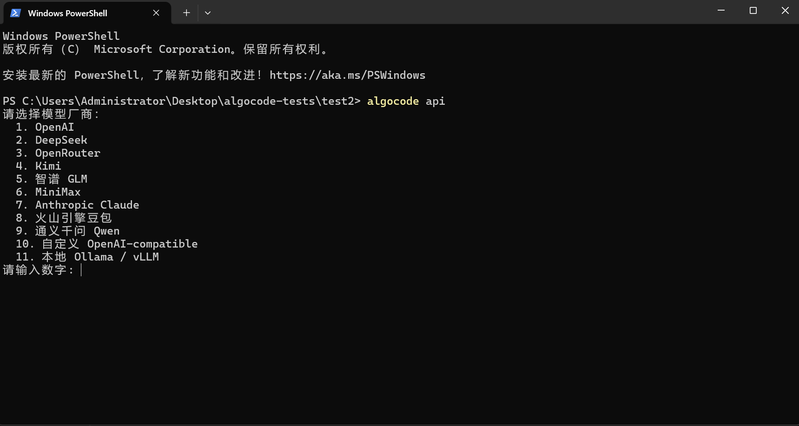
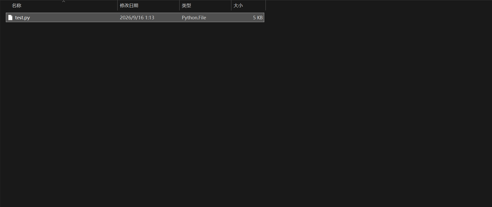
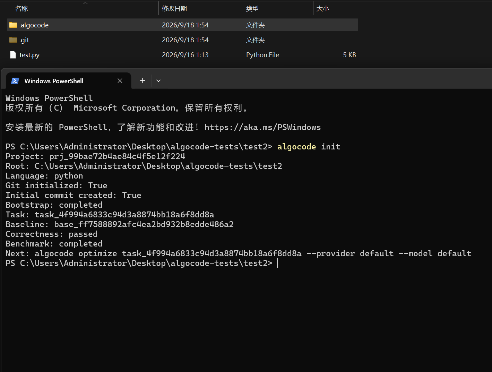
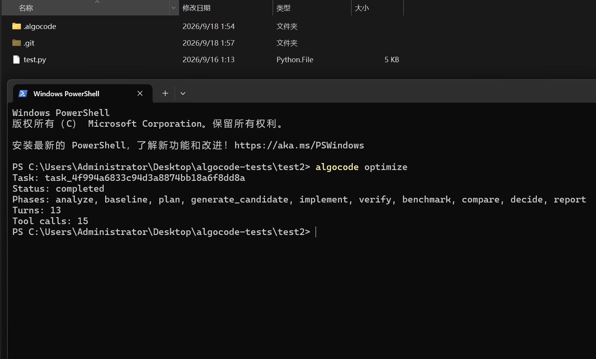

<div align="center">


# Algocode

> *面向 C++ / Python 的可验证算法优化 Agent — 本地优先，证据驱动，可回滚。*

[](LICENSE)
[](https://www.python.org/)
[](https://pypi.org/project/algocode-agent/)
[](https://code.visualstudio.com/)
[](https://platform.openai.com/)

**Algocode 不是直接替你改代码的黑盒。**

它会先建立行为契约，再在隔离 Worktree 中尝试优化，最后用 Correctness、Contract 和 Benchmark 三类证据决定候选是否值得应用。

[快速开始](#快速开始) · [VS Code](#vs-code-扩展) · [工作流](#优化工作流) · [命令速查](#cli-命令速查) · [常见问题](#常见问题)

</div>

---

## 它能做什么

把一个可以通过命令运行的 C++ / Python 项目交给 Algocode：

```text
输入项目：test.py

Algocode 自动执行：
  1. 生成项目行为契约
  2. 捕获基线输出与基线性能
  3. 分析算法热点，规划优化方向
  4. 在隔离 Worktree 中生成候选实现
  5. 验证正确性与契约
  6. 对比 Benchmark
  7. 生成报告、Diff，等待用户决定是否 Apply
```

示例输出：

```text
Task: task_xxxxxxxx
Status: completed
Correctness: passed
Benchmark valid: true
Baseline median: 0.7594s
Candidate median: 0.5357s
Improvement: 29.4573%
```

适用于算法竞赛代码、数据结构实现、图算法、字符串算法、缓存系统、解析器、并发组件等可确定性验证的代码。

---

## 核心特性

- **契约优先** — 优化前先确定公开 API、输入输出、配置字段、错误语义和边界行为，避免“变快了但语义坏了”。
- **证据驱动** — Correctness、Contract、Benchmark 结果全部持久化，接受与拒绝基于真实证据，而不是模型自我评价。
- **隔离候选** — CLI 在 Git Worktree 中试错；VS Code 扩展在临时影子工作区中运行，原项目不会被直接修改。
- **人工可控** — Diff、Review、Apply 分离。先看证据，再决定是否应用，应用后支持 Rollback。
- **全程可审计** — 每次模型调用、工具调用、阶段结果、候选快照和优化记录都会保存。
- **阶段进度可见** — VS Code 终端会显示当前阶段、总阶段序号、轮次、当前工具、工具数量和耗时。
- **失败可重试** — 负收益、证据不足或阶段阻塞时，可基于历史记录重新规划方向。
- **多模型 Provider** — 支持 OpenAI、DeepSeek、OpenRouter、Kimi、智谱 GLM、MiniMax、Claude、豆包、通义千问以及任意 OpenAI-compatible 服务。
- **本地优先** — 默认在本机执行；Docker / WSL2 仅作为可选隔离增强。
- **CLI + VS Code 双入口** — 适合终端自动化和日常编辑器操作。

---

## 性能与结果声明

Algocode 通过大模型分析源代码并生成候选优化。优化后的性能可能提升、没有明显变化，甚至下降；结果会受到源代码质量、项目结构、模型能力、输入规模、运行环境和系统负载等因素影响。

Algocode 不承诺每次优化都带来正收益，也不替代人工代码审查。请以实际的 Correctness、Contract、Benchmark、Diff 和 Review 结果为准，在确认行为正确且收益满足预期后再 Apply。

## 使用守则（优化前必看）

Algocode 适合优化“行为可验证”的代码。开始前请确认项目满足以下条件。

### 通用要求

| 条件 | 说明 |
|---|---|
| Git 仓库 | 项目需要是 Git 仓库；不是时 Algocode 会自动初始化 |
| 单主语言 | 一个项目只支持一种主语言；Python 和 C++ 同时存在时优先 C++ |
| 明确入口 | 有可执行入口文件，运行后能输出结果 |
| 确定性输出 | 相同输入下输出一致，供 Correctness 验证 |
| 进程级 Benchmark | 以整个程序运行为测量单位，不支持函数级 Benchmark |

### Python 项目

- 项目中存在 `.py` 文件，或存在 `pyproject.toml` / `setup.py`。
- 入口优先匹配 `main.py`、`test.py`，否则选择第一个非 `__init__.py` 文件。
- 入口程序能正常运行，退出码为 0。

### C++ 项目

- 项目中存在 `.cpp` / `.cc` / `.cxx` 文件，或存在 `CMakeLists.txt` / `Makefile`。
- 系统已安装 `g++` 或 `clang++`，支持 C++17。
- 入口优先匹配 `main.cpp`、`test.cpp`，否则选择第一个源文件。
- 代码能正常编译和运行，退出码为 0。

### 暂不支持的场景

- Python 与 C++ 深度混合项目，例如 Python 调用 C++ 扩展。
- 复杂多翻译单元或大型 CMake 工程。
- 运行时依赖网络、数据库、GPU 或不可控外部服务的代码。
- 函数级或模块级 Benchmark。


## 环境与依赖

### 系统要求

| 依赖 | 最低版本 | 说明 |
|---|---|---|
| Python（必需） | 3.11+ | 运行环境 |
| Git（必需） | — | Worktree 隔离与版本管理 |
| C++ 编译器 | — | 优化 C++ 项目时需要，支持 `g++` 或 `clang++` |

可选增强：
- **Docker / WSL2** — 用于更强的沙箱隔离，非强制要求。
- **VS Code** — 用于右键菜单、实时阶段进度、Diff、Apply 和 Rollback。

## 快速开始

### 方式一：从 PyPI 安装

```bash
pip install algocode-agent
```

安装 VS Code 扩展：

```bash
algocode vscode install
```

扩展命令会自动查找本机的 `code`、`code-insiders` 或 `codium`。

如果找不到 VS Code CLI：

```powershell
algocode vscode install --code "{VScode路径}\bin\code.cmd"
```

### 方式二：从源码安装

Windows PowerShell：

```powershell
git clone https://github.com/acd2113/Algocode.git
cd Algocode
python -m venv .venv
.\.venv\Scripts\python -m pip install -e ".[dev]"
.\.venv\Scripts\python -m algocode doctor
```

macOS / Linux：

```bash
git clone https://github.com/acd2113/Algocode.git
cd Algocode
python3 -m venv .venv
.venv/bin/python -m pip install -e ".[dev]"
.venv/bin/python -m algocode doctor
```

### 配置模型

```bash
algocode api
algocode test
```

`algocode api` 用于选择模型厂商、Base URL、模型 ID 和 API Key。API Key 保存在本机凭证文件中，不会写入项目配置。

切换默认模型：

```bash
algocode model
```

### 环境检查

```bash
algocode doctor
```

查看是否满足条件，建议优先运行

### 运行第一次优化

在项目目录中执行：

```bash
algocode init
algocode optimize
```

查看状态、证据和 Diff：

```bash
algocode status
algocode review
algocode diff
```

应用或回滚：

```bash
algocode apply
algocode rollback
```

重新尝试优化方向：

```bash
algocode retry
```

---

## VS Code 扩展

### 安装

推荐使用：

```bash
algocode vscode install
```

也可以使用 VSIX 手动安装：

```powershell
code --install-extension "路径\algocode-vscode-0.1.1.vsix" --force
```

或者：

```text
Extensions -> ... -> Install from VSIX...
```

### 使用

右键 `.py`、`.cpp`、`.cc`、`.cxx` 文件，选择：

```text
Algocode
    优化 Optimize
    回滚 Rollback
    应用 Apply
    差异 Show Diff
    检查 Review
```

各操作含义：

| 操作 | 说明 |
|---|---|
| 优化 Optimize | 启动完整优化流程，并在临时影子工作区中运行 |
| 回滚 Rollback | 撤销最近一次通过扩展应用的候选 |
| 应用 Apply | 将最近一次候选应用到原项目 |
| 差异 Show Diff | 打开 VS Code 原生 Diff |
| 检查 Review | 查看 Candidate、Correctness、Benchmark、Decision 和变更文件 |

扩展运行时会自动打开 `Algocode` 终端，并实时显示：

```text
[algocode] analyze | 1/10 | turn 2 | running read_file (3s) | tools 4 | 18s
[algocode] implement | 5/10 | turn 8 | running run_candidate_check (7s) | tools 14 | 47s
[algocode] benchmark | 7/10 | running benchmark | 21s
```

---

## CLI 命令速查

```bash
$ algocode --help
```

| 命令 | 说明                      |
|---|-------------------------|
| `algocode api` | 配置模型 Provider 和 API Key |
| `algocode test` | 验证模型连接                  |
| `algocode model` | 切换默认模型                  |
| `algocode doctor` | 检查本地环境                  |
| `algocode init` | 初始化项目、生成契约、建立基线         |
| `algocode optimize` | 运行完整优化流程                |
| `algocode retry` | 基于历史记录重新规划              |
| `algocode status` | 查看当前任务、阶段与进度            |
| `algocode review` | 查看正确性、Benchmark 和决策证据   |
| `algocode diff` | 查看候选代码变更                |
| `algocode apply` | 接收并应用候选                 |
| `algocode rollback` | 回滚已应用候选                 |
| `algocode report` | 生成 Markdown 报告          |
| `algocode vscode install` | 安装包内携带的 VS Code 扩展      |

大多数命令支持 `--json`：

```bash
algocode status --json
algocode review --json
algocode optimize --json
```

---

## 使用方式

### 使用示例

执行 `algocode api` 选择模型厂商和 API Key：



将需要优化的文件放入一个文件夹中：



执行 `algocode init` 初始化项目、生成契约并建立基线：



执行 `algocode optimize` 启动优化流程；`Status: completed` 表示流程完成，后续可执行 `review`、`diff`、`report`、`apply` 和 `rollback`：




### 方式一：完整 CLI 流程

```bash
algocode init
algocode optimize
algocode status
algocode review
algocode diff
```

如果结果满足要求：

```bash
algocode apply <task-id> <candidate-id>
```

如需恢复：

```bash
algocode rollback
```

### 方式二：VS Code 右键流程

```text
右键文件
  -> Algocode
  -> 优化 Optimize
  -> 查看实时阶段
  -> 查看 Diff / Review
  -> Apply 或 Rollback
```

适合日常开发时直接在编辑器内完成优化、审查和应用。

### 方式三：脚本与自动化

```bash
algocode init --json
algocode optimize --json
algocode status --json
algocode review --json
```

JSON 输出适合接入 CI、批处理脚本或上层工具。

---

## 优化工作流

阶段之间存在 Gate：

- Contract 或 Correctness 未通过，不进入 Benchmark。
- Benchmark 无效或无正收益，不进入接受流程。
- Apply 前会检查候选是否 stale。
- Rollback 用于撤销已应用候选。

---

## 验证体系

Algocode 将优化结果拆成三类证据：

| 类型 | 作用 |
|---|---|
| **Correctness** | 验证候选是否复现基线行为，支持 cases、oracle、stress、hybrid 等模式 |
| **Contract** | 保护公开 API、配置语义、错误类型、状态转换、排序和边界行为 |
| **Benchmark** | 受控测量 warmup、重复样本、median、variation、环境 hash 等 |

优化速度和正确性发生冲突时，正确性优先。

---

## 架构

```text
CLI / VS Code
      ↓
Application Services
      ↓
Runtime Agent
      ↓
Context / Tools / Providers
      ↓
Language Adapters
      ↓
Git Worktree / Sandbox
      ↓
Storage / Event Store / Artifacts
```

---

## 项目结构

完整源码、测试与运行时目录结构见 [PROJECT_STRUCTURE.md](PROJECT_STRUCTURE.md)。

### 源码结构

```text
src/algocode/
├── cli/                  # CLI 命令入口与输出
├── application/          # Task、Candidate、Baseline、Benchmark 等服务
├── domain/               # 实体、值对象、事件
├── runtime/              # 阶段机、Tool Loop、Retry、模型调用日志
├── config/               # 配置加载与模型
├── context/              # 上下文构建、事实账本与预算
├── tools/                # 文件、进程、校验等工具
├── policy/               # 策略引擎
├── approval/             # 审批服务
├── sandbox/              # Native / Docker / WSL2 执行后端
├── security/             # 凭证与脱敏
├── providers/            # 模型 Provider 适配
├── languages/            # Python / C++ 语言适配
├── correctness/          # Correctness 验证
├── benchmark/            # Benchmark 引擎
├── workspace/            # Git Worktree、Apply、Rollback
├── storage/              # SQLite Event Store、Projection、Artifact
└── resources/            # 资源与内置 VS Code 扩展

### 项目内 .algocode

执行 `init` 后，项目根目录生成：

```text
.algocode/
├── config.yaml           # 项目配置
├── config.local.yaml     # 本地覆盖（可选）
├── contract.json         # 行为契约
├── task.txt              # 当前任务摘要
├── current-task.json     # 当前任务状态
├── oracle/               # Correctness 与 Contract Test
│   ├── check.py
│   ├── correctness.yaml
│   ├── contract_test.py
│   ├── contract_test.cpp
│   └── reference/
├── benchmarks/
│   └── benchmark.yaml
└── cache/
    ├── algocode.db       # Event Store 与 Projection
    ├── artifacts/
    ├── model-logs/
    ├── optimization-records/
    ├── worktrees/
    ├── repair-memory/
    └── rollbacks/
```

---

## 配置与数据

### Provider

支持：

```text
OpenAI
DeepSeek
OpenRouter
Kimi
智谱 GLM
MiniMax
Anthropic Claude
火山引擎豆包
通义千问 Qwen
自定义 OpenAI-compatible
本地 Ollama / vLLM
```

### 报告

```bash
algocode report
```

会在项目根目录生成：

```text
report.md
```

同时在 `.algocode/cache/artifacts` 中保留内部产物。

---

## 安全与数据

- Algocode 默认在本机运行。
- API Key 保存在本机凭证文件中，不写入项目配置。
- 模型调用日志会经过脱敏后写入 `.algocode/cache/model-logs`。
- Contract、Correctness、Benchmark 和 Oracle 文件属于保护文件。
- Docker / WSL2 是可选隔离增强。
- 不建议在包含敏感数据、生产密钥或不可信代码的目录中直接运行。

---

## 开发

```bash
git clone https://github.com/acd2113/Algocode.git
cd Algocode
python -m venv .venv
.venv/bin/python -m pip install -e ".[dev]"
.venv/bin/python -m pytest
.venv/bin/python -m ruff check .
```

VS Code 扩展开发：

```bash
cd extensions/vscode
npm install
npm run compile
```

开发调试：

```text
按 F5 -> Run Algocode Extension
```

开发完成后可打包：

```bash
npx --yes @vscode/vsce package
```

---

## 发布

Python 包发布由 GitHub Actions 完成。

发布流程：

```bash
git tag v0.1.1
git push origin v0.1.1
```

工作流会构建并发布：

```text
algocode_agent-0.1.1.tar.gz
algocode_agent-0.1.1-py3-none-any.whl
```

允许用户安装：

```bash
python -m pip install algocode-agent
algocode vscode install
```

---

## 贡献

欢迎提交 Issue 和 Pull Request。

提交 Issue 时建议提供：

- 操作系统与 Python 版本
- Algocode 版本
- 复现步骤
- 期望行为与实际行为
- 相关日志或截图

提交代码前建议运行：

```bash
python -m pytest
python -m ruff check .
```

---

## 许可证

本项目使用 [MIT License](LICENSE)。

---

<div align="center">

> **Algocode** — 让每一次算法优化都有证据。

</div>
