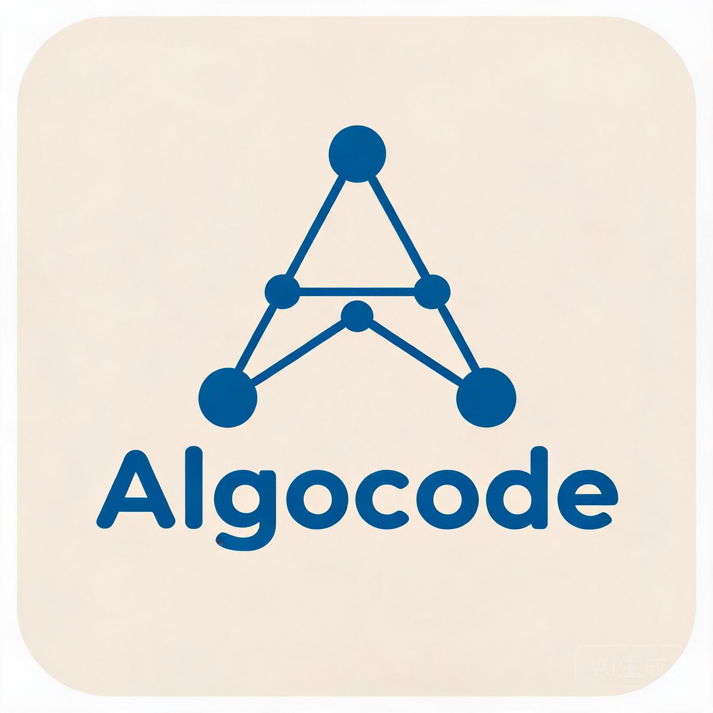
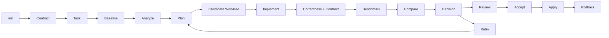

# Algocode

<p align="center">
  
</p>
<br>
<p align="center">面向 C++ / Python 的可验证算法优化 Agent</p>
<p align="center">本地优先、证据驱动、可回滚</p>

## Algocode 是什么

Algocode 是一个类git、命令行优先的算法优化 Agent，面向已经存在的 C++ 或 Python 项目。

它会分析项目入口、公开 API、配置和可观察行为，生成项目行为契约，并由此派生优化目标、Correctness 规范和 Benchmark 规范。随后，Algocode 在独立 Git Worktree 中生成候选实现，先验证正确性和行为契约，再运行 Benchmark，最终输出可审查的 Diff、证据和报告。

Algocode 的目标不是替代算法工程师，而是缩短下面这条反馈循环：

```text
发现优化点
  -> 实现候选
  -> 验证语义
  -> 测量收益
  -> 决定是否采用
```

Algocode 不会把一次 Benchmark 结果当作唯一真相，也不会在正确性未知时声称性能提升。

## 设计原则

### Contract First

优化前先确定公开 API、输入输出、配置语义、状态转换、错误行为和不可变约束。Candidate 不能只复制原实现的“表面输出”，还必须通过行为契约。

### Evidence Driven

Benchmark 不是模型的自我评价，而是运行时产生的证据。Correctness、Contract、Benchmark、Comparison 和 Decision 都会被持久化。

### Isolated Candidate

Agent 不直接在用户工作区上试错。候选实现运行在独立 Worktree 中，用户工作区只在明确执行 Apply 时被修改。

### Human Controlled

Accept 与 Apply 分离。用户可以查看 Diff、报告和证据，再决定是否采用。Apply 后仍可以 Rollback。

### Auditable

每次模型调用、工具调用、阶段结果、优化记录、候选血缘和回滚信息都会保存，方便定位失败原因和复盘。

## 核心能力

| 能力 | 说明 |
|---|---|
| Python 支持 | Contract Test、Correctness、Benchmark、Candidate Worktree 和 Runtime 流程 |
| C++ 支持 | 单入口 C++ Contract Test、candidate/reference 双编译差分和 Benchmark |
| Contract Discovery | 从代码、文档、配置和行为中提取项目契约 |
| Correctness Gate | Candidate 必须通过输出正确性和 Contract 检查 |
| Benchmark Evidence | 保存 warmup、重复样本、median、variation 和环境 hash |
| Candidate Worktree | 使用 Git Worktree 隔离候选实现，避免直接污染源码 |
| Accept / Apply 分离 | 先做决策，再修改用户工作区，支持 stale 检查 |
| Rollback | Apply 后按 manifest 恢复原状态 |
| Retry | 基于历史优化记录从 PLAN 重新搜索方向 |
| Model Logs | 保存 System Prompt、输入、输出、Reasoning、Tool Calls、Usage 和错误 |
| JSON CLI | 大多数命令支持 `--json`，便于脚本和自动化集成 |
| Provider Adapter | 当前支持 OpenAI-compatible Chat Completions |
| Sandbox | 支持 process、Docker、WSL2 等后端策略 |

## 工作流



内部阶段：

```text
CREATE
  -> ANALYZE
  -> BASELINE
  -> PLAN
  -> GENERATE_CANDIDATE
  -> IMPLEMENT
  -> VERIFY
  -> BENCHMARK
  -> COMPARE
  -> DECIDE
  -> REPORT
```

阶段之间存在 Gate。Candidate 未通过 Correctness 时不能进入 Benchmark；没有有效 Comparison 时不能进入 Decide。

## 环境要求与安装

要求：

- Python 3.11 或更高版本；
- Git；
- 优化 C++ 项目时需要可用的 C++ 编译器和构建工具；
- 使用真实模型时需要 OpenAI-compatible Provider；
- Docker 或 WSL2 不是强制依赖，但可以用于更明确的沙箱边界。

Windows PowerShell：

```powershell
python -m venv .venv
.\.venv\Scripts\python -m pip install -e ".[dev]"
.\.venv\Scripts\python -m algocode doctor
```

macOS / Linux：

```bash
python3 -m venv .venv
.venv/bin/python -m pip install -e ".[dev]"
.venv/bin/python -m algocode doctor
```

当前项目尚未确认已发布到 PyPI。若没有安装 `algocode` 命令，可将后续命令替换为对应虚拟环境下的 `python -m algocode`。

> Native Windows Sandbox 不是强隔离。涉及不可信代码时，建议使用 Docker 或 WSL2 后端。

## 配置 Provider、Model 和 API Key

推荐使用交互式命令完成首次配置：

```bash
algocode api
algocode test
```

`algocode api` 会显示 OpenAI、DeepSeek、OpenRouter、Kimi、智谱 GLM、MiniMax、Anthropic Claude、火山引擎豆包、通义千问 Qwen、自定义 OpenAI-compatible 和本地 Ollama / vLLM 选项，并把 Provider、默认模型和 API Key 配置到本机。API Key 不会写入项目 YAML，而是保存在用户本机凭证文件中。

切换模型：

```bash
algocode model
```

Provider、模型和默认项写入用户全局配置：

```text
Windows
%LOCALAPPDATA%\algocode\config.yaml

Linux
~/.local/share/algocode/config.yaml

macOS
~/Library/Application Support/algocode/config.yaml
```

项目的 `.algocode/config.local.yaml` 只用于项目级覆盖，不由 `algocode api` 自动写入。不要把 API Key 写进 YAML。

```yaml
version: 1

project:
  language: auto
  source_root: "."

providers:
  default:
    type: openai-compatible
    base_url: https://your-provider.example/v1
    api_key_env: ALGOCODE_MODEL_API_KEY

models:
  default:
    provider: default
    model: your-model-name
    context_window: 128000

defaults:
  provider: default
  model: default

runtime:
  max_steps_per_phase: 30
  max_tool_calls_per_phase: 50
  max_candidates: 3
  network: false

benchmark:
  method: process
  warmup: 2
  repeats: 5
  primary_metric: wall_time
  direction: minimize

acceptance_policy:
  require_correctness: true
  min_median_improvement_percent: 0.0
  max_variation_percent: null

policy:
  approval:
    mode: non-interactive
  sandbox:
    mode: process
    backend: auto
    network: false
    timeout_seconds: 120
```

Provider Key 通过环境变量传入：

```powershell
$env:ALGOCODE_MODEL_API_KEY = "your-api-key"
```

Secret 只允许通过 `api_key_env` 或 `credential_ref` 引用，不允许直接出现在配置文件、Prompt、Event、日志或报告中。

## 快速开始

在待优化的项目目录中执行：

```bash
algocode api
algocode test
algocode doctor
algocode init
algocode status
algocode optimize
```

`init` 成功后会保存当前 Task，因此后续命令通常不需要手动复制 Task ID。

查看结果：

```bash
algocode status
algocode review
algocode diff
```

接受并应用候选：

```bash
algocode accept <task-id> <candidate-id>
algocode apply
```

回滚：

```bash
algocode rollback
```

基于历史记录重新搜索方向：

```bash
algocode retry
```

只做本地流程自测，不调用真实 Provider：

```bash
algocode optimize --fake-provider
```

脚本场景优先使用 JSON：

```bash
algocode status --json
algocode optimize --json
algocode review --json
```

## init、optimize 与 retry

### `algocode init`

默认执行完整 Bootstrap：

```text
检测或初始化 Git 仓库
  -> 检测主语言
  -> 写入 .algocode/config.yaml
  -> 写入 .algocode/.gitignore
  -> Contract Discovery
  -> Contract Compiler
  -> 生成并验证 Contract Test
  -> 生成 Oracle、Correctness 和 Benchmark 规范
  -> 创建初始 commit
  -> 注册 Project
  -> 创建 Task
  -> 捕获 Baseline
  -> 运行 Baseline Correctness
  -> 运行 Baseline Benchmark
  -> 持久化 current-task.json 和 task.txt
```

Python 项目会生成 `check.py`、`contract_test.py`、`correctness.yaml` 和 `benchmark.yaml`。C++ 项目会生成 `contract_test.cpp`、`correctness.yaml` 和 `benchmark.yaml`，并分别针对 candidate 与 reference 编译后比较确定性输出。

只注册项目而不执行 Bootstrap：

```bash
algocode init --no-bootstrap
```

### `algocode optimize`

```bash
algocode optimize
algocode optimize <task-id>
```

常用参数：

```text
--provider <provider-key>
--model <model-key>
--candidate-id <candidate-id>
--candidate-workspace <path>
--max-steps <n>
--max-tool-calls <n>
--stop-after <phase>
--json
```

默认运行到 `report`。非完成状态会返回非零退出码，但脚本应优先读取 JSON 中的 `status`。

阶段职责：

| 阶段 | 主要职责 |
|---|---|
| ANALYZE | 阅读项目、理解热点和约束 |
| PLAN | 产出可执行的优化计划 |
| GENERATE_CANDIDATE | 创建独立 Candidate Worktree |
| IMPLEMENT | 编辑候选代码并运行候选自检 |
| VERIFY | 执行 Correctness 和 Contract |
| BENCHMARK | 运行受控 Benchmark |
| COMPARE | 计算 baseline 与 candidate 的差异 |
| DECIDE | 根据证据生成决策 |
| REPORT | 输出结果、证据和限制 |

IMPLEMENT 阶段由 Agent 运行 Tool Loop。每次 Turn 都会重新组装上下文，执行 Provider 调用和 Tool Calls，并将 Tool Result 注入下一轮。

### `algocode retry`

`retry` 不是简单重跑：

1. 加载当前 Task 的历史 Optimization Records；
2. 写入 `task.retry_requested`；
3. 从 PLAN 阶段重新开始；
4. 将历史计划、候选结果和失败信息注入上下文；
5. 判断上一次方案是否已经到达当前方向的上限；
6. 选择继续优化、切换方向或重新建立假设；
7. 从 Candidate Workspace 分叉新 Candidate；
8. 保留 `parent_candidate_id` 和 `fork_snapshot_hash` 作为代码血缘；
9. Apply Base 仍指向 Task Baseline。

没有历史 Optimization Record 时，`retry` 会拒绝执行，而不是凭空重跑。

## 验证体系

Algocode 将优化结果拆成三类证据。

### Correctness

验证候选实现是否可以复现基线行为。支持 `cases`、`oracle`、`stress`、`hybrid` 和 checker command。

### Contract

保护算法之外的行为，例如公开 API、配置字段、错误类型、状态转换、边界行为和可观察输出。Python 使用 `.algocode/oracle/contract_test.py`，C++ 使用 `.algocode/oracle/contract_test.cpp`。

### Benchmark

Benchmark 默认是 process-level，主动拒绝 function-scope Benchmark。每次运行会记录 run command、warmup、repeats、timeout、metric、direction、raw samples、median、variation、input hash、spec hash、environment hash 和 baseline/candidate comparison。

Candidate 未通过 Correctness 或 Contract 时，不会进入有效的 Benchmark Comparison。

## Candidate 生命周期

```text
generated
  -> editing
  -> verifying
  -> verified
  -> selected / accepted
  -> applied
  -> rolled_back
```

Candidate 不直接修改用户工作区。Agent 在 Worktree 中完成编辑和验证。

Accept 要求 Candidate 属于当前 Task、Correctness passed、Benchmark completed、Comparison valid，并满足 Acceptance Policy。

Apply 会检查 Candidate 是否已 Accepted、用户工作区是否仍与 Apply Base 一致、Candidate 是否 stale，以及是否可以产生 rollback manifest。

Rollback 只处理已经 applied 的 Candidate。如果当前工作区已经从 Apply 后状态继续变化，自动回滚会被拒绝。

## .algocode 目录结构

```text
<project>/
  .algocode/
    .gitignore
    config.yaml
    config.local.yaml
    contract.json
    task.txt
    current-task.json

    oracle/
      check.py
      correctness.yaml
      contract_test.py
      contract_test.cpp
      reference/

    benchmarks/
      benchmark.yaml

    cache/
      algocode.db
      artifacts/
      locks/
      model-logs/
      optimization-records/
      repair-memory/
      worktrees/
      rollbacks/
      evals/
```

关键路径：

| 路径 | 作用 |
|---|---|
| `.algocode/contract.json` | 项目行为契约 |
| `.algocode/current-task.json` | 当前 Task、状态和下一步命令 |
| `.algocode/oracle/` | Correctness、Contract Test 和 Reference |
| `.algocode/benchmarks/` | Benchmark 规范 |
| `.algocode/cache/algocode.db` | Event Store 和 Projection |
| `.algocode/cache/model-logs/` | 每次模型调用记录 |
| `.algocode/cache/optimization-records/` | 每次 optimize / retry 的优化记录 |
| `.algocode/cache/repair-memory/` | IMPLEMENT 失败后的修复上下文 |
| `.algocode/cache/worktrees/` | Baseline 和 Candidate Worktree |
| `.algocode/cache/rollbacks/` | Apply 的 rollback manifest |

旧版的根目录 `oracle/`、`benchmarks/`、`.algocode.yaml` 和 `.algocode.local.yaml` 只作为兼容读取路径保留。新项目应使用 `.algocode/`。

## CLI 命令

主要用户入口：

| 命令 | 作用 |
|---|---|
| `algocode api` | 选择模型厂商、模型和 API Key |
| `algocode model` | 切换用户全局默认模型 |
| `algocode test` | 发送一条最小真实请求验证模型连接 |
| `algocode doctor` | 检查本地运行环境 |
| `algocode init` | 初始化项目并执行 Bootstrap |
| `algocode optimize` | 运行完整优化流程 |
| `algocode retry` | 基于历史记录重新从 PLAN 搜索 |
| `algocode status` | 查看当前 Task 和下一步命令 |
| `algocode review` | 查看候选、验证和决策证据 |
| `algocode diff` | 查看候选 patch |
| `algocode accept` | 接受已验证候选 |
| `algocode apply` | 将已接受候选应用到工作区 |
| `algocode rollback` | 回滚已应用候选 |
| `algocode report` | 生成 JSON / Markdown 报告 |

高级和自动化入口：

```text
algocode baseline
algocode benchmark
algocode correctness run
algocode correctness replay
algocode task create
algocode task list
algocode task show
algocode candidate create
algocode candidate freeze
algocode candidate list
algocode candidate show
algocode experiment list
algocode experiment show
algocode gate run
algocode eval run
```

大多数命令支持 `--json`、`--no-color`、`--quiet`、`--verbose` 和 `--data-dir`。

JSON 输出使用统一 Envelope：

```json
{
  "ok": true,
  "command": "optimize",
  "status": "completed",
  "task_id": "task_...",
  "candidate_id": "cand_...",
  "experiment_id": "bench_...",
  "artifacts": [],
  "message": "",
  "data": {}
}
```

主要退出码：

| 退出码 | 含义 |
|---:|---|
| 0 | 成功 |
| 1 | Runtime、Provider、Decision、Eval 或 Doctor 失败 |
| 2 | 参数、配置或初始化错误 |
| 3 | Baseline 或 Correctness 配置错误 |
| 4 | Correctness 失败 |
| 5 | Benchmark 失败 |

## 当前支持与限制

当前已经支持：

- Python 项目的完整 Bootstrap 和优化闭环；
- C++ 确定性单入口项目的 Contract、Correctness 和 Benchmark；
- Python Contract Test；
- C++ candidate/reference 双编译差分；
- Candidate Worktree；
- Accept、Apply、Rollback；
- 基于历史记录的 Retry；
- 模型调用日志和优化记录；
- OpenAI-compatible Chat Completions Provider；
- process、Docker、WSL2 沙箱后端。

当前限制：

- 一个 Project 当前只有一个主语言；
- 同目录同时存在 C++ 和 Python 时，C++ 优先；
- 跨语言 Pipeline，例如 Python Encoder 加 C++ Decoder，当前不支持；
- 多 translation unit 和复杂 CMake Contract Harness 仍需扩展；
- Function Scope Benchmark 当前被拒绝；
- Provider 协议当前主要面向 OpenAI-compatible Chat Completions；
- Native Windows Sandbox 不是强隔离；
- Report 目前更偏 Evidence Report，tradeoffs 和 limitations 仍可继续增强；
- `experiment` 当前主要由 Benchmark Run 支撑，尚未成为完全独立的聚合。

## 开发与测试

```powershell
.\.venv\Scripts\python -m pytest
.\.venv\Scripts\python -m ruff check .
.\.venv\Scripts\python -m algocode doctor
.\.venv\Scripts\python -m algocode eval run smoke --provider fake --json
.\.venv\Scripts\python -m algocode gate run --json
```

调试模型行为时，优先查看：

```text
.algocode/cache/model-logs/
.algocode/cache/optimization-records/
.algocode/cache/repair-memory/
```

## 项目架构与设计文档

当前是模块化单体，主要分为：

| 层 | 职责 |
|---|---|
| CLI | Typer 命令、参数、Human / JSON 输出 |
| Bootstrap | 依赖组装和 Project Bootstrap |
| Application | Task、Candidate、Benchmark、Decision、Apply、Report |
| Domain | 实体、值对象、枚举、事件 |
| Runtime | Phase Machine、Tool Loop、Retry、Logging |
| Tools | Tool Registry、Policy、Approval、Sandbox |
| Languages | Python / C++ 检测、构建和运行 |
| Correctness | Correctness Spec 和执行 |
| Benchmark | 采样、比较和环境 hash |
| Workspace | Git Worktree、Patch、Apply 和 Rollback |
| Storage | Event、Projection 和 Artifact |
| Eval | Suite、A/B 和指标 |
| Acceptance | Traceability 和 Release Gate |

完整工程设计文档：

- [Algocode 工程化总体设计文档](docs/design/09-algocode-engineering-design.md)

P0 验收材料：

- [P0 Report](docs/acceptance/P0/report.md)
- [P0 Report JSON](docs/acceptance/P0/report.json)

## Roadmap

P1：

- Candidate / Experiment 集中式状态机；
- Experiment 独立聚合；
- 多 translation unit 和 CMake C++ Contract Harness；
- 更准确的 Tokenizer；
- Artifact Retention Worker；
- Responses API 和更多 Provider 协议；
- 强 Sandbox 中的完整 Shell Tool；
- Profiler Adapter；
- Report 质量提升；
- Worktree 生命周期管理。

P2：

- MCP；
- Plugin Marketplace；
- 远程 Worker；
- Web UI / TUI；
- Multi-Agent；
- Pareto 多目标优化；
- 组织级 Policy；
- 集中式 Artifact 和 Audit；
- GPU Profiler；
- 分布式 Benchmark。

## License

本项目使用 MIT License，详见 [LICENSE](LICENSE)。
