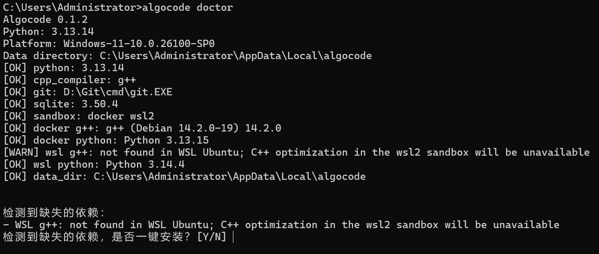
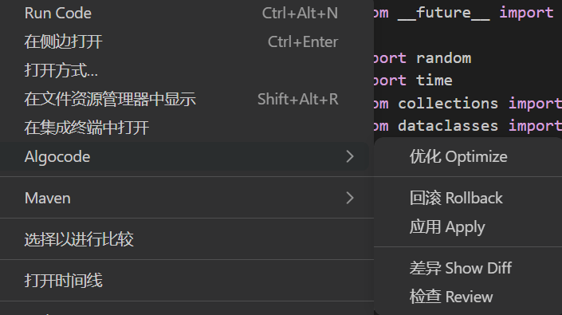

<div align="center">


# Algocode

> *面向 C++ / Python 的可验证算法优化 Agent — 本地优先，证据驱动，可回滚。*

[](LICENSE)
[](https://www.python.org/)
[](https://pypi.org/project/algocode-agent/)
[](https://code.visualstudio.com/)
[](https://platform.openai.com/)

**Algocode 不是直接替你改代码的黑盒。**

它会先建立行为契约，再在隔离 Worktree 中尝试优化，最后用 Correctness、Contract 和 Benchmark 三类证据决定候选是否值得应用。

[English](README_EN.md) · [快速开始](#快速使用) · [VS Code](#vs-code-扩展) ·  [命令速查](#cli-命令速查)


</div>

---

## Algocode 是什么

Algocode 是一款面向 C++ / Python 的可验证算法优化 Agent CLI 工具。它通过契约、正确性和性能证据驱动代码优化，只需配置一个模型端点即可使用。

它读取 Git 仓库和项目入口，通过具备工具调用能力的 Agent 分析算法热点、问题结构和复杂度，并在隔离的 Git Worktree 中生成候选实现。Agent 可以读取完整文件、搜索代码库、检查其他文件、运行构建与正确性测试、执行 Benchmark，从而进行算法级优化，而不是仅停留在表面的代码改写。

Algocode 不会直接修改用户项目。每个候选都必须通过 Correctness、Contract 和 Benchmark 验证，用户可以查看结构化的证据链、Diff、置信区间和决策结果，再显式执行 accept 和 apply。应用后如果发现问题，还可以通过 rollback 回滚。

除了单次优化，Algocode 支持多候选搜索：当一个方向有显著正向前景但尚未满足接受条件时，会继续细化同一候选；当方向没有可测收益时，则创建新候选继续搜索。它同时提供 CLI 和 VS Code 扩展入口，适合算法竞赛代码、数据结构、图算法、字符串算法、缓存和解析器等行为可验证的程序。

## 为什么选择 Algocode？
### 通用 Agent 做算法优化的局限
- **只能改代码，不能证明正确性** ——模型可能改变边界条件、错误语义、返回顺序或状态转换，而这些变化不一定能被普通测试发现。
- **容易只做局部优化** ——通用 Agent 倾向于修改循环、变量和调用方式，不容易主动重新分析问题结构，寻找真正的算法级改进。
- **性能结果缺少可信依据** ——单次 time 或一次 Benchmark 很容易受到系统负载、缓存、解释器启动和环境变化影响。
- **长任务容易偏离原始目标** ——随着上下文增长，模型可能逐渐忽略行为契约、保护文件和验证约束。
- **缺少稳定的候选生命周期** ——没有隔离候选、证据门控和回滚机制时，失败尝试很难安全地继续下去。
- **难以比较不同方向** ——如果多个优化方案只存在于对话和临时命令中，就无法系统地比较性能、正确性和风险。
- **过程难以审计和复现** ——为什么接受、为什么拒绝、测试和 Benchmark 具体运行了什么，往往没有完整记录。
- **质量过度依赖模型和提示词** ——换一个模型或修改一段提示词，优化结果可能明显波动。
### Algocode 能做的
- **建立行为契约** ——在优化前明确公开 API、输入输出、错误行为、状态转换、排序和边界条件。
- **隔离每次优化** ——在独立 Git Worktree 中创建候选，验证通过前不会修改用户项目。
- **进行算法级分析** ——分析问题结构、输入分布、操作代数和复杂度差距，并提出多个候选算法方向。
- **验证行为一致性** ——通过 Correctness、Contract 和参考实现交叉验证，确保候选没有破坏原有行为。
- **提供可信 Benchmark** ——使用 warmup、重复采样、交错运行、多规模输入和固定 harness，减少环境噪声。
- **判断提升是否真实** ——通过配对置换检验、bootstrap 置信区间和 MAD 鲁棒波动，区分真实收益与随机波动。
- **识别算法级改进** ——分析运行时间随输入规模的增长趋势，识别复杂度下降，而不只看固定输入的百分比。
- **细化有前景的候选** ——方向正确但收益不足时，重新打开同一候选继续优化。
- **继续搜索其他方向** ——当前方向没有可测收益时，基于历史记录创建新候选，而不是重复同一种失败方案。
- **约束 Agent 行为** ——阶段只暴露允许使用的工具，并持续告知剩余模型轮次、剩余工具调用数和候选自检要求。
- **保留人工控制** ——候选经过 Review 和 Diff 后，由用户显式执行 accept 和 apply。
- **支持安全回滚** ——应用后发现问题，可以执行 rollback 恢复原工作区。
- **保持模型可替换** ——支持不同模型 Provider，同时复用相同的契约、验证、Benchmark 和候选生命周期。
- **留下完整证据链** ——Contract、Correctness、Benchmark、Decision、Report、模型日志和候选记录都会持久化，便于审计和复现。

## 性能与结果声明

Algocode 通过大模型分析源代码并生成候选优化。优化后的性能可能提升、没有明显变化，甚至下降；结果会受到源代码质量、项目结构、模型能力、输入规模、运行环境和系统负载等因素影响。

Algocode 不承诺每次优化都带来正收益，也不替代人工代码审查。请以实际的 Correctness、Contract、Benchmark、Diff 和 Review 结果为准，在确认行为正确且收益满足预期后再 Apply。


## Algocode 如何保证正确性？
Algocode 不依赖模型自我评价，而是通过行为契约、基线冻结、Correctness、Contract Test 和参考实现交叉验证共同保证候选正确性。
- **契约先行** ——优化前明确公开 API、输入输出、错误行为、状态转换、排序和边界条件，禁止通过删除检查或修改测试获得性能提升。
- **基线冻结** ——保存原始源码快照、环境 Hash、基线输出和基线性能，所有候选必须与同一个基线比较。
- **多层验证** ——通过固定用例、参考实现、压力测试和确定性检查，验证输出、退出码、异常、API 返回和状态变化。
- **参考交叉** ——在保护目录中保存未修改的参考实现，候选必须在边界输入和小规模输入上与其行为一致。
- **阶段门禁** ——候选只有通过 Build、Correctness 和 Contract Test，才能进入 Benchmark；Apply 前还会检查 Decision、stale 状态和 Rollback Manifest。
- **人工确认** ——自动验证通过后，仍需用户查看 Diff、Review 和证据，显式执行 accept 和 apply。


## 如何使用

### 环境与依赖

#### 系统要求

| 依赖 | 最低版本 | 说明 |
|---|---|---|
| Python（必需） | 3.11+ | 运行环境 |
| Git（必需） | — | Worktree 隔离与版本管理 |
| C++ 编译器 | — | 优化 C++ 项目时需要，支持 `g++` 或 `clang++` |

可选增强：
- **Docker / WSL2** — 用于更强的沙箱隔离，非强制要求。
- **VS Code** — 用于右键菜单、实时阶段进度、Diff、Apply 和 Rollback。


### CLI

#### 安装
```bash
pip install algocode-agent
```

扩展命令会自动查找本机的 `code`、`code-insiders` 或 `codium`。

安装后，`algocode` 命令即可全局使用。

#### 快速使用

配置模型

```bash
algocode api
algocode test
```

`algocode api` 用于选择模型厂商、Base URL、模型 ID 和 API Key。API Key 保存在本机凭证文件中，不会写入项目配置。

切换默认模型：

```bash
algocode model
```
### 环境检查

```bash
algocode doctor
```

查看是否满足条件，建议优先运行

### 运行第一次优化

在项目目录中执行：

```bash
algocode init
algocode optimize
```

查看状态、证据和 Diff：

```bash
algocode status
algocode review
algocode diff
```

应用或回滚：

```bash
algocode apply
algocode rollback
```

---

### VS Code 扩展

#### 安装
也要先用cli安装
```bash
pip install algocode-agent
```

安装扩展：
```bash
algocode vscode install
```

#### 使用
**配置模型** ——[同上](#快速使用)
右键 `.py`、`.cpp`、`.cc`、`.cxx` 文件，选择：


各操作含义：

| 操作 | 说明 |
|---|---|
| 优化 Optimize | 启动完整优化流程，并在临时影子工作区中运行 |
| 回滚 Rollback | 撤销最近一次通过扩展应用的候选 |
| 应用 Apply | 将最近一次候选应用到原项目 |
| 差异 Show Diff | 打开 VS Code 原生 Diff |
| 检查 Review | 查看 Candidate、Correctness、Benchmark、Decision 和变更文件 |

扩展运行时会自动打开 `Algocode` 终端，并实时显示：

```text
[algocode] analyze | 1/10 | turn 2 | running read_file (3s) | tools 4 | 18s
[algocode] implement | 5/10 | turn 8 | running run_candidate_check (7s) | tools 14 | 47s
[algocode] benchmark | 7/10 | running benchmark | 21s
```

---

## CLI 命令速查

```bash
$ algocode --help
```

| 命令 | 说明                      |
|---|-------------------------|
| `algocode api` | 配置模型 Provider 和 API Key |
| `algocode test` | 验证模型连接                  |
| `algocode model` | 切换默认模型                  |
| `algocode doctor` | 检查本地环境                  |
| `algocode init` | 初始化项目、生成契约、建立基线         |
| `algocode optimize` | 运行完整优化流程                |
| `algocode retry` | 基于历史记录重新规划              |
| `algocode status` | 查看当前任务、阶段与进度            |
| `algocode review` | 查看正确性、Benchmark 和决策证据   |
| `algocode diff` | 查看候选代码变更                |
| `algocode apply` | 接收并应用候选                 |
| `algocode rollback` | 回滚已应用候选                 |
| `algocode report` | 生成 Markdown 报告          |
| `algocode vscode install` | 安装包内携带的 VS Code 扩展      |

大多数命令支持 `--json`：

```bash
algocode status --json
algocode review --json
algocode optimize --json
```

---

## 优化工作流

阶段之间存在 Gate：

- Contract 或 Correctness 未通过，不进入 Benchmark。
- Benchmark 无效或无正收益，不进入接受流程。
- Apply 前会检查候选是否 stale。
- Rollback 用于撤销已应用候选。

---

## 验证体系

Algocode 将优化结果拆成三类证据：

| 类型 | 作用 |
|---|---|
| **Correctness** | 验证候选是否复现基线行为，支持 cases、oracle、stress、hybrid 等模式 |
| **Contract** | 保护公开 API、配置语义、错误类型、状态转换、排序和边界行为 |
| **Benchmark** | 受控测量 warmup、重复样本、median、variation、环境 hash 等 |

优化速度和正确性发生冲突时，正确性优先。

---

## 架构

```text
CLI / VS Code
      ↓
Application Services
      ↓
Runtime Agent
      ↓
Context / Tools / Providers
      ↓
Language Adapters
      ↓
Git Worktree / Sandbox
      ↓
Storage / Event Store / Artifacts
```

---

## 项目结构

完整源码、测试与运行时目录结构见 [PROJECT_STRUCTURE.md](PROJECT_STRUCTURE.md)。

### 源码结构

```text
src/algocode/
├── cli/                  # CLI 命令入口与输出
├── application/          # Task、Candidate、Baseline、Benchmark 等服务
├── domain/               # 实体、值对象、事件
├── runtime/              # 阶段机、Tool Loop、Retry、模型调用日志
├── config/               # 配置加载与模型
├── context/              # 上下文构建、事实账本与预算
├── tools/                # 文件、进程、校验等工具
├── policy/               # 策略引擎
├── approval/             # 审批服务
├── sandbox/              # Native / Docker / WSL2 执行后端
├── security/             # 凭证与脱敏
├── providers/            # 模型 Provider 适配
├── languages/            # Python / C++ 语言适配
├── correctness/          # Correctness 验证
├── benchmark/            # Benchmark 引擎
├── profiling/            # 性能分析适配
├── workspace/            # Git Worktree、Apply、Rollback
├── storage/              # SQLite Event Store、Projection、Artifact
└── resources/            # 资源与内置 VS Code 扩展
```

### 项目内 .algocode

执行 `init` 后，项目根目录生成：

```text
.algocode/
├── config.yaml           # 项目配置
├── config.local.yaml     # 本地覆盖（可选）
├── contract.json         # 行为契约
├── task.txt              # 当前任务摘要
├── current-task.json     # 当前任务状态
├── oracle/               # Correctness 与 Contract Test
│   ├── check.py
│   ├── correctness.yaml
│   ├── contract_test.py
│   ├── contract_test.cpp
│   └── reference/
├── benchmarks/
│   └── benchmark.yaml
└── cache/
    ├── algocode.db       # Event Store 与 Projection
    ├── artifacts/
    ├── model-logs/
    ├── optimization-records/
    ├── worktrees/
    ├── repair-memory/
    └── rollbacks/
```

---

## 配置与数据

### Provider

支持：

```text
OpenAI
DeepSeek
OpenRouter
Kimi
智谱 GLM
MiniMax
Anthropic Claude
火山引擎豆包
通义千问 Qwen
自定义 OpenAI-compatible
本地 Ollama / vLLM
```

### 报告

```bash
algocode report
```

会在项目根目录生成：

```text
report.md
```

同时在 `.algocode/cache/artifacts` 中保留内部产物。

---

## 安全与数据

- Algocode 默认在本机运行。
- API Key 保存在本机凭证文件中，不写入项目配置。
- 模型调用日志会经过脱敏后写入 `.algocode/cache/model-logs`。
- Contract、Correctness、Benchmark 和 Oracle 文件属于保护文件。
- Docker / WSL2 是可选隔离增强。
- 不建议在包含敏感数据、生产密钥或不可信代码的目录中直接运行。

---

## 开发

```bash
git clone https://github.com/acd2113/Algocode.git
cd Algocode
python -m venv .venv
.venv/bin/python -m pip install -e ".[dev]"
.venv/bin/python -m pytest
.venv/bin/python -m ruff check .
```

VS Code 扩展开发：

```bash
cd extensions/vscode
npm install
npm run compile
```

开发调试：

```text
按 F5 -> Run Algocode Extension
```

开发完成后可打包：

```bash
npx --yes @vscode/vsce package
```

---

## 发布

Python 包发布由 GitHub Actions 完成。

发布流程：

```bash
git tag v0.1.2
git push origin v0.1.2
```

工作流会构建并发布：

```text
algocode_agent-0.1.2.tar.gz
algocode_agent-0.1.2-py3-none-any.whl
```

完整变更见 [`docs/changelog/v0.1.2.md`](docs/changelog/v0.1.2.md)。

允许用户安装：

```bash
python -m pip install algocode-agent
algocode vscode install
```

---

## 贡献

欢迎提交 Issue 和 Pull Request。

提交 Issue 时建议提供：

- 操作系统与 Python 版本
- Algocode 版本
- 复现步骤
- 期望行为与实际行为
- 相关日志或截图

提交代码前建议运行：

```bash
python -m pytest
python -m ruff check .
```

---

## 许可证

本项目使用 [MIT License](LICENSE)。

---

<div align="center">

> **Algocode** — 让每一次算法优化都有证据。

</div>
