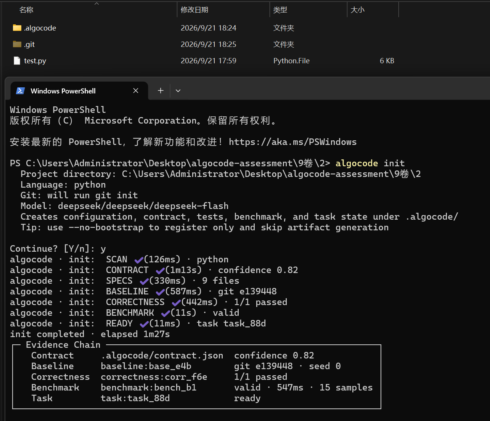
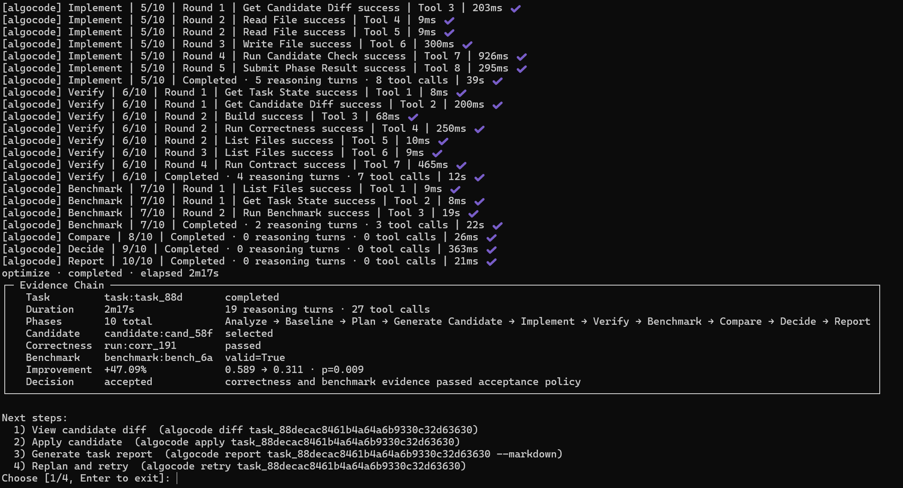

<div align="center">


# Algocode

> *A verifiable algorithm optimization agent for C++ / Python. Local first, evidence driven, rollback safe.*

[](LICENSE)
[](https://www.python.org/)
[](https://pypi.org/project/algocode-agent/)
[](https://code.visualstudio.com/)
[](https://platform.openai.com/)

**Algocode is not a black-box agent that edits your code directly.**

It establishes a behavioral contract first, explores optimizations in isolated worktrees, and uses Correctness, Contract, and Benchmark evidence to decide whether a candidate is worth applying.

[Chinese](README.md) · [Quick Start](#quick-start) · [VS Code](#vs-code-extension) · [Command Reference](#cli-command-reference)

</div>

---

## What Is Algocode?

Algocode is a verifiable algorithm optimization agent CLI for C++ and Python. It uses contracts, correctness checks, and performance evidence to drive code optimization, and only requires a model endpoint to get started.

It reads a Git repository and its entry points, then uses a tool-using Agent to analyze algorithmic hotspots, problem structure, and complexity. Candidate implementations are generated in isolated Git worktrees. The Agent can read complete files, search the codebase, inspect related files, run builds and correctness tests, and execute benchmarks, enabling algorithmic changes rather than surface-level rewrites.

Algocode does not modify the user project directly. Every candidate must pass Correctness, Contract, and Benchmark validation. Users can inspect the structured evidence chain, diff, confidence intervals, and decision results, then explicitly run `accept` and `apply`. If problems appear after application, `rollback` restores the workspace.

Beyond single-pass optimization, Algocode supports multi-candidate search. When a direction has significant positive evidence but has not met acceptance criteria, it refines the same candidate. When a direction has no measurable benefit, it creates a new candidate. Algocode supports both CLI and VS Code entry points and is designed for algorithm competition code, data structures, graph algorithms, string algorithms, caches, parsers, and other programs with verifiable behavior.

## Why Algocode?

### Limitations of General-Purpose Agents

- **They can edit code but cannot prove correctness.** Models can change boundaries, errors, ordering, or state transitions in ways ordinary tests may miss.
- **They tend to make local changes.** General-purpose agents often modify loops and variables without reanalyzing the problem structure for a true algorithmic improvement.
- **Performance results lack reliable evidence.** A single `time` command or one benchmark run can be dominated by system load, cache state, interpreter startup, or environment changes.
- **Long tasks drift from the original objective.** As context grows, the model may forget the behavioral contract, protected files, and validation constraints.
- **Candidate lifecycles are unstable.** Without isolated candidates, evidence gates, and rollback, failed attempts are difficult to continue safely.
- **Direction comparison is difficult.** If multiple approaches exist only in chat and temporary commands, performance, correctness, and risk cannot be compared systematically.
- **Processes are hard to audit and reproduce.** The reason for accepting or rejecting a candidate, and the exact tests and benchmarks that ran, are often not recorded.
- **Quality depends too heavily on the model and prompt.** Changing a model or prompt can materially change the result.

### What Algocode Provides

- **Behavioral contracts first.** Public APIs, inputs and outputs, errors, state transitions, ordering, and boundary behavior are defined before optimization.
- **Isolated optimization.** Each candidate evolves in an independent Git worktree and never modifies the user project before validation.
- **Algorithmic analysis.** Input structure, data distribution, operation algebra, query/update mix, and complexity gaps are analyzed to propose multiple algorithmic directions.
- **Behavior verification.** Correctness, Contract, and reference cross-checks detect changes to observable behavior.
- **Trustworthy benchmarks.** Warmup, repeated sampling, interleaved execution, multi-scale inputs, and fixed harnesses reduce environment noise.
- **Statistical decisions.** Paired permutation tests, bootstrap confidence intervals, and MAD-based robust variation distinguish real gains from noise.
- **Algorithmic gain detection.** Runtime growth is fitted across input sizes so a lower asymptotic exponent can be recognized even when small inputs are slower.
- **Refinement of promising candidates.** A direction with meaningful positive evidence can be reopened and refined.
- **Search across other directions.** When a direction has no measurable benefit, Algocode creates a new candidate from historical evidence.
- **Constrained Agent behavior.** Each phase exposes only an allowlist of tools and receives remaining turns, tool-call budgets, and self-check requirements.
- **Human control.** Candidates must be reviewed and explicitly accepted before they are applied.
- **Safe rollback.** Applied candidates can be rolled back through a manifest.
- **Replaceable models.** Different model providers reuse the same contract, validation, benchmark, and candidate lifecycle.
- **Complete evidence chains.** Contract, Correctness, Benchmark, Decision, Report, model logs, and candidate records are persisted for audit and reproduction.

## Performance and Results Notice

Algocode uses large language models to analyze source code and generate candidate optimizations. Performance may improve, remain unchanged, or regress. Results depend on source quality, project structure, model capability, input size, runtime environment, and system load.

Algocode does not guarantee a positive result and does not replace human code review. Use the actual Correctness, Contract, Benchmark, Diff, and Review evidence, and apply only after verifying behavior and expected gains.

## How Algocode Protects Correctness

Algocode does not rely on model self-evaluation. It combines behavioral contracts, frozen baselines, Correctness, Contract Tests, and reference implementations:

- **Contract first:** define public APIs, I/O, errors, state transitions, ordering, and boundaries before optimization. Removing checks or changing tests to gain speed is prohibited.
- **Frozen baseline:** preserve the original source snapshot, environment hash, baseline output, and baseline performance. Every candidate is compared with the same baseline.
- **Layered verification:** fixed cases, reference implementations, stress tests, and determinism checks validate output, exit codes, exceptions, API returns, and state changes.
- **Reference cross-check:** an unmodified reference implementation is stored in a protected directory. Candidates must match it on boundary and small-scale inputs.
- **Phase gates:** candidates must pass Build, Correctness, and Contract before Benchmark. Apply additionally checks Decision, stale state, and the Rollback Manifest.
- **Human confirmation:** even after automated validation passes, the user must inspect Diff and Review and explicitly run `accept` and `apply`.

## Usage

### Requirements

| Dependency | Minimum | Notes |
| --- | --- | --- |
| Python (required) | 3.11+ | Runtime environment. |
| Git (required) | any | Worktree isolation and version management. |
| C++ compiler | any | Required for C++ projects; supports `g++` or `clang++`. |

Optional enhancements:

- **Docker / WSL2** for stronger sandbox isolation.
- **VS Code** for context menus, live phase progress, Diff, Apply, and Rollback.

### Code Requirements

- The project to optimize should be a Git repository with an entry point that can be built and run directly.
- Python and C++ are supported; the project should provide a clear program or test entry point.
- Inputs, outputs, exit codes, and key behaviors should be reliably reproducible so that Correctness and Benchmark checks can be established.
- Avoid dependencies on unavailable private data, network services, or non-reproducible environments; complex dependencies should be configured in advance.
- The code should have a clear optimization goal, such as reducing time complexity, lowering memory usage, or improving hot-path performance.

### CLI

#### Installation

```bash
pip install algocode-agent
```

The extension command automatically looks for `code`, `code-insiders`, or `codium`.

After installation, the `algocode` command is available globally.

#### Quick Usage

Configure a model:

```bash
algocode api
algocode test
```


`algocode api` selects the provider, Base URL, model ID, and API key. The key is stored in a local credential file and is not written to project configuration.

Switch the default model:

```bash
algocode model
```

### Environment Check

```bash
algocode doctor
```


Run this check first to confirm that the environment meets the requirements.

### Run the First Optimization

From the project directory:

```bash
algocode init
```

```bash
algocode optimize
```

Inspect status, evidence, and diff:

```bash
algocode status
algocode review
algocode diff
```

Apply or roll back:

```bash
algocode apply
algocode rollback
```

---

### VS Code Extension

#### Installation

Install the CLI first:

```bash
pip install algocode-agent
```

Install the extension:

```bash
algocode vscode install
```

#### Usage

**Configure the model** as described above.

Right-click a `.py`, `.cpp`, `.cc`, or `.cxx` file and select an Algocode action:


| Action | Description |
| --- | --- |
| Optimize | Run the full optimization workflow in a temporary shadow workspace. |
| Rollback | Undo the most recently applied extension candidate. |
| Apply | Apply the latest candidate to the original project. |
| Show Diff | Open the native VS Code diff. |
| Review | Inspect Candidate, Correctness, Benchmark, Decision, and changed files. |

The extension opens an `Algocode` terminal and shows live progress:

```text
[algocode] analyze | 1/10 | turn 2 | running read_file (3s) | tools 4 | 18s
[algocode] implement | 5/10 | turn 8 | running run_candidate_check (7s) | tools 14 | 47s
[algocode] benchmark | 7/10 | running benchmark | 21s
```

---

## CLI Command Reference

```bash
algocode --help
```

| Command | Description |
| --- | --- |
| `algocode api` | Configure a model provider and API key. |
| `algocode test` | Verify the model connection. |
| `algocode model` | Select the default model. |
| `algocode doctor` | Check the local environment. |
| `algocode init` | Initialize the project, generate a contract, and capture a baseline. |
| `algocode optimize` | Run the complete optimization workflow. |
| `algocode retry` | Replan from historical optimization records. |
| `algocode status` | Show the current task, phase, and progress. |
| `algocode review` | Inspect Correctness, Benchmark, and Decision evidence. |
| `algocode diff` | Show candidate changes. |
| `algocode apply` | Accept and apply a candidate. |
| `algocode rollback` | Roll back an applied candidate. |
| `algocode report` | Generate a Markdown report. |
| `algocode vscode install` | Install the bundled VS Code extension. |

Most commands support `--json`:

```bash
algocode status --json
algocode review --json
algocode optimize --json
```

---

## Optimization Workflow

Phase gates enforce evidence order:

- If Contract or Correctness fails, Benchmark is not allowed.
- If Benchmark is invalid or shows no positive gain, the candidate cannot be accepted.
- Before Apply, Algocode checks whether the candidate is stale.
- Rollback restores the workspace after an applied candidate.

---

## Verification System

Algocode separates evidence into three categories:

| Type | Purpose |
| --- | --- |
| **Correctness** | Verify that the candidate reproduces baseline behavior using `cases`, `oracle`, `stress`, or `hybrid` modes. |
| **Contract** | Protect public APIs, configuration semantics, error types, state transitions, ordering, and boundary behavior. |
| **Benchmark** | Measure warmup, repeated samples, median, variation, and environment hash in a controlled environment. |

When speed and correctness conflict, correctness wins.

---

## Architecture

```text
CLI / VS Code
      |
Application Services
      |
Runtime Agent
      |
Context / Tools / Providers
      |
Language Adapters
      |
Git Worktree / Sandbox
      |
Storage / Event Store / Artifacts
```

---

## Project Structure

See [PROJECT_STRUCTURE.md](PROJECT_STRUCTURE.md) for the complete source, test, extension, and runtime layout.

### Source Structure

```text
src/algocode/
├── cli/                  # CLI command entry points and output
├── application/          # Task, Candidate, Baseline, Benchmark, and report services
├── domain/               # Entities, value objects, and events
├── runtime/              # Phase machine, tool loop, retry, model logs
├── config/               # Configuration loading and models
├── context/              # Context assembly, fact ledger, and budgets
├── tools/                # Files, process, and validation tools
├── policy/               # Policy engine
├── approval/             # Approval service
├── sandbox/              # Native / Docker / WSL2 execution backends
├── security/             # Credentials and secret redaction
├── providers/            # Model provider adapters
├── languages/            # Python / C++ language adapters
├── correctness/          # Correctness validation
├── benchmark/            # Benchmark engine
├── profiling/            # Profiling adapters
├── workspace/            # Git worktree, Apply, Rollback
├── storage/              # SQLite Event Store, Projection, Artifact
└── resources/            # Resources and bundled VS Code extension
```

### Project `.algocode`

After `init`, the project root contains:

```text
.algocode/
├── config.yaml           # Project configuration
├── config.local.yaml     # Optional local overrides
├── contract.json         # Behavioral contract
├── task.txt              # Current task summary
├── current-task.json     # Current task state
├── oracle/               # Correctness and Contract Tests
│   ├── check.py
│   ├── correctness.yaml
│   ├── contract_test.py
│   ├── contract_test.cpp
│   └── reference/
├── benchmarks/
│   └── benchmark.yaml
└── cache/
    ├── algocode.db       # Event Store and projections
    ├── artifacts/
    ├── model-logs/
    ├── optimization-records/
    ├── worktrees/
    ├── repair-memory/
    └── rollbacks/
```

---

## Configuration and Data

### Providers

Supported providers include:

```text
OpenAI
DeepSeek
OpenRouter
Kimi
Zhipu GLM
MiniMax
Anthropic Claude
Volcano Engine Doubao
Qwen
Custom OpenAI-compatible
Local Ollama / vLLM
```

### Reports

```bash
algocode report
```

This generates:

```text
report.md
```

Internal artifacts are retained under `.algocode/cache/artifacts`.

---

## Security and Data

- Algocode runs locally by default.
- API keys are stored in the local credential file, not project configuration.
- Model-call logs are redacted before being written to `.algocode/cache/model-logs`.
- Contract, Correctness, Benchmark, and Oracle files are protected.
- Docker / WSL2 are optional isolation layers.
- Avoid running in directories containing sensitive data, production secrets, or untrusted code.

---

## Development

```bash
git clone https://github.com/acfoundry/Algocode.git
cd Algocode
python -m venv .venv
.venv/bin/python -m pip install -e ".[dev]"
.venv/bin/python -m pytest
.venv/bin/python -m ruff check .
```

VS Code extension development:

```bash
cd extensions/vscode
npm install
npm run compile
```

Debugging:

```text
Press F5 -> Run Algocode Extension
```

Package the extension:

```bash
npx --yes @vscode/vsce package
```

---

## Release

Python package releases are handled by GitHub Actions.

```bash
git tag v0.1.2
git push origin v0.1.2
```

The workflow builds and publishes:

```text
algocode_agent-0.1.2.tar.gz
algocode_agent-0.1.2-py3-none-any.whl
```

See [`docs/changelog/v0.1.2.md`](docs/changelog/v0.1.2.md) for full changes.

Users can install with:

```bash
python -m pip install algocode-agent
algocode vscode install
```

---

## Contributing

Issues and pull requests are welcome.

When opening an issue, include:

- Operating system and Python version
- Algocode version
- Reproduction steps
- Expected and actual behavior
- Relevant logs or screenshots

Before submitting code, run:

```bash
python -m pytest
python -m ruff check .
```

---

## License

This project is licensed under the [MIT License](LICENSE).

---

<div align="center">

> **Algocode** — evidence for every algorithm optimization.

</div>
