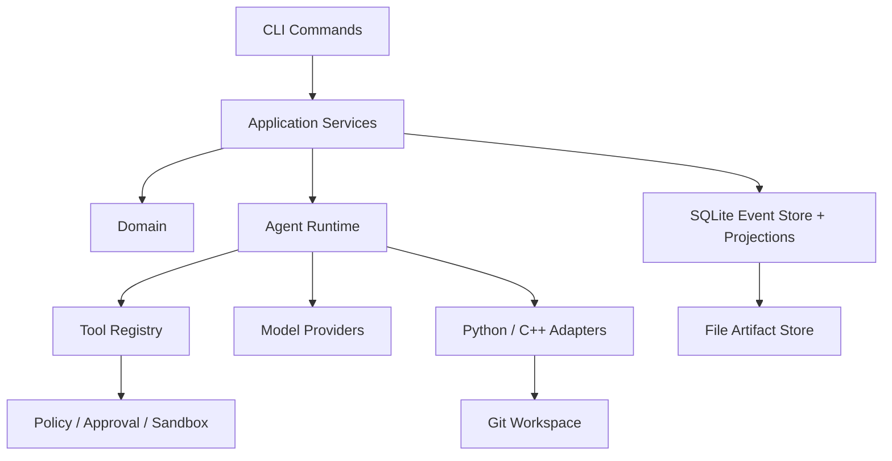

# 架构概览

## 层职责

- `cli/`：命令入口和输出。
- `application/`：业务流程编排。
- `domain/`：领域模型和事件。
- `runtime/`：阶段机、工具循环和模型交互。
- `tools/`：Agent 可调用的工具。
- `providers/`：模型服务适配。
- `languages/`：Python 和 C++ 适配。
- `workspace/`：Git Worktree 和 Patch 管理。
- `storage/`：事件、投影和产物持久化。
- `security/`：凭证与脱敏。
- `policy/`：策略决策。
- `approval/`：人工审批。

## 双入口

系统同时提供两个入口：

| 入口 | 隔离方式 | 主要用途 |
| --- | --- | --- |
| CLI | Git Worktree | 终端自动化、完整流程、批量或脚本调用。 |
| VS Code 扩展 | 临时影子工作区 | 编辑器内右键优化、Diff、Review、Apply、Rollback。 |

两个入口最终都调用相同的 Application Services、Runtime、验证和存储层。

## 请求路径

CLI 或 VS Code 命令进入 `application` 后，业务流程会驱动 `runtime` Agent。Agent 通过 `tools` 修改候选 Worktree，通过 `providers` 调用模型，通过 `languages` 适配 Python/C++，再通过 `workspace` 管理 Git 状态，通过 `storage` 持久化事件和产物。Policy、Approval 和 Sandbox 在执行高风险动作时提供约束。
