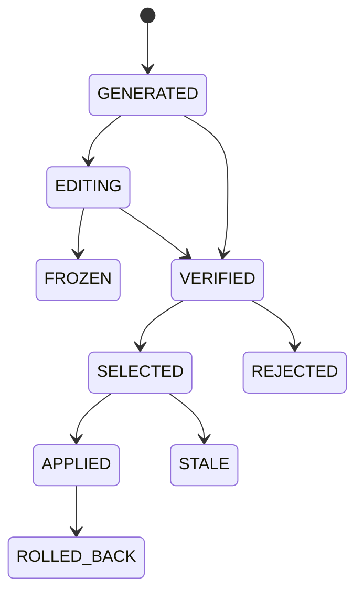

# 候选生命周期

候选不会直接出现在用户工作区中，而是在独立 Git Worktree 中完成生命周期。

## 主要状态

- `generated`：候选已创建。
- `editing`：候选代码正在修改。
- `frozen`：候选内容被固定。
- `verified`：候选 Correctness 已通过。
- `selected`：候选被接受决策选中。
- `applied`：候选已应用到用户工作区。
- `rolled_back`：已回滚。
- `rejected`：验证失败或被拒绝。
- `stale`：工作区变化后不再可安全应用。

其中 `verifying` 表示 Correctness/Contract 正在执行。CLI 与 VS Code 扩展都会复用相同状态模型；区别主要在候选的物理隔离位置和应用方式。
