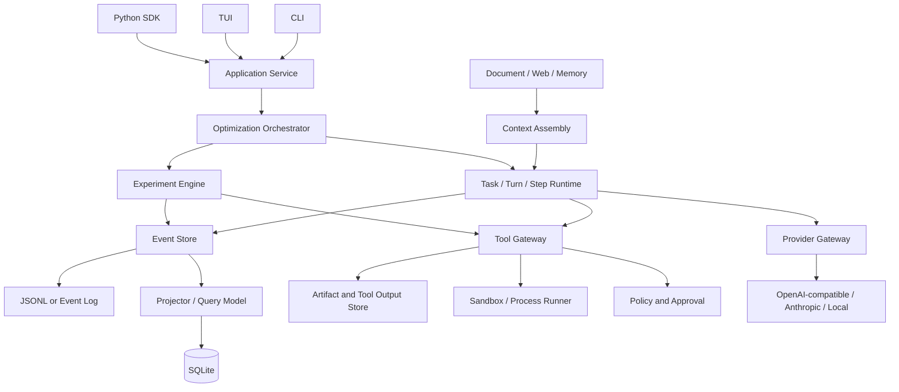
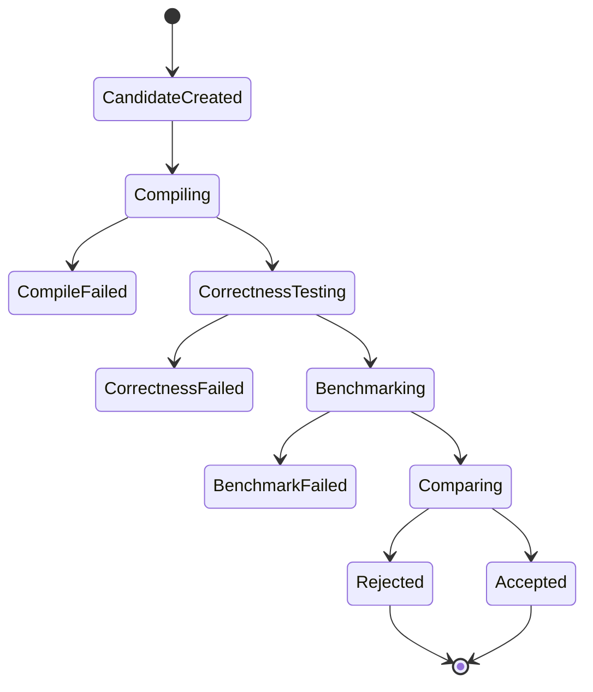

# Algocode 八项目横向设计分析

> 文档版本：分析稿 v1.0  
> 分析日期：2026-09-15  
> 分析对象：Algocode Demo、MarkItDown、OpenViking、Firecrawl、OpenClaude、DeepSeek Harness、OpenCode、Codex  
> 文档目的：把八个项目的设计取舍合并成 Algocode 可执行的架构决策

## 1. 阅读说明

本文件不重复每份单项目设计文档的实现细节。各项目细节应分别参考：

- `01-demo-algocode-design.md`
- `02-markitdown-design.md`
- `03-openviking-design.md`
- `04-firecrawl-design.md`
- `05-openclaude-design.md`
- `06-deepseek-harness-design.md`
- `07-opencode-design.md`
- `08-codex-design.md`

对应覆盖范围和证据级别见各项目的 `*-coverage.md`。

本文的核心问题是：

1. 八个项目分别解决什么问题。
2. 哪些设计是 Coding Agent 的通用基础设施。
3. 哪些设计属于 Algocode 的算法优化垂直能力。
4. 哪些代码可以借鉴，哪些只能借鉴思想。
5. Algocode 第一版应选什么架构，不应选什么架构。

## 2. 八个项目不是同一类软件

| 项目 | 本质 | 最核心的贡献 | 对 Algocode 的直接价值 |
|---|---|---|---|
| Algocode Demo | 算法优化 Agent 原型 | 多路径优化、Worker、对拍、性能验证 | 领域工作流与问题定义 |
| MarkItDown | 文档到 Markdown 转换引擎 | Converter Registry、格式归一化 | 读取算法题面、论文、报告、Office 文档 |
| OpenViking | Agent 上下文数据库 | URI Resource、L0/L1/L2、目录检索 | 组织代码、实验、日志和领域知识 |
| Firecrawl | Web 数据抓取平台 | 多引擎瀑布、异步任务、统一文档模型 | 抓取算法资料、Benchmark、论文和网页 |
| OpenClaude | 多 Provider Coding Agent CLI | Provider、Tool、Permission、MCP、SDK | Agent 产品结构参考，但存在许可证风险 |
| DeepSeek Harness | 插件化 Agent Harness | Cordis、Profile/Patch、事件 Session、Tool Pipeline | 插件化和可组合产品架构 |
| OpenCode | 本地优先 Coding Agent 平台 | Server/SDK、V1/V2 迁移、Event Sourcing、Location | 渐进式内核演进和 Tool Registry |
| Codex | 工业级 Coding Agent Runtime | Thread/Turn/Step、Approval、Sandbox、Rollout | 最完整的执行控制面和可靠性模型 |

结论：不应该“拼装八个项目”，而应该按职责选择最合适的设计来源。

## 3. 横向能力矩阵

### 3.1 Agent 运行链

| 项目 | Session 模型 | Agent Loop | 工具系统 | 恢复能力 |
|---|---|---|---|---|
| Algocode Demo | 任务、Worker、RunState | Python Controller | Benchmark/对拍工具为主 | 文件式状态，恢复较弱 |
| MarkItDown | 单次转换 | 无 Agent Loop | Converter | 不需要 Agent 恢复 |
| OpenViking | Resource + Work | 上层 Agent 使用其上下文 | Memory/检索接口 | 有 Job 和索引恢复 |
| Firecrawl | Crawl/Batch Job | 无通用 Agent Loop | Scrape 引擎 | 队列、状态、重试强 |
| OpenClaude | Transcript + Query Loop | QueryEngine | Tool + Hook + MCP | 会话恢复和压缩较完整 |
| DeepSeek Harness | 事件溯源 Session | Turn/Step | Scoped Tool Pipeline | 崩溃修复、格式迁移强 |
| OpenCode | V1 Message + V2 Event | Prompt Loop / Runner | V1/V2 Tool Registry | V2 Replay 强，V1 产品主链成熟 |
| Codex | Thread/Task/Turn/Step | Submission + run_turn | Registry/Router/Orchestrator | Rollout + SQLite 强 |

### 3.2 Provider 与模型路由

| 项目 | 策略 | 优点 | 代价 |
|---|---|---|---|
| Algocode Demo | 直接调用 OpenAI-compatible API | 简单 | Provider 逻辑与业务耦合 |
| OpenClaude | 大量 Provider 适配 | 模型覆盖广 | 架构大，许可证风险高 |
| DeepSeek Harness | Provider Adapter + Profile | 可组合 | 需要依赖注入和插件体系 |
| OpenCode | Provider/Model/Endpoint/Variant + LLM Route | 层次完整 | V1/V2 双轨复杂 |
| Codex | Responses-only Wire API | 与目标模型深度绑定 | 通用多协议灵活性较弱 |

Algocode 推荐：

```text
Canonical Experiment Request
  -> Provider Adapter
  -> OpenAI-compatible / Anthropic / local
```

不要第一版就建设 OpenCode 式完整 Route/Protocol/Transport 框架，但必须把 Provider 从 Controller 中抽出去。

### 3.3 工具注册与工具执行

| 项目 | 工具模型 | 主要优点 |
|---|---|---|
| Algocode Demo | 项目内直接调用 | 领域明确、修改少 |
| MarkItDown | Converter Registry | 注册和优先级清晰 |
| Firecrawl | Engine Waterfall | 多实现回退 |
| OpenClaude | Tool Registry + Hook | 多 Provider 工具编排 |
| DeepSeek Harness | Scoped Layers + Pipeline | 工具授权和生命周期完整 |
| OpenCode | V1 AI SDK Tool + V2 Opaque Tool | V2 Codec、Scope、Stale 防止非常好 |
| Codex | Registry + Router + Orchestrator | 工具视图冻结和安全执行最成熟 |

Algocode 的工具模型必须比普通 Coding Agent 多一层“实验事实”：

```text
工具执行
  -> Tool Result
  -> Experiment Evidence
  -> Metric Record
  -> Decision Input
```

普通文件读写在执行完就结束；Benchmark 工具必须生成可审计的实验结果。

### 3.4 权限、安全和沙箱

| 项目 | 权限模型 | 沙箱 | 风险 |
|---|---|---|---|
| Algocode Demo | 基本路径限制 | 宿主临时目录 | 不可运行不可信代码 |
| OpenClaude | Permission + Hook | 主要依赖宿主 | 高权限自动化 |
| DeepSeek Harness | Approval + Sandbox | 跨平台较强 | 配置和平台复杂 |
| OpenCode | Ruleset + Provider Policy | Bash 本身无 Sandbox | 插件是任意代码 |
| Codex | Approval + ExecPolicy + Sandbox + Network Proxy | 最完整 | 组合复杂、平台差异大 |

Algocode 需要保护的不是“源代码秘密”这么简单，还包括：

- 宿主机器。
- 用户数据集。
- 竞赛评测环境。
- 云账号和模型 Key。
- Benchmark 可重复性。
- 结果不被错误修改或伪造。

因此算法优化 Agent 至少需要：

1. Workspace Root。
2. Command Allow/Prompt/Forbid。
3. Network Policy。
4. Output Bounding。
5. Process Timeout。
6. Resource Limit。
7. Experiment Lock。
8. Baseline Snapshot。

### 3.5 持久化

| 项目 | 主存储 | 搜索/索引 | 事件重放 |
|---|---|---|---|
| Algocode Demo | 文件、JSON | 较少 | 弱 |
| MarkItDown | 无状态 | 无 | 不适用 |
| OpenViking | 文件系统 + 索引 | 强 | 部分 |
| Firecrawl | PG/Redis/Queue/Object Storage | 强 | 任务状态 |
| OpenClaude | Transcript | 会话恢复 | 中等 |
| DeepSeek Harness | JSONL Event Log | 迁移/修复 | 强 |
| OpenCode V2 | SQLite Event + Projector | 强 | 强 |
| Codex | JSONL Rollout + SQLite State DB | 强 | 强 |

Algocode 推荐组合：

```text
Durable Experiment Log
  = JSONL 或 SQLite Event Table
Metadata Index
  = SQLite
Source Snapshot
  = Git Commit / Worktree / File Hash
Large Artifact
  = Artifact Store / Tool Output Store
```

### 3.6 扩展系统

| 项目 | 扩展方式 | Algocode 是否早期需要 |
|---|---|---|
| MarkItDown | Converter Registration | 可选 |
| OpenViking | Resource/Indexer | 中后期 |
| Firecrawl | Engine + Storage Backend | 不直接需要 |
| OpenClaude | Plugin、Hook、MCP、Skill | 中后期 |
| DeepSeek Harness | Cordis 全插件 | 中后期 |
| OpenCode | Plugin + MCP + LSP | 中后期 |
| Codex | Plugin + MCP + Hook + Skill | 中后期 |

Algocode 第一版只需要稳定两类扩展：

1. Benchmark/Profiler Adapter。
2. Provider Adapter。

MCP、Plugin、Hook 和 Skill 可以统一放到后期。

## 4. 对 Algocode 最有价值的设计

### 4.1 来自 Algocode Demo：领域闭环

Algocode Demo 最重要的不是代码规范，而是定义了正确工作流：

```text
可运行原始程序
  -> 多路径优化
  -> 独立实现
  -> 编译
  -> 正确性对拍
  -> 性能 Benchmark
  -> 结果聚合
  -> 报告
```

必须保留：

- 原始程序作为可信基线。
- 多候选而不是单次生成。
- 独立正确性验证。
- 性能数据。
- 结果证据。
- 失败原因。

需要重写：

- 全局状态。
- Controller 耦合。
- 文件式临时状态。
- Provider 直连。
- C++ 执行逻辑写死。
- 缺少正式状态机和持久化。

### 4.2 来自 MarkItDown：文档转换层

MarkItDown 适合 Algocode 的输入扩展：

- Python、C++ 文档注释。
- PDF 论文。
- DOCX/PPTX 题目或报告。
- XLSX/CSV 实验数据。
- HTML 算法博客。
- 图片 OCR/说明。

推荐接口：

```python
convert_to_markdown(source) -> MarkdownDocument
```

必须保留：

- Converter Registry。
- 优先级覆盖。
- 统一输出结构。
- 流和文件两类输入。
- 失败回退。

不应直接照搬：

- 无沙箱的任意 URL 抓取。
- 默认宽松 I/O。

### 4.3 来自 OpenViking：实验上下文组织

算法优化会产生：

- 基线代码。
- Candidate Diff。
- 测试数据。
- Benchmark 输出。
- Profiler 火焰图。
- 编译日志。
- 失败报告。
- 历史结论。
- 论文和题解。

OpenViking 的启发是：

```text
Resource URI
  + 元数据
  + L0 摘要
  + L1 概览
  + L2 完整内容
```

Algocode 可以使用类似结构：

```text
algocode://project/<id>/baseline
algocode://project/<id>/candidate/<experiment-id>
algocode://project/<id>/benchmark/<run-id>
algocode://project/<id>/profile/<run-id>
algocode://knowledge/<paper-id>
```

模型优先看到摘要和引用，需要时再读取完整内容。

### 4.4 来自 Firecrawl：可重试任务平台

Firecrawl 的抓取领域与 Algocode 不同，但有三个共通点：

1. 长任务需要异步化。
2. 每个 Pipeline Stage 需要可重试。
3. 中间结果和最终结果需要分层存储。

Algocode 可以借鉴：

- Job 状态：Queued、Running、Succeeded、Failed、Cancelled。
- 分阶段重试。
- Engine/Backend 可替换。
- 结果和审计分离。
- 并发限制。
- Webhook 或事件通知。

不建议把 Algocode 做成 Redis、RabbitMQ、PG、对象存储四件套平台。单机 SQLite 足够开始。

### 4.5 来自 OpenClaude：Agent 产品面

OpenClaude 展示了完整 Coding Agent 的用户期待：

- 交互 TUI。
- Headless 输出。
- Query Loop。
- Tool Pipeline。
- Permission。
- Session Transcript。
- Compaction。
- MCP。
- Subagent。
- SDK。
- Provider 适配。

许可证风险决定 Algocode 只能借鉴架构和接口，不应复制源码。

### 4.6 来自 DeepSeek Harness：插件化和事件 Session

DeepSeek Harness 的核心思路：

```text
CLI 只加载 Profile
Profile 组合 Bundle 和 Patch
插件提供 Session、Agent、Tool、LLM、Sandbox、UI
Session 是事件日志
Agent Loop 用 Turn 和 Step 描述工作
```

对 Algocode 的启发：

- 把 Benchmark、Provider、Report 和 Sandbox 做成可替换插件。
- 用事件日志记录优化过程。
- 把“输入接纳”和“工作完成”区分。
- 明确 Tool Pipeline。
- 对 Session Format 做版本化。

不建议第一版直接引入 Cordis 和数十个插件包。

### 4.7 来自 OpenCode：渐进式内核迁移

OpenCode 同时保留：

- V1 产品主链。
- V2 Event-sourced 内核。

这证明大型 Agent 可以从单体 Prompt Loop 逐步迁移到更可靠的内核。

Algocode 应学习：

- Location/Workspace 隔离。
- Tool 先持久化再执行。
- Session Input 先 Admit 后 Prompt。
- Context Epoch。
- Tool Output Bounding。
- Permission Last Match Wins。

不应学习：

- 同时维护两套完整 Session。
- 第一版就采用 Effect Beta 级别的复杂运行时。
- 在没有产品验证前建设全部 Surface。

### 4.8 来自 Codex：执行控制面

Codex 最值得 Algocode 借鉴的是安全执行控制：

```text
Step Context 冻结
  -> Tool Router
  -> PreToolUse Hook
  -> Approval
  -> ExecPolicy
  -> Sandbox
  -> First Attempt
  -> Escalation
  -> PostToolUse Hook
  -> Durable Result
```

Algocode 的算法实验也需要同样的纪律：

- 一次 Benchmark 使用哪个 Commit。
- 使用什么编译参数。
- 使用哪份输入数据。
- 使用哪个 CPU/GPU。
- 哪一个 Baseline。
- 哪个工具调用产生的指标。
- 哪个决策接受了结果。

## 5. Algocode 推荐总体架构



### 5.1 建议模块

```text
algocode/
  cli/
  api/
  runtime/
    task.py
    turn.py
    step.py
    event.py
  experiment/
    baseline.py
    candidate.py
    runner.py
    metrics.py
    compare.py
    decision.py
  tools/
    registry.py
    benchmark.py
    profiler.py
    correctness.py
    edit.py
    search.py
  policy/
    rules.py
    approval.py
    sandbox.py
  providers/
    base.py
    openai_compatible.py
    anthropic.py
  context/
    markdown.py
    resources.py
    compaction.py
  storage/
    event_store.py
    sqlite.py
    artifacts.py
  surfaces/
    terminal.py
    server.py
    sdk.py
```

### 5.2 核心数据模型

```ts
Task
  id
  objective
  repository
  baseline
  status
  time

Turn
  id
  taskId
  objective
  status
  time

Step
  id
  turnId
  provider
  model
  request
  response
  time

Experiment
  id
  taskId
  candidateId
  baselineId
  command
  environment
  correctness
  metrics
  artifacts
  status

Candidate
  id
  baseCommit
  patch
  files
  author
  status

Decision
  id
  experimentIds
  result
  reason
  acceptedPatch
```

### 5.3 事件

推荐事件：

- TaskCreated
- TurnStarted
- PromptAdmitted
- StepStarted
- ModelTextDelta
- ToolRequested
- ToolApproved
- ToolStarted
- ToolFinished
- BenchmarkStarted
- BenchmarkFinished
- CorrectnessFailed
- CandidateRejected
- CandidateAccepted
- TaskCompleted

所有事件应包含：

- ID
- Task/Turn/Step ID
- Timestamp
- Sequence
- Payload Version

## 6. 算法优化领域的专门工具

普通 Coding Agent 的工具不够表达算法性能优化。Algocode 至少需要：

### 6.1 实验准备

- `prepare_baseline`
- `snapshot_workspace`
- `detect_build_system`
- `probe_environment`
- `prepare_dataset`

### 6.2 代码优化

- `read_code`
- `search_code`
- `apply_patch`
- `generate_candidate`
- `explain_complexity`
- `check_invariants`

### 6.3 正确性

- `compile`
- `run_unit_test`
- `run_stress_test`
- `compare_with_bruteforce`
- `run_edge_cases`
- `validate_output`

### 6.4 性能

- `run_benchmark`
- `repeat_benchmark`
- `collect_cpu_profile`
- `collect_memory_profile`
- `collect_gpu_profile`
- `measure_cache_behavior`
- `measure_allocations`

### 6.5 结论

- `aggregate_metrics`
- `compare_baseline`
- `check_statistical_significance`
- `reject_regression`
- `accept_candidate`
- `write_report`

每个 Benchmark/Profiler Tool 必须返回结构化结果，而不是只返回一段文本。

## 7. 实验状态机



关键要求：

- Compile Failed 不进入 Benchmark。
- Correctness Failed 不进入 Benchmark。
- Benchmark Failed 不能解释为性能回退。
- Benchmark 通过但无统计差异时不能自动接受。
- Reject 必须保留原因。
- Accept 必须关联 Patch、Benchmark 和正确性证据。

## 8. Context 与记忆策略

### 8.1 分四层

```text
L0: 一句话状态
L1: 当前实验摘要
L2: 代码、日志、Profile 的必要片段
L3: 完整原始 Artifact
```

模型默认只看到 L0/L1 和 L2 引用。

### 8.2 上下文来源

- 用户目标。
- 当前代码。
- Git Diff。
- 编译错误。
- 正确性结果。
- 最近 Benchmark。
- 历史失败策略。
- 环境限制。
- 相关论文或题解。

### 8.3 不使用无界上下文

- 原始 Benchmark 输出写 Artifact。
- Profiler 结果只回传关键热点。
- 重复失败折叠为 Failure Pattern。
- 过期试验只保留摘要和引用。

## 9. 安全策略

### 9.1 默认规则

| 操作 | 默认 |
|---|---|
| 读取 Workspace | Allow |
| 读取 `.env` 和密钥 | Deny 或 Ask |
| 修改 Workspace | Ask |
| 编译 | Allow |
| 本地单元测试 | Allow |
| Benchmark | Allow |
| Profiler | Allow |
| 下载依赖 | Ask |
| 访问任意公网 | Ask |
| 执行任意 Shell | Ask |
| 写入 Workspace 外 | Deny |
| 删除文件 | Ask |
| 修改 Benchmark 输入 | Deny |
| 修改正确性 Oracle | Ask 或 Deny |
| 自动接受优化 | Deny |

### 9.2 防止 Benchmark 作弊

必须检测：

- 跳过输入。
- 缓存结果。
- 修改测试数据。
- 修改计时器。
- 修改 Oracle。
- 热身后记录。
- 只跑最快样本。
- 删除输出。
- 在编译期完成大量工作却只统计运行期。

Benchmark 工具应：

- Clone 或锁定输入。
- 使用固定编译参数。
- 随机运行顺序。
- 多次采样。
- 记录原始样本。
- 使用同一机器和环境。
- 对比 Baseline 与 Candidate。

## 10. Provider 策略

### 10.1 第一版

```text
ProviderAdapter
  -> OpenAI-compatible Chat/Responses
  -> Anthropic Messages
  -> Local OpenAI-compatible
```

统一接口：

```python
class ProviderAdapter:
    def complete(request: ModelRequest) -> ModelResponse: ...
    def stream(request: ModelRequest) -> Iterator[ModelEvent]: ...
```

### 10.2 不提前建设

- 复杂 Endpoint Catalog。
- Variant 全矩阵。
- Provider Policy 插件。
- 多租户凭据。
- WebSocket 增量请求。
- Prompt Cache 高级策略。

这些可以在出现真实需求后从 OpenCode/Codex 的成熟结构借鉴。

## 11. 存储策略

### 11.1 MVP

单机建议：

```text
SQLite
  + 本地 Artifact Directory
  + Git Repository/Worktree
  + JSON 报告
```

表：

- tasks
- turns
- steps
- events
- candidates
- experiments
- metrics
- artifacts
- decisions

### 11.2 后期

只有出现远程执行或多用户需求后再加入：

- PostgreSQL
- Object Storage
- Queue
- Remote Worker
- Web API
- Multi-tenant Auth

## 12. 各项目直接采用建议

| 能力 | 优先参考 | 采用方式 |
|---|---|---|
| 算法优化闭环 | Algocode Demo | 重构，不照搬 |
| 文档转换 | MarkItDown | 独立 Adapter |
| 上下文 Resource | OpenViking | 借鉴 URI 与分层 |
| 抓取与异步任务 | Firecrawl | 后期借鉴 |
| 多 Provider Coding CLI | OpenClaude | 只借鉴，注意许可证 |
| 插件化 Agent Runtime | DeepSeek Harness | 中后期借鉴 |
| Location + Event Session | OpenCode | 渐进采用 |
| Approval + Sandbox + Rollout | Codex | 优先采用思想 |

## 13. 最终推荐技术路线

### Phase 1：单机可靠实验

- Python CLI。
- SQLite。
- Git Worktree。
- 结构化 Event。
- Provider Adapter。
- Benchmark 工具。
- 正确性工具。
- 输出截断。
- 单 Agent Loop。

### Phase 2：可复现实测

- 多 Benchmark 采样。
- Profiler。
- 环境探测。
- Experiment Matrix。
- Baseline Comparison。
- Failure Pattern。
- HTML/JSON 报告。
- Run Resume。

### Phase 3：Agent 能力

- 子 Agent。
- Context 分层。
- Compaction。
- Tool Registry。
- Policy。
- Sandbox。
- MCP。
- Python SDK。

### Phase 4：产品化

- TUI。
- Server/JSON-RPC。
- Web UI。
- Remote Worker。
- Plugin Marketplace。
- Multi-tenant。
- Cloud/Team Workspace。

## 14. 最终判断

八个项目的共同结论不是“功能越多越好”，而是：

> 一个可靠的 Agent 产品，必须让模型动作、工具执行、权限决策、持久化事实和用户可见结果保持一致的因果链。

对 Algocode，这条因果链是：

```text
优化目标
  -> Baseline
  -> Candidate
  -> 正确性验证
  -> Benchmark
  -> Metric
  -> Decision
  -> Patch
```

只要这条链可靠，Algocode 就已经超过普通代码生成工具。

反过来，如果 Baseline、验证环境、Benchmark 或 Decision 不可信，无论 Agent 接入多少 Provider、多少 Tool、多少 Plugin、多少 UI，都不能构成真正有效的算法优化系统。

因此，Algocode 的正确起点不是“复制 Codex 或 OpenCode”，而是先建立这个小而完整的实验内核：

```text
Durable Task
  + Baseline Snapshot
  + Candidate Patch
  + Correctness Gate
  + Reproducible Benchmark
  + Structured Evidence
  + Explicit Decision
  + Rollback
```

这应是 Algocode 后续所有架构设计的中心约束。
