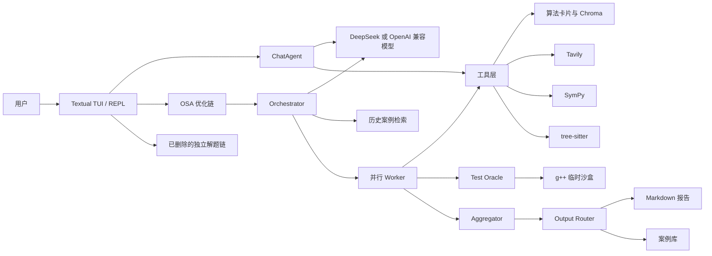
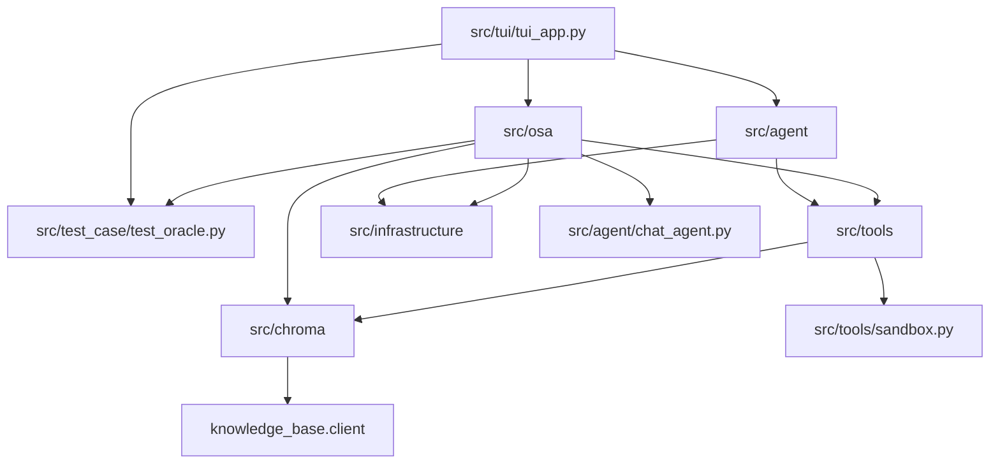
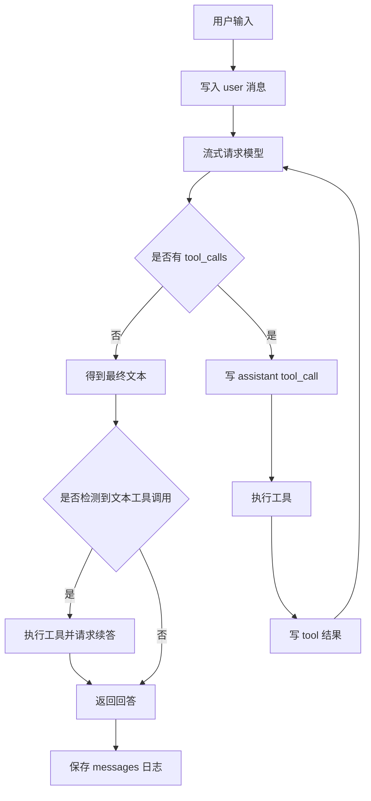
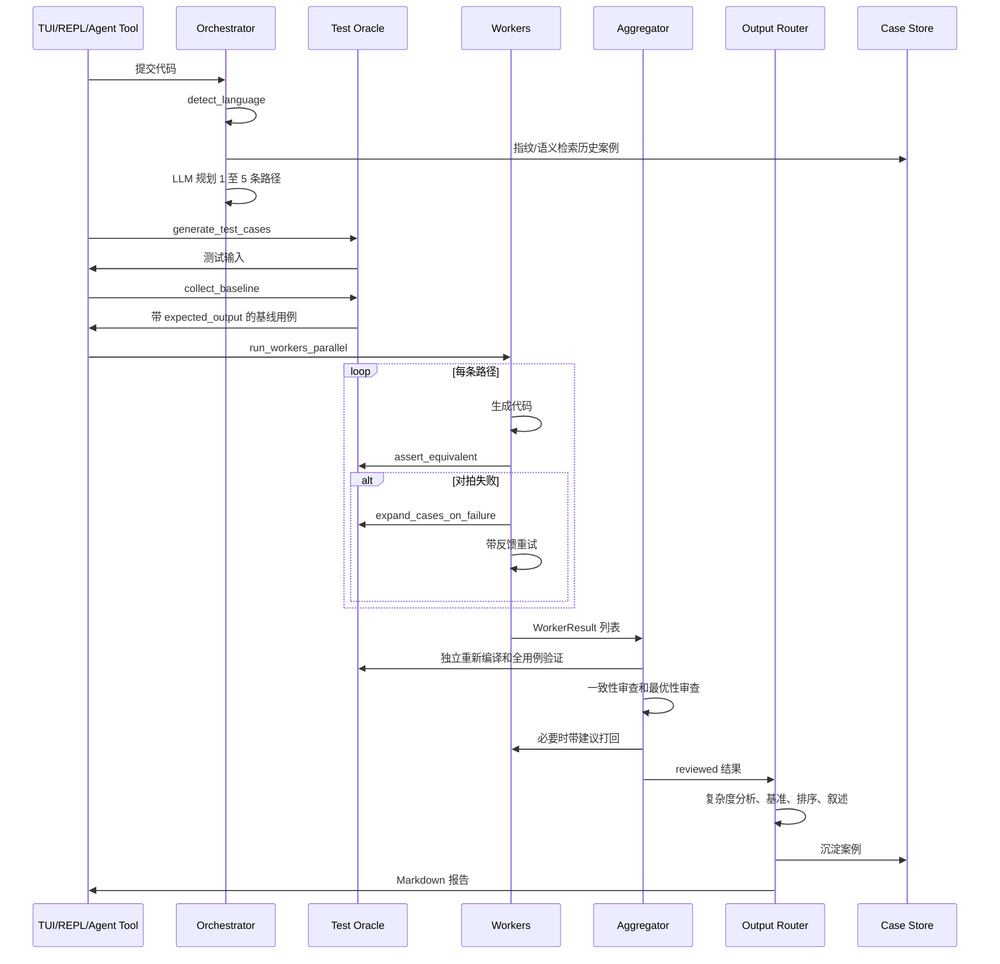
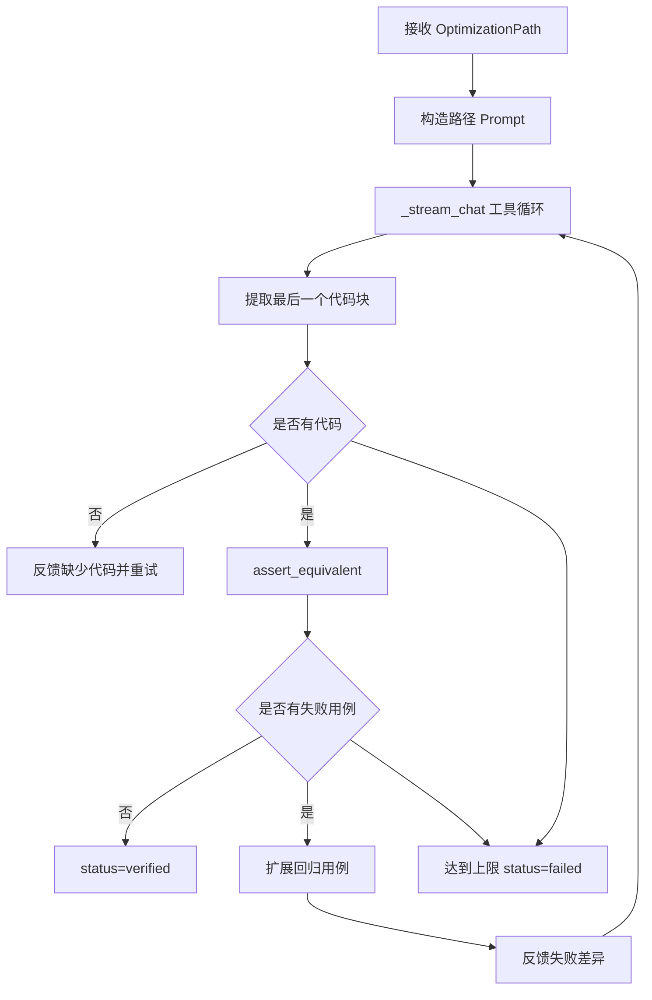

# Algocode Demo 详细设计文档

> 文档版本：分析稿 v1.0  
> 分析日期：2026-09-15  
> 分析对象：`C:\Users\Administrator\Desktop\algocode\demo`  
> 分析基线：当前工作区，而不是仅依据历史提交或现有设计文档  
> 代码规模：30 个第一方 Python 源文件，7,826 行；25 个测试/演示 Python 文件，2,033 行  
> 文档目的：完整解释 Algocode Demo 的目标、架构、运行链、数据契约、可靠性设计、当前缺陷和演进方向

## 1. 结论摘要

Algocode Demo 不是一个普通代码问答机器人，而是一个面向算法代码优化的终端 Agent 原型。它的核心主张是：

```text
原始程序本身作为可信基线
  -> LLM 规划多条互不相同的优化路径
  -> 多个 Worker 并行实现
  -> Python 侧强制编译、运行和对拍
  -> Aggregator 独立复核
  -> 输出带测试证据、复杂度分析和性能数据的报告
```

当前项目最有价值的设计不是某个 Prompt，而是已经在代码中形成了一条完整的“受验证优化链”：

1. 路径规划、测试基线、Worker、Aggregator、报告生成已经分层。
2. 模型不能只靠自述宣称代码正确，最终必须经过本地 g++ 执行验证。
3. 多个优化方案使用线程池并行执行，单个 Worker 异常不会直接拖垮全部任务。
4. 对话 Agent 具备流式工具循环、超时控制、重试、取消、文本工具调用兜底和自动验证。
5. 本地算法卡片已形成 BM25、向量、RRF 和 reranker 的混合检索链路。
6. 案例库同时使用 JSON 保存完整结构、Chroma 保存向量摘要。

当前项目的主要问题也很明确：

1. 工作区中的 `src/solver` 已被删除，但 `solve_tui.py`、REPL 的 `/solve`、两份测试和多个文档仍在引用，独立解题功能已经断裂。
2. 全量 `pytest` 无法完成收集；忽略残留测试后，当前环境实际结果是 `175 passed, 2 failed`。
3. `chat_system_prompt` 没有把 `{model_name}` 替换为真实模型名，切换模型后提示词身份不会更新。
4. `OptimizeAgent.clear_task` 是空方法，与文档承诺不一致。
5. 案例持久化职责同时存在实现路径和报告路径，JSON 与 Chroma 已经出现数量不一致。
6. 代码虽然声明支持 C++、Python、Java、Go、C，但测试 Oracle、沙盒、代码提取、代码块格式和准备逻辑实际主要面向 C++。
7. 当前沙盒只是宿主进程加临时目录，具备超时，但没有内存、系统调用、网络和 CPU 级隔离，不能直接用于执行不可信公网代码。
8. README、历史设计文档、当前代码三者存在明显漂移，不能直接把旧文档当作系统现状。

## 2. 项目定位与边界

### 2.1 产品目标

Algocode 面向算法工程师、竞赛选手和需要优化算法代码的开发者。用户提交一段可运行程序或代码片段后，系统尝试：

1. 理解代码解决的问题。
2. 生成测试输入。
3. 用原始代码运行结果建立 ground truth。
4. 规划不同算法族或工程策略的优化路径。
5. 并行生成候选实现。
6. 使用原始代码基线对候选实现做差分验证。
7. 对通过验证的方案做复杂度和性能分析。
8. 输出按可信度和代码量排序的 Markdown 报告。

### 2.2 当前真正实现的能力

| 能力 | 当前状态 | 主要入口 |
|---|---|---|
| 普通算法对话 | 已实现 | Textual 对话视图、`ChatAgent` |
| function calling 工具循环 | 已实现 | `src/agent/chat_agent.py` |
| 本地算法卡片检索 | 已实现 | `search_knowledge`、`retrieve_cards` |
| Tavily 联网搜索 | 已实现，依赖 API Key | `search_web` |
| C++ 单文件编译运行 | 已实现，依赖 g++ | `src/tools/sandbox.py` |
| 批量测试 | 已实现 | `run_code_tests`、`run_cpp_tests` |
| 原代码与目标代码对拍 | 已实现 | `run_differential_test` |
| SymPy 精确数学计算 | 已实现 | `src/tools/compute_math.py` |
| tree-sitter C++ 静态分析 | 已实现，能力较基础 | `src/tools/code_parser.py` |
| OSA 多方案优化 | 已实现主链 | `src/osa/` |
| 性能基准 | 已实现，使用大输入重复运行取中位数 | `benchmark_cpp` |
| 长期案例 JSON 存档 | 已实现 | `data/case_library.json` |
| Chroma 案例向量索引 | 已实现 | collection `cases` |
| 独立解题 TUI | 当前破损 | `src/tui/solve_tui.py` 引用了已删除模块 |
| REPL `/solve` | 当前破损 | `src/osa/cli_runner.py` 引用了已删除模块 |
| 多语言真实验证 | 未完成 | 模型层有语言名映射，执行层仍是 C++ |
| 安全强隔离沙盒 | 未完成 | 当前是宿主临时目录执行 |
| 可安装 Python 包 | 未完成 | 没有 `pyproject.toml` 和 console script 定义 |
| 可重复评测集 | 未完成 | 有规划，没有成体系的 benchmark 数据集 |

### 2.3 当前明确不做或尚未完成的事情

- 不保证优化原代码本身有 bug 时得到正确语义，因为系统把原代码输出当作标准答案。
- 不支持真正意义上的交互题。
- 不支持多文件工程、依赖库隔离、增量编译或链接配置。
- 不支持 Java、Go、Python 的本地真实执行验证。
- 没有分布式任务调度、服务端 API、用户权限和计费。
- 没有容器化沙盒、ASan、UBSan 或 profiler。
- 没有严格的 JSON Schema 校验；多数结构化输出依赖正则提取和容错解析。

## 3. 核心术语

| 术语 | 含义 |
|---|---|
| OSA | Orchestrator、Sub-agent/Worker、Aggregator 组成的多方案优化流程 |
| Orchestrator | 识别语言、规划优化路径、检索历史案例的调度层 |
| OptimizationPath | 一条优化路线，包含算法族、策略、预期复杂度、风险和实现要点 |
| Worker | 按一条路径生成代码并自我对拍的执行单元 |
| Aggregator | 独立验证候选代码、检查方案一致性和最优性、决定是否打回 |
| Output Router | 复杂度分析、性能基准、排序和 Markdown 报告组装 |
| Test Oracle | 生成用例、运行原代码、归一化输出、建立基线和差分验证 |
| Baseline | 原始程序在测试输入上的归一化输出 |
| Equivalence Result | 优化程序相对基线的单用例比较结果 |
| TaskSession | 一次优化任务的主状态容器 |
| Follow-up Context | 优化完成后，供用户继续追问的压缩任务上下文 |
| Case Library | 已验证案例的长期存储，JSON 保存完整记录，Chroma 保存向量摘要 |
| Card | 从 OI Wiki 提取出的结构化算法知识卡片 |
| Stream Hook | Worker 输出到 TUI 面板的跨线程事件入口 |

## 4. 技术栈和运行依赖

### 4.1 语言和运行时

| 项目 | 版本或要求 |
|---|---|
| Python | README 写 Python 3.13；测试使用仓库内 `.venv` |
| C++ | 默认 g++，默认标准 `c++17` |
| 操作系统适配 | 明显优先 Windows；剪贴板和 `.exe` 逻辑依赖 Windows |
| 终端 UI | Textual 8.2.8 |
| 普通 REPL | prompt_toolkit 3.0.53 |

### 4.2 模型和检索

| 依赖 | 用途 |
|---|---|
| openai 2.50.0 | OpenAI 兼容接口客户端 |
| LangChain 1.3.14 | `@tool` 工具定义和调用适配 |
| DeepSeek API | 默认上游模型服务 |
| ChromaDB 1.5.9 | 算法卡片和案例向量存储 |
| SentenceTransformers 5.6.1 | BGE embedding 和 reranker |
| jieba | 中文 BM25 分词 |
| rank-bm25 | BM25 检索 |
| Tavily | 联网搜索 |

### 4.3 代码分析和数学

| 依赖 | 用途 |
|---|---|
| tree-sitter 0.26.0 | C++ AST 解析 |
| tree-sitter-cpp 0.23.4 | C++ 语法 |
| SymPy 1.14.0 | 精确符号计算 |

### 4.4 依赖结构风险

依赖数量较重，尤其是 `sentence-transformers` 和 PyTorch。即使对话只使用远程 LLM，`knowledge_base` 和 `retrieve_cards` 的导入仍可能触发模型相关依赖加载。项目依赖本地模型目录和 Windows DLL 修复，部署可重复性较差。

## 5. 总体架构

### 5.1 系统上下文



### 5.2 分层关系

| 层次 | 模块 | 职责 |
|---|---|---|
| 交互层 | `src/tui`, `src/osa/cli_runner.py` | 命令输入、视图切换、流式展示、报告展示 |
| Agent 层 | `src/agent` | 对话工具循环、优化追问、OSA 工具封装 |
| 优化编排层 | `src/osa` | 规划、执行、聚合、报告、会话 |
| 支撑能力层 | `src/tools`, `src/test_case` | 编译、测试、对拍、数学、静态分析 |
| 知识数据层 | `src/chroma`, `data` | 卡片、检索、案例、JSON 数据 |
| 基础设施层 | `src/infrastructure`, `src/config.py` | 模型客户端、环境变量、配置 |
| 表现和日志辅助 | `review_thinking.py` | 请求日志回放和诊断 |

### 5.3 组件依赖方向



存在两个明显的反向依赖：

- `src/osa/aggregator.py` 导入 `src/osa/worker.py`，再由 Worker 调用同层函数。
- `src/osa/result_builder.py` 和 `output_router.py` 都负责案例持久化，导致职责重复。

## 6. 仓库现状和入口

### 6.1 Git 快照

| 项目 | 当前值 |
|---|---|
| 仓库路径 | `C:\Users\Administrator\Desktop\algocode\demo` |
| 分支 | `main` |
| HEAD | `f458e72 Initial Algocode project` |
| 跟踪文件 | 2,615 |
| 工作区状态 | 有未提交修改和已暂存删除 |
| 修改文件 | `README.md`、`data/case_library.json`、`src/agent/__init__.py` |
| 已暂存删除 | 整个 `src/solver/` 目录，共 15 个文件、1,212 行删除 |

这说明当前文档必须记录“现实状态”，不能把 HEAD 中的独立解题代码当作仍可运行功能。

### 6.2 可运行入口

| 入口 | 当前状态 | 说明 |
|---|---|---|
| `algocode.cmd` | 可运行 | 进入项目根目录，执行 `src/tui/tui_app.py` |
| `python src\tui\tui_app.py` | 可运行 | Textual 全屏应用 |
| `python src\osa\cli_runner.py` | 部分可运行 | 代码优化可用，`/solve` 会在运行时导入失败 |
| `algocode-solve.cmd` | 当前损坏 | 目标 `solve_tui.py` 导入已删除的 `src.solver.v2.orchestrator` |
| `python review_thinking.py` | 可运行 | 读取 JSONL 请求日志生成时间线 |

### 6.3 README 与实际代码的差异

当前 README 仍写着“独立解题 TUI”，但工作区已经删除独立解题实现。主要命令表的 `/clear` 行也被错误地写成“清空对话 输入题目”，无法对应当前 TUI 和 REPL 的真实命令集。

## 7. 配置和模型基础设施

### 7.1 配置加载

`src/config.py` 在导入时完成：

1. 通过文件位置计算项目根目录。
2. 从根目录 `.env` 读取环境变量。
3. 创建全局 `settings`。
4. 定义质量档位到重试次数的映射。
5. 提供 `update_env` 在运行时回写 `.env`。

### 7.2 关键配置

| 配置项 | 默认值 | 作用 |
|---|---|---|
| `DEEPSEEK_API_KEY` | 无 | 模型服务密钥 |
| `DEEPSEEK_BASE_URL` | `https://api.deepseek.com/v1` | OpenAI 兼容地址 |
| `MODEL_NAME` | `deepseek-v4-pro` | 默认模型名 |
| `REASONING_EFFORT` | `high` | DeepSeek thinking 推理强度 |
| `STREAM_IDLE_TIMEOUT_SEC` | `120` | 无新 chunk 的空闲超时 |
| `STREAM_RETRIES` | `2` | 可重试模型错误次数 |
| `AUTO_VERIFY_CODE` | `1` | 是否自动验证模型给出的代码 |
| `VERIFY_ATTEMPTS` | `2` | 自动验证失败后的修复次数 |
| `MESSAGES_LOG_PATH` | `messages_log.json` | 完整会话消息覆盖日志 |
| `LLM_REQUESTS_LOG_PATH` | `requests_log.jsonl` | 每次真实模型请求追加日志 |
| `THINKING_LOG_PATH` | `thinking_log.md` | 最近一次思考过程 |
| `REASONING_TIME_BUDGET_SEC` | `600` | 单步推理总时长预算 |
| `DEEPSEEK_EXTRAS` | `1` | 是否发送 thinking 参数和回传 reasoning |
| `CPP_STANDARD` | `c++17` | g++ 编译标准 |
| `GXX` | `g++` | 编译器路径 |

### 7.3 质量档位

| 档位 | Worker 最大尝试次数 |
|---|---:|
| `fast` | 2 |
| `balanced` | 3 |
| `max` | 4 |
| 数字字符串 | 收敛到 1 至 10 |
| 未知字符串 | 使用 `balanced`，即 3 |

### 7.4 DeepSeekClient 设计

`src/infrastructure/deepseek_client.py` 封装以下能力：

- 创建 OpenAI 兼容客户端。
- 运行时替换 API Key、Base URL 和模型名。
- 将配置变更写回 `.env`。
- 调用 `/models` 获取可用模型并排序。
- 包装 `chat.completions.create`，在请求前把完整 messages 追加到 JSONL。
- 提供简单的非流式 `chat` 方法，但主流程大多直接使用 `client.client.chat.completions.create`。

### 7.5 安全和隐私风险

请求日志会保存完整 messages、工具名以及用户代码。该文件已在 `.gitignore` 中，但仍然包含潜在源码和提示词敏感信息。日志写入当前没有脱敏、轮转和容量上限。

## 8. Agent 层设计

### 8.1 ChatAgent

`ChatAgent` 是当前对话主 Agent，状态包括：

| 状态 | 作用 |
|---|---|
| `client` | DeepSeek 客户端 |
| `messages` | 常驻会话历史 |
| `_cancelled` | 用户中断标记 |
| `_tool_cache` | 同一轮内相同工具和参数的去重缓存 |
| `_web_searches` | 本轮真实网页搜索次数 |
| `_pending_user_index` | 被中断轮的精确回滚位置 |
| `_transcript` | 内存中的 step、tool、turn 耗时 |
| `_events` | 结构化内存事件日志 |
| `_turn_no` | 当前轮序号 |

### 8.2 对话工具循环



### 8.3 流式控制和容错

- `_StreamWatchdog` 在固定时间没有新 chunk 时主动关闭流。
- `_collect_step` 对超时、连接、限流错误进行有限重试。
- `REASONING_TIME_BUDGET_SEC` 超时会终止当前推理并要求模型收尾。
- `finish_reason == length` 会追加一条“输出被截断，请简洁收尾”的临时用户消息。
- 工具轮次耗尽后，会额外做一次不携带工具参数模型的收尾调用。
- 模型连续空输出时，会再补一次空回复恢复调用。
- 被中断轮次可以通过 `rollback_pending` 精确删除。
- 同一轮的相同工具调用会复用缓存结果。
- 每轮最多进行 5 次真实网页搜索。

### 8.4 自动验证闭环

`ask_with_verification` 的设计是：

1. 调用普通 `ask`。
2. 从回答中提取最后一个代码块。
3. 如果没有代码，直接返回。
4. 如果本轮已有通过标记，直接返回。
5. 否则强制调用 `run_code_tests`。
6. 失败时把工具结果追加给模型并要求修复。
7. 到达尝试上限后返回最后一次回答。

这套设计的优点是 Python 侧掌握验证权，不依赖模型自报。缺点是验证结果通过中文字符串判断，例如“结论：全部正确”，工具文案变化可能破坏控制流。

### 8.5 工具调用文本兜底

模型可能不通过 function calling，而是输出 XML 或 JSON 文本。`extract_text_tool_call` 支持：

- `<invoke name="..."><parameter ...>...</parameter></invoke>`
- `{"name": "...", "arguments": "..."}`
- 外层 Markdown 代码围栏
- 部分全角或 DSML 风格包裹

找到文本调用后会真实执行工具并请求模型续答；如果模型继续输出工具调用文本，最终会返回明确错误提示，不把 XML 泄漏给用户。

### 8.6 OptimizeAgent

`OptimizeAgent` 面向优化完成后的追问，内部持有：

```text
TaskSession
followups: [(question, answer), ...]
```

`_build_context` 会压缩：

- 原代码前 6,000 字符
- 路径规划和实现要点
- 每个方案代码前 2,500 字符
- 报告前 5,000 字符
- 最近 6 轮追问，每轮回答前 800 字符

追问模型没有工具循环，也没有独立验证，只是一次非流式模型调用。

`set_model` 会调用 `session.start_new()` 并清空 followups，因此仅仅切换模型也会丢失当前优化任务上下文。

### 8.7 OptimizeAgent 已知缺陷

`clear_task` 只有 docstring，没有清空 session 和 followups。虽然当前 TUI 主要通过直接替换 session 或 `set_model` 清理上下文，但该方法是明确的死实现。

### 8.8 IntegratedChatAgent

`src/agent/unified_agent.py` 定义了 `IntegratedChatAgent`，它复制并简化了 ChatAgent 工具循环。但 `src/agent/__init__.py` 当前改为直接导出 `ChatAgent`，所以该类已经不再是应用主入口。它保留了独立实现，容易形成双源逻辑。

## 9. OSA 优化链详细设计

### 9.1 总流程



### 9.2 前置代码准备

`src/osa/prepare.py` 负责处理不完整代码：

- 如果同时检测到 `int main(` 和 `#include`，视为完整可运行程序。
- 否则调用 LLM，只允许添加头文件、`using namespace std`、main 函数和最小 I/O。
- Prompt 要求不得改变原算法、函数签名和业务语义。
- 如果模型判断不能安全补齐，返回结构化错误。

当前实现仍以 C++ 为唯一目标。

#### 9.2.1 入口间的前置处理差异

- `optimize_code` 工具会先调用 `prepare_optimizable_code`，因此可以尝试补齐函数片段。
- TUI 和 REPL 的 OSA 入口直接调用 `plan_optimization_paths`，没有经过代码补齐阶段。
- `optimize_code(code, quality, instruction)` 接收 `instruction`，但当前实现没有把它注入路径规划或 Worker Prompt，参数实际被忽略。

### 9.3 Orchestrator

#### 9.3.1 语言识别

`detect_language` 是规则启发式：

| 特征 | 判定 |
|---|---|
| `public static void main` 或 `public class ` | Java |
| `def `、`if __name__` 或 shebang | Python |
| `package main` 加 `func ` | Go |
| `using namespace std`、`iostream` 或万能头 | C++ |
| `stdio.h` 或 `stdlib.h` | C |
| 无匹配 | C++ |

这只能用于提示层。实际编译、代码提取和测试仍是 C++。

#### 9.3.2 路径规划

`plan_optimization_paths` 进行一次 LLM 调用，要求：

- 规划 1 至 `max_paths` 条路径。
- 路径必须可行且不同。
- 每条路径使用不同 `algorithm_family`。
- 填写状态定义、转移方程、边界和代码骨架。
- 只输出 JSON。

规划前会检索长期案例：

1. 先计算代码指纹。
2. 指纹完全命中时直接取历史案例。
3. 未命中时让 LLM 生成一句问题摘要。
4. 用摘要做向量检索。
5. 把历史路径摘要注入规划 Prompt。

#### 9.3.3 路径解析和去重

`parse_paths_json` 支持：

- JSON 数组
- `{"paths": [...]}` 对象
- Markdown JSON 围栏
- 前后包有解释文字

`deduplicate_paths` 只按非空 `algorithm_family` 去重，并在达到 `max_paths` 后截断。空 family 不去重，因此 LLM 返回多条空 family 时会全部保留。

### 9.4 Test Oracle

`src/test_case/test_oracle.py` 是整个可信链的根基。

#### 9.4.1 输入用例生成

`generate_test_cases` 让模型：

- 分析 stdin 读取格式。
- 识别数组上限、值域、除数和索引风险。
- 覆盖最小、最大、边界、负数、0、重复、随机和最大规模。
- 只输出 `{"cases": [...]}` JSON。

温度设为 `1.2`，目标是增加用例多样性，但也增加格式不稳定概率。

#### 9.4.2 带期望输出用例生成

`generate_expected_cases` 主要用于独立解题和题目模式评测：

- 输入题目原文。
- 模型先分析格式、范围和边界。
- 模型根据题目语义直接生成 expected output。
- 不依赖用户代码。

#### 9.4.3 基线采集

`collect_baseline` 对每个输入运行原始程序：

1. 调用 `compile_and_run_cpp`。
2. 编译或运行失败时记录 `osa_error.log`。
3. 成功时对 stdout 做归一化。
4. 将归一化结果写入 `expected_output`。

核心假设是“原代码既正确且确定”。如果原代码本身有 bug、依赖时间、随机、并发或环境，基线不可信。

#### 9.4.4 输出归一化

`normalize_output` 会：

- 统一 CRLF/CR 到 LF。
- 去除每行首尾空白。
- 去除整个输出首尾空白。
- 把小数四舍五入到 6 位并去掉尾零。

不会处理行顺序、科学计数法、NaN、无穷大、浮点误差阈值和自定义比较器。

#### 9.4.5 差分验证

`assert_equivalent` 对优化代码逐个用例运行：

- 编译或运行失败：记录失败和错误原因。
- 成功：归一化 stdout，与 expected 精确比较。
- 返回 `EquivalenceResult` 列表。

#### 9.4.6 失败用例扩展

`expand_cases_on_failure` 会把失败上下文写入 Prompt，让 LLM 生成新用例，然后用原代码重新采集基线。如果扩展失败，则保留原测试集。

#### 9.4.7 基准输入

`generate_benchmark_input` 要求 LLM 生成 n=100000 到 1000000 级别的大输入。生成失败时，报告层会回退到测试用例中输入长度中位数的那组。

### 9.5 Worker

#### 9.5.1 单 Worker 生成循环



#### 9.5.2 Worker 工具集

- `search_knowledge`
- `search_web`
- `compile_and_run`
- `analyze_code`
- `compute_math`
- `run_code_tests`
- `run_differential_test`

#### 9.5.3 Worker 对话记忆

`WorkerResult.conversation` 保存 Worker 的 system、user、assistant 和 tool 消息，用来在以下场景保持上下文：

- 对拍失败后的同一路径重试
- Aggregator 打回后的继续优化

但当前 `_stream_chat` 在没有 tool call 的最终分支中没有把 assistant 最终代码写回 `messages`。因此正常的“生成代码 -> 对拍失败 -> 重试”路径里，后续请求并不一定能看到上一次完整代码，只能看到反馈摘要。这与源码注释中“模型能看到上一轮的代码、思考与工具结果”并不完全一致。

#### 9.5.4 并行

`run_workers_parallel` 使用 `ThreadPoolExecutor`：

- 每个路径一个任务。
- 默认并发上限为 `min(paths, 5)`。
- 每个 Worker 自己创建 DeepSeekClient。
- 每次编译使用独立临时目录。
- Worker 异常转换为 `status="failed"`。
- 返回结果保持路径输入顺序。

### 9.6 Aggregator

Aggregator 只负责验证、审查、打回和放行。

#### 9.6.1 独立验证

对于 Worker 自报 verified 且有代码的结果，Aggregator 重新调用 `assert_equivalent`。任何失败都会把状态改为 failed。

#### 9.6.2 一致性和最优性审查

审查 Prompt 要求模型输出：

```json
{
  "consistent": true,
  "optimal": true,
  "suggestion": ""
}
```

语义定义：

| 条件 | 行为 |
|---|---|
| 不一致 | 要求按声明方案重新实现 |
| 一致且已最优 | 放行 |
| 一致但仍有优化空间 | 给出建议并打回 |
| 解析失败 | 保守放行，避免无限循环 |

#### 9.6.3 打回循环

`_reoptimize`：

1. 记录当前已验证方案。
2. 最多执行预算轮审查。
3. 不通过时带 suggestion 调用 `run_worker`。
4. 打回版本需独立验证。
5. 打回版本失败时保留原版本。

### 9.7 结构化工具结果

`src/osa/result_builder.py` 将 reviewed 结果转换成：

```json
{
  "status": "ok 或 no_verified 或 error",
  "original_code": "...",
  "prepared_code": "...",
  "verified_solutions": [],
  "failed_solutions": [],
  "best_solution": "path-1",
  "benchmark": {},
  "error": ""
}
```

当前实现的两个问题：

1. `best_solution` 取 `verified[0].path_id`，没有按性能或复杂度重新排序。
2. `benchmark` 始终为空，但工具描述声称会返回基准数据。

### 9.8 Output Router

#### 9.8.1 复杂度分析

`_analyze_complexity_batch` 一次请求分析所有 verified 方案，返回 time、space 和 reason，写入 `complexity_claim`。

#### 9.8.2 排序

`_rank_key` 的顺序是：

```text
review_status 优先级
  verified < failed < infeasible
再按 optimized_code 行数少优先
```

没有依据实际性能排序，也没有比较复杂度等级。

#### 9.8.3 性能基准

`_run_benchmark`：

- 原代码和所有 verified 代码并行执行。
- 每个对象调用 `benchmark_cpp`。
- 编译一次，多次运行，取中位执行时间。
- 不使用编译时间。

`generate_report` 最多生成三次基准输入，每次根据失败原因反馈重试。连续失败后回退到测试用例中位输入。

#### 9.8.4 报告结构

最终 Markdown 包含：

1. 标题和 verified 数量。
2. 原代码综合评估。
3. 每个方案的状态、思路、复杂度、耗时、测试记录和代码。
4. 原代码与各方案性能表。
5. 推荐段。

#### 9.8.5 案例沉淀

报告层在 return 前调用 `add_case` 写 JSON 和 Chroma。`result_builder` 另有一个后台线程也负责沉淀案例。虽然当前主要流程通常只经过其中一条路径，但持久化职责已经分叉。

### 9.9 报告和多语言不一致

报告模板固定使用：

````markdown
```cpp
...
```
````

即使 `detect_language` 返回 Python、Java 或 Go，报告仍标记为 C++。这与真实执行能力一致，但和“多语言”字段形成误导。

## 10. 工具层和沙盒

### 10.1 工具契约

`src/tools/tools.py` 使用 LangChain `@tool` 暴露能力。ChatAgent 和 Worker 通过 OpenAI function schema 发起调用，再把参数 JSON 传给 `func.invoke(args)`。

| 工具 | 输入 | 输出 |
|---|---|---|
| `search_knowledge` | query、lang | 最多三张算法卡片文本 |
| `search_web` | query | 最多五条 Tavily 结果 |
| `analyze_code` | code | 循环深度、函数列表 |
| `compute_math` | query | SymPy 精确计算结果 |
| `compile_and_run` | code、input、expected | 编译运行结果和可选正确性 |
| `run_code_tests` | code、cases/problem/count | 批量评测结果 |
| `run_differential_test` | baseline、target、count | 对拍结果 |
| `optimize_code` | code、quality、instruction | OSA JSON 结果 |

`search_knowledge` 虽然接收 `lang`，但 `retrieve_cards` 不按语言过滤卡片，参数目前是名义参数。

### 10.2 沙盒执行流程

`compile_and_run_cpp`：

1. 解析 g++ 路径。
2. 编译器不存在时返回友好错误。
3. 创建临时目录。
4. 写入 `main.cpp`。
5. 把 `<bits/stdc++.h>` 替换为常用标准头。
6. 用 `-std` 和 `-O2` 编译为 `main.exe`。
7. 用超时限制运行。
8. 返回 stdout、stderr 和错误。

`run_cpp_tests` 会编译一次，再逐用例运行。expected 缺失时只做冒烟测试，不检查输出正确性。

`benchmark_cpp` 编译一次，运行多次，只统计运行时间。

### 10.3 沙盒安全边界

当前实现不是安全沙盒：

- 用户代码在宿主进程直接运行。
- 没有 CPU、内存、文件大小、进程数和系统调用限制。
- 没有网络隔离。
- 没有容器或低权限用户。
- 编码固定为 UTF-8，Windows 本地化输出可能失真。
- 超时是主要资源保护手段。

它适合本地可信输入和原型开发，不适合公网多用户服务。

### 10.4 静态代码分析

`code_parser.py` 使用 tree-sitter：

- `extract_loop_depth` 统计最大 for/while/do 嵌套深度。
- `extract_function_info` 提取函数名、调用列表和递归标记。

当前只分析 C++，提取能力停留在结构特征级别，不生成控制流图、数据依赖或真正复杂度。

### 10.5 数学工具

`compute_math` 的设计较完整：

1. 限制输入长度。
2. 用 SymPy transformations 支持 `^`、隐式乘法和常用数学符号。
3. 把表达式 stringify 成 Python 代码。
4. 使用 AST 白名单拒绝属性访问、下标、lambda、导入和未知调用。
5. 限制嵌套深度、字面量大小和幂运算。
6. 在 `__builtins__ = {}` 的命名空间中执行。

支持 solve、sum、diff、integrate、simplify、factor、expand、gcd、modinv、mod、isprime、factorint、limit 和 eval。

## 11. 知识库和长期案例库

### 11.1 数据规模

| 数据 | 当前数量 |
|---|---:|
| 算法卡片 JSON | 320 |
| OI Wiki Markdown | 329 |
| OI Wiki Python 示例 | 56 |
| Chroma `oi_wiki` | 320 |
| Chroma `cases` | 3 |
| JSON 案例 | 2 |
| JSON 中有 best 的案例 | 0 |

JSON 与 Chroma 案例数量不一致，说明索引与文件存储没有强一致或重建机制。

### 11.2 卡片生成链路

`data/build_cards.py`：

1. 递归扫描 OI Wiki Markdown。
2. 跳过 code、examples、images 和 index。
3. 每个页面截取前 8,000 字符。
4. 要求 LLM 提取结构化卡片。
5. 归一化 category。
6. 写入 `data/cards/*.json`。
7. 使用 embedding 批量写入 Chroma collection `oi_wiki`。

### 11.3 算法卡片检索

`retrieve_cards` 的链路是：

```text
query
  -> BM25 分字段加权
  -> bge-base-zh 向量召回
  -> RRF 融合
  -> 前 20 候选
  -> bge-reranker
  -> 前 3 卡片
```

BM25 权重：

| 字段 | 权重 |
|---|---:|
| name | 50 |
| scenario | 20 |
| definition | 20 |
| category | 10 |

### 11.4 代码指纹

`code_fingerprint`：

1. 删除字符串字面量。
2. 删除注释。
3. 折叠空白。
4. 把所有标识符按首次出现顺序替换为 `v0`、`v1` 等。
5. 计算 SHA256。

该设计可以忽略变量名和注释差异，但也可能把语义不同的代码归一为相同结构，尤其在标识符数量相同但顺序语义发生变化时。

### 11.5 案例结构

案例包含：

- id 和创建时间
- 语言
- 代码指纹
- 关键词
- 原代码
- 路径元数据
- 每个方案状态、复杂度、耗时、审查意见和错误
- verified 数量
- best path id
- 最优方案的完整代码

只有最优方案保存完整代码，其他方案只保存摘要。

### 11.6 案例一致性风险

`case_store.add_case` 的流程是：

```text
读取 JSON
  -> 删除同指纹旧案例
  -> 追加新案例
  -> 截断到 200 条
  -> 覆盖 JSON
  -> 写入 Chroma
```

该流程没有文件锁和事务。多个后台线程同时写案例时可能丢失更新。Chroma 已有 3 条而 JSON 只有 2 条，也说明索引与 JSON 需要重建或对账命令。

## 12. TUI 和 REPL

### 12.1 Textual 应用结构

`src/tui/tui_app.py` 是最大的单文件，约 1,971 行。主要组件包括：

| 组件 | 作用 |
|---|---|
| `AlgocodeTUI` | 主应用 |
| `WorkerPanel` | 单条优化路径的流式面板 |
| `MultilineInput` | 回车提交，Ctrl+J 换行 |
| `CodeScreen` | 代码编辑弹窗和剪贴板 |
| `ApiKeyScreen` | API Key 和 Base URL 设置 |

### 12.2 双视图

| 视图 | 功能 |
|---|---|
| `chat-view` | 普通对话、思考抽屉、Markdown 助手气泡 |
| `work-view` | 代码提交、优化 Worker 面板、报告、追问 |

快捷键：

| 快捷键 | 行为 |
|---|---|
| Ctrl+Q | 退出 |
| Ctrl+T | 切换视图 |
| Ctrl+O | 展开或收起思考 |
| Ctrl+C | 中断对话 |
| Ctrl+H | 收起或展开 hero |
| Ctrl+Space | 补全工作区命令 |

### 12.3 跨线程模型

Worker 在后台线程运行，UI 不直接等待：

```text
后台线程
  -> STREAM_HOOK
  -> queue.Queue
  -> Textual 定时器每 80ms 批量消费
  -> 更新 WorkerPanel / RichLog
```

ChatAgent 使用独立队列。这样可以避免后台线程阻塞 UI，但事件流依赖队列和定时器，错误会被多处 `except Exception: pass` 静默隐藏。

### 12.4 对话视图

- 用户消息是右侧气泡。
- 助手消息是左侧 Markdown 气泡。
- 思考内容放在独立 RichLog 抽屉。
- 工具调用不进入正文，只写入思考记录。
- 只渲染最近 100 条，Agent 历史仍保留。
- 支持复制整条回答。
- LaTeX 数学片段转换为 Unicode 或 Markdown chip。

### 12.5 工作视图命令

当前实际处理：

```text
/code
/file <path>
/quality <max|balanced|fast|数字>
/api [key]
/base <url>
/model [name]
/hero
/exit
/help
```

`COMMANDS` 列表包含 `/status`，但 `_handle_command` 没有 `/status` 分支，因此补全会提示一个实际不可用的命令。

### 12.6 REPL

`src/osa/cli_runner.py` 提供传统界面。它支持：

- 代码输入和文件输入
- 质量档位
- API Key
- 模型列表
- 任务历史
- 任务状态
- 新会话和丢弃代码

`/solve` 仍然调用已删除的 `ProblemSolver`，所以该分支不可用。

### 12.7 独立解题 TUI

`src/tui/solve_tui.py` 在模块导入阶段引用 `src.solver.v2.orchestrator`。由于模块已删除，该入口当前在启动时直接 ImportError。

## 13. 数据模型

### 13.1 TestCase

```text
id: str
input_data: str
expected_output: str
source: str
tags: list
```

来源包括 `llm`、`llm-expected`、`edge` 和 `regression`。

### 13.2 EquivalenceResult

```text
case_id: str
passed: bool
expected: str
actual: str
input_data: str
diff: str
```

### 13.3 OptimizationPath

```text
id: str
title: str
algorithm_family: str
strategy: str
expected_complexity: str
risk: str
feasibility: str
implementation_notes: str
```

### 13.4 WorkerResult

```text
path_id: str
status: verified / infeasible / failed / unverified
optimized_code: str
compile_ok: bool
test_results: list[EquivalenceResult]
complexity_claim: str
perf_metrics: dict
retrieval_sources: list
diff_lines: int
attempts: int
error: str
time_level: int
space_level: int
review_status: str
review_note: str
rework_rounds: int
conversation: list
```

### 13.5 OptimizationToolResult

```text
status: str
original_code: str
prepared_code: str
verified_solutions: list
failed_solutions: list
best_solution: str
benchmark: dict
error: str
```

### 13.6 TaskSession

```text
original_code: str
code_lines: int
paths: list[OptimizationPath]
worker_results: list[WorkerResult]
report_md: str
quality: str
created_at: str
```

`TaskSession` 同时承担任务状态和对话追问上下文，职责已经偏重。

## 14. 持久化和运行产物

| 路径 | 类型 | 生命周期 |
|---|---|---|
| `.env` | 配置密钥 | 长期，被 gitignore |
| `data/case_library.json` | 案例 JSON | 长期，上限 200 |
| `chroma_db/` | 卡片和案例向量 | 长期，被 gitignore |
| `models/` | 本地 embedding 和 reranker | 长期，被 gitignore |
| `messages_log.json` | 最近完整会话 messages | 每轮覆盖 |
| `requests_log.jsonl` | 每次模型请求追加 | 持续增长 |
| `thinking_log.md` | 最近一次思考过程 | 每次回答覆盖 |
| `osa_report.md` | 最近优化报告 | 每次优化覆盖 |
| `osa_error.log` | 基线或流程错误 | 最近一次覆盖 |
| `chat_debug.log` | 文本工具调用调试 | 追加 |
| `solution_report.md` | 独立解题报告 | 当前独立解题已删除，只有历史规划 |

## 15. 并发、取消和错误处理

### 15.1 并发点

| 位置 | 机制 |
|---|---|
| Worker 并行 | ThreadPoolExecutor |
| Aggregator 审查 | ThreadPoolExecutor |
| 性能基准 | ThreadPoolExecutor |
| TUI 流式事件 | 后台线程到 queue |
| 案例后台沉淀 | daemon Thread |
| embedding 单例 | 模块级 `_embedder`，没有显式锁 |

### 15.2 取消

只有 ChatAgent 提供用户主动取消。OSA Worker 和报告阶段没有统一取消令牌。用户关闭 TUI 时，后台优化线程和模型请求不一定能及时停止。

### 15.3 错误处理策略

| 场景 | 当前行为 |
|---|---|
| 模型路径 JSON 解析失败 | 返回空路径，调用方处理不一致 |
| 无优化路径 | `optimize_code` 明确返回错误，TUI/REPL 没有完整保护 |
| 原代码编译失败 | OSA 停止并记录错误 |
| 单个 Worker 异常 | 转成 failed 结果 |
| Worker 对拍失败 | 反馈、扩展用例、重试 |
| Aggregator 审查失败 | 重复审查或保留原版本 |
| 报告生成失败 | 整个优化任务在昂贵执行后被异常中断 |
| 案例写入失败 | 静默忽略 |
| 请求日志写入失败 | 静默忽略 |

## 16. 测试和质量验证

### 16.1 测试分层

| 测试文件 | 重点 |
|---|---|
| `test_offline_boot.py` | 核心模块导入和配置 |
| `test_orchestrator.py` | 语言判断、路径 JSON、去重 |
| `test_worker.py` | 代码提取和工具接线 |
| `test_aggregator.py` | 排序和全失败结果 |
| `test_test_oracle.py` | 归一化和 JSON 解析 |
| `test_sandbox.py` | 头文件替换、编译、批量评测、缺少编译器 |
| `test_compute_math.py` | 数学命令和注入防护 |
| `test_code_parser.py` | 循环深度、函数、递归 |
| `test_case_library.py` | 指纹和案例构建 |
| `test_chat_agent.py` | 工具循环、中断、重试、日志、验证和 TUI |
| `test_solver*.py` | 已删除独立解题模块的残留测试 |
| `tests/demos` | 手工演示脚本，多数不是自动断言测试 |

### 16.2 实际验证结果

执行命令：

```powershell
.\.venv\Scripts\python.exe -m pytest -q
```

结果：收集阶段失败。

```text
tests/test_solver.py
  ModuleNotFoundError: No module named 'src.solver'

tests/test_solver_v2.py
  ModuleNotFoundError: No module named 'src.solver'
```

排除残留独立解题测试后执行：

```powershell
.\.venv\Scripts\python.exe -m pytest -q `
  --ignore=tests\test_solver.py `
  --ignore=tests\test_solver_v2.py `
  --basetemp=.pytest_tmp_demo
```

结果：

```text
2 failed, 175 passed
```

失败项：

1. `test_chat_agent_set_model_rebuilds_system_prompt`
   - 系统提示词仍包含字面量 `{model_name}`，没有替换为当前模型名。
2. `test_ask_writes_messages_log`
   - 测试文件把多个独立 TUI 测试代码错误地放进了同一函数，导致 `AlgocodeTUI` 作用域错误。

默认 pytest 临时目录在当前 Windows 环境还可能产生 `PermissionError`，因此需要显式 `--basetemp`。

### 16.3 静态编译检查

执行：

```powershell
.\.venv\Scripts\python.exe -m compileall -q src tests
```

结果：通过。说明主要问题是运行时导入、测试组织或逻辑断言，而不是 Python 语法。

## 17. 当前问题和风险

### P0：功能入口和测试基线已经断裂

证据：

- `src/osa/cli_runner.py:163` 导入已删除的 `src.solver.problem_solver`
- `src/tui/solve_tui.py:14` 导入已删除的 `src.solver.v2.orchestrator`
- `tests/test_solver.py:1` 和 `tests/test_solver_v2.py:1` 导入已删除模块
- 全量 pytest 无法收集

影响：

- 独立解题 TUI 和 REPL `/solve` 不可用。
- 无法建立统一的绿色测试基线。
- README 仍宣称独立解题能力。

### P0：测试文件结构损坏

`tests/test_chat_agent.py` 中：

- 第 419 行和第 422 行的测试只有 docstring，没有测试体。
- 第 605 行之后的 messages 日志测试混入数段 TUI 测试代码。
- 模块层级和函数作用域被错误拼接。

影响：

- `175 passed, 2 failed` 不能作为可信回归结果。
- TUI 行为和模型提示词修复缺少稳定测试。

### P1：模型提示词没有实际插入模型名

`src/prompts.py:47` 的 `chat_system_prompt(model_name)` 忽略参数并直接返回 `BASE_SYSTEM_PROMPT`。模板中包含 `{model_name}`，因此模型看到的是字面量。

影响：

- 模型身份和实际配置不一致。
- 相关测试失败。
- 模型切换时系统提示词没有有效更新。

### P1：无双路径保护

`plan_optimization_paths` 可能返回空列表。`optimize_code` 工具显式检查空路径，但 TUI 和 REPL 没有同样保护。若继续执行，`aggregate_results` 可能以 `max_workers=0` 创建线程池并抛出异常。

影响：

- 模型 JSON 解析失败或拒答时，界面可能进入异常收尾。
- 不同入口行为不一致。

### P1：案例持久化职责分叉

- `result_builder._persist_case` 在后台线程写案例。
- `output_router.generate_report` 在返回前同步写案例。
- `add_case` 的 JSON 读改写没有锁。
- Chroma 当前 3 条案例，JSON 当前 2 条。

影响：

- 数据可能丢失或被旧记录覆盖。
- 只读 JSON 和只读 Chroma 会得到不同历史。
- 难以确定案例库的真实状态。

### P1：Worker 记忆承诺和实现不一致

`_stream_chat` 无工具调用时直接返回内容，没有把最终 assistant 消息写回 conversation。对拍失败重试时，模型通常看不到上一版完整代码。

影响：

- 重试可能重复犯同一个错误。
- 与“沿用完整 conversation”的架构描述不一致。

### P1：多语言是表层能力

虽然语言识别支持五种语言，但：

- 代码准备只识别 C++ main 和 include。
- 代码提取主要接受 cpp fence。
- Test Oracle 固定调用 C++ sandbox。
- 报告固定写 cpp 代码块。
- 工具描述大量写死 C++。

影响：

- Python、Java、Go、C 输入会进入错误的执行链。
- 对外能力描述容易误导。

### P1：沙盒不具备公网安全边界

用户代码直接在宿主执行，没有内存、网络和系统调用隔离。

影响：

- 恶意代码可能读写宿主文件或发起网络请求。
- 后续服务化前必须替换或包裹为容器沙盒。

### P2：优化结果契约不完整

- `best_solution` 不是基于性能排序。
- `benchmark` 字段始终为空。
- verified solution 中缺少完整复杂度和性能指标。
- 工具调用说明承诺的数据没有全部兑现。

### P2：报告阶段会成为单点失败

所有高成本 Worker 结束后，报告层还会执行复杂度 LLM 调用、叙述 LLM 调用、基准输入生成和多次编译运行。任何未捕获错误都会丢掉前面已完成的结果。

影响：

- 已生成候选方案无法以降级报告返回。
- 用户体验和成本浪费明显。

### P2：配置和日志安全不足

- 完整 messages 无脱敏写入 JSONL。
- `.env` 由运行时直接修改。
- 日志没有轮转和容量控制。
- 多处异常被完全吞掉，诊断困难。

### P2：TUI 单文件过大且平台耦合

`tui_app.py` 约 1,971 行，承担组件、状态、命令、后台任务、剪贴板和报告流。剪贴板依赖 Windows ctypes。

影响：

- 测试困难。
- 跨平台能力弱。
- 修改任意视图都可能影响全局应用。

## 18. 值得保留的设计

1. 原代码基线对拍：这是 Algocode 区别于普通代码生成 Agent 的核心可信机制。
2. 多路径规划加并行 Worker：增加方案多样性，同时用预算限制防止无限重试。
3. Aggregator 独立验证：不信任 Worker 自报结果，方向正确。
4. Python 侧确定性验证：模型负责生成，Python 负责裁决，职责边界正确。
5. Test Oracle 归一化：已经覆盖常见空白、换行、尾随空格和浮点格式。
6. 流式工具循环：支持长任务、工具调用、超时、重试和中断。
7. 文本工具调用兜底：应对模型不遵守 function calling 的真实工程问题。
8. 混合检索：BM25、向量、RRF 和 reranker 的链路合理。
9. 案例指纹：为后续自进化和成功案例复用提供了基础。
10. 请求日志回放：`review_thinking.py` 对调试复杂 Agent 很实用。

## 19. 建议的重构方向

### 19.1 先恢复稳定基线

1. 明确独立解题功能是删除还是恢复。
2. 若删除，同步删除 `solve_tui.py`、REPL `/solve`、两份 solver 测试和相关 README 描述。
3. 若恢复，重新引入新的独立解题模块，不直接复活旧实现。
4. 修复测试文件作用域，恢复全量 pytest。
5. 修复系统提示词的模型名模板替换。
6. 修复 `clear_task` 或删除该 API。
7. 补空路径保护。
8. 统一案例持久化入口，增加 JSON 与 Chroma 重建命令。

### 19.2 拆分核心运行时

建议把目录按领域重新组织：

```text
src/algocode/
  runtime/        Agent 循环、事件、取消、预算
  providers/      模型 Provider 抽象
  tools/          工具注册和调用契约
  optimization/   路径、Worker、验证、聚合、报告
  verification/   测试用例、基线、归一化、差分
  execution/      C++ 和未来多语言执行器
  knowledge/      卡片、检索、案例
  interfaces/     TUI、REPL、未来 API
```

重点不是一次移动全部文件，而是先抽出稳定接口：

- `ModelProvider`
- `ConversationStore`
- `ToolRuntime`
- `ExecutionBackend`
- `OptimizationRun`
- `CaseRepository`
- `EventSink`

### 19.3 建立强类型契约

- 使用 Pydantic 或 dataclass 加 JSON Schema 校验 LLM 输出。
- 区分原始模型文本、解析结果和失败原因。
- 所有阶段统一使用结构化 `ErrorInfo`，避免通过异常字符串和中文关键字判断状态。
- 为路径、测试用例、Worker 结果和报告建立版本号。

### 19.4 把执行后端抽象出来

第一版保留 C++ backend，接口至少包含：

```python
class ExecutionBackend:
    def prepare(self, source: str, language: str) -> str: ...
    def compile(self, source: str, options: dict) -> CompileResult: ...
    def run(self, artifact, input_data: str, limits: ResourceLimits) -> RunResult: ...
    def test(self, source: str, cases: list) -> TestReport: ...
    def benchmark(self, source: str, input_data: str, runs: int) -> BenchmarkResult: ...
```

这样 Python、Java、Go 和 C 可以逐步接入，不需要重写 OSA。

### 19.5 强化沙盒

- 本地阶段至少加入独立低权限进程、工作目录只读模板、网络关闭和资源上限。
- 服务化阶段使用容器或微虚拟机。
- 编译和运行分成独立阶段。
- 记录退出码、信号、峰值内存、CPU 时间、墙钟时间和超时原因。
- 对不可信输入默认禁止访问宿主网络和敏感目录。

### 19.6 持久化和可观测性

- 案例库增加单写者或文件锁。
- JSON 作为事实源，Chroma 作为可重建索引。
- 增加 `rebuild-index` 和 `verify-index` 命令。
- 请求日志增加脱敏、大小限制和轮转。
- 每次优化生成 run id，统一关联模型请求、工具事件、测试结果和报告。
- 报告阶段失败时返回已完成结果的降级报告。

### 19.7 评测体系

建议建立独立基准目录：

```text
benchmarks/
  sort/
  binary-search/
  dynamic-programming/
  graph/
  string/
  numerical/
```

每个案例包含：

- 原代码
- 输入格式和运行命令
- 已知正确输出或参考解
- 已知瓶颈
- 允许的时间预算
- 期望优化类型
- 回归用例

核心指标：

| 指标 | 定义 |
|---|---|
| 验证通过率 | Worker 候选通过独立对拍的比例 |
| 优化成功率 | 至少一个 verified 方案的运行比例 |
| 复杂度下降率 | 优化方案相对原代码的复杂度下降比例 |
| 性能提升 | 同一输入下原代码中位耗时除以方案中位耗时 |
| 请求成本 | 每次运行输入和输出 token |
| 阶段耗时 | 规划、基线、Worker、聚合、报告分别耗时 |
| 案例复用命中率 | 规划和报告检索命中历史案例的比例 |
| 假通过率 | 独立验证通过但人工认定为错误的比例 |

## 20. 建议的阶段性路线

### 阶段 0：恢复一致性

- 清理独立解题残留引用。
- 修复全部测试。
- 修复提示词、`clear_task` 和空路径。
- 更新 README，使文档与当前代码一致。

### 阶段 1：稳定 OSA 版本

- 强化 Worker conversation。
- 统一案例持久化。
- 增加 JSON Schema 校验。
- 为报告阶段增加降级路径。
- 增加最小评测集和结构化成败报告。

### 阶段 2：抽象和测试

- 抽出 ModelProvider、ExecutionBackend 和 EventSink。
- 拆分 TUI。
- 增加端到端 mock 测试。
- 加入真实的 C++ 评测集。

### 阶段 3：多语言和安全沙盒

- 增加 Python backend。
- 再增加 Java、Go、C。
- 把本地执行迁移到隔离沙盒。
- 将沙盒能力纳入评测和报告。

### 阶段 4：产品化

- 增加 CLI 稳定命令和安装包。
- 增加服务 API。
- 增加异步任务、缓存、用户反馈和案例运营。

## 21. 验收标准建议

下一版至少应满足：

1. 全新环境按 README 可以启动。
2. `pytest` 全量绿色。
3. C++ 优化任务端到端可运行。
4. 无路径、模型失败、编译失败和报告失败都能返回结构化错误。
5. 每次 verified 结果能追溯到测试用例、沙盒运行和独立验证记录。
6. JSON 案例与 Chroma 索引可通过命令校验。
7. 全量日志中不出现未脱敏密钥。
8. 沙盒至少具备超时、内存、网络和文件系统限制。
9. 对话模型切换后系统提示词包含真实模型名。
10. README、CLI 命令和实际入口完全一致。

## 22. 文件级职责索引

| 文件 | 行数 | 职责 | 状态 |
|---|---:|---|---|
| `src/config.py` | 211 | 环境、设置、提示词、质量档位 | 可用，提示词模板有缺陷 |
| `src/prompts.py` | 94 | 对话和 Worker 提示词 | 模型名替换失败 |
| `src/infrastructure/deepseek_client.py` | 121 | 模型客户端、配置更新、请求日志 | 可用，日志未脱敏 |
| `src/agent/chat_agent.py` | 933 | 对话工具循环、验证、取消和调试 | 核心可用 |
| `src/agent/optimize_agent.py` | 85 | 优化任务追问 | 可用，`clear_task` 空实现 |
| `src/agent/osa_tool.py` | 98 | `optimize_code` 工具封装 | 可用 |
| `src/agent/unified_agent.py` | 117 | 旧 IntegratedChatAgent | 当前未接线 |
| `src/agent/__init__.py` | 6 | Agent 导出 | 已切换到 ChatAgent |
| `src/osa/models.py` | 112 | 数据模型和 TaskSession | 可用 |
| `src/osa/prepare.py` | 103 | C++ 代码完整性补齐 | 可用，仅 C++ |
| `src/osa/orchestrator.py` | 193 | 语言识别、路径规划、历史案例注入 | 可用 |
| `src/osa/worker.py` | 422 | Worker 生成、工具循环、对拍、并行 | 核心可用，记忆有缺口 |
| `src/osa/aggregator.py` | 135 | 独立验证、一致性和最优性审查 | 可用 |
| `src/osa/result_builder.py` | 79 | OSA 工具 JSON 结果、后台案例写入 | 契约不完整、职责分叉 |
| `src/osa/output_router.py` | 248 | 复杂度、基准、排序、报告、案例写入 | 可用但较重 |
| `src/osa/cli_runner.py` | 340 | 传统 REPL | 代码优化可用，`/solve` 损坏 |
| `src/test_case/test_oracle.py` | 315 | 用例、基线、归一化、对拍、基准输入 | 可信链核心 |
| `src/tools/tools.py` | 225 | LangChain 工具定义 | 可用，主要面向 C++ |
| `src/tools/sandbox.py` | 320 | 编译、运行、批量测试、基准 | 可用但非安全沙盒 |
| `src/tools/code_parser.py` | 125 | tree-sitter C++ 静态分析 | 基础可用 |
| `src/tools/compute_math.py` | 349 | SymPy 安全数学计算 | 设计较完整 |
| `src/chroma/knowledge_base.py` | 82 | Chroma 和 embedding 单例 | 可用，模型较重 |
| `src/chroma/retrieve_cards.py` | 172 | BM25、向量、RRF、rerank | 可用 |
| `src/chroma/case_library.py` | 114 | 案例模型、JSON、代码指纹 | 可用 |
| `src/chroma/case_store.py` | 128 | 案例 Chroma 索引和检索 | 可用，无一致性和锁 |
| `src/tui/tui_app.py` | 1971 | Textual 主应用 | 可运行，过大且 Windows 耦合 |
| `src/tui/solve_tui.py` | 317 | 独立解题 TUI | 当前不可导入 |
| `src/tui/tui.py` | 209 | banner、边框、REPL 输入 | 可用 |
| `src/tui/math_text.py` | 96 | LaTeX 到 Unicode | 可用 |
| `src/tui/math_markdown.py` | 106 | Markdown 数学插件 | 可用 |
| `review_thinking.py` | 约 111 | 请求日志时间线回放 | 可用 |

## 23. 最终评价

Algocode Demo 已经不只是 Demo 级的单体脚本。它具备清晰的工程主张和一条可运行的受验证优化链，尤其“原代码基线 + 多路径并行 + 独立复核”值得保留并继续强化。

它目前更像一个能力很强但边界仍在变化的研究型原型：

- 核心优化链有真实工程价值。
- 独立解题链已经删除但残骸仍在。
- 测试、文档和实现存在多源真相冲突。
- C++ 之外的声明多于实际能力。
- 沙盒和案例库还不足以支持公网或多人环境。
- 单文件 TUI 和全局配置会增加后续演进成本。

下一阶段最正确的方向不是继续堆 Prompt，而是先修复一致性，再抽出 Provider、ExecutionBackend、RunState 和 EventSink，用评测集证明每个改动确实让 Algocode 更可靠。
