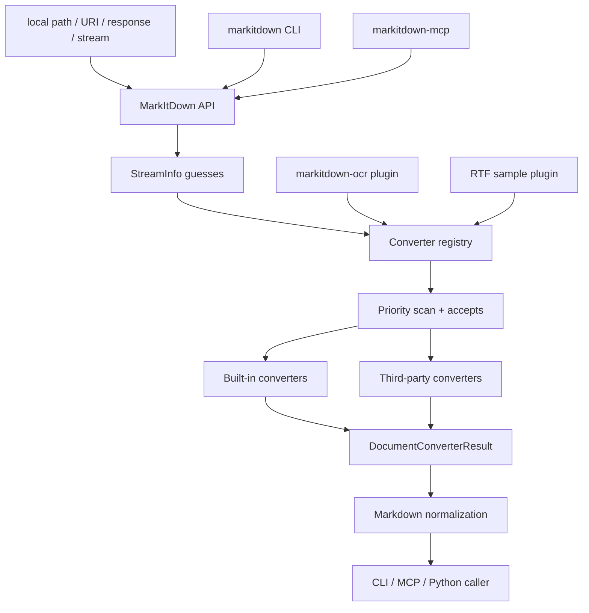
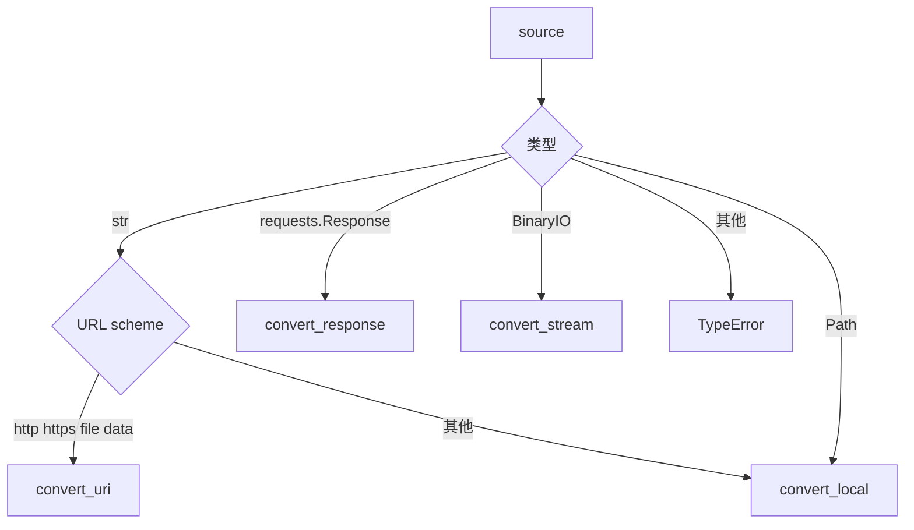
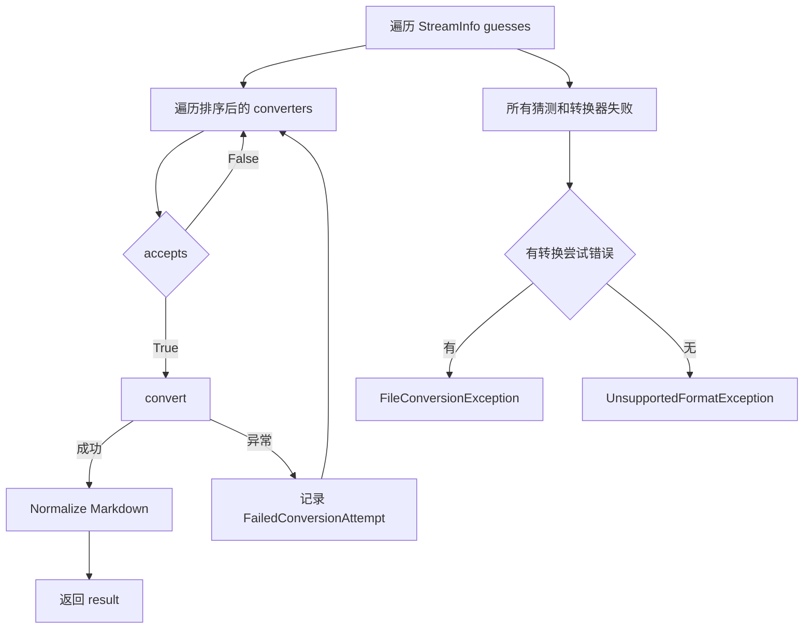
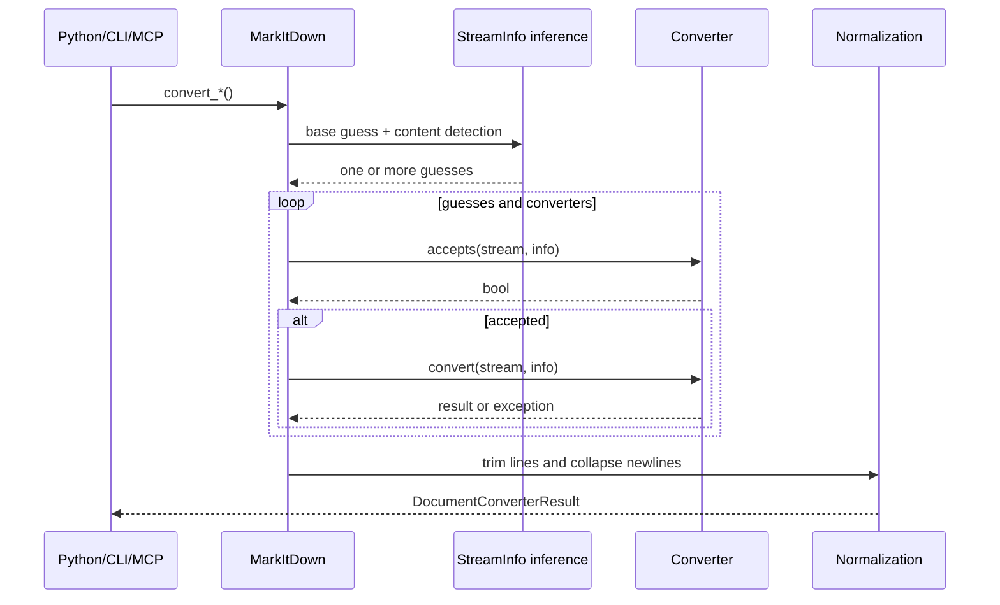

# MarkItDown 详细设计文档

> 文档版本：分析稿 v1.0  
> 分析日期：2026-09-15  
> 分析对象：`C:\Users\Administrator\Desktop\markitdown-main\markitdown-main`  
> 项目版本：`markitdown 0.1.8b1`、`markitdown-mcp 0.0.1a6`、`markitdown-ocr 0.1.1b1`、`markitdown-sample-plugin 0.1.0a1`  
> 许可证：MIT  
> 代码规模：52 个第一方 Python 源文件，8,803 行；44 个测试文件，10,632 行  
> 测试规模：386 个 `test_*` 函数，31 个主包测试 fixture 文件

## 1. 结论摘要

MarkItDown 是 Microsoft 开源的轻量文件到 Markdown 转换工具。它不是文档编辑器，也不是完整文档解析平台，而是一个面向 LLM 和文本处理流水线的统一适配层。

它的核心设计可以概括为：

```text
任意输入源
  -> 推断 StreamInfo
  -> 生成一个或多个候选 StreamInfo
  -> 按优先级遍历转换器
  -> converter.accepts() 判断是否接纳
  -> converter.convert() 生成 Markdown
  -> 统一清理输出
  -> 返回 DocumentConverterResult
```

最重要的设计优点：

1. 输入源和格式判断分离，支持本地路径、URL、requests response、data URI、file URI 和二进制流。
2. 转换器以注册表组织，按优先级排序，新增格式不需要修改主调度器。
3. 插件通过 Python entry point 自动发现，可替换内置转换器。
4. 单个转换器失败不会立即终止，系统会继续尝试其他候选转换器。
5. 所有转换结果统一为 `DocumentConverterResult`，对外 API 很小。
6. 文档格式覆盖广，且针对真实文件问题积累了大量修复逻辑。
7. MCP 服务对错误信息做了专门脱敏，避免泄露本地路径和内部网络信息。
8. OCR 插件通过优先级覆盖内置转换器，不需要修改 MarkItDown 主包。

当前主要风险：

1. 项目明确声明按当前进程权限执行 I/O，`convert()` 可以访问本机文件和网络。
2. HTTP URL 没有内置 SSRF allowlist、私网地址阻断或文件大小限制。
3. 非 seekable 流和 HTTP response 会被整体读入内存。
4. MCP 服务没有认证，HTTP 默认只适合绑定 localhost。
5. OCR 插件部分异常被静默吞掉，设计上偏向“继续转换”，但可能隐藏图片遗漏。
6. PPTX OCR 转换器存在明显实现缺陷，包括错误导入和不一致换行处理。
7. 当前仓库没有项目环境，不能直接执行测试；需要 Hatch 或等价环境安装 optional dependencies。
8. converter 实例可能被多个转换任务共享，RSS 转换器内部保存可变 `_kwargs`，线程安全边界不明确。

## 2. 项目定位

### 2.1 目标

将各种文档格式转换成适合 LLM 使用的 Markdown，重点保留：

- 标题结构
- 列表
- 表格
- 链接
- 图片引用
- 基础格式语义
- 文档顺序和主要正文内容

项目不追求用于人工出版的高保真排版转换，而是强调：

- 统一 API
- 低门槛使用
- 输出可被 LLM 理解
- 可选择性安装格式依赖
- 可通过插件扩展

### 2.2 四个交付形态

| 包 | 作用 |
|---|---|
| `markitdown` | 核心库和 CLI |
| `markitdown-mcp` | 把转换能力暴露为 MCP 工具 |
| `markitdown-ocr` | 针对 PDF、DOCX、PPTX、XLSX 的 LLM Vision OCR 插件 |
| `markitdown-sample-plugin` | 展示如何实现第三方插件，包含 RTF 示例 |

### 2.3 明确的非目标

根据 README 和仓库边界，以下内容不属于 MarkItDown 仓库：

- Web 服务或 REST API
- 浏览器前端
- 桌面或移动应用
- 托管式转换平台
- 与核心转换无关的完整产品

项目鼓励外部系统依赖核心库，而不是把产品层合并进主仓库。

## 3. 技术栈

### 3.1 核心依赖

| 依赖 | 用途 |
|---|---|
| `beautifulsoup4` | HTML/XML 文本解析 |
| `requests` | HTTP/HTTPS 获取 |
| `markdownify` | HTML 到 Markdown |
| `magika~=0.6.1` | 基于内容的文件类型识别 |
| `charset-normalizer` | 文本编码检测 |
| `defusedxml` | 安全 XML 解析 |

### 3.2 可选依赖

| Extra | 依赖 | 格式 |
|---|---|---|
| `pptx` | python-pptx | PowerPoint |
| `docx` | mammoth、lxml | Word |
| `xlsx` | pandas、openpyxl | Excel OOXML |
| `xls` | pandas、xlrd | 旧版 Excel |
| `pdf` | pdfminer.six、pdfplumber | PDF |
| `outlook` | olefile | Outlook MSG |
| `audio-transcription` | pydub、SpeechRecognition | WAV、MP3、MP4/M4A |
| `youtube-transcription` | youtube-transcript-api | YouTube 字幕 |
| `az-doc-intel` | Azure Document Intelligence SDK | 云端文档解析 |
| `az-content-understanding` | Azure Content Understanding SDK | 多模态云端解析 |
| `all` | 以上全部 | 全功能安装 |

### 3.3 Python 版本

核心包和其他子包均声明 `requires-python >=3.10`。Docker 镜像使用 Python 3.13 slim。

## 4. 总体架构



### 4.1 分层

| 层次 | 组件 | 职责 |
|---|---|---|
| 公共 API | `MarkItDown` | 输入路由、流信息推断、转换调度 |
| 数据契约 | `StreamInfo` | MIME、扩展名、字符集、文件名、路径、URL |
| 结果契约 | `DocumentConverterResult` | Markdown 和可选标题 |
| 转换器协议 | `DocumentConverter` | `accepts()` 和 `convert()` |
| 内置转换器 | `converters/` | 各文件格式实现 |
| 插件系统 | entry point `markitdown.plugin` | 外部转换器注册 |
| CLI | `markitdown.__main__` | 参数解析、文件/标准输入、输出 |
| MCP | `markitdown_mcp` | MCP tool、stdio、HTTP、SSE |
| OCR 扩展 | `markitdown_ocr` | LLM Vision 图片文本提取 |

### 4.2 依赖方向

```text
CLI / MCP
  -> markitdown.MarkItDown
     -> converter registry
        -> built-in converters
        -> plugin converters
           -> possible LLM client
           -> possible Azure client

MarkItDown
  -> requests
  -> magika
  -> charset-normalizer
  -> converter implementations
```

核心库不依赖 MCP 或 OCR 插件。插件反向依赖核心库，因此扩展方向清晰。

## 5. 公共 API

### 5.1 主要入口

| API | 输入 | 特点 |
|---|---|---|
| `convert()` | 路径、URI、Response、二进制流 | 最宽松，自动分派 |
| `convert_local()` | 本地路径 | 只读本地文件 |
| `convert_stream()` | 二进制流 | 最可控，可传 `StreamInfo` |
| `convert_uri()` | `file:`、`data:`、`http:`、`https:` | URI 统一入口 |
| `convert_response()` | `requests.Response` | 使用响应头和响应体 |
| `convert_url()` | URL | `convert_uri()` 的兼容别名 |

安全文档建议调用者使用满足需求的最小 API：

- 只读本地文件时使用 `convert_local()`。
- 需要自行控制 URL 请求时，由调用方发起 `requests.get()`，再使用 `convert_response()`。
- 最大控制力使用 `convert_stream()`。

### 5.2 `DocumentConverterResult`

```text
markdown: str
title: str | None
text_content: str
```

`text_content` 是软废弃别名，当前仍支持读写，实际存储仍是 `markdown`。

### 5.3 `StreamInfo`

`StreamInfo` 是不可变 dataclass，字段包括：

```text
mimetype
extension
charset
filename
local_path
url
```

`copy_and_update()` 会用新对象中的非空字段覆盖原值。该设计保证流信息可以在调用链中逐层增强。

## 6. MarkItDown 核心调度设计

### 6.1 构造阶段

`MarkItDown.__init__` 的流程：

1. 如果调用者未传入 `requests_session`，创建新的 `requests.Session`。
2. 设置 `Accept` 头，优先请求 `text/markdown`、`text/html` 和 `text/plain`。
3. 创建 `magika.Magika()` 实例。
4. 初始化 LLM、ExifTool、style map 等全局参数。
5. 默认启用内置转换器。
6. 可选启用第三方插件。

### 6.2 输入分派



### 6.3 流信息推断

`_get_stream_info_guesses` 是核心识别算法。

第一层：MIME 与扩展名互补。

- 有扩展名无 MIME，用 `mimetypes.guess_type` 推断 MIME。
- 有 MIME 无扩展名，用 `mimetypes.guess_all_extensions` 推断扩展名。

第二层：Magika 内容识别。

- 从当前流位置读取内容。
- 获取 MIME、候选扩展名、是否文本。
- 如果是文本，读取最多 64 KiB 用于 charset 检测。
- `_read_charset_sample` 会补齐样本末尾被截断的 UTF-8 字符。
- charset 结果通过 `codecs.lookup` 归一化。

第三层：基础信息和内容信息兼容性判断。

| 条件 | 处理 |
|---|---|
| MIME、扩展名、charset 都兼容 | 生成一个融合猜测 |
| 基础信息与 Magika 冲突 | 同时保留基础猜测和内容猜测 |
| Magika 无结果 | 使用增强后的基础猜测 |

最后，`_convert` 还会追加一个空的 `StreamInfo()` 作为兜底。

### 6.4 转换器优先级

优先级规则：

- 数值越小越先尝试。
- 默认专用转换器为 `0.0`。
- 通用转换器为 `10.0`。
- 插件可以用负数排在所有内置转换器前面。
- 相同优先级使用稳定排序。
- `register_converter()` 使用 `insert(0)`，因此后注册且同优先级的转换器先执行。

### 6.5 转换循环



关键约束：

- `accepts()` 不应改变流位置。
- `convert()` 结束后无论成功还是异常，调度器都会把流位置恢复到初始位置。
- 如果某个转换器返回结果，立即停止后续尝试。
- 如果所有转换器都不接收输入，返回 `UnsupportedFormatException`。
- 如果至少一个转换器接受但失败，返回带 attempts 的 `FileConversionException`。

### 6.6 输出归一化

每个成功结果都会：

1. 按换行拆分。
2. 删除每行尾空白。
3. 使用单 LF 重新拼接。
4. 将三个及以上连续换行压缩为两个换行。

该归一化会改变原始 Markdown 的精确空白，但有利于 LLM 输入的一致性。

## 7. 内置转换器

### 7.1 实际注册顺序

由于每次 `register_converter()` 都插入列表头部，最终同优先级顺序与源码调用顺序相反。基于当前代码，实际高优先级顺序为：

```text
Csv
Epub
OutlookMsg
Pdf
Ipynb
Image
Audio
Pptx
Xls
Xlsx
Docx
BingSerp
YouTube
Wikipedia
Rss
Html              priority 10
Zip               priority 10
PlainText         priority 10
```

如果配置了 Azure：

```text
ContentUnderstanding 在 DocumentIntelligence 之前
两者默认都在普通专用转换器之前
```

插件可使用优先级 `-1.0` 覆盖内置 PDF、DOCX、PPTX 和 XLSX。

### 7.2 文本和 HTML

#### PlainTextConverter

支持：

- `text/*`
- `application/json`
- `application/markdown`
- `.txt`
- `.text`
- `.md`
- `.markdown`
- `.json`
- `.jsonl`

有 charset 时直接解码。没有 charset 时先用 `charset_normalizer`，无法识别时使用 UTF-8 ignore。

#### HtmlConverter

流程：

1. 使用 BeautifulSoup 的 `html.parser`。
2. 删除 script 和 style。
3. 优先转换 body。
4. 通过自定义 markdownify 输出 Markdown。
5. 如果递归过深，回退到 `get_text()`。

自定义 Markdown 行为：

- 标题使用 ATX 风格。
- 删除 JavaScript 链接。
- 只保留 http、https、file 链接。
- URL path 做安全编码，并保留已有 `%HH`。
- 默认截断 data URI 图片。
- 支持 `data-src` 作为延迟加载图片的真实地址。
- 复选框转换为 `[x]` / `[ ]`。
- 保留下划线标签。
- `<strike>` 按删除线处理。

### 7.3 网页专用转换器

#### WikipediaConverter

只接收 Wikipedia URL 加 HTML。优先提取 `mw-content-text`，尽量避免导航、语言列表等页面噪声。

#### BingSerpConverter

只接收 Bing 搜索 URL 加 HTML。提取 `b_algo` 搜索结果，解码 Bing 跳转 URL，输出简化结果列表。

#### YouTubeConverter

支持：

- `youtu.be`
- `youtube.com/watch`
- `/shorts`
- `/embed`

可提取：

- 标题
- 描述
- views、keywords、runtime
- YouTube transcript

如果无法提取任何内容，就回退到普通 HTML 转换。

### 7.4 Office 转换器

#### DOCX

依赖 mammoth、lxml。转换流程：

1. 修复 ZIP local header 和 central directory 文件名大小写不一致。
2. 将 OMML 数学公式转成 LaTeX。
3. 将双删除线 `dstrike` 归一为删除线。
4. 修复缺少 `w:type` 或 `w:styleId` 的样式。
5. 使用 mammoth 转 HTML。
6. 使用 HtmlConverter 转 Markdown。

OMML 模块支持分数、上下标、根号、矩阵、函数、定界符、上下限和常见 LaTeX 字符映射。

#### PPTX

按 slide 输出：

- `<!-- Slide number: n -->`
- 标题为一级标题
- 表格
- 图表数据表
- 图片 alt text 或 LLM caption
- group shape 递归展开
- notes

图片默认可转为本地占位文件名；`keep_data_uris=True` 时嵌入 base64。

#### XLSX/XLS

使用 pandas 读取所有 sheet，每个 DataFrame 转 HTML，再转 Markdown 表格。XLSX 额外修复旧属性 `showZeroes`，把它改为 schema 中的 `showZeros`。

### 7.5 PDF

PDF 转换是内置转换器中最复杂的一项。

流程：

1. 整体读入 BytesIO。
2. 使用 pdfplumber 单次打开。
3. 每页先尝试 `_extract_form_content_from_words`。
4. 检测密集表格、表单式列结构。
5. 对表格区域生成对齐的 Markdown 表格。
6. 非表格页使用 `page.extract_text()`。
7. 每页处理完立即 `page.close()`。
8. 如果没有任何表单页，回退给 pdfminer。
9. 如果 pdfplumber 失败，再回退到 pdfminer。
10. 最后合并 MasterFormat 风格的 `.1`、`.2` 分段编号。

该设计明显针对扫描发票、票务、表格和普通论文做过多轮修复。测试中有专门内存基准，验证 200 页 PDF 峰值内存应低于约 30 MiB。

### 7.6 图片、音频和邮件

#### Image

支持 JPEG、PNG。可提取 ExifTool 元数据，也可调用多模态 LLM 生成 caption。默认 caption prompt 是 “Write a detailed caption for this image.”。

#### Audio

支持 WAV、MP3、MP4、M4A。可提取元数据，并通过 SpeechRecognition 调用 Google 在线识别。音频转写是可选功能。

#### Outlook MSG

手动解析 OLE 流：

- 读取 PT_UNICODE 和 PT_STRING8
- 读取 message codepage 和 internet codepage
- 支持大量 Windows codepage
- 处理 ISO-2022-JP 和半角 Katakana
- 输出 From、To、Subject 和正文

### 7.7 归档和数据格式

| 转换器 | 作用 |
|---|---|
| ZIP | 解压内存内容，递归调用 MarkItDown，跳过不支持或失败的成员 |
| EPUB | 读取 container、OPF、manifest、spine，再转换章节 XHTML |
| CSV | 解析 CSV 为 Markdown 表格，转义 pipe 和换行 |
| IPYNB | Markdown cell 原样保留，code cell 包 Python fence，raw cell 包普通 fence |

## 8. Azure 云端转换器

### 8.1 Document Intelligence

支持 DOCX、PPTX、XLSX、HTML、PDF 和图片。使用 `prebuilt-layout`，可启用公式、高清 OCR 和字体样式特性。输出后删除 HTML 注释。

适合本地解析质量不足的场景，但每次调用可能产生费用，并把文档发送到 Azure。

### 8.2 Content Understanding

支持文档、图片、音频和视频，是项目中最广的多模态转换器。

关键设计：

- `ContentUnderstandingFileType` 枚举统一格式。
- 扩展名和 MIME 都可检测。
- 将格式归类为 document、image、audio、video。
- 使用内置 analyzer 映射：
  - document/image -> `prebuilt-documentSearch`
  - audio -> `prebuilt-audioSearch`
  - video -> `prebuilt-videoSearch`
- 自定义 analyzer 可读取 modality，并把不兼容格式自动路由回预置 analyzer。
- 输出使用 `to_llm_input()`，包含结构化字段和 Markdown。

## 9. 插件系统

### 9.1 发现机制

插件通过 Python entry point group 发现：

```toml
[project.entry-points."markitdown.plugin"]
plugin_name = "python_package"
```

`_load_plugins()` 使用全局缓存，只加载一次。单个插件加载失败会发出 warning，不影响其他插件。

### 9.2 插件接口

插件需要导出：

```python
__plugin_interface_version__ = 1

def register_converters(markitdown, **kwargs):
    ...
```

`register_converters()` 会在启用插件时调用，传入 MarkItDown 实例和全局 kwargs。

### 9.3 插件优先级

插件通过注册优先级控制位置：

| 优先级 | 位置 |
|---:|---|
| 小于 0 | 覆盖内置转换器 |
| 0 | 与专用内置转换器同层 |
| 1 至 9 | 在部分内置专用转换器之后、通用转换器之前 |
| 10 | 与通用转换器同层 |

OCR 插件使用 `-1.0`，实现无侵入替换。

## 10. OCR 插件详细设计

### 10.1 目标

从 PDF、DOCX、PPTX、XLSX 的嵌入图片中提取文字，并把结果插入 Markdown 内容流。

### 10.2 服务层

`LLMVisionOCRService`：

1. 读取图片字节。
2. 改为 data URI。
3. 通过 OpenAI 兼容 `chat.completions` 发送文本 prompt 和图片。
4. 返回 `OCRResult`。

默认 prompt：

```text
Extract all text from this image. Return ONLY the extracted text,
maintaining the original layout and order. Do not add any commentary
or description.
```

默认不重试，不限制图片体积，不直接产生异常。异常被写入 `OCRResult.error`。

### 10.3 PDF OCR

- 用 pdfplumber 提取页面图片。
- 图片如果有 stream，先转成 PNG。
- 无法直接取图时，用页面 bbox 裁剪并渲染。
- 文本行和图片按 Y 坐标排序，尽量保持阅读顺序。
- 扫描页无文本时，把整页以 300 DPI 转成图片做 OCR。
- pdfplumber 无法打开损坏 PDF 时，使用 PyMuPDF 渲染。
- 每张 OCR 文本使用统一标记：

```text
*[Image OCR]
...
[End OCR]*
```

### 10.4 DOCX OCR

采用 placeholder 策略：

1. 从 DOCX relationships 提取图片并 OCR。
2. DOCX 先转 HTML。
3. 把 `` 替换为纯文本 `MARKITDOWNOCRBLOCKn`。
4. HTML 转 Markdown。
5. 转换完成后再把 placeholder 替换为 OCR block。

这样避免了 Markdown 转换器转义 `*` 和 `_`。

### 10.5 PPTX OCR

- 遍历 shape、table、chart 和 group shape。
- 对图片优先请求 LLM description，失败后再 OCR。
- 输出仍使用 OCR 标记。

当前实现存在明显缺陷：

- 代码尝试 `from ._llm_caption import llm_caption`，但 OCR 包中不存在该模块。
- 该异常被静默捕获，导致文档描述的“先 description、后 OCR”实际通常只会走 OCR。
- 多处使用字面量 `"\\n"`，输出中包含反斜杠和字母 n，而不是真正换行。
- 测试已经把这个错误换行行为固化为预期，后续修复需要同步修改测试。
- 对没有 raster fallback 的 SVG 图片没有复用主包的 `_get_image_info` 逻辑。

### 10.6 XLSX OCR

- 使用 openpyxl 获取 worksheet 图片。
- 计算锚点对应的单元格地址。
- OCR 文本统一放在每个 sheet 数据表后的 “Images in this sheet:” 区域。
- 计算出的 `cell_ref` 没有展现在最终 Markdown 中。
- 图片不会插入表格行内部。

### 10.7 无 OCR 客户端时的行为

插件仍然加载，但 `ocr_service` 为 None。四个增强转换器退回普通转换逻辑，不输出 OCR block。

## 11. CLI 设计

### 11.1 基本用法

```text
markitdown file.pdf
markitdown file.pdf -o file.md
cat file.pdf | markitdown
markitdown -x pdf < file
```

### 11.2 参数

| 参数 | 作用 |
|---|---|
| `-o` | 输出文件 |
| `-x` | 扩展名提示 |
| `-m` | MIME 提示 |
| `-c` | 字符集提示 |
| `-p` | 启用第三方插件 |
| `--list-plugins` | 列出插件 |
| `--keep-data-uris` | 保留 base64 data URI |
| `-d` | 使用 Azure Document Intelligence |
| `-e` | Document Intelligence endpoint |
| `--use-cu` | 使用 Azure Content Understanding |
| `--cu-endpoint` | CU endpoint |
| `--cu-analyzer` | CU analyzer id |
| `--cu-file-types` | CU 路由白名单 |

Document Intelligence 和 Content Understanding 互斥。

### 11.3 标准输入处理

Windows pipe-backed stdin 可能错误报告为 seekable。CLI 会先执行 `sys.stdin.buffer.read()`，再放入 `BytesIO`，避免不可回退流问题。

## 12. MCP 服务设计

### 12.1 暴露接口

MCP 只暴露一个工具：

```text
convert_to_markdown(uri) -> markdown
```

支持 `http:`、`https:`、`file:` 和 `data:` URI。

### 12.2 传输方式

- 默认 STDIO。
- `--http` 同时启用 Streamable HTTP 和 SSE。
- 默认 host 是 `127.0.0.1`。
- 默认 port 是 `3001`。
- `--sse` 是 `--http` 的兼容别名。

### 12.3 插件开关

MCP 通过环境变量控制插件：

```text
MARKITDOWN_ENABLE_PLUGINS=true|1|yes
```

### 12.4 错误脱敏

MCP 对错误做了明确分类：

| 错误 | 返回策略 |
|---|---|
| UnsupportedFormatException | 原样返回 |
| HTTPError | 只返回 HTTP 状态码 |
| RequestException | 隐藏内部 host 和 proxy 信息 |
| FileConversionException | 返回通用文件转换失败 |
| OSError | 只返回 errno 对应固定文本 |
| ValueError | 返回 URI 校验错误 |
| 其他异常 | SDK 转为 UnexpectedToolError |

原始异常仍保留在 `__cause__` 链上，便于服务端诊断。

### 12.5 安全模型

官方 README 明确说明：

- 服务没有认证。
- 服务拥有运行用户权限。
- 可以读取该用户可访问的任意文件。
- 可以访问该用户所在网络。
- HTTP/SSE 不应绑定到非 localhost 接口。
- 容器运行时建议只挂载受控目录。

## 13. 数据流和状态

### 13.1 转换请求



### 13.2 无长期状态

核心转换器基本是请求式：

- 读取当前流
- 生成结果
- 恢复流位置
- 返回结果

MarkItDown 实例保存：

- requests session
- Magika 实例
- converter registrations
- LLM、ExifTool、style map 等全局参数
- 是否已经启用 built-ins/plugins

它没有数据库、任务队列、缓存或持久化用户状态。

### 13.3 并发状态风险

- converter 列表允许在实例生命周期内修改。
- `_load_plugins` 是模块级全局缓存。
- `RssConverter` 在 `convert()` 中写入 `self._kwargs`。
- 共享 `MarkItDown` 实例并发转换时，RSS 路径的 kwargs 存在竞争条件。
- 官方实现没有声明 `MarkItDown` 是线程安全的。
- 最安全的并发方式是为每个任务创建独立 MarkItDown 实例，或至少隔离 converter。

## 14. 错误模型

### 14.1 异常类型

| 异常 | 含义 |
|---|---|
| `MarkItDownException` | 基础异常 |
| `MissingDependencyException` | 可选依赖缺失 |
| `UnsupportedFormatException` | 没有 converter 接纳输入 |
| `FileConversionException` | 有 converter 接纳但全部失败 |
| `FailedConversionAttempt` | 单个 converter 失败记录 |

### 14.2 处理器策略

MarkItDown 的主策略是宽松降级：

- 某个 converter 失败后继续尝试其他 converter。
- ZIP 中某个成员失败后跳过该成员。
- OCR 单图失败后继续处理其他图片。
- YouTube 内容提取为空时回退到 HTML。
- PDF 表格识别失败时回退到 pdfminer。
- HTML 递归过深时回退到纯文本。

优点是鲁棒，缺点是可观测性较弱，错误可能只在最终失败时集中暴露，或完全被吞掉。

## 15. 安全设计

### 15.1 项目明确的安全声明

MarkItDown 不是沙盒。它执行的是当前进程有权执行的 I/O。

### 15.2 已有保护

| 保护 | 位置 |
|---|---|
| 拒绝 UNC 和 Windows device file URI | `_uri_utils` |
| 限制 file URI netloc 为 localhost 或空 | `convert_uri` |
| 拒绝 JavaScript 链接 | `_CustomMarkdownify` |
| 截断 data URI | `_CustomMarkdownify` |
| 使用 defusedxml | DOCX/EPUB/RSS 等 XML 路径 |
| ExifTool 最低版本检查 | `_exiftool` |
| MCP 错误信息脱敏 | `markitdown-mcp` |
| MCP HTTP 默认 localhost | `markitdown-mcp` |

### 15.3 仍存在的风险

1. `convert_local()` 可以直接接受 UNC 或设备路径，file URI 检查不能覆盖所有调用。
2. `convert_uri()` 的 HTTP 请求没有私网 IP、metadata service 和其它 SSRF 目标阻断。
3. `convert_response()` 和 `convert_uri()` 没有响应体大小上限。
4. `convert_stream()` 对不可 seekable 的流会全部读入内存。
5. ZIP 转换可能触发大量成员递归，没有总解压大小和成员数量限制。
6. OCR 和图片描述会把文件内容发送给外部 LLM。
7. Azure 转换器会把文档发送到云服务。
8. SpeechRecognition 默认 Google 在线识别会外传音频。
9. MCP 服务无认证，只适合本机可信调用者。
10. 插件可以在转换过程中执行任意 Python 代码，安装插件等于增加受信代码。

## 16. 性能和资源设计

### 16.1 已做的优化

- PDF 单次打开 pdfplumber。
- 每页处理完成后立即 `page.close()`。
- PPTX chart series values 先物化，避免 O(n²) 属性扫描。
- ZIP 成员使用内存流，避免落盘。
- DOCX 预处理只在出现相关标记时做部分变更。
- `register_converter()` 使用稳定排序，运行时开销较低。
- 控制流位置，避免重复读取。

### 16.2 潜在瓶颈

- 每次创建 MarkItDown 都创建 Magika 和 Session。
- 大文件会整体进入内存。
- PDF 表格启发式分析会遍历每页词块。
- RSS XML 深树解析和 HTML 渲染有递归风险。
- OCR 插件会对每张图片单独请求 LLM。
- 扫描 PDF 每页以 300 DPI 渲染，内存和 token 成本都很高。
- XLSX 对每个 sheet 既打开 workbook，又再次用 pandas 读取。

## 17. 测试设计

### 17.1 测试规模

| 项目 | 数量 |
|---|---:|
| Python 测试文件 | 44 |
| `test_*` 函数 | 386 |
| 主包 fixture 文件 | 31 |

格式 fixture 包括 DOCX、XLSX、XLS、PPTX、PDF、MSG、HTML、RSS、EPUB、CSV、Jupyter Notebook、图片、音频、ZIP 和随机二进制。

### 17.2 核心测试矩阵

`FileTestVector` 定义了：

- 文件名
- MIME
- charset
- URL
- 必须包含的字符串
- 必须不包含的字符串

同一组 fixture 会通过以下路径验证：

- `_get_stream_info_guesses`
- `convert_local`
- `convert_stream` 带完整 hints
- `convert_stream` 无 hints
- `convert_file_uri`
- `convert_data_uri`
- HTTP URL
- CLI stdout
- CLI 输出文件
- CLI stdin
- `keep_data_uris`

### 17.3 重点回归领域

| 领域 | 测试重点 |
|---|---|
| charset | UTF-8 分片、错误猜测、显式 charset 优先 |
| URI | UNC/device 拒绝、Windows drive、data URI |
| CSV | CR/LF/CRLF、大段空行、pipe 转义、BOM |
| DOCX | 数学公式、strike、underline、style map、坏 ZIP 大小写 |
| XLSX | showZeroes 修复 |
| PDF | 表格识别、内存稳定、页关闭、扫描 PDF |
| PPTX | SVG fallback、图表、notes、空标题 |
| Outlook | ANSI codepage、日文、俄文、希腊文 |
| RSS | Atom namespace、xhtml、xml:base、深嵌套 fallback |
| HTML | URL 编码、data-src、underline |
| MCP | stdio 新旧握手、HTTP/SSE、错误脱敏 |
| OCR | 四类文档的图片位置和 snapshot 输出 |

### 17.4 当前执行状态

当前源码快照没有 `.venv`，系统 Python 也没有 `pytest` 和 MarkItDown 运行依赖。

已执行的静态检查：

```powershell
python -m compileall -q packages
```

结果：通过。

未执行完整测试。要执行测试，需要在各自的 Hatch 环境安装依赖，例如：

```powershell
pip install hatch
cd packages\markitdown
hatch test
```

OCR 和 MCP 包还需要分别安装自己的依赖。

## 18. 主要风险和代码问题

### P1：PPTX OCR 的 LLM description 路径实际失效

`_pptx_converter_with_ocr.py` 尝试从当前包导入 `_llm_caption`，但该模块位于 `markitdown` 主包，OCR 包中没有它。异常被捕获后继续走 OCR，因此 README 描述的“先 description，再 OCR”不成立。

### P1：PPTX OCR 输出包含字面量 `\n`

转换器使用 `"\\n"` 而非真实换行，测试也明确认为这是当前输出格式。该问题会降低 Markdown 可读性，并说明插件内部的文本拼接没有复用主 PPTX 转换器。

### P1：MarkItDown 不是安全边界

项目自己也明确写出这一点。任何公网或多用户服务必须在调用前做：

- URI scheme allowlist
- DNS 解析后的私网地址阻断
- 文件路径限制
- 文件大小和 ZIP 解压大小限制
- 容器隔离
- 超时和取消

### P1：远程 URL 和响应体没有资源上限

HTTP 响应会完整缓冲。压缩炸弹、超大 PDF、超大 ZIP 和无限响应都可能导致内存或磁盘压力。

### P2：OCR 插件异常静默

OCR 服务和四种转换器都大量捕获异常后继续。最终文档可能悄悄缺少图片文本，而调用者不知道哪些图片失败。

### P2：OCR 没有成本控制

没有图片大小限制、调用数限制、并发限制、重试策略或预算统计。批量处理大型扫描 PDF 时成本不可预测。

### P2：RSS converter 有可变实例状态

`self._kwargs` 在每次转换时写入。如果同一个实例被并发复用，可能出现参数串扰。

### P2：MCP 服务没有认证和速率限制

即便默认绑定 localhost，本机其他进程仍可调用并读取当前用户可访问的文件。部署到共享机器或容器时必须限制网络和挂载。

### P2：云转换器直接构造客户端

Document Intelligence 和 Content Understanding 转换器在构造时创建 SDK client。缺少 endpoint、凭据和包时，失败发生在 MarkItDown 初始化阶段，而不是转换阶段。

### P3：Magika 实例重复创建

每个 MarkItDown 实例都创建 Magika。对频繁创建短生命周期实例的调用方，会有额外初始化成本。

### P3：依赖矩阵较重

`[all]` 包含大量格式库和 Azure SDK。部署镜像较大，漏洞扫描和依赖升级成本较高。

## 19. 对 Algocode 的可借鉴设计

### 19.1 建议直接借鉴

1. `StreamInfo` 作为输入元数据契约。
2. `DocumentConverterResult` 这种稳定最小结果对象。
3. `accepts()` 与 `convert()` 分离。
4. 转换器优先级注册表。
5. Python entry point 插件发现。
6. `convert_uri`、`convert_local`、`convert_stream` 的窄 API 分层。
7. 错误 attempt 链保留内部诊断信息。
8. MCP 面向客户端的错误脱敏。
9. PDF 逐页释放资源。
10. 大量真实格式 fixture 的回归测试方式。

### 19.2 建议改造后借鉴

1. OCR 插件的优先级覆盖机制。
2. DOCX placeholder 技术。
3. PDF 扫描页 300 DPI 全页 OCR。
4. RSS 和 HTML 的深嵌套 fallback。
5. ZIP 递归转换。
6. 云端统一多模态转换入口。

改造时应增加：

- 资源预算
- 并发控制
- 明确错误报告
- 可取消令牌
- 每个文件的处理状态

### 19.3 不建议直接复制

1. 放宽的联网 URI 访问。
2. 无大小限制的完整缓冲。
3. 静默吞掉 OCR 和 ZIP 错误。
4. OCR 插件中的字面量换行。
5. 共享实例上的可变转换器状态。
6. 把 Magika 等重对象在每次实例构造时无条件创建。

## 20. 如果 Algocode 集成 MarkItDown

建议把 MarkItDown 定位为“文档预处理工具”，而不是核心 Agent 本体。

集成边界：

```text
用户文件
  -> Algocode 文件准入策略
  -> 路径/大小/类型/URL 校验
  -> 隔离进程或容器中的 MarkItDown
  -> Markdown
  -> 文档清洗和分块
  -> 算法知识提取或代码提取
  -> 进入 Algocode 上下文
```

建议调用：

- 本地文件：`convert_local()` 或受控的 `convert_stream()`。
- 用户提供 URL：Algocode 自己 fetch，验证状态、大小、重定向和 IP 后再 `convert_response()`。
- 不需要云能力时关闭 Azure 和 LLM caption。
- OCR 只对允许外发的文档开启。
- 将转换与 Agent 推理分离，转换失败不影响对话主流程。

## 21. 设计评价

MarkItDown 的优势在于边界清楚。它没有试图变成完整的文档处理平台，而是专注解决“如何把很多格式统一成适合 LLM 的 Markdown”。

它的核心抽象少而有效：

```text
StreamInfo
DocumentConverter
DocumentConverterResult
MarkItDown
```

插件和内置转换器都遵循同一接口，因此扩展成本低。

它的弱点同样明确：

- 输入 I/O 和安全隔离完全依赖调用方。
- 大文件和网络资源没有统一预算。
- 宽松降级提高成功率，但降低可观测性。
- 插件质量不一定达到核心包水平。
- OCR 和云转换会带来数据外发与成本问题。

对 Algocode 来说，MarkItDown 最值得学习的是“格式识别、转换器注册、优先级覆盖和结果归一化”，而不是无条件下放它的宽松 I/O 能力。
