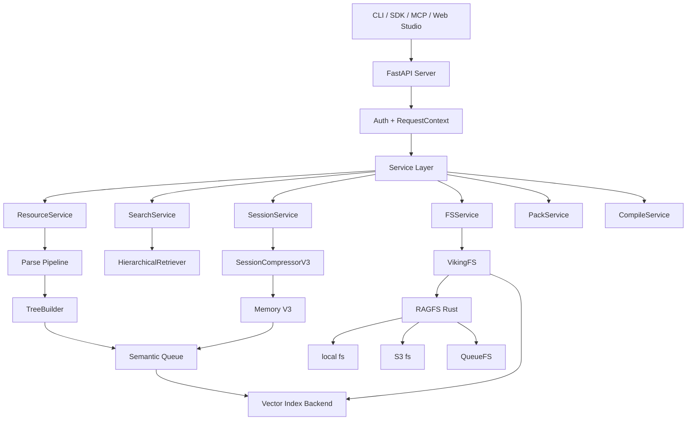

# OpenViking 详细设计文档

> 文档版本：分析稿 v1.0  
> 分析日期：2026-09-15  
> 分析对象：`C:\Users\Administrator\Desktop\OpenViking-main\OpenViking-main`  
> 项目定位：AI Agent 上下文数据库  
> 主要语言：Python、Rust、TypeScript、Go  
> 许可证：主项目 AGPLv3；`crates/ov_cli` 和 `examples` 使用 Apache 2.0

## 1. 分析范围说明

OpenViking 是一个大型多产品 monorepo，不仅是 Python 服务，还包含：

- Python 核心服务、存储、解析、检索、会话和记忆系统
- Rust RAGFS 文件系统
- Rust `ov` CLI
- Python、TypeScript、Go SDK
- VikingBot
- Web Studio
- MCP、OAuth、ACL、加密、可观测性和多租户
- benchmark、example、integration 和 third-party 代码

本设计文档聚焦 OpenViking 核心上下文数据库的运行链：

```text
CLI / SDK / MCP
  -> HTTP Server
  -> Service Layer
  -> Retrieval / Session / Parse
  -> VikingFS + VectorDB + QueueFS
  -> RAGFS localfs / S3FS / memory backends
```

外围 Bot、Web Studio、benchmark 和示例不会按产品手册展开，但会在覆盖台账中记录。

## 2. 核心结论

OpenViking 最核心的设计不是“再做一个向量数据库”，而是把 Agent 上下文建成一个可浏览、可检索、可版本化、可分层的虚拟文件系统。

它的核心公式是：

```text
Context Database
  = viking:// 统一 URI
  + L0/L1/L2 分层上下文
  + RAGFS 内容真源
  + VectorDB 派生索引
  + QueueFS 异步语义流水线
  + Session/Memory 生命周期
  + 多租户与 ACL
```

四个关键设计决策：

1. 文件内容与向量索引分离。VikingFS 是事实来源，向量库只保存 URI、摘要、元数据和索引。
2. 上下文按目录组织。检索不是全库扁平 TopK，而是先定位目录，再沿目录树递归探索。
3. L0/L1 是目录级 sidecar。`.abstract.md` 和 `.overview.md` 用较少 token 支持渐进式加载。
4. 写入通过路径锁、持久化队列和两阶段 session commit 保证可恢复性。

## 3. 产品定位与能力边界

### 3.1 解决的问题

OpenViking 试图为 Agent 提供跨会话、跨工具、跨 Agent 的统一上下文层：

- 资源：代码库、文档、网页、PDF、媒体
- 记忆：用户偏好、实体、事件、身份、执行轨迹、经验
- 技能：可调用的 Agent 能力定义
- 会话：消息、工具结果、归档上下文和使用记录

### 3.2 主要接口

| 接口 | 作用 |
|---|---|
| `openviking-server` | HTTP 服务 |
| `ov` | Rust CLI |
| Python SDK | `AsyncHTTPClient`、`SyncHTTPClient`、Session 封装 |
| TypeScript SDK | Node/Fetch 客户端 |
| Go SDK | Go HTTP 客户端 |
| MCP | 将文件、搜索、记忆和技能暴露给 Agent |
| WebDAV | 以文件协议访问上下文 |
| Agent plugins | Claude Code、Codex、OpenCode、DSH、OpenClaw 等集成 |

### 3.3 当前能力

- 资源导入：本地文件、目录、Git 仓库、网页、RSS、PDF、Office、图片、音频、视频
- 多层摘要：L0、L1、L2
- 混合检索：dense、sparse、全文和 rerank
- 目录递归检索：TrieHI、优先队列和分数传播
- Context Assembly：在服务端完成召回、预算、分层、去重和渲染
- Session：消息、工具结果、归档、压缩、自动提交
- Memory V3：提取、解析、去重、合并、链接、向量化和审计
- 多租户：account、user、peer、role
- ACL：共享资源的继承、restricted 和 principal grant
- 加密：文件加密、密钥提供者、敏感配置
- 可观测性：OpenTelemetry、metrics、observer、usage/audit
- 快照和 Git：commit、log、restore、diff、ignore
- OVPack：导出、备份、恢复和跨环境迁移

## 4. 关键术语

| 术语 | 含义 |
|---|---|
| Viking URI | `viking://{scope}/{path}` 统一资源标识 |
| Context | 文件、目录、摘要、记忆或技能的统称 |
| Resource | 用户添加的客观知识 |
| Memory | Agent 从交互中提取的长期认知 |
| Skill | Agent 可调用能力定义 |
| L0 | `.abstract.md` 目录摘要 |
| L1 | `.overview.md` 目录概览 |
| L2 | 原始文件或完整内容 |
| VikingFS | `viking://` 到实际存储的虚拟文件系统 |
| RAGFS | Rust 实现的底层文件系统和挂载路由 |
| QueueFS | 持久化异步任务队列 |
| Semantic DAG | 自底向上生成摘要和向量的依赖图 |
| RequestContext | account、user、role、peer 等请求身份 |
| Peer | 当前用户边界内的稳定交互对象 |
| OVPack | 可迁移的上下文包格式 |
| Hotness | 记忆使用活跃度，用于生命周期排序 |
| Recall Ledger | 跨轮次去重和已召回记录 |

## 5. 总体架构



## 6. 服务启动与生命周期

### 6.1 `openviking-server`

启动入口在 `openviking_cli/server_bootstrap.py`。

流程：

1. 解析 `--config`、host、port、workers 和 Bot 参数。
2. 加载 `ov.conf`。
3. 初始化日志。
4. 运行认证启动健康检查。
5. 如配置 Ollama，先做可用性检查。
6. 可选启动 VikingBot 子进程。
7. 创建 FastAPI app。
8. 运行 uvicorn。

### 6.2 FastAPI app

`openviking/server/app.py` 负责：

- 创建应用生命周期
- 初始化 `OpenVikingService`
- 初始化认证插件
- 加载 account ACL 设置
- 配置默认线程池
- 注册 request id、profile、CORS 和异常处理中间件
- 注册系统、文件、内容、搜索、会话、技能、任务、WebDAV、Bot 等路由

### 6.3 `OpenVikingService`

`openviking/service/core.py` 是核心组合根，负责：

- 初始化配置
- 获取工作区进程锁
- 构建加密配置
- 初始化 RAGFS/AGFS 客户端
- 初始化 QueueManager
- 初始化 VikingDBManager
- 初始化 VikingFS
- 初始化 embedder、ResourceProcessor、SkillProcessor 和 SessionCompressor
- 组合 FSService、SearchService、SessionService、ResourceService、PackService 等子服务

### 6.4 优雅关闭

关键顺序：

1. 停止接收新任务
2. 标记 VectorDB closing
3. 停止 queue workers
4. 等待已提交任务
5. 关闭存储和客户端
6. 释放工作区锁

## 7. 目录和模块设计

| 目录 | 职责 |
|---|---|
| `openviking/server` | HTTP API、认证、OAuth、MCP、错误映射、中间件 |
| `openviking/service` | 业务服务编排 |
| `openviking/storage` | VikingFS、VectorDB、QueueFS、ACL、加密、快照 |
| `openviking/retrieve` | 意图分析、层级检索和 Context Assembly |
| `openviking/session` | 会话、压缩、记忆提取、训练和技能提取 |
| `openviking/parse` | 文件识别、Parser、TreeBuilder、语义处理 |
| `openviking/ingest` | 从 Codex、Claude Code、OpenCode、Cursor 等抓取会话 |
| `openviking/models` | Embedding、VLM、Rerank 和模型抽象 |
| `openviking/privacy` | 用户隐私配置及版本管理 |
| `openviking/crypto` | 封装加密、密钥提供者 |
| `openviking/observability` | trace、audit、usage、observer |
| `openviking/telemetry` | 请求级遥测和 span |
| `openviking/metrics` | 指标注册、collector 和 exporter |
| `openviking_cli` | 配置、HTTP 客户端、Rust CLI 包装、doctor |
| `crates/ov_cli` | Rust CLI |
| `crates/ragfs` | Rust 文件系统和 Git/锁/缓存 |
| `sdk/python` | Python SDK |
| `sdk/typescript` | TypeScript SDK |
| `sdk/go` | Go SDK |

## 8. Viking URI 与权限边界

### 8.1 格式

```text
viking://{scope}/{path}
```

公开作用域：

- `resources`
- `user`
- `agent`

内部作用域：

- `queue`
- `temp`
- `upload`

兼容别名：

- `viking://~` 展开为 `viking://user/{user_id}`
- `viking://session/{session_id}` 作为当前用户 session 的兼容路径

### 8.2 典型结构

```text
viking://
├── resources/{project}/
├── agent/
│   ├── skills/
│   ├── endpoints/
│   ├── tools/
│   └── payments/
└── user/{user_id}/
    ├── memories/
    ├── resources/
    ├── skills/
    ├── peers/{peer_id}/
    └── sessions/{session_id}/
```

### 8.3 身份和路径的关系

`viking://` URI 不直接包含 account。实际隔离依靠：

```text
account_id
+ user_id
+ optional actor_peer_id
```

底层路径示例：

```text
viking://resources/project-a
  -> /local/{account_id}/resources/project-a

viking://~/memories/profile.md
  -> /local/{account_id}/user/{user_id}/memories/profile.md
```

### 8.4 URI 分类与校验

`openviking/core/namespace.py` 将 URI 分为：

- resource
- memory
- skill
- user namespace root
- session
- internal scope

它负责：

- home alias 展开
- canonical URI 生成
- user/peer 边界识别
- actor peer 可见性
- owner_user_id 和 owner_space 推导

## 9. 上下文分层 L0/L1/L2

| 层级 | 文件 | 默认上限 | 用途 |
|---|---|---:|---|
| L0 | `.abstract.md` | 256 字符 | 向量召回和快速筛选 |
| L1 | `.overview.md` | 4000 字符 | rerank、导航和规划 |
| L2 | 原始文件 | 无统一上限 | 完整内容 |

### 9.1 sidecar 规则

L0/L1 是目录级 sidecar，不是普通文件的同名伴生文件。

```text
docs/
├── .abstract.md
├── .overview.md
├── api.md
└── guides.md
```

普通 `ls` 默认隐藏这些文件。

### 9.2 生成顺序

```text
文件摘要
  -> 叶子目录 L1
  -> 叶子目录 L0
  -> 父目录 L1/L0
  -> namespace 根边界
```

### 9.3 freshness

目录 sidecar 包含 freshness 元数据：

- `total_entries`
- `sampled_entries`
- `unsampled_entries`
- `pending_child_changes`

当子项超过阈值时，系统使用确定性保序采样，避免重复生成时产生无意义 diff。

### 9.4 写保护

- 公共 API 不能直接创建新的 L0/L1 sidecar。
- 只更新正文时保留 protected metadata。
- 修改受保护 metadata 会失败。
- 未知 metadata 会被丢弃。
- `append` 只追加正文。
- 更新 L0/L1 正文后只重建对应向量，不覆盖为自动摘要。

## 10. 解析与资源导入

### 10.1 两阶段解析

```text
输入
  -> Accessor 读取
  -> Parser 解析为文件和目录
  -> TreeBuilder 构建临时树
  -> 正式目录落盘
  -> SemanticQueue
```

文档明确要求 Parser 阶段不调用 LLM。LLM 相关工作后移到 Semantic DAG。

### 10.2 Accessor

支持：

- local
- HTTP
- Git
- web feed
- Scrapy web crawler
- Feishu
- 上传文件

### 10.3 Parser

主要 Parser：

| Parser | 能力 |
|---|---|
| Markdown | 标题切分、表格保护、相对链接重写、图片导入、智能分块 |
| PDF | pdfplumber/pdfminer、多级标题、书签、图片提取、MinerU 可选 |
| Directory | 递归目录、忽略规则、并发解析、状态报告 |
| Code | Git clone/download、仓库结构、AST 特征、代码索引 |
| HTML/Text/媒体 | HTML、纯文本、图片、音频、视频 |

### 10.4 TreeBuilder

`TreeBuilder`：

- 确定目标 URI
- 处理临时目录和最终目录
- 构建目录树
- 写入元数据
- 触发语义任务

### 10.5 语义 DAG

`SemanticDagExecutor` 使用事件驱动、自底向上的 DAG：

- 文件节点先处理
- 子目录摘要完成后再处理父目录
- 并发受 `max_concurrent_llm` 控制
- `coalesce_version` 防止旧摘要覆盖新结果
- DAG 完成后写向量
- resource/skill 会向父级冒泡刷新

### 10.6 导入一致性

资源首次导入和增量更新分开处理：

- 首次导入：目标目录先落盘并持生命周期 TreeLock
- 临时目录承担解析和语义处理
- 完成后同步到正式目录
- 增量更新：保留目标目录，使用 temp 和新语义结果做差异合并
- DAG 期间 `rm` 同路径会得到 `ResourceBusyError`

## 11. VikingFS 设计

### 11.1 职责

`VikingFS` 是核心抽象层，组合多个 mixin：

| Mixin | 职责 |
|---|---|
| `_AccessMixin` | 权限、namespace、租户检查 |
| `_OpsMixin` | read、write、ls、tree、rm、mv、cp、glob、stat |
| `_SemanticMixin` | abstract、overview、find、search |
| `_SyncMixin` | 复制、差异同步、迁移 |
| `_GrepMixin` | grep |
| `_SnapshotMixin` | Git 快照、diff、恢复 |
| `_VectorMixin` | 向量读写同步 |

### 11.2 URI 到物理路径

```text
viking://... -> /local/{account_id}/...
```

VikingFS 负责：

- canonical URI
- 身份展开
- account 路径前缀
- 内部文件隐藏
- actor peer 过滤
- 向量同步
- ACL

### 11.3 RAGFS

Rust RAGFS 提供：

- FileSystem trait
- MountableFS radix trie 路由
- localfs
- S3FS
- memory backend
- path lock
- cache provider
- multi-write
- Git repository

### 11.4 多写模式

顶层 backend 是 primary：

- 负责权威写入
- backup 用于副本、迁移或读加速
- `.redirect.json` 维护重定向
- `.sync_log.json` 维护同步进度
- 用户 API 不感知多写结构

## 12. 向量存储设计

### 12.1 统一 context collection

Schema 字段主要包括：

- `id`
- `uri`
- `parent_uri`
- `type`
- `context_type`
- `vector`
- `sparse_vector`
- `level`
- `name`
- `description`
- `tags`
- `search_tags`
- `abstract`
- `content`
- `created_at`
- `updated_at`
- `active_count`
- `account_id`
- `owner_user_id`
- ACL 字段

### 12.2 索引

默认使用 hybrid index：

- dense vector
- sparse vector
- full text content
- scalar filters
- cosine distance
- 可选 int8 quantization

### 12.3 后端

- local
- HTTP
- Volcengine VikingDB
- VikingDB private
- 可选 NVIDIA cuVS

### 12.4 向量 ID

L2 文件使用：

```text
md5(f"{account_id}:{uri}")
```

目录有多条层级记录，因为 L0、L1、L2 各自有不同语义。

### 12.5 embedding 配置兼容性

Collection description 保存 embedding 元数据：

- provider
- model
- dimension
- model_identity

维度、模型或向量空间不兼容时，系统要求重建索引，而不是静默混用向量。

## 13. QueueFS 与异步处理

### 13.1 标准队列

| 队列 | 作用 |
|---|---|
| Embedding | 生成和写入向量 |
| Semantic | L0/L1 和语义内容生成 |
| ExternalParse | 外部解析服务 |
| AddResource | 资源导入 |
| SessionCommit | 会话提交 Phase 2 和记忆提取 |
| ExternalTask | 外部任务 |
| UserDeletion | 用户删除 |

### 13.2 Worker 模型

`QueueManager` 为每个队列启动独立线程和事件循环：

- 每个队列拥有并发上限
- 持久化状态位于 QueueFS
- 进程启动后恢复未完成 work
- `TaskWorkIndex` 把 queue message 映射回 task
- `SessionCommit` 和 `ExternalTask` 使用较慢重投间隔，避免持续抢占

### 13.3 队列生命周期

```text
enqueue
  -> persistent queue record
  -> worker dequeue
  -> handler
  -> success: remove/ack
  -> failure: retry/requeue/dead state
```

## 14. 事务、路径锁和一致性

### 14.1 设计原则

- 文件系统是源数据。
- 向量库是可重建派生索引。
- 宁可暂时搜不到，也不能搜到不存在的文件。
- 写操作使用路径锁互斥。
- 队列 enqueue 在锁外执行，依靠幂等重试。

### 14.2 锁类型

| 锁 | 范围 |
|---|---|
| EXACT | 单一路径 |
| TREE | 路径及其完整子树 |
| MV | 源路径和目标路径组合 |

锁 token 格式：

```text
{handle_id}:{time_ns}:{lock_type}
```

路径锁 Provider：

- filesystem
- memory
- Redis cache

### 14.3 删除顺序

```text
删除向量索引
  -> 删除文件
```

这样最坏情况只是源文件仍在但没有索引，可以重建，不会产生“索引存在但文件不存在”。

### 14.4 移动顺序

```text
复制到目标
  -> 更新索引 URI
  -> 删除源
```

索引更新失败时清理目标副本。

### 14.5 Session 提交

Phase 1，同步：

- 写归档 messages
- 写摘要和元数据
- 清空当前消息
- 返回 task_id

Phase 2，异步：

- 持久化 SessionCommitMsg
- 提取记忆
- 更新记忆文件
- 向量化
- 写 `memory_diff.json`
- 写 `.done`

崩溃恢复依赖持久化 `session_commit` 队列。

## 15. 检索设计

### 15.1 `find()` 与 `search()`

| 能力 | find | search |
|---|---|---|
| LLM 意图分析 | 否 | 是 |
| 会话上下文 | 否 | 是 |
| 查询数量 | 1 | 0 至 5 |
| 延迟 | 低 | 较高 |
| 场景 | 直接查询 | 复杂任务 |

### 15.2 意图分析

`IntentAnalyzer` 将以下内容交给 query planner：

- session 压缩摘要
- 最近 5 条消息
- 当前消息
- 可选 context type 和目标摘要

输出 `QueryPlan`，包含多个 `TypedQuery`：

```text
query
context_type
intent
priority
```

### 15.3 层级检索

`HierarchicalRetriever` 流程：

1. 确定根目录。
2. 全局向量检索得到起始候选。
3. rerank 起始候选。
4. 使用优先队列递归搜索子节点。
5. 分数向子节点传播。
6. 同 URI 去重。
7. 连续若干轮 TopK 不变时收敛。
8. 转成 `MatchedContext`。

关键参数：

- `GLOBAL_SEARCH_TOPK = 10`
- `MAX_CONVERGENCE_ROUNDS = 3`
- `MAX_PARALLEL_CHILD_SEARCHES = 4`
- `score_propagation_alpha`
- `hotness_alpha`
- `DIRECTORY_DOMINANCE_RATIO = 1.2`

### 15.4 QUICK 与 THINKING

- QUICK：直接向量搜索，适合简单查询和图片检索。
- THINKING：全局搜索、目录递归和 rerank，适合复杂 Agent 任务。

### 15.5 Context Assembly

`assemble_context` 是面向 Agent 的单次 HTTP 回合，负责：

- query expansion
- 加载 session
- Recall Ledger 跨轮去重
- 多查询并行 gather
- quota 分配
- detail tier 决定
- 按预算读取 L2
- render
- optional LLM rewrite
- 记录实际返回的 URI

它的目标是让各 Agent 插件继承同一套预算、分层、去重和渲染逻辑，而不是每个插件自己实现循环。

## 16. Session 与 Memory V3

### 16.1 Session 状态

Session 保存：

- messages
- archive 状态
- compression index
- session meta
- context usage
- tool results
- checkpoints
- token 统计
- memory policy
- auto commit policy

### 16.2 消息 Part

- TextPart
- ImagePart
- ContextPart
- ToolPart

ToolPart 支持大输出外置：

- storage URI
- SHA256
- MIME
- 截断标记
- 原始字符数
- preview 字符数
- 来源位置
- 分组预算

### 16.3 归档

Session commit 将旧消息写入：

```text
sessions/{session_id}/history/archive_N/
```

归档包含：

- `messages.jsonl`
- `.abstract.md`
- `.overview.md`
- `memory_diff.json`
- `.done`

### 16.4 Memory V3

Memory V3 的主要阶段：

```text
session archive
  -> schema/memory policy
  -> extract loop
  -> candidate operations
  -> resolve existing memories
  -> dedup/merge/patch/delete decisions
  -> apply operations
  -> vectorize
  -> memory diff audit
```

内置记忆类型包括：

- profile
- preferences
- entities
- events
- identity
- soul
- cases
- trajectories
- experiences

### 16.5 去重与合并

- candidate `skip`
- candidate `create`
- candidate `none`
- existing `merge`
- existing `delete`

Memory Updater 还维护：

- links 和 backlinks
- resource refs
- lineage
- immutable/merge/sum/patch/replace 操作
- 文件级和摘要级向量化

### 16.6 稳定性措施

- 大消息先切块。
- 长工具输出外置。
- output protocol 限制格式。
- patch 操作先验证。
- event ranges 无效时跳过并记录 reason code。
- streaming updater 对同类型合并请求做批处理。
- 写入失败要有 memory diff 审计证据。
- Session skill extraction 可独立开关。

## 17. 认证、多租户与 ACL

### 17.1 认证模式

| 模式 | 身份来源 |
|---|---|
| dev | 默认 ROOT/default 用户，仅本地 |
| api_key | root key 或 user key |
| trusted | 受信网关注入 account/user header |
| OAuth | 面向 Studio 等入口 |
| LDAP | 企业目录认证 |
| OIDC | 标准身份提供方 |

### 17.2 角色

| 角色 | 权限 |
|---|---|
| ROOT | 全局 account 管理、跨租户管理 |
| ADMIN | 单 account 管理用户和设置 |
| USER | 自己的 user/peer/session 数据和共享资源 |

### 17.3 隔离边界

- account 决定存储租户前缀。
- user 决定个人记忆、资源和技能。
- peer 在当前 user 内进一步限定交互对象。
- actor peer 过滤只影响 peer 集合，不改变 account/user。

### 17.4 ACL

ACL 只作用于共享 `viking://resources`。

| Level | 能力 |
|---|---|
| read | 读取、列目录、搜索 |
| write | read + 写入和修改 |
| manage | write + 删除/移动目录、管理 ACL |

模式：

- none
- inherit
- restricted

ACL 保存在 context collection 的 scalar fields 中，不用独立 collection。检索过滤和文件读取使用同一套有效权限。

## 18. 安全与加密

### 18.1 加密

`openviking/crypto` 提供：

- envelope encryption
- 固定 header 格式
- key version
- local/Vault/KMS-like provider
- 加密文件读取与写入
- 敏感配置

### 18.2 网络安全

现有安全能力包括：

- 网络 guard
- URL/路径安全检查
- OAuth state/OTP
- API key 哈希或加密存储
- trusted mode 显式 header
- path traversal 防护
- ZIP 解压安全测试
- ACL
- root key 与 user key 分离

### 18.3 需要部署方承担的安全责任

- 不要以无 `root_api_key` 的 dev 模式暴露公网。
- 不要把 HTTP 服务绑定到不受信网络。
- 不要把本地文件访问权限直接开放给任意 Agent。
- 不要忽略隐私配置中的外发模型调用。
- 要限制 Git、S3、KMS、LDAP、OAuth 和 LLM 凭据权限。

## 19. Codex、OpenClaude 等 Agent 接入

OpenViking 提供多种接入方式：

- Hooks
- MCP
- Agent plugin
- Context engine
- LangChain/LangGraph tools
- 直接 HTTP SDK

典型流程：

```text
Agent 开始任务
  -> recall/search/search_context
  -> 注入记忆、资源和技能
  -> Agent 执行
  -> 会话消息和 ToolPart 回传
  -> session.commit
  -> Memory V3 后台提取
```

接入来源目录包括：

- `openviking/ingest/sources/codex.py`
- `claude_code.py`
- `open_code.py`
- `cursor.py`
- `openclaw.py`
- `hermes.py`

每个 source 负责把外部 Agent 的会话日志规范化成统一 models。

## 20. SDK 设计

### 20.1 Python SDK

`AsyncHTTPClient` 约 3,164 行，承担：

- 资源、文件和内容 API
- find、search、search_context
- session 和 messages
- skills
- tasks
- watches
- OVPack
- Git snapshot
- ACL
- admin
- compile
- experience/trajectory
- 上传和下载
- retry、错误映射和 headers

`SyncHTTPClient` 通过异步客户端封装同步语义。

### 20.2 TypeScript SDK

特点是：

- Fetch API
- Node 文件上传
- data URI、Blob、FormData
- 流式 response
- AbortSignal
- 类型化 options
- 错误类型
- 文件下载

### 20.3 Go SDK

按领域拆分：

- client.go
- filesystem.go
- retrieval.go
- sessions.go
- skills.go
- resources.go
- pack.go
- watches.go
- acl.go
- admin.go
- transport.go

## 21. Rust CLI 和 RAGFS

### 21.1 `ov` CLI

Rust CLI 覆盖：

- filesystem
- resources
- search
- session
- skills
- tasks
- snapshot
- pack
- privacy
- observer
- watch
- admin
- ACL
- compile
- chat
- crypto

Python `openviking_cli/rust_cli.py` 只负责找二进制并 exec 或 subprocess，避免 Python CLI 维护两套业务逻辑。

### 21.2 RAGFS

RAGFS 是内容存储底座：

- `MountableFS` 使用 radix trie 路由
- localfs
- S3FS
- memfs
- 路径锁
- cache wrapper
- Git object/ref/index store
- branch、commit、restore、diff
- multi-write redirect 和 sync log
- Python PyO3 binding

## 22. 可观测性和运维

### 22.1 Observer

Observer API 覆盖：

- queue
- vikingdb
- models
- lock
- retrieval
- filesystem
- system

### 22.2 Metrics

指标架构将：

- data source
- collector
- registry
- exporter

分离。首版 exporter 是 Prometheus，但架构不把核心逻辑绑定在 Prometheus 上。

### 22.3 Telemetry

每条请求可通过 telemetry context 记录：

- span
- operation
- wait
- vector scanned
- embedding calls
- VLM calls
- memory extraction
- resource summary
- retrieval result

### 22.4 Usage/Audit

Session commit 后可提取记忆使用事件：

- memory.recalled
- memory.injected
- experience.recall.count
- experience.inject.count

Usage Reporter/Sink 设计保证 sink 失败不反向影响 session commit。

## 23. 快照、Git 与 OVPack

### 23.1 Git Snapshot

每个 account 可对应一个逻辑 Git 仓库，跨 scope 共享 root tree。支持：

- commit
- log
- show
- diff
- restore
- ignore
- branch

文件内容是事实来源，Git 提供版本历史和恢复能力。

### 23.2 OVPack

OVPack 是上下文迁移格式，支持：

- export
- import
- backup
- restore
- validation
- conflict policy
- vector mode

其典型结构包含 manifest、内容、索引信息和向量数据。

## 24. 并发模型

### 24.1 Python 层

- FastAPI event loop
- `asyncio.to_thread` 默认 executor
- QueueManager 每队列独立线程与事件循环
- 内部 async locks
- semaphore 限制 LLM/embedding 并发
- ThreadPoolExecutor 用于可阻断 I/O

### 24.2 Rust 层

- RAGFS 多线程/async 执行
- PathLockEngine 负责跨进程协调
- Git 服务内部处理对象、索引和引用
- PyO3 保持 Python 调用接口

### 24.3 并发风险

- Python GIL 限制 CPU-bound 工作。
- queue worker 使用独立事件循环，跨循环对象不能随意共享。
- 共享 `OpenVikingService` 单例和全局 singleton 需要严格生命周期管理。
- 多进程模式需要 Redis cache path lock 才能正确协调。
- session commit 和 memory update 需要处理租约、重试和取消。

## 25. 测试和质量保障

### 25.1 规模

当前快照测试规模：

| 项目 | 数量 |
|---|---:|
| Python 测试文件 | 657 |
| 测试代码行数 | 202,649 |
| `test_*` 函数 | 4,535 |
| 核心 Python 源文件 | 700 |
| 核心 Python 行数 | 205,274 |
| Rust 源文件 | 148 |
| Rust 行数 | 105,048 |

### 25.2 测试层次

- 单元测试
- 文件系统一致性测试
- queue 和 task 恢复测试
- session/memory extraction 测试
- retrieval 和 rerank 测试
- parser 测试
- SDK 测试
- API 路由测试
- ACL、加密、OAuth 测试
- Rust RAGFS 测试
- integration 和 CLI remote 测试

### 25.3 当前执行状态

本机环境没有项目依赖环境：

- 系统 Python 3.13
- `pytest` 未安装
- `cargo` 未安装
- 没有 `.venv`
- 没有 `.git`

已执行：

```powershell
python -m compileall -q openviking openviking_cli sdk\python\openviking_sdk
```

结果：通过。

未执行 Python 测试和 Rust 测试，因此所有测试通过率只能参考仓库文档和测试代码结构，不能视为本机验证结果。

## 26. 主要设计优点

1. URI 和文件系统模型统一，Agent 可以用直观操作浏览上下文。
2. 内容真源与向量索引分离，恢复路径清晰。
3. L0/L1/L2 分层显著降低 Agent 上下文 token。
4. 目录层级检索比全局 TopK 更适合代码库和文档树。
5. QueueFS 把长耗时 LLM 和 embedding 工作从 HTTP 请求中移出。
6. session commit 有明确的两阶段恢复模型。
7. PathLock 能保护 VikingFS、VectorDB 和 QueueFS 的跨系统一致性。
8. 多租户、ACL、加密和审计均有独立设计。
9. SDK、CLI、MCP 和 Agent plugin 复用同一后端服务。
10. 对 Agent 集成场景有明确的 Codex、Claude Code、OpenClaw 等 sources。

## 27. 主要风险和限制

### P1：系统复杂度非常高

单仓库同时包含 Python 服务、Rust FS、多个 SDK、Bot、Web Studio 和大量集成。部署、调试和升级成本远高于单 Agent 工具。

### P1：数据和索引一致性问题无法完全消除

向量库是派生索引，路径锁和队列可以降低风险，但多后端、S3、多写和崩溃恢复仍需要运维验证。系统依赖后台重建和一致性检查工具。

### P1：LLM 记忆提取不可完全确定

Memory V3 使用多轮 LLM、schema、patch、merge 和 link 决策。即使有严格的 diff、repair 和 audit，语义错误仍可能进入长期记忆。

### P1：成本不可忽略

Session commit、语义摘要、rerank、context rewrite、embedding、VLM 和 OCR 会叠加调用。大仓库首次导入和长期会话提交都可能产生显著 token 费用。

### P1：部署安全责任很重

系统有 root key、user key、LDAP、OIDC、OAuth、KMS、S3、Redis、Git credentials 和 MCP。错误配置可能导致跨租户或本地文件泄露。

### P2：外围产品导致文档和代码漂移

README、docs、CLI、Web Studio、Rust CLI 和 Python SDK 更新速度不同，需要持续做命令和 API 对照。

### P2：大量单文件

例如 `session.py` 5,635 行、`resource_service.py` 2,463 行、`memory_updater.py` 1,699 行。即使功能设计正确，维护和 review 难度仍很高。

### P2：Python 与 Rust 边界复杂

Python service、RAGFS binding、AGFS HTTP、QueueFS、VectorDB 后端和 Rust Git 之间存在多套抽象。错误需要在多层传播和映射。

### P2：多写和 S3 后端不是零成本一致性模型

副本同步、redirect、锁和故障恢复都需要生产运维经验，不能仅依赖单机本地测试。

## 28. 对 Algocode 的可借鉴设计

### 建议直接借鉴

1. `viking://` 式稳定 URI，把项目、知识、记忆和会话统一寻址。
2. L0/L1/L2 分层加载。
3. 内容真源与索引分离。
4. 目录级递归检索和分数传播。
5. RequestContext 作为全部存储访问的显式身份参数。
6. Queue + Task 结构承载长任务。
7. Memory Diff 作为长期记忆审计记录。
8. ToolPart 外置大工具结果。
9. 使用明确的 reason code 记录跳过和失败。
10. 多 SDK 共享同一 HTTP 合同。

### 改造后借鉴

1. PathLock 和两阶段 session commit。
2. Memory V3 的提取、合并、patch 和 lineage。
3. Context Assembly 的服务端预算和跨轮去重。
4. ACL 的继承和 restricted 模型。
5. Git Snapshot 和 OVPack。
6. Agent plugin 自动 recall 和 capture。

### 不要直接照搬

1. 一开始就构建跨 Python/Rust/多 SDK 的完整平台。
2. 让长期记忆在所有会话中自动写入而没有用户确认。
3. 在没有评测集的情况下启用复杂 rerank 和 rewrite。
4. 把所有上下文都塞进单一 collection。
5. 在 Algocode 具备单机稳定闭环前引入多租户和分布式存储。

## 29. 面向 Algocode 的最小落地路线

Algocode 当前最适合先借鉴一个受限子集：

```text
项目知识
  -> algocode://resources/{project}
  -> L2 原始文件和代码
  -> L0/L1 目录摘要
  -> 统一检索
  -> 会话级记忆
```

建议分三步：

### 阶段 1：本地上下文仓库

- 使用 URI 管理项目文档、代码和算法卡片。
- 保存目录级 L0/L1。
- 使用本地 SQLite/FTS 或 Chroma 作为索引。
- 索引可重建，文件系统是真源。

### 阶段 2：目录检索和会话记忆

- 加入层级检索。
- 会话提交时生成结构化总结。
- 记忆按偏好、实体、事件和案例分类。
- 提供 memory diff。

### 阶段 3：Agent 集成

- 提供 MCP 或本地 HTTP 工具。
- 在对话开始召回相关知识。
- 在任务完成后提交经验。
- 最后再考虑多用户、ACL 和云存储。

## 30. 最终评价

OpenViking 是目前分析项目中工程野心最大的系统之一。它把“上下文”从数据库表提升为一个可以被 Agent 浏览、组织、检索和演化的虚拟文件系统，并把索引、队列、记忆提取、ACL、加密、快照和多租户统一到一个架构中。

它的优点来自系统性：URI、层级、存储、检索、会话和记忆彼此一致。

它的风险也来自系统性：任何一个底层组件的不一致、配置错误或性能瓶颈，都可能沿着服务、队列、索引和 Agent 集成链路放大。

对 Algocode 来说，OpenViking 应该作为目标架构的参考，而不是一次性复制的起点。最合理的路径是先采用其 URI、L0/L1/L2、内容与索引分离三个核心思想，再逐步引入队列、记忆审计和目录检索。
