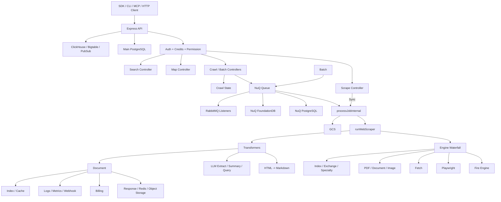

# Firecrawl 详细设计文档

> 文档版本：分析稿 v1.0  
> 分析日期：2026-09-15  
> 分析对象：`C:\Users\Administrator\Desktop\firecrawl-main\firecrawl-main`  
> 项目定位：面向 AI Agent 和应用的 Web 数据 API、抓取引擎与异步任务平台  
> 主要语言：TypeScript、Python、Go、JavaScript、Java、Rust、Ruby、PHP、.NET、Elixir  
> 服务端许可证：AGPL-3.0  
> SDK 许可证：多数 SDK 使用 MIT

## 1. 分析范围说明

Firecrawl 是一个大型多语言 monorepo。它不仅包含网页抓取，还包含：

- Scrape、Crawl、Map、Search、Batch Scrape、Extract、Agent 等 API
- 多引擎抓取瀑布与重试机制
- HTML 到 Markdown 转换
- PDF、Office 文档、图片和媒体处理
- PostgreSQL、Redis、RabbitMQ、FoundationDB、GCS、ClickHouse、Bigtable、Pub/Sub
- NuQ 异步任务系统
- 并发限制、计费、Webhook、零数据保留和威胁保护
- Python、Node.js、Go、Java、Rust、Ruby、PHP、.NET、Elixir SDK
- CLI、MCP、Skill、Workflow 和 UI
- 自托管 Docker Compose、Kubernetes 和 Helm 示例

本次分析聚焦服务端核心运行链：

```text
HTTP API
  -> Router / Auth / Credits / Threat Protection
  -> Scrape Controller
  -> Sync Execution or NuQ Queue
  -> runWebScraper
  -> scrapeURL engine waterfall
  -> transformers
  -> Document / Markdown / JSON / Media
  -> Billing / Logging / Webhook / Cache
```

Crawl、Batch、Map、Search 和队列系统会完整展开。所有 SDK 会做接口级审阅，但不会把每种语言的完整实现逐行展开。大量测试不会逐行阅读，而是按文件、用例主题和关键断言审查。

## 2. 核心结论

Firecrawl 的核心价值不是“写了一个爬虫”，而是把网页获取做成了可扩展、可排队、可计费、可监控、可回退的生产平台。

可以概括为：

```text
Firecrawl
  = 多入口 API
  + 多引擎抓取瀑布
  + 统一文档模型
  + 队列与并发控制
  + 多后端状态存储
  + 计费与权限
  + 安全与数据保留策略
```

最重要的设计决策：

1. API 层和执行层分离。同步 Scrape 可以直接执行，Crawl、Batch 等异步任务通过 NuQ 队列分发。
2. 抓取引擎通过统一 `EngineScrapeResult` 接口接入，按能力、质量和特性动态排序。
3. 引擎失败可以触发“增加特性”或“移除特性”后重试，而不是简单换一个 URL 下载器。
4. Crawl、Batch、Map、Search 都尽可能复用 Scrape 管线，避免构建独立抓取器。
5. 长任务状态分散在 Redis、Queue 后端、对象存储和关系数据库，按实时状态、结果体、审计记录分层保存。
6. PG 队列已形成稳定基线，FoundationDB 队列正在作为可迁移后端加入，并通过 crawl 级后端固定避免任务跨后端漂移。
7. Webhook、计费和日志与抓取主链解耦，允许异步执行和补偿。
8. 自托管是可用的起点，但默认安全、持久化和认证能力有限，生产化责任在部署方。

## 3. 产品定位与能力边界

### 3.1 目标

Firecrawl 的目标是让应用和 Agent 可以稳定地：

- 抓取单个网页
- 抓取整个站点
- 批量抓取 URL
- 发现站点 URL
- 搜索 Web 并抓取结果
- 提取 Markdown、HTML、截图、链接、图片、JSON 和结构化数据
- 处理 PDF、Office 文档、图片、音频和视频
- 对页面执行点击、滚动、输入、等待、JavaScript 等操作
- 通过 Webhook、轮询或 WebSocket 获取异步结果
- 通过托管服务和多语言 SDK 集成

### 3.2 典型接口

| 接口 | 同步或异步 | 主要用途 |
|---|---|---|
| `POST /v2/scrape` | 同步 | 抓取单 URL |
| `POST /v2/crawl` | 异步 | 站内发现并抓取 |
| `GET /v2/crawl/:id` | 同步查询 | 查询 Crawl 状态 |
| `DELETE /v2/crawl/:id` | 同步 | 取消 Crawl |
| `POST /v2/batch/scrape` | 异步 | 批量抓取 URL |
| `GET /v2/batch/scrape/:id` | 同步查询 | 查询 Batch 状态 |
| `POST /v2/map` | 同步 | 发现站点 URL |
| `POST /v2/search` | 同步 | Web 搜索，可选抓取 |
| `POST /v2/parse` | 同步 | 解析上传文件 |
| `POST /v2/extract` | 异步 | LLM 结构化提取 |
| `POST /v2/agent` | 异步 | 自主搜索和采集 |
| `GET /v2/team/queue-status` | 同步 | 查询团队队列占用 |
| `GET /v2/team/credit-usage` | 同步 | 查询额度使用 |
| WebSocket `/v2/crawl/:id` | 流式 | 增量接收 Crawl 文档 |
| MCP Actions | 多种 | Agent 操作审计 |

### 3.3 版本策略

服务端同时维护三个主要 API 版本：

| 版本 | 状态 | OpenAPI 路径数 |
|---|---|---:|
| v0 | 兼容旧调用 | 5 |
| v1 | 稳定旧接口 | 18 |
| v2 | 当前主接口 | 20 |

v2 路由还包含 Labs、Exchange、Admin、MCP、Monitor、Browser、Slack、Support 和 Research 等扩展面。OpenAPI 路径数不能代表全部实际路由，因为许多内部路由、WebSocket 和 labs 路由不进入主 OpenAPI。

### 3.4 明确的复杂度边界

Firecrawl 服务端不是一个可以轻松嵌入本地命令行工具的小库。它的完整运行需要：

- Node.js 与大量 TypeScript 依赖
- Redis
- PostgreSQL
- RabbitMQ
- 可选 FoundationDB
- 可选 GCS、ClickHouse、Bigtable、Pub/Sub
- 可选 Playwright、Fire Engine、FirePDF 和外部模型
- 计费、认证和 Webhook 配置

如果 Algocode 只需要“给定 URL 获取 Markdown”，应借用其抓取瀑布和接口设计，而不是直接引入完整服务端。

## 4. 技术栈

### 4.1 服务端核心

| 类别 | 技术 |
|---|---|
| HTTP | Express 5、express-ws |
| 语言 | TypeScript |
| 参数校验 | Zod 4 |
| HTML | Cheerio、JSDOM、Turndown |
| 浏览器 | Playwright、Fire Engine CDP |
| 原生能力 | Koffi、Rust native `@mendable/firecrawl-rs`、Go shared library |
| ORM | Drizzle ORM |
| 关系数据库 | PostgreSQL |
| 状态与锁 | Redis、Redlock |
| 队列 | NuQ PostgreSQL、FoundationDB、RabbitMQ 监听 |
| 对象存储 | Google Cloud Storage |
| 分析 | ClickHouse、Bigtable、Pub/Sub |
| 可观测性 | Winston、OpenTelemetry、prom-client |
| LLM | Vercel AI SDK 及多 provider |
| PDF | Rust、pdfplumber、MinerU、FirePDF |
| 测试 | Vitest、Supertest |

### 4.2 当前本机环境

已确认：

- Node.js `v25.2.1`
- npm `11.6.2`
- pnpm `11.22.0`
- `apps/api/node_modules` 不存在
- 根目录 `node_modules` 不存在
- Python SDK 没有独立 `.venv`
- 当前仓库没有可确认的 Git 元数据

因此本轮没有执行 TypeScript 构建、Vitest 或 SDK 测试。

## 5. 关键术语

| 术语 | 含义 |
|---|---|
| Engine | 一种具体抓取实现，例如 Playwright、Fetch、Fire Engine CDP、PDF |
| Waterfall | 按能力和质量排序后依次尝试的引擎列表 |
| Meta | 一次 Scrape 的运行时上下文，包含 URL、选项、日志、特性、预取文件 |
| Feature Flag | 请求需要的执行能力，例如 actions、screenshot、stealth、PDF |
| Transformer | 对抓取结果做清洗、格式派生、LLM 提取或索引 |
| Crawl Group | 一个 Crawl 或 Batch 的任务组 |
| NuQ | Firecrawl 自建异步任务队列抽象 |
| PG Backend | 使用 PostgreSQL 实现的 NuQ 后端 |
| FDB Backend | 使用 FoundationDB 实现的 NuQ 后端 |
| CQ | Concurrency Queue，等待团队或 Crawl 并发额度的任务 |
| ZDR | Zero Data Retention，零数据保留 |
| Threat Protection | URL 威胁分类和阻断策略 |
| Exchange | 预采集或上游路由数据源 |
| Index | Firecrawl 的网页缓存和搜索索引 |
| FirePDF | 独立 PDF OCR 和布局分析服务 |
| Watcher | SDK 中通过 WebSocket 或轮询监听异步任务的对象 |

## 6. 总体架构



## 7. 仓库结构

| 目录 | 职责 |
|---|---|
| `apps/api` | 主 API、工作进程、抓取器、队列、存储、计费和测试 |
| `apps/playwright-service-ts` | Playwright 浏览器微服务 |
| `apps/nuq-postgres` | NuQ 所需 PostgreSQL 镜像和 schema |
| `apps/redis` | Redis 相关镜像或配置 |
| `apps/go-html-to-md-service` | Go HTML 到 Markdown 服务 |
| `apps/python-sdk` | Python 同步和异步 SDK |
| `apps/js-sdk` | Node.js SDK、Watcher 和类型 |
| `apps/go-sdk` | Go SDK |
| `apps/java-sdk` | Java SDK |
| `apps/rust-sdk` | Rust SDK |
| `apps/ruby-sdk` | Ruby SDK |
| `apps/php-sdk` | PHP 与 Laravel 集成 |
| `apps/dot-net-sdk` | .NET SDK |
| `apps/elixir-sdk` | Elixir SDK |
| `apps/test-suite` | 跨语言和端到端测试 |
| `apps/ui` | 管理或采集界面 |
| `firecrawl-cli` | 命令行工具 |
| `firecrawl-cli-skills` | CLI 相关 Agent Skill |
| `firecrawl-skills` | Agent Skill 集合 |
| `firecrawl-workflows` | 自动化工作流 |
| `examples/kubernetes` | Kubernetes 和 Helm 示例 |

### 7.1 `apps/api/src` 分层

| 目录 | 文件数 | 行数 | 职责 |
|---|---:|---:|---|
| `__tests__` | 114 | 33,796 | 集成、E2E、Snips 和路由测试 |
| `controllers` | 117 | 25,503 | v0、v1、v2 API 控制器 |
| `lib` | 240 | 66,755 | 通用能力、错误、缓存、队列辅助、格式和权限 |
| `scraper` | 137 | 30,694 | 引擎、转换器、抓取后处理、PDF 和浏览器 |
| `services` | 153 | 41,554 | 队列、Worker、计费、日志、Webhook、索引等 |

上述统计只包含 `apps/api` 下的 TypeScript 和 TSX 文件，并排除 `node_modules` 与 `dist`。

## 8. 服务启动与生命周期

### 8.1 API 启动入口

入口是 `apps/api/src/index.ts`：

1. 加载 `.env` 和严格配置。
2. 初始化 OpenTelemetry 和日志。
3. 创建 Express 5 应用并启用 WebSocket。
4. 安装 HTTP 和 HTTPS DNS 缓存。
5. 解析 URL 编码请求和最大 10 MB JSON。
6. 全局启用 CORS 和响应耗时。
7. 关闭 `x-powered-by`。
8. 按配置设置信任代理。
9. 注册 Bull Board 管理面板，但仅在设置 `BULL_AUTH_KEY` 时开放。
10. 注册 v0、v1、v2、labs、exchange、admin 和 MCP 路由。
11. 初始化 blocklist、强制引擎映射和 Exchange 目录。
12. 启动 HTTP 服务。
13. 收到 SIGTERM 或 SIGINT 后，先停止接受请求，再关闭 NuQ、Webhook、索引队列、Pub/Sub 和 Tracing。

### 8.2 开发与容器启动

`apps/api/src/harness.ts` 提供统一开发启动器，可按照参数启动 API 和多个 Worker：

- `--start`
- `--start-built`
- `--start-docker`
- 针对 API、NuQ、NuQ FDB、Extract、Index、ZDR 和 reconciler 的独立启动模式

容器的默认命令是：

```bash
node dist/src/harness.js --start-docker
```

### 8.3 Worker 生命周期

`nuq-worker-runner.ts` 为 PG 和 FDB Worker 提供统一循环：

1. 初始化 blocklist 和引擎强制映射。
2. 提供 `/health` 和 `/metrics`。
3. 从队列获取任务。
4. 每 15 秒续租任务锁。
5. 执行 `processJobInternal`。
6. 成功时 `jobFinish`，失败时 `jobFail`。
7. 空闲时指数退避轮询，最大等待 10 秒。
8. 收到停止信号后，不再领取新任务，等待当前任务完成，然后关闭运行时。

## 9. API 路由设计

v2 路由集中在 `apps/api/src/routes/v2.ts`。中间件顺序通常为：

```text
request timing
-> auth
-> country check
-> credit check
-> blocklist
-> idempotency
-> controller
```

### 9.1 核心路由

| 方法 | 路径 | 控制器 | 特性 |
|---|---|---|---|
| POST | `/v2/scrape` | `scrapeController` | 支持 keyless、并发信号量、同步执行 |
| POST | `/v2/crawl` | `crawlController` | 幂等、异步、Webhook |
| POST | `/v2/batch/scrape` | `batchScrapeController` | 异步批量 |
| POST | `/v2/map` | `mapController` | 同步 URL 发现 |
| POST | `/v2/search` | `searchController` | Web/News/Image/Developer/Tools |
| POST | `/v2/parse` | `parseController` | 50 MB 文件上传或引用 |
| POST | `/v2/extract` | `extractController` | 旧结构化提取能力 |
| POST | `/v2/agent` | `agentController` | 自主采集 |
| GET | `/v2/crawl/:jobId` | `crawlStatusController` | 分页和结果聚合 |
| DELETE | `/v2/crawl/:jobId` | `crawlCancelController` | 取消 |
| GET | `/v2/crawl/:jobId/errors` | `crawlErrorsController` | 失败 URL 与 robots 阻断 |
| GET | `/v2/batch/scrape/:jobId` | 共用 Crawl 状态控制器 | Batch 模式 |
| DELETE | `/v2/batch/scrape/:jobId` | 共用取消控制器 | Batch 取消 |
| GET | `/v2/team/queue-status` | `queueStatusController` | 团队并发和等待数 |
| WS | `/v2/crawl/:jobId` | `crawlStatusWSController` | 增量文档流 |

### 9.2 v2 扩展路由

v2 还包括：

- `/parse/upload-url` 和 `/parse/upload/:uploadId`
- `/scrape/:jobId` 和 `/scrape/:jobId/interact`
- `/crawl/params-preview`
- `/crawl/ongoing` 和 `/crawl/active`
- `/agent`、Agent trace、snapshot、skill、thread、cancel
- `/team/credit-usage`、token usage、activity
- `/team/threat-protection`
- `/team/siem`
- `/monitor`
- `/slack`
- `/browser` 和 `/interact`
- `/support/ask`
- `/search/research`、`/search/developer`
- `/research` 和 `/developer`

### 9.3 统一错误处理

`index.ts` 对未知路径和异常做统一响应：

- 队列满返回 HTTP 429。
- Zod 校验错误返回 HTTP 400，并包含 issues。
- 未识别字段返回专用提示，避免 API 静默接受旧参数。
- JSON 格式错误返回 `BAD_REQUEST_INVALID_JSON`。
- 请求体过大返回 HTTP 413。
- 其他异常返回带错误 ID 的 `UNKNOWN_ERROR`，避免直接泄漏内部堆栈。

## 10. 请求数据模型

v2 请求 schema 位于 `controllers/v2/types.ts`，该文件约 2,791 行。

### 10.1 Scrape 基础选项

`baseScrapeOptions` 包括：

| 选项 | 作用 |
|---|---|
| `formats` | markdown、html、rawHtml、links、images、screenshot、JSON、summary、query 等 |
| `headers` | 自定义 HTTP Header |
| `includeTags` / `excludeTags` | HTML 清洗选择器 |
| `onlyMainContent` | 只保留主内容，默认开启 |
| `onlyCleanContent` | 进一步清洗 |
| `timeout` | 抓取超时 |
| `waitFor` | 页面等待 |
| `mobile` | 移动端渲染 |
| `parsers` | PDF 和图片解析模式 |
| `actions` | 点击、输入、滚动、等待、截图、JS、PDF |
| `location` | 国家与语言 |
| `skipTlsVerification` | TLS 校验策略 |
| `removeBase64Images` | 删除内嵌 Base64 图片 |
| `fastMode` | 优先使用更快的引擎 |
| `blockAds` | 广告拦截 |
| `proxy` | basic、stealth、enhanced、auto |
| `maxAge` / `minAge` | 缓存年龄边界 |
| `storeInCache` | 是否写入缓存 |
| `lockdown` | 仅使用缓存或索引，不访问实时 Web |
| `redactPII` | 脱敏 |
| `threatProtection` | 请求级威胁策略覆盖 |
| `auditMetadata` | 审计元数据 |
| `profile` | 浏览器配置复用 |

### 10.2 输出格式

`FormatObject` 支持：

- `markdown`
- `html`
- `rawHtml`
- `rawBase64`
- `links`
- `images`
- `summary`
- `json`
- `deterministicJson`
- `changeTracking`
- `screenshot`
- `attributes`
- `question`
- `highlights`
- `query`
- `branding`
- `product`
- `menu`
- `audio`
- `video`

Schema 会拒绝冲突组合，例如：

- 只能有一个 screenshot 格式。
- `changeTracking` 必须同时请求 `markdown`。
- `json` 和 `deterministicJson` 不能同时出现。
- `rawBase64` 不能和其他格式组合。
- 最多 50 个 Actions。
- `waitFor` 与所有 wait Action 的总时间不能超过 60 秒。
- `waitFor` 不能超过 timeout 的一半。

### 10.3 Crawl 选项

`crawlerOptions` 包括：

| 选项 | 默认值 | 作用 |
|---|---:|---|
| `includePaths` | `[]` | 仅抓取匹配路径 |
| `excludePaths` | `[]` | 排除匹配路径 |
| `maxDiscoveryDepth` | 可选 | 链接发现层数 |
| `limit` | 10000 | 最大页面数 |
| `crawlEntireDomain` | 可选 | 是否允许从起始路径向上扩展 |
| `allowExternalLinks` | false | 是否允许站外链接 |
| `allowSubdomains` | false | 是否允许子域 |
| `ignoreRobotsTxt` | false | 是否忽略 robots |
| `robotsUserAgent` | 可选 | robots User-Agent |
| `sitemap` | include | skip、include、only |
| `deduplicateSimilarURLs` | true | URL 去重 |
| `ignoreQueryParameters` | false | 是否忽略查询参数 |
| `regexOnFullURL` | false | 正则匹配完整 URL |
| `delay` | 可选 | 请求间隔，最大 60 秒 |

### 10.4 Map 选项

Map 在 Crawl 选项之上增加：

- `search`
- `includeSubdomains`
- `ignoreQueryParameters`
- `filterByPath`
- `useIndex`
- `ignoreCache`
- 最大 limit 100000
- 默认 limit 5000
- 可选 timeout
- 可选 headers 和 location

## 11. 同步 Scrape 请求生命周期

`scrapeController` 是 v2 最关键的同步入口。

### 11.1 前置阶段

1. 生成 UUIDv7 `jobId`。
2. 解析 `scrapeRequestSchema`。
3. 解析团队级和请求级 Threat Protection 策略。
4. 检查团队权限。
5. 检查 API Key 对格式和 Action 的限制。
6. 计算 ZDR。
7. 校验 Agent interop secret。
8. 计算 keyless credits，需要时先预留额度。
9. 异步写入父 `requests` 记录，但暂不阻塞主流程。
10. 创建 OpenTelemetry Span。

### 11.2 并发控制

同步 Scrape 不走 NuQ 队列，而是直接调用 `processJobInternal`。它使用团队级 `teamConcurrencySemaphore`：

- 默认等待获得团队并发槽。
- 若 timeout 存在，只给获取槽位约 2/3 的时间。
- 客户端提前断开时通过 AbortController 取消等待。
- Agent interop 可将并发提升到三倍。
- 被限流时最终 Document 会带 warning。

这使同步 Scrape 具有“同步返回”的用户体验，同时仍然受团队并发预算约束。

### 11.3 执行

控制器构造一个状态为 `active` 的内存 NuQ Job：

```text
data.skipNuq = true
data.mode = "single_urls"
data.internalOptions.teamConcurrency = baseConcurrency
data.startTime = controllerStartTime
```

随后直接调用：

```text
processJobInternal(job)
```

因为没有进入队列，所以 `skipNuq` 让部分结果获取和日志逻辑使用同步路径。

### 11.4 响应

成功时返回 Document。

异常映射包括：

- DNS 错误：HTTP 200 加 `success: false`
- 无缓存数据：HTTP 404
- Lockdown 缓存未命中：HTTP 404
- Agent Index 限制：HTTP 403
- 超时：对应超时错误
- 其他可传输错误：按错误码映射

## 12. 抓取瀑布设计

### 12.1 `buildMetaObject`

`scrapeURL` 首先构造 `Meta`：

- URL 和重写 URL
- Scrape 选项
- 内部选项
- Logger
- AbortManager
- 特性集合
- 图片 OCR gate
- PDF、Document、Image 和 Fetch 预取状态
- 大 PDF 异步任务状态
- 成本追踪
- 威胁决策列表

`Meta` 被设计成近似不可变对象。引擎和 Transformer 通常接收它的副本，只有成本、日志、威胁决策和大 PDF 状态等共享可变容器会跨阶段更新。

### 12.2 特性标记

`buildFeatureFlags` 根据请求生成 Feature Set：

- `actions`
- `waitFor`
- `screenshot`
- `screenshot@fullScreen`
- `branding`
- `audio`
- `video`
- `location`
- `mobile`
- `skipTlsVerification`
- `useFastMode`
- `stealthProxy`
- `pdf`
- `document`
- `image`
- `disableAdblock`

若 URL 看起来是 PDF、Office 文档或图片，会自动加入相应文件特性。

### 12.3 引擎列表

`engines/index.ts` 定义引擎类型和注册表。典型顺序：

```text
X/Twitter
Wikipedia
Index
Fire Engine Chrome CDP
Fire Engine Chrome CDP Stealth
Fire Engine CDP Retry
Fire Engine CDP Retry Stealth
Fire Engine TLS Client
Fire Engine TLS Client Stealth
Playwright
Fetch
PDF
Document
Image
```

Exchange 可能在更早阶段直接短路。

### 12.4 特性支持评分

每个引擎声明支持的 Feature。系统：

1. 计算请求的特性总优先级。
2. 计算每个引擎支持的优先级。
3. 只保留支持分数达到阈值的引擎。
4. 显式 stealth 请求时只保留支持 stealth 的引擎。
5. 根据引擎质量排序。
6. 特殊 URL 决定是否保留 X/Twitter 或 Wikipedia。
7. Lockdown 和 `agentIndexOnly` 可以强制只使用 Index。
8. 文件 URL 在 Fire Engine 可用时优先通过浏览器预取文件，再交给专用文件解析器。

### 12.5 引擎质量

质量分数表达默认偏好，而不是绝对优先级：

| 引擎 | 质量 |
|---|---:|
| Exchange | 2000 |
| X/Twitter | 1500 |
| Index | 1000 |
| Wikipedia | 500 |
| Chrome CDP | 50 |
| Chrome CDP Retry | 45 |
| Playwright | 20 |
| TLS Client | 10 |
| Fetch | 5 |
| Document、PDF、Image | -20 |
| TLS Client Stealth | -15 |
| CDP Stealth | -2 |
| CDP Retry Stealth | -5 |

负质量通常表示专用引擎或高成本后备方案。

### 12.6 重试机制

`scrapeURL` 支持多个错误信号：

- `AddFeatureError`：失败后增加要求的能力，再重试。
- `RemoveFeatureError`：失败后移除不支持的能力。
- `WaterfallNextEngineSignal`：直接进入下一个引擎。
- `EngineSnipedError`：另一个执行已经赢得结果。
- 普通 EngineError：按策略继续。

`apps/api/src/main/runWebScraper.ts` 在 Crawl 场景下还会对整个 `scrapeURL` 尝试最多 3 次；普通 Scrape 为 1 次。

### 12.7 特殊引擎

| 引擎 | 说明 |
|---|---|
| Exchange | 使用预路由数据源，质量最高，支持条件很严格 |
| Index | 读取已有网页索引，适合缓存和 Search |
| X/Twitter | 使用 X API 配置或托管服务能力 |
| Wikipedia | 企业凭据存在时启用 |
| Fire Engine CDP | 完整浏览器渲染、Action、截图、Branding |
| Fire Engine TLS Client | 更快，适合不需要浏览器的站点 |
| Playwright | 自托管时的浏览器后备 |
| Fetch | 基础 HTTP 抓取 |
| PDF | Rust、pdfplumber、MinerU、FirePDF |
| Document | DOCX、XLSX 等 Office 文档 |
| Image | 通过 FirePDF 做图片 OCR |

### 12.8 Index 跳过条件

以下情况不会使用 Index：

- Parse 上传
- Screenshot 有自定义 viewport 或 quality
- Change Tracking
- Branding
- PDF pageMarkdown、blocks 或 pageMarkers
- 自定义请求上下文
- `maxAge = 0`
- Index 被关闭或仅写模式

## 13. HTML 到 Markdown

`lib/html-to-markdown.ts` 采用三级策略：

```text
HTML
  -> HTML_TO_MARKDOWN_SERVICE_URL
  -> Go shared library
  -> Turndown + GFM plugin
  -> postProcessMarkdown
  -> Markdown
```

### 13.1 HTTP 服务

若配置 `HTML_TO_MARKDOWN_SERVICE_URL`，优先调用独立服务。失败后记录错误并回退。

### 13.2 Go shared library

若启用 `USE_GO_MARKDOWN_PARSER`，通过 Koffi 加载共享库，调用：

```text
ConvertHTMLToMarkdown(CString) -> CString
```

该路径同步执行在异步包装中，并负责释放原生字符串。当前代码里明确保留了“需要为 Go parser 增加 timeout”的 TODO。

### 13.3 Turndown

最后回退到 Turndown，并启用 GFM 插件支持表格等语法。项目还包含处理多行链接和移除 Skip to Content 的辅助逻辑。

### 13.4 后处理

所有成功路径最终会调用 Rust native：

```text
postProcessMarkdown(markdown)
```

因此格式清洗逻辑在多种转换后端之间保持一致。

## 14. Transformer 管线

`transformers/index.ts` 把原始引擎结果转换成统一 Document。

典型顺序：

```text
rawHtml
  -> metadata
  -> cleaned html
  -> markdown
  -> links
  -> images
  -> branding
  -> JSON extraction
  -> deterministic JSON
  -> clean content
  -> summary
  -> question / highlights / query
  -> attributes
  -> product / menu / audio / video
  -> PII redaction
  -> cache / index
```

### 14.1 HTML 清洗

`htmlTransform` 结合：

- includeTags
- excludeTags
- onlyMainContent
- blockAds
- iframe selector 转换
- 页面 URL

生成可比原始 HTML 更干净的 `document.html`。

### 14.2 Markdown 派生

只有请求了 Markdown 或依赖 Markdown 的格式才执行转换。需要 Markdown 的能力包括：

- changeTracking
- json
- deterministicJson
- summary
- question
- highlights
- query
- redactPII
- onlyCleanContent

如果 `onlyMainContent` 得到空 Markdown，会自动回退到完整 HTML 再转换一次。

JSON 响应会被包装为 fenced code block；`text/plain` 原样保留，避免转义 Markdown 标点。

### 14.3 链接和图片

- `extractLinks` 从 HTML 或 Markdown 提取链接。
- `extractImages` 提取图片。
- 当索引流量采样开启时，链接还会异步发送到索引 Worker。
- 未请求 links 时，提取出的 links 会被删除，避免无端增加响应体。

### 14.4 LLM 提取

`llmExtract.ts` 约 1,605 行，包含：

- JSON Schema 检测和规范化
- 模型选择
- Token 裁剪
- 成本计算
- Completions 生成
- LLM JSON 提取
- Clean Content
- Summary
- 根据 Prompt 生成 Schema
- 根据 Prompt 生成 Crawl 参数

模型调用通过 AI SDK 抽象，支持 OpenAI、Anthropic、Google、Vertex、Groq、Fireworks、DeepInfra、xAI、OpenRouter 和 Ollama 等 provider。

### 14.5 Prompt Injection Guard

`promptInjectionGuard.ts` 提供抓取内容到 LLM 之前的额外安全检查：

- 使用 `gpt-4o-mini`
- 每块最多 32,000 字符
- 相邻块重叠 2,000 字符
- 并发上限 5
- 随机 Tag 包裹不可信内容，避免页面伪造闭合标签
- 结构化返回 `isInjection` 和 reason
- 检出时抛出 `PromptInjectionDetectedError`
- 调用失败时默认 fail-open
- 成本进入 CostTracking

该机制降低部分 Prompt Injection 风险，但不应被视为完整安全边界。失败时继续执行意味着安全性和可用性之间存在明确取舍。

## 15. Crawl 设计

### 15.1 创建 Crawl

`crawlController` 的执行顺序：

1. 解析 schema。
2. 计算 ZDR。
3. 解析 Threat Protection。
4. 检查团队权限和 Key 限制。
5. 对种子 URL 做威胁检查。
6. 写父请求日志。
7. 读取剩余 credits。
8. 如果存在自然语言 `prompt`，先用站点结构和 LLM 生成 crawler options。
9. 将用户显式参数优先于 Prompt 生成参数。
10. 再用 `limit = min(remainingCredits, requestedLimit)` 限制任务规模。
11. 解析团队有效并发限制。
12. 构造 `StoredCrawl`。
13. 获取 robots.txt。
14. 选择 PG 或 FDB 队列后端。
15. 保存 Crawl、标记 active、创建 Crawl Group。
16. 写入一个 `mode = "kickoff"` 的任务。
17. 立即返回 Crawl ID 和状态 URL。

### 15.2 Crawl Redis 状态

`lib/crawl-redis.ts` 使用多个键保存运行状态：

| Key 模式 | 作用 |
|---|---|
| `crawl:{id}` | 完整 StoredCrawl，TTL 24 小时 |
| `crawls_by_team_id:{team}` | 团队 Crawl 集合 |
| `crawl:{id}:jobs` | 所有任务 ID |
| `crawl:{id}:jobs_qualified` | 仍然有效的任务 ID |
| `crawl:{id}:jobs_done` | 完成集合 |
| `crawl:{id}:jobs_donez_ordered` | 按完成时间排序 |
| `crawl:{id}:visited` | 已访问 URL |
| `crawl:{id}:visited_unique` | 去重后的访问 URL |
| `crawl:{id}:robots_blocked` | robots 阻断 URL |
| `crawl:{id}:threat_blocked` | 威胁阻断 URL 与决策 |
| `crawl:{id}:sitemap_jobs` | Sitemap 任务 |
| `crawl:{id}:sitemap_jobs_done` | 已完成 Sitemap 任务 |
| `active_crawls` | 活跃 Crawl 集合 |
| `crawl-job-done-repair` | 完成标记修复队列 |

### 15.3 完成标记修复

完成标记写入采用：

- Redis Pipeline
- 最多 3 次重试
- 成功任务写入有序集合
- 失败任务从有序集合移除
- 多次失败后写入 `crawl-job-done-repair`

reconciler Worker 每分钟调用 `repairCrawlJobDoneMarkers`，通过 HSCAN 分批重试。修复积压超过 10,000 时记录高优先级错误日志。

该设计承认 Redis 写入可能短暂失败，并通过补偿机制避免 Crawl 永远无法结束。

### 15.4 Kickoff 任务

`processKickoffJob`：

1. 加载 Crawl。
2. 构造 WebCrawler。
3. 锁定种子 URL。
4. 创建种子 Scrape Job。
5. 发送 `crawl.started` Webhook。
6. 添加多个 Sitemap 任务。
7. 从 Index 查询可能链接。
8. 对 Index 链接执行威胁检查。
9. 锁定并批量写入 Index 链接任务。
10. 标记 Kickoff 完成。
11. 出错时写入 Crawl error。

### 15.5 Sitemap 任务

每个 Sitemap Job：

- 下载并解析 Sitemap。
- 支持嵌套 Sitemap。
- 使用 48 小时缓存。
- 经过 Crawler 的同域、路径、深度和 robots 过滤。
- 执行威胁检查。
- 锁定并批量生成 Scrape Job。
- 递归添加子 Sitemap Job。
- 最后记录 `sitemap_jobs_done`。

### 15.6 页面发现

每个成功 Scrape 完成后，如果属于 Crawl：

1. 检查 Redirect 是否被 Crawl 配置允许。
2. 若跨域 Redirect，必要时更新 originUrl。
3. 从响应中提取链接。
4. 应用 Crawl 过滤规则。
5. 记录 robots 阻断和威胁阻断。
6. 对每个新链接尝试原子锁定。
7. 创建新的 Scrape Job。
8. 写入 Crawl Job 集合。
9. 发送页面级 Webhook。
10. 记录完成标记。

### 15.7 URL 过滤

WebCrawler 支持拒绝原因：

- 深度超限
- excludePaths
- includePaths
- robots.txt
- 不支持的协议
- 不支持的文件类型
- 向上路径爬取关闭
- 社交媒体或邮件链接
- 外部域未开启
- Section Anchor
- 非 HTTP 协议
- 发现深度超限

核心过滤先由 Rust 执行，出错时回退到 JavaScript。

### 15.8 完成 Crawl

`finishCrawlSuper` 在最后一个任务完成后执行：

- 清理 Crawl 运行态
- 统计文档数和 credits
- 写 `crawls` 或 `batch_scrapes` 审计记录
- 按 v0 或 v1 协议发送完成 Webhook
- 对 ZDR Crawl 删除临时状态

v1 完成 Webhook 不把全部文档再次塞进事件，而是发送完成通知，客户端通过状态接口读取；v0 兼容路径可能包完整文档。

## 16. Batch Scrape 设计

Batch 和 Crawl 共享 `StoredCrawl`、Crawl Group、状态查询、取消和错误接口，但不创建 Crawler。

### 16.1 创建 Batch

`batchScrapeController`：

1. 根据 `ignoreInvalidURLs` 选择严格或宽松 URL schema。
2. 解析威胁策略和权限。
3. 执行 Key 格式限制。
4. 计算 ZDR。
5. 校验 Agent interop。
6. 使用 UUIDv7 作为 job id。
7. 过滤本地 blocklist URL。
8. 对威胁保护执行批量 URL 检查。
9. 可选返回 `invalidURLs`，或整批拒绝。
10. 创建 StoredCrawl，但 `crawlerOptions = null`。
11. 选择 PG/FDB 后端。
12. 创建 Crawl Group。
13. URL 大于 1000 时计算更高优先级。
14. 为每个 URL 创建独立 Scrape Job。
15. 锁定 URL、写 Redis Job 集合、写入 NuQ。
16. 发送 `batch_scrape.started` Webhook。
17. 返回 Batch ID。

### 16.2 Append

Batch 支持通过 `appendToId` 向已有任务追加 URL：

- 必须属于同一个 team。
- 复用已有 StoredCrawl。
- 不重新创建 Group。
- 新 URL 仍重新执行威胁检查和计费。
- 适合增量扩展批量任务。

### 16.3 状态查询

`crawlStatusController` 同时服务于 Crawl 和 Batch：

- 校验 UUID。
- 支持 `skip` 和 `limit` 分页。
- 读取 Crawl Group 状态。
- 读取 Group 数字统计。
- 查询已计费 credits。
- 读取 Kickoff 错误。
- 拉取完成 Job 的返回值，必要时从 GCS 读取。
- 单个响应体最多约 10 MiB。
- 返回 `next` URL。
- Crawl 额外返回 robots 警告和 base domain 警告。
- 返回 createdAt、completedAt、duration 和 expiresAt。

### 16.4 WebSocket

WebSocket 状态接口：

- 首次发送 `catchup` 快照。
- 随后每秒发送新完成 `document`。
- 最终发送 `done`。
- 认证失败码为 3000 或 3003。
- 非法 ID 为 1008。
- 内部错误为 1011。

该接口让 SDK Watcher 可以在不反复拉取全量结果的情况下接收增量文档。

## 17. Map 设计

Map 负责快速发现站点 URL，不抓取正文。

`getMapResults` 的主要流程：

1. 解析 Redirect。
2. 若跨域，调整主机名。
3. 构造 WebCrawler。
4. 获取 robots.txt。
5. 若 `sitemap = only`，只使用 Sitemap。
6. 否则并行查询：
   - Firecrawl Index
   - Fire Engine Search
   - Sitemap
7. Fire Engine 查询按每页 100 条执行。
8. 最多使用 `maxFireEngineResults`。
9. 使用 Redis 缓存 48 小时。
10. ZDR 时不写缓存。
11. 对搜索结果执行 URL 清洗。
12. 执行同域和子域过滤。
13. 可选路径过滤。
14. 去重。
15. 如果提供 search，则用 Cosine Similarity 重排。
16. 应用 limit。
17. 执行威胁过滤。
18. 计费并记录 Map 审计记录。

Map 的核心优点是“优先使用已有知识”，只在需要时访问外部发现服务，因此比完整 Crawl 更适合预算发现阶段。

## 18. Search 设计

Search 支持 Web、News、Image、Developer 和 Tools 等来源。

### 18.1 控制器

`searchController` 负责：

- 解析 Search schema。
- 检查 keyless 和 provider tools 权限。
- 检查 Key 格式和 endpoint 限制。
- 校验 Agent interop。
- 解析搜索级和 Scrape 级 Threat Protection。
- 注入团队强制 ZDR 或匿名模式。
- 预留 keyless credits。
- 调用 `executeSearch`。
- 按搜索结果数量计费。
- Scrape 结果由 Scrape 任务自行计费。
- 写 Search 和 Developer 审计记录。

### 18.2 执行器

`executeSearch`：

1. 根据 category 和 domains 构建搜索查询。
2. 可选并行执行 Developer Search。
3. 调用统一 `search()`。
4. 对结果执行 Threat Protection 过滤。
5. 给 Web 和 News 结果补充 category。
6. 对各类型结果裁剪到 limit。
7. 可选执行 Tools Discovery。
8. 计算 Search credits。
9. 如果请求了 Scrape formats，则批量 Scrape 搜索结果并合并正文。
10. 可选运行 Index Highlights。
11. 输出 Developer 结果。
12. 记录 Search 和结果追踪。

### 18.3 计费

默认每 10 个结果 2 credits；ZDR 模式每 10 个结果 10 credits。威胁扫描费用附加在 Search credits 上。Scrape 费用由每个 Scrape Job 单独记账。

### 18.4 搜索后端回退

搜索层支持：

- Fire Engine Search
- SearXNG
- DuckDuckGo

不同部署能力不一致时，可以通过回退维持基本可用性。

## 19. NuQ 队列系统

NuQ 是 Firecrawl 自建队列抽象。它既替代部分 BullMQ 职责，也承担 Crawl Group、任务锁、并发和结果状态。

### 19.1 PostgreSQL 后端

`services/worker/nuq.ts` 提供：

- Job 添加
- 批量添加
- Job 获取与锁
- 锁续租
- Job 完成和失败
- Group 创建、查询、完成和取消
- Group 数字统计
- Crawl Job 分页查询
- Job 监听
- 健康检查
- 本地 metrics

PostgreSQL 通过 `LISTEN` 和轮询协调任务可用性，并使用锁和租约避免重复执行。

### 19.2 RabbitMQ

RabbitMQ 在 NuQ 中主要承担监听或信号角色，不作为唯一事实来源。Job 状态仍然写入持久后端。Webhook 队列也可以使用 RabbitMQ，并启用持久消息。

### 19.3 FoundationDB 后端

FDB 后端在 `nuq-fdb/queue.ts` 中实现，当前处于迁移和实验阶段。

路由规则：

- 新 Crawl 根据团队 flag 或 `NUQ_BACKEND=fdb` 选择后端。
- 选择写入 `StoredCrawl.queueBackend`。
- 一个 Crawl 的任务永远不会跨后端。
- 无标记历史 Job 默认回 PG。
- FDB 故障时，非强制模式可回退 PG。
- FDB 强制模式下故障直接失败。
- 生产 Worker 分别消费 PG 和 FDB。

### 19.4 Job 后端标记

Standalone Job 在 Redis 中写入：

```text
nuq:job_backend:{jobId} -> pg | fdb
```

TTL 为 24 小时。Crawl Job 优先跟随 Crawl 的 `queueBackend`，避免迁移期间同一个 Crawl 分裂到两个后端。

### 19.5 并发队列

当团队或 Crawl 达到并发上限时：

1. Job 以 `backlogged` 状态写入主队列。
2. Job ID 写入团队 Concurrency Queue。
3. 活跃 Job 返回后，Worker 提升下一个等待任务。
4. 等待队列也有最大长度，超过时抛 `QueueFullError`，API 返回 429。
5. Crawl 可以配置 `maxConcurrency`，同时受团队总并发限制。
6. 自托管默认跳过团队并发门控。

### 19.6 Reconciler

`concurrency-queue-reconciler.ts` 周期修复：

- 主队列 backlog 中存在、但 Concurrency Queue 丢失的任务
- Concurrency Queue 中存在、但主队列已经不存在或已完成的陈旧任务
- 因为进程崩溃而没有被正确提升的任务
- 完成标记写入失败的 Crawl 任务

reconciler 每 60 秒运行，并输出 Prometheus 指标：

- `concurrency_queue_reconciler_runs_total`
- `concurrency_queue_reconciler_failures_total`
- `concurrency_queue_reconciler_jobs_recovered_total`

### 19.7 Worker 锁

Worker 获取任务后：

- 每 15 秒续租。
- 续租失败后停止续租并记录警告。
- 无论业务成功或失败，都调用队列 Finish 或 Fail。
- 关闭时等待当前任务完成，不强行中断。
- 对 ZDR Job，队列 bookkeeping 也在非记录 trace 上下文中执行。

## 20. 存储设计

### 20.1 主 PostgreSQL

`db/schema/public.ts` 定义核心表，包括：

- `requests`
- `scrapes`
- `parses`
- `crawls`
- `batch_scrapes`
- `searches`
- `maps`
- `extracts`
- `llmstxts`
- `deep_researches`
- `agents`
- `browser_sessions`
- `monitors`
- `monitor_checks`
- `webhook_logs`
- `api_keys`
- `teams`
- `users`
- `threat_protection_config`
- `siem_logging_config`

`requests` 是父审计记录，具体能力使用子表。部分写入故意异步化，以减少主请求延迟，但会等待父记录先提交，避免外键顺序问题。

### 20.2 Redis

Redis 承担：

- Crawl 实时状态
- 任务完成集合
- URL 去重和锁
- 并发活跃集合
- 等待队列
- Map 缓存
- blocklist hit
- Webhook 日志写入队列
- 速率限制
- Job 后端标记

生产环境可能使用多个 Redis 实例，例如 `REDIS_URL`、`REDIS_EVICT_URL`、`REDIS_RATE_LIMIT_URL` 和 `SPUR_REDIS_URL`。代码中特别区分了 `REDIS_EVICT_URL`，因为部分状态写入和读取必须使用同一实例。

### 20.3 GCS

GCS 用于：

- 大结果体
- ZDR 清理对象
- Parse 上传
- Fire Engine 文件交接
- FirePDF by-reference 输入
- 截图和媒体

Crawl 状态接口在 NuQ returnvalue 不存在时会回退读取 GCS。

### 20.4 其他存储

- ClickHouse：Search Analytics。
- Bigtable：Change Tracking。
- Pub/Sub：日志和异步事件。
- FoundationDB：可选队列后端。

多存储设计提高了扩展性，但也显著增加了数据一致性和运维复杂度。

## 21. 计费与额度

计费通过 `billTeam` 等接口集中处理。

典型计费点：

- Scrape 成功后按 Document 和 Feature 计费
- Crawl 每个 Scrape Job 独立计费
- Batch 每个 Scrape Job 独立计费
- Map 固定基础费用加威胁扫描费用
- Search 按结果数量计费
- Search 触发的 Scrape 单独计费
- Threat Provider 调用产生附加 credits
- keyless 请求先预留，再按真实用量调整

审计记录记录 credits_cost，状态接口可通过数据库 RPC 查询已计费 credits。

### 21.1 幂等

部分计费传入 `chargeId`：

- Scrape 使用 jobId
- Map 使用 mapId
- Threat 扫描可能使用 suffixed chargeId

但代码中也有明确注释说明某些多批次费用故意没有共享 chargeId，因为一次 Crawl 下多个页面确实会产生多笔合法费用。计费幂等必须和业务语义一致，不能简单全局去重。

## 22. Webhook 设计

### 22.1 事件

Crawl 和 Batch 支持：

- started
- page
- completed
- failed
- cancelled

Agent 还支持 action 等事件。

### 22.2 发送方式

`WebhookSender`：

1. 判断事件过滤器。
2. 生成唯一 `webhookId`。
3. 添加业务 ID、数据、错误和 metadata。
4. 可选择同步等待。
5. 默认后台投递。
6. 配置 RabbitMQ 时先进入持久队列。
7. 未使用 RabbitMQ 时直接 POST。

### 22.3 安全

- 默认拒绝私网 Webhook，除非显式允许本地 Webhook。
- 使用无 Cookie 的安全 Dispatcher。
- 支持 HMAC-SHA256。
- Header 为 `X-Firecrawl-Signature`。
- v0 Webhook 超时 30 秒。
- v1 Webhook 超时 10 秒。
- 投递结果写入 `webhook_logs`，通过 Redis 批量插入降低数据库写放大。

## 23. 安全与数据保留

### 23.1 认证

托管模式支持：

- API Key
- 团队和用户
- API Key endpoint 限制
- API Key format/action 限制
- keyless 请求
- Agent interop secret
- IP 限制
- country check

### 23.2 ZDR

Scrape ZDR 有三种状态：

- disabled
- allowed
- forced

Search ZDR 还有：

- forced-anon

ZDR 请求不会记录完整 OpenTelemetry 输入，结果和 Crawl 临时状态会按策略清理。`zdrcleaner` 批量读取需要清理的 request 和 blob，从 GCS 删除，全部成功后再把 `dr_clean_by` 置空。

### 23.3 Threat Protection

支持：

- Google Web Risk
- Zscaler
- 本地规则
- 组织级策略
- 请求级 override

入口阶段可拒绝种子 URL；Crawl 和 Map 发现阶段会过滤阻断链接；真正抓取时会再次检查，防止 Redirect 绕过。

### 23.4 Prompt Injection

Prompt Injection Guard 默认只对显式开启 `checkPromptInjection` 的 JSON 提取生效，并且调用失败为 fail-open。它应被定位为“额外防线”，不是完整隔离机制。

### 23.5 自托管安全

`SELF_HOST.md` 明确说明：

- 默认无认证。
- 默认 Compose 不提供 Redis、RabbitMQ、NuQ PostgreSQL 持久卷。
- 生产部署需要自行补齐认证、TLS、持久化、备份、资源限制和网络策略。
- 只有 API 默认发布到主机端口 3002。
- 不应把 Redis、PostgreSQL、RabbitMQ 和 Worker 端口公开到不可信网络。

## 24. 可观测性

主要机制：

- Winston 结构化日志
- OpenTelemetry Trace
- Prometheus metrics
- Bull Board
- Worker `/health`
- Worker `/metrics`
- reconciler metrics
- Webhook logs
- request、scrape、crawl、batch、search、map 审计表
- CostTracking
- SIEM 事件
- PostHog 等产品分析

关键 Trace 信息：

- scrape job id
- crawl id
- team id
- URL
- engine
- timeout
- cache
- threat decisions
- credits

ZDR 会禁用或过滤部分 trace 记录，避免敏感内容进入观测系统。

## 25. 自托管设计

Compose 默认服务：

- API
- Playwright
- Redis
- RabbitMQ
- NuQ PostgreSQL
- FoundationDB 和 FoundationDB Init

默认特征：

- `USE_DB_AUTHENTICATION=false`
- NuQ 后端为 PostgreSQL
- 抓取默认 Playwright 加 Fetch 后备
- 无模型 provider
- Bull Board 关闭
- 仅 API 映射到宿主端口

可启用：

- Fire Engine
- FirePDF
- OpenAI 或其他模型
- SearXNG
- Slack
- Webhook
- FoundationDB

参考自托管路径明确要求先使用固定 release tag，再逐步替换后端和 provider。

## 26. SDK 设计

### 26.1 Python

Python SDK 提供：

- 统一 `Firecrawl` 顶层客户端
- `.v1` 旧客户端
- `AsyncFirecrawl`
- Pydantic 类型
- Scrape、Search、Crawl、Batch、Map、Extract、Agent
- Monitor、Browser、Credit、Token、Queue API
- Research 和 Developer Search
- Watcher

默认顶层 API 指向 v2，v1 作为 feature-frozen 兼容层。

### 26.2 Node.js

Node SDK 由统一 `Firecrawl` 继承 v2 Client，并惰性创建 v1 Client。核心特点：

- 顶层为 v2
- `.v1` 为旧版本
- TypeScript 类型完整
- 支持 WebSocket Watcher
- 在 Node 缺少全局 WebSocket 时尝试 `node:undici`
- Watcher 可自动回退轮询

Watcher 事件：

- `snapshot`
- `document`
- `done`
- `error`

用 URL、docId 或内容 JSON 去重文档。

### 26.3 其他 SDK

Go、Java、Rust、Ruby、PHP 和 .NET SDK 提供同类 API 包装。Elixir SDK 具有代码生成结构。SDK 层设计说明 Firecrawl 把公开协议当作独立产品维护，而不是由服务端内部类型直接决定。

## 27. 主要设计优点

1. API 和 Worker 分层清晰，同步与异步请求通过统一执行函数复用。
2. 引擎接口统一，扩展新抓取方式不需要重写控制器。
3. 引擎瀑布按能力和质量动态选择，兼顾质量、速度和成本。
4. HTML 到 Markdown 有 HTTP、Go 和 Turndown 三级回退。
5. Crawl、Batch、Map、Search 都复用 Scrape 基座，避免逻辑碎片化。
6. NuQ 提供队列、并发、Group、锁和状态统计等统一抽象。
7. Crawl 状态有明确 TTL、分页和 WebSocket 推送。
8. 完成标记和并发队列都有 reconciler，承认分布式系统必然出现漂移。
9. Webhook 与主请求解耦，支持持久队列和 HMAC。
10. ZDR、Threat Protection、Prompt Injection Guard 等多层安全措施。
11. 多语言 SDK 和 MCP 让 Agent 接入成本较低。
12. 自托管文档明确说明安全责任，没有把默认 Compose 伪装成生产方案。

## 28. 主要风险和限制

### P1：服务端复杂度过高

完整 Firecrawl 同时依赖 Redis、PostgreSQL、RabbitMQ、GCS、多个外部服务和可选队列后端。对小型项目而言，部署、调试和升级成本很高。

### P1：多存储一致性是持续难题

Crawl 状态在 Redis，审计在 PostgreSQL，结果可能在 NuQ 或 GCS，缓存可能在 Index 或 Redis。任何存储短暂失败都可能导致状态漂移，因此出现了 reconciler 和 repair 机制。

### P1：FoundationDB 迁移增加双后端复杂度

PG 和 FDB 双后端、团队级 flag、Crawl 级固定和后端标记都属于正确设计，但仍会显著增加测试矩阵和故障模式。

### P1：外部抓取引擎不可控

Fire Engine、FirePDF、模型 Provider、搜索后端和 Threat Provider 都可能限流、变更或故障。系统虽然有回退，但质量、成本和延迟会随之波动。

### P2：自托管默认不安全

默认无认证且没有核心服务持久卷。如果部署方忽略文档，直接暴露到公网，将产生严重安全风险。

### P2：Prompt Injection Guard 是 fail-open

Guard 调用失败时继续提取。可用性更好，但不能把它当作强安全边界。

### P2：LLM 提取成本可能快速增加

长页面会被分块并逐块检查，JSON 提取还可能额外调用模型。成本追踪存在，但预算控制仍需要调用方和平台共同约束。

### P2：代码体量大

`types.ts`、`scrape-worker.ts`、`nuq.ts`、`llmExtract.ts` 等单文件规模很大，提高新成员理解成本，也增加修改冲突概率。

### P2：多语言 SDK 存在协议漂移可能

服务端 v2 的字段和能力不断扩展，各 SDK 更新节奏可能不一致。需要持续依赖 OpenAPI、生成代码和跨语言测试。

### P2：WebSocket 与轮询状态表达能力不同

WebSocket 会发送完成文档，而轮询状态可能经过 GCS 回退。某些失败和取消场景下，增量流的终止语义仍需要客户端妥善处理。

## 29. 对 Algocode 的可借鉴设计

### 29.1 建议直接借鉴

1. **统一抓取结果模型**  
   Algocode 应定义稳定的 `SourceDocument`，包含 URL、标题、Markdown、元数据、抓取时间、哈希和来源类型。

2. **引擎和能力标签分离**  
   不要写成一串 `if`。定义 `Fetcher` 接口，每个实现声明支持的能力，例如浏览器、PDF、登录态、动态页面。

3. **抓取瀑布**  
   先尝试缓存或本地文件，再使用轻量 HTTP，再使用浏览器，最后使用专用解析器。每一步都要有明确错误信号。

4. **状态查询协议**  
   长任务统一返回 id、status、completed、total、next、expiresAt 和 warnings，避免每个命令自定义状态格式。

5. **Webhook 与轮询双通道**  
   命令行 Agent 可以优先轮询，服务化场景可以选 Webhook 或 WebSocket。

6. **内容哈希与缓存**  
   页面、文档和搜索结果都使用 canonical URL 加内容哈希，避免重复分析和重复耗费模型 token。

7. **厚客户端 Watcher**  
   在 Python SDK 中提供 Watcher，对 CLI 和后续服务化都有价值。

### 29.2 改造后借鉴

1. **NuQ 不适合原样搬入**  
   Algocode 初期只需要本地持久队列，可以选择 SQLite 或文件队列。保留 Job 状态机、锁和恢复语义即可。

2. **多引擎瀑布应缩小**  
   初期实现 `cache -> HTTP -> Playwright -> specialized parser`，不必一次引入 Exchange、Wikipedia、X 和多种云端代理。

3. **搜索能力通过插件接入**  
   Firecrawl Search 是大型平台能力。Algocode 可以将 Search 定义成 Provider 接口，先支持一个可配置后端。

4. **Threat Protection 可延后**  
   命令行本地工具默认不处理多租户威胁扫描，但应保留 URL 协议、私网地址、文件大小和路径边界检查。

5. **计费机制改为预算控制**  
   Algocode 没有 credits 系统，但需要等价机制：
   - 最大抓取页数
   - 最大模型调用次数
   - 最大 token
   - 最大运行时间
   - 单任务成本预估和上限

6. **多存储改为单库优先**  
   初期使用 SQLite 保存任务、文档、缓存、向量和审计，避免 Redis、PG、GCS 同时部署。

### 29.3 不要直接照搬

1. 不要复制 Express、NuQ、PG、FDB、RabbitMQ 全套服务。
2. 不要把 AGPL 服务端代码直接嵌入闭源发行版而不做许可证评估。
3. 不要在没有认证和持久化配置时暴露自托管 API。
4. 不要在 CLI 内同时实现 Crawl、Search、Map、Agent、Browser、Monitor 和 Slack。
5. 不要把 Prompt Injection Guard 当成完整沙箱。
6. 不要让缓存成为唯一事实来源。缓存失效后必须能重新获取原始资料。

## 30. 面向 Algocode 的最小落地路线

### 阶段 1：抓取与文档统一

```text
algocode fetch <url>
algocode parse <local-file>
algocode sources list
algocode sources show <id>
```

实现：

- Fetcher 接口
- HTTP Fetcher
- Playwright Fetcher
- HTML / PDF / Office Parser
- Markdown 后处理
- 内容哈希
- SQLite 元数据

### 阶段 2：缓存与任务状态

```text
algocode cache inspect
algocode fetch --force
algocode crawl <url> --limit 50
algocode crawl status <id>
algocode crawl cancel <id>
```

实现：

- URL 规范化
- 内容缓存
- Crawl 状态机
- 本地持久队列
- 失败重试
- 并发上限
- JSON 和表格输出

### 阶段 3：Agent 集成与预算

```text
algocode research <task>
algocode research status <id>
algocode research export <id>
```

实现：

- 抓取瀑布
- 搜索 Provider
- 文档去重
- 证据引用
- 模型调用预算
- Prompt Injection 标记
- 审计轨迹

### 阶段 4：服务化

只有在确实需要远程执行、多人共享和 Webhook 时，才增加：

- HTTP API
- 分布式队列
- PostgreSQL 或对象存储
- 团队级并发和额度
- 可观测性

## 31. 最终评价

Firecrawl 是当前分析项目中工程化程度最高的 Web 数据平台。它的价值主要不在某个单独抓取算法，而在于把抓取请求建模为一个可回退、可排队、可计费、可追踪、可清理的完整任务系统。

对 Algocode 最值得借鉴的四个核心是：

1. `Fetcher` 能力矩阵和抓取瀑布。
2. 统一的异步任务状态协议。
3. 抓取结果、缓存、审计和导出格式的统一。
4. 预算和恢复机制，而不是只考虑第一次抓取成功。

同时必须保持边界：Algocode 是算法优化 Agent 和命令行工具，不应该为了追求 Firecrawl 式通用性，把第一版直接建设成多后端云平台。正确的路线是先实现可靠的本地抓取、解析、缓存和任务状态机，再逐步增加搜索、Agent 和远程服务能力。
