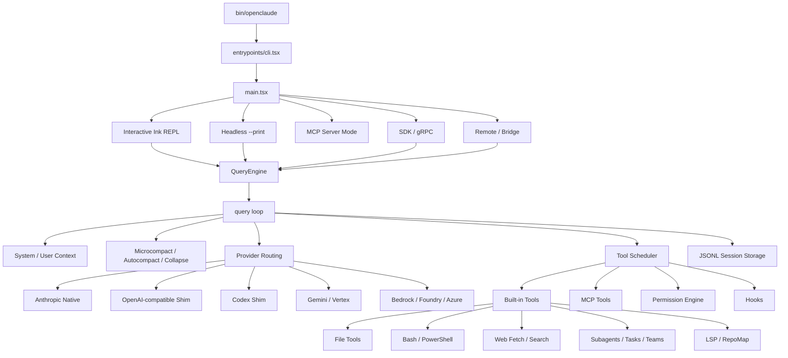

# OpenClaude 详细设计文档

> 文档版本：分析稿 v1.0  
> 分析日期：2026-09-15  
> 分析对象：`C:\Users\Administrator\Desktop\openclaude-main\openclaude-main`  
> 项目版本：`@gitlawb/openclaude 0.30.0`  
> 项目定位：面向任意云模型和本地模型的开源 Coding Agent CLI  
> 运行时：Node.js `>=22`  
> 构建与测试：Bun `1.3.13`  
> 许可证：修改部分声称 MIT，但仓库明确声明衍生自 Anthropic 的专有 Claude Code CLI；完整代码的法律授权状态不明确

## 1. 最重要结论

在分析任何技术细节之前，必须先确认许可证问题。

仓库根目录的 `LICENSE` 明确写明：

```text
This repository contains code derived from Anthropic's Claude Code CLI.
The original Claude Code source is proprietary software.
The project does not have Anthropic's authorization to distribute
their proprietary source.
Users and contributors should evaluate their own legal position.
```

因此：

- 不能仅依据 README 中的 MIT 徽章，把整个仓库都视为可自由复制、修改和再发布的 MIT 项目。
- OpenClaude 自有的“修改部分”声称使用 MIT，但底层衍生代码仍被声明为 Anthropic 版权。
- 如果 Algocode 只借鉴架构思想、接口设计和行为模式，并独立实现，法律风险显著低于直接复制代码。
- 如果 Algocode 直接复用 OpenClaude 源码，尤其是接近 Claude Code 原始结构的部分，必须先进行正式开源许可证和法律审查。
- 本设计文档只记录源码事实，不构成法律意见。

这是整个项目最高级别的风险。下面的架构分析不代表建议直接复用其代码。

## 2. 分析范围说明

OpenClaude 是一个超大型 TypeScript monorepo。`src` 约 3,227 个文件，其中：

- 非测试 TypeScript、TSX、JavaScript 和 JSX 约 2,521 个文件
- 非测试代码约 611,951 行
- `src`、`tests` 和 `scripts` 下约 733 个测试文件
- 测试代码约 204,238 行
- Node.js `>=22`
- 只有 Bun 能直接执行仓库的 build 和 test scripts
- 当前本机没有安装 Bun
- 当前没有 `node_modules`

本次覆盖聚焦：

```text
bin/openclaude
  -> entrypoints/cli.tsx
  -> main.tsx
  -> Command / Interactive / Print / MCP / SDK / gRPC
  -> QueryEngine
  -> query loop
  -> Provider transport
  -> Tool execution
  -> Permission
  -> Session transcript
```

Provider、工具、权限、MCP、插件、Skills、会话和上下文系统会详细展开。Web、VSCode 扩展、所有 UI 组件和全部测试逐行展开，只做结构和职责覆盖。

## 3. 产品定位

OpenClaude 的目标是把 Claude Code 风格的编码 Agent 工作流开放给更多模型和 Provider：

- Anthropic 原生 API
- OpenAI 兼容 API
- OpenAI Responses API
- Codex OAuth 与 Codex 协议
- Google Gemini
- GitHub Models 和 Copilot
- Bedrock、Vertex AI、Azure 和 Foundry
- OpenRouter、Fireworks、Groq、Together、DeepInfra 等网关
- DeepSeek、Qwen、Kimi、GLM、MiniMax、MiMo 等模型
- Ollama、LM Studio、Atomic Chat 等本地后端
- 用户自定义 OpenAI 兼容或 Anthropic 代理端点

它提供：

- 交互式终端 UI
- `--print` 单次或流式非交互模式
- 工具调用和多轮工具循环
- Bash 和 PowerShell
- 文件读、写、编辑和 Notebook 编辑
- Grep、Glob、RepoMap 和 LSP
- Web Fetch 和 Web Search
- MCP 工具、资源、命令和认证
- 子 Agent、并行 Agent、任务和团队
- Skills、Plugins 和 Marketplace
- Hooks 和 Hook Chains
- 会话持久化、恢复、分支和上下文压缩
- 后台会话
- TypeScript SDK
- MCP Server 模式
- gRPC Headless Server
- 远程会话和 Bridge 模式
- 费用、Token 和上下文统计

## 4. 技术栈

| 类别 | 技术 |
|---|---|
| 语言 | TypeScript、TSX、少量 JavaScript |
| 运行时 | Node.js 22 |
| 构建 | Bun、Bun bundle、自定义 build script |
| CLI | Commander |
| 终端 UI | React 19、React Reconciler、Ink 风格渲染层 |
| 参数 Schema | Zod 3 |
| 模型 SDK | Anthropic SDK、OpenAI 兼容 HTTP、Gemini、Bedrock、Vertex、Foundry |
| MCP | `@modelcontextprotocol/sdk` |
| WebSocket | `ws` |
| gRPC | `@grpc/grpc-js` |
| 代码解析 | web-tree-sitter、tree-sitter-wasms |
| 搜索索引 | Orama |
| 文件监听 | Chokidar |
| 子进程 | Execa、cross-spawn、tree-kill |
| 图片 | Sharp |
| 配置 | JSON、JSONC、环境变量、密钥存储 |
| 测试 | `bun test` |

## 5. 仓库结构

| 目录 | 文件数 | 行数 | 职责 |
|---|---:|---:|---|
| `src/utils` | 956 | 269,896 | 基础设施、会话、权限、模型、工具辅助、协议 |
| `src/services` | 369 | 127,246 | API、MCP、Skill、Plugin、Compact、Analytics、Auth |
| `src/components` | 482 | 103,579 | React/Ink 终端 UI |
| `src/tools` | 277 | 63,644 | 全部内置工具 |
| `src/commands` | 297 | 44,064 | Slash Commands 和 CLI 子命令 |
| `src/integrations` | 146 | 33,593 | Provider、模型、网关和品牌描述符 |
| `src/cli` | 57 | 24,964 | 后台会话、Skill CLI、MCP CLI 和任务报告 |
| `src/hooks` | 113 | 20,643 | React Hooks 和权限处理器 |
| `src/ink` | 110 | 20,185 | 终端渲染基础设施 |
| `src/entrypoints` | 31 | 12,608 | CLI、MCP 和 SDK 入口 |
| `src/bridge` | 37 | 12,281 | Remote Bridge 和会话桥接 |
| `src/query` | 15 | 5,872 | Query Loop 辅助状态、预算和 Stop Hooks |
| `src/skills` | 23 | 4,936 | Skill 加载与执行 |
| `src/memdir` | 17 | 4,007 | Memory 目录 |
| `src/tasks` | 16 | 3,933 | 本地、远程和工作流任务 |
| `web` | 71 | 约 700 KB | Astro 文档网站 |
| `vscode-extension` | 21 | 约 200 KB | VS Code 启动集成 |
| `scripts` | 41 | 约 341 KB | 构建、Provider、验证和安全检查 |

代码规模巨大，且包含许多内部功能门控、兼容层和历史包袱。

## 6. 总体架构



## 7. 启动和 CLI 生命周期

### 7.1 启动器

`bin/openclaude` 负责：

- 检查 Node 版本
- 调整 V8 Heap
- 设置 Node 编译缓存
- 定位 `dist/cli.mjs`
- 在模块加载前处理 Heap 和运行时兼容问题

### 7.2 CLI 引导层

`src/entrypoints/cli.tsx` 是轻量 Bootstrap 层，设计目标是减少冷启动模块加载。

快速路径包括：

- `--version`
- `openclaude ps`
- `openclaude logs`
- `openclaude attach`
- `openclaude kill`
- `openclaude skills`
- `--bg`
- `--dump-system-prompt`
- MCP 特殊模式
- daemon worker
- remote-control
- environment-runner
- self-hosted-runner
- tmux + worktree

未命中快速路径后，才加载完整 `main.tsx`。

### 7.3 `main.tsx`

`main.tsx` 约 4,482 行，是整个 CLI 的装配中心：

1. 设置 Windows PATH 安全策略。
2. 注册信号和光标清理。
3. 处理深链接、SSH、Direct Connect 和 Assistant。
4. 判断交互或非交互模式。
5. 设置 Client Type。
6. 加载 Settings。
7. 初始化配置、代理、TLS、清理注册器。
8. 解析 Commander 参数。
9. 建立 Workspace Trust。
10. 加载 MCP、Plugins、Skills 和 Hooks。
11. 接入模型 Profile。
12. 选择交互式 REPL、Print、MCP、SDK 或远程模式。
13. 建立 Session ID 和 JSONL Transcript。
14. 启动 QueryEngine。

### 7.4 工作目录信任

OpenClaude 有 Workspace Trust 概念。在未信任目录中，会限制：

- 项目级 Hooks
- Plugin 的 LSP 和可执行组件
- 项目 `.openclaude` 指令
- 其他可能执行代码的项目配置

`--print` 会跳过信任对话框，文档明确要求只在可信目录使用。

### 7.5 `--bare`

`--bare` 是简化模式，会跳过：

- Hooks
- LSP
- Plugin Sync
- Attribution
- Auto Memory
- 后台预取
- Keychain 读取
- CLAUDE.md 自动发现

显式传入的 System Prompt、MCP、Settings、Agents、Plugins 和 `--add-dir` 仍然生效。

## 8. CLI 主要模式

| 模式 | 入口 | 说明 |
|---|---|---|
| Interactive | Ink REPL | 默认模式 |
| Print | `--print` | 适合脚本和管道 |
| Stream JSON | `--input-format stream-json` | 双向流式协议 |
| MCP Server | `mcp serve` | 把工具暴露给 MCP 客户端 |
| MCP Client | 默认 | 连接外部 MCP Server |
| Native SDK | `src/entrypoints/sdk` | TypeScript SDK |
| gRPC | `scripts/start-grpc.ts` | Headless 双向流服务 |
| Background | `--bg` | 本地子进程后台会话 |
| Remote | remote / bridge | 远程执行和会话桥接 |
| SSH | `ssh` | 通过 SSH 驱动远程 REPL |
| Worktree | `--worktree` | Git Worktree 隔离 |
| Coordinator | Feature Gate | 多 Worker Agent 协调 |
| Daemon Worker | 内部 | 后台监督器和 Worker |

### 8.1 Print 模式

Print 模式支持：

- `text`
- `json`
- `stream-json`
- JSON Schema 结构化输出
- Heartbeat
- 最大 turns
- 最大预算
- 工具 allow / deny
- Session Resume
- Partial Messages
- Hook Events
- Replay User Messages

### 8.2 后台会话

后台会话是本地子进程，不启动独立 Daemon 或网络服务。

命令：

```bash
openclaude --bg "fix failing tests"
openclaude ps
openclaude logs <id-or-name>
openclaude kill <id-or-name>
```

状态和日志保存在：

```text
~/.openclaude/bg-sessions/
```

状态包括 exited、failed、stale 和 killed。Windows 无法推断 POSIX Signal 名称。

## 9. QueryEngine

`src/QueryEngine.ts` 约 1,555 行，提供一个会话级对象。

### 9.1 职责

每个 QueryEngine 对应一个 Conversation，负责：

- 保存当前 Message 列表
- 保存 AbortController
- 保存 Permission Denial
- 保存累计 Usage
- 保存 File State Cache
- 保存 Auto Compact Tracking
- 保存 Skill Discovery 状态
- 执行 Slash Command 处理
- 组建完整 System Prompt
- 调用底层 `query()`
- 将内部 Message 映射为 SDK Message
- 在 Session 中持续存在多个 Turn

### 9.2 一次 `submitMessage`

流程：

1. 创建或保留 AbortController。
2. 清理本轮 Skill Discovery 状态。
3. 设置 CWD。
4. 包装 `canUseTool`，记录拒绝的权限请求。
5. 解析当前 Model、Fallback Model 和 Thinking Config。
6. 获取 Default System Prompt。
7. 获取 User Context。
8. 获取 System Context。
9. 注入 Coordinator Context 和 Memory Mechanics Prompt。
10. 处理 Structured Output Enforcement。
11. 调用 `processUserInput`。
12. 执行 Slash Command。
13. 调用 `query()`。
14. 将内部消息映射为 SDK 消息。
15. 写入 Session Transcript。
16. 更新 Usage、Cost 和状态。

### 9.3 SDK 与 REPL 的区别

QueryEngine 最初用于 Headless 和 SDK 路径。

REPL 保留完整 UI History 和交互状态。SDK 模式更关注：

- 消息流
- 权限回调
- 结构化输出
- Session Persistence
- 无 UI Resource Cleanup

## 10. 主 Query Loop

`src/query.ts` 约 3,204 行，是 Agent Loop 的核心。

### 10.1 状态机

每个 Turn 的主要状态包括：

- messages
- toolUseContext
- autoCompactTracking
- maxOutputTokensRecoveryCount
- reactive compact 是否已尝试
- context overflow 是否已尝试
- provider fallback 是否已尝试
- maxOutputTokensOverride
- providerMaxOutputTokensCap
- pendingToolUseSummary
- stopHookActive
- turnCount
- continuationNudgeCount
- transition
- agentStepLimit

循环内部通过 `State` 对象重建状态，避免使用零散变量。

### 10.2 一轮循环

```text
准备 Context
  -> 工具结果预算
  -> Snip
  -> Microcompact
  -> Context Collapse
  -> Auto Compact
  -> 构建 System Prompt
  -> 决定模型
  -> 发送 Provider 请求
  -> 流式接收 Assistant Blocks
  -> 发现 Tool Use
  -> 流式或批量执行工具
  -> 生成 Tool Result
  -> 检查 Abort
  -> 检查 Stop Hooks
  -> 检查 Token Budget
  -> 决定继续或结束
```

### 10.3 继续条件

以下情况会继续下一轮：

- 模型返回 Tool Use，需要工具结果
- Agent Step Limit 尚未触发最终总结
- Stop Hook 产生 Blocking Error
- Token Budget 允许继续
- 模型输出表明仍有未完成工作
- 自动上下文恢复成功，需要重试

终止原因包括：

- completed
- max_turns
- aborted_streaming
- aborted_tools
- blocking_limit
- model_error
- image_error
- prompt_too_long
- stop_hook_prevented
- hook_stopped
- tool_failure_loop
- agent_step_limit

### 10.4 工具循环保护

项目有多个循环防护：

- Doom Loop：连续相同 Tool 和 Input
- Tool Failure Loop Guard：连续同类失败
- Continuation Nudge 上限：20
- Max Output Token Recovery 上限：3
- Auto Compact 连续失败熔断
- Agent `maxSteps`
- Max Turns

### 10.5 Max Output Token 恢复

当 Provider 返回 `max_output_tokens`：

1. 首次可能把最大输出 Token 从 8k 提升到 64k。
2. 后续注入“继续，从断点接着做”的 Meta 消息。
3. 最多 3 次恢复。
4. 超过上限后把错误返回调用方。

### 10.6 Context Overflow 恢复

当 Provider 返回上下文溢出：

1. 隐藏中间错误，避免 SDK 提前终止。
2. 强制压缩 Conversation。
3. 增加恢复提示。
4. 只重试一次。
5. 仍失败则返回 blocking limit。

### 10.7 Provider Rate Limit 恢复

若配置 `providerFallbackChain`：

1. 隐藏原始 429。
2. 激活下一个 Provider Profile。
3. 更新 Session Model。
4. 重试整个 Turn。
5. 链路耗尽后再暴露 429。

### 10.8 Smart Routing 恢复

Simple Model 调用失败时：

1. 仅对可重试错误触发。
2. 切换到 Strong Model。
3. 本轮后续请求固定到 Strong Model。
4. 记录升级统计。
5. Abort、权限和 4xx 不重试。

## 11. 上下文系统

### 11.1 System Context

`context.ts` 提供会话级缓存上下文：

- Git 状态
- 当前分支
- 主分支
- 最近 5 个 Commit
- Git User
- Repo Map
- 内部 Cache Breaker

Git 状态上限约 2,000 字符，避免大仓库状态淹没 Prompt。

### 11.2 User Context

用户上下文包括：

- CLAUDE.md 或兼容 Memory 文件
- 当前日期
- 项目附加目录
- 自动加载的嵌套 Memory

OpenClaude 声明默认不读取 `~/.claude` 或项目 `.claude`，而是使用 OpenClaude 自己的配置目录。代码内仍存在大量 Claude 命名，这是历史兼容和衍生结构留下的痕迹。

### 11.3 Repo Map

Repo Map 是 OpenClaude 的代码库结构摘要：

1. 用 `git ls-files --cached --others --exclude-standard` 枚举文件。
2. 非 Git 仓库退回目录遍历。
3. 使用 Tree-sitter 解析 TypeScript、JavaScript 和 Python。
4. 提取函数、类、类型、接口和跨文件引用。
5. 建立文件引用图。
6. 边权为引用次数乘 Symbol IDF。
7. 使用 PageRank 排序。
8. 按 Token Budget 渲染签名摘要。
9. 使用路径、mtime 和 size 做磁盘缓存。

默认自动注入关闭，启用后使用 1,024 Token；`/repomap` 默认使用 2,048 Token。首次大仓库构建可能 20 到 30 秒。

局限：

- 只显示 Signature，不显示实现。
- 只支持 TS、JS 和 Python。
- TypeScript 引用捕获不完整。
- WASM Tree-sitter 冷启动成本明显。

## 12. 消息与 Transcript

### 12.1 消息类型

内部消息包括：

- User
- Assistant
- System
- Progress
- Attachment
- Tool Use Summary
- Tombstone
- Compact Boundary
- SDK Result

Tombstone 用于在流式 Fallback 后撤销无效的部分 Assistant Message，尤其是带 Signature 的 Thinking Block。

### 12.2 Session Storage

`sessionStorage.ts` 约 6,196 行，负责：

- JSONL Transcript
- Message Chain
- Sidechain Transcript
- Agent Transcript
- Remote Agent Metadata
- Compact Boundary
- Snip Removal
- Content Replacement
- File History Snapshot
- Attribution Snapshot
- Session Metadata
- Custom Title
- AI Title
- Tags
- PR Link
- Session Search
- Resume
- Fork
- Log 清理和脱敏

### 12.3 会话链

JSONL 中每个消息包含 UUID 和 Parent UUID。恢复时：

1. 读取 JSONL。
2. 找到最新 Compact Boundary。
3. 根据 preserved segment 处理被保留片段。
4. 删除压缩边界前的旧链。
5. 找到最新 Leaf。
6. 从 Leaf 反向构建 Conversation Chain。
7. 移除持久化专用字段。
8. 作为 QueryEngine 初始消息。

### 12.4 Sidechain

Subagent 或并行任务会写入 Sidechain Transcript。主链不直接包含所有内部子 Agent 消息，但可以：

- 按 Agent ID 读取
- 随任务展示
- 用于 Resume
- 用于 SDK 或 UI 回溯

### 12.5 Resume 与 Fork

- `--continue`：继续当前目录最近会话。
- `--resume <id>`：按 Session ID 恢复。
- `--fork-session`：复制历史到新 Session ID，不复制 Git Worktree。
- `--resume-session-at <message-id>`：截断到指定消息。
- `--rewind-files <user-message-id>`：恢复文件状态。

Fork 仅是 Conversation Branch，不是文件系统隔离、Git Worktree 或安全沙箱。

## 13. Compact 与长会话

### 13.1 多层压缩

OpenClaude 有多套 Context 管理机制：

| 机制 | 作用 |
|---|---|
| Tool Result Budget | 超大工具结果转存文件，仅保留预览 |
| Snip | 删除历史中低价值片段 |
| Microcompact | 对旧 Tool History 做较小粒度压缩 |
| Context Collapse | 将上下文折叠为可投影视图 |
| Auto Compact | 接近 Context Window 时生成完整摘要 |
| Reactive Compact | 收到 Prompt Too Long 后紧急压缩 |
| Context Overflow Recovery | Provider 明确报 Context Overflow 后压缩重试 |

顺序通常是：

```text
Tool Result Budget
  -> Snip
  -> Microcompact
  -> Context Collapse
  -> Auto Compact
  -> Provider Request
```

### 13.2 Compact 内容

Compact 会：

- 移除或缩小旧工具结果
- 保留近期 Message
- 注入摘要
- 重建 Message Chain
- 记录 Compact Boundary
- 保留特殊 Segment
- 恢复文件和计划附件
- 更新 Token 和 Cache 统计

### 13.3 熔断

Auto Compact 连续失败后会进入：

- Failure Count
- Cooldown
- Circuit Breaker
- Half-open Retry

若仍然超过安全阈值，系统会停止，而不是继续发送必然超限的请求。

### 13.4 风险

上下文管理非常复杂，涉及缓存一致性、Thinking Signature、Tool Use/Tool Result 配对和 Provider 差异。任何压缩错误都可能导致：

- API 400
- 工具结果孤立
- Thinking Block 失效
- Prompt Cache 失效
- Conversation Chain 损坏

## 14. Provider 和模型集成

### 14.1 Descriptor-first 架构

Provider 系统强调四个分离：

1. Metadata
2. Routing
3. Transport
4. Credentials

主要描述符目录：

- `src/integrations/vendors`
- `src/integrations/gateways`
- `src/integrations/models`
- `src/integrations/brands`
- `src/integrations/anthropicProxies`
- `src/integrations/transport`

描述符通过：

- `defineVendor`
- `defineGateway`
- `defineCatalog`
- `defineModel`
- `defineBrand`
- `defineAnthropicProxy`

声明元数据。

### 14.2 Loader-owned Registration

普通描述符不直接调用 `registerVendor`、`registerGateway` 或 `registerModel`。

流程是：

```text
Descriptor files
  -> integrations:generate
  -> integrationArtifacts.generated.ts
  -> integrations/index.ts
  -> registry
  -> runtime metadata
  -> transport
```

生成产物包含约 60 多个模块和大量模型条目。Registry 使用懒加载，避免启动时加载完整模型目录。

### 14.3 Transport Kinds

常见 Transport：

- `anthropic-native`
- `anthropic-proxy`
- `openai-compatible`
- `local`
- `bedrock`
- `vertex`
- `foundry`
- Codex
- Gemini

Gateway 的 `category` 只用于 UI 分组，不能决定 Transport。实际路由必须依据 `transportConfig.kind`。

### 14.4 OpenAI-compatible Shim

OpenAI Shim 允许主 Query Loop 继续使用 Anthropic SDK 风格调用。

它负责：

- Anthropic Message 转 OpenAI Message
- System Prompt 转换
- Tool Schema 转换
- OpenAI Strict Tool 要求适配
- Response API 或 Chat Completions 选择
- SSE Stream 转 Anthropic Stream Event
- Tool Call 增量拼装
- XML/Text Tool Call 兼容
- DeepSeek、Kimi、GLM、Moonshot 的特殊字段
- Gemini Thought Signature
- Ollama 原生 Chat API
- 多 API Key 凭据池
- Provider 错误分类
- Retry 和 Base URL 自愈
- Header、认证、Azure 和 Bankr 差异
- 图片输入限制
- 流空闲超时
- Prompt Cache 兼容

### 14.5 Codex Shim

Codex Shim 处理：

- Codex OAuth
- Codex Request Format
- Codex Stream 到 Anthropic Stream
- 非流式响应转换
- Codex 专属 Dispatch
- 认证刷新

### 14.6 Gemini

Gemini 路径有：

- API Key
- OAuth
- Thought Signature
- 原生 Gemini Stream 转 Anthropic Stream
- Gemini Vertex Client

### 14.7 Provider Profile

Provider Profiles 保存：

- Route ID
- Base URL
- Model
- Credentials
- Auth Header
- Custom Header
- Fast Mode
- Fallback Chain
- Additional options

README 说明 Profile 可能保存敏感凭据。`/provider` 是推荐配置入口。

### 14.8 兼容层

仍存在多个兼容桥：

- 旧 `APIProvider` 枚举
- `--provider` 环境变量契约
- 旧 Preset 名称
- Provider-specific Profile 摘要
- Startup Banner 推断

文档明确称这些是兼容层，不是理想架构。

## 15. 模型路由

### 15.1 主模型

主模型由以下来源解析：

- CLI `--model`
- Settings
- Provider Profile
- 环境变量
- Provider 默认模型

### 15.2 Fallback Model

`--fallback-model` 用于模型过载时切换。

切换时会：

- 丢弃失败请求的部分 Assistant 消息
- 撤销未完成的 Tool Use
- 清理 Thinking Signature
- 更新 ToolUseContext
- 发送用户可见警告
- 重试

### 15.3 Provider Fallback Chain

Provider 级回退处理 429 等错误。它比 Model Fallback 更重，因为会替换：

- Endpoint
- Credentials
- Model
- Transport

### 15.4 Smart Routing

Smart Routing 是实验功能，默认关闭。

它把每个 User Turn 分类为：

- Simple
- Strong

特点：

- 每 Turn 只决策一次
- 同 Provider 内换模型
- Simple 调用失败时升级 Strong
- 受 Organization Model Allowlist 限制
- Cross-provider 暂不支持
- `/cost` 显示 Routing 统计
- 费用估计基于内置参考价格，不一定等于实际账单

### 15.5 Agent Routing

`agentModels` 和 `agentRouting` 可以把不同 Agent 路由到不同模型。

支持：

- 跨 Provider Agent Model
- 同 Provider Model-only Route
- 内置 Agent Type
- 自定义 Agent
- Agent Tool 显式 `model` 覆盖

若 `api_key` 写在 Settings 中，是明文存储。

### 15.6 Agent Step Limit

自定义 Agent 可设置 `maxSteps`。达到限制后：

- 拒绝后续 Tool Call
- 请求本轮总结
- 要求总结 Completed、Findings、Remaining、Another Run

## 16. Tool 系统

### 16.1 Tool 接口

`Tool.ts` 定义一个完整工具需要：

- `name`
- `aliases`
- `searchHint`
- `call`
- `description`
- `prompt`
- `inputSchema`
- `outputSchema`
- `validateInput`
- `checkPermissions`
- `isEnabled`
- `isConcurrencySafe`
- `isReadOnly`
- `isDestructive`
- `interruptBehavior`
- `maxResultSizeChars`
- `mapToolResultToToolResultBlockParam`
- React/Ink 渲染方法
- Progress 渲染
- Tool Result 渲染
- 错误和拒绝渲染

`buildTool` 提供安全默认值：

- `isEnabled = true`
- `isConcurrencySafe = false`
- `isReadOnly = false`
- `isDestructive = false`
- `checkPermissions = allow`
- `toAutoClassifierInput = ''`

默认并发安全为 false，是保守设计。

### 16.2 内置工具

主要工具：

| 工具 | 能力 |
|---|---|
| Agent | 启动子 Agent |
| TaskOutput | 查看任务输出 |
| Bash | Shell 命令 |
| PowerShell | Windows Shell |
| Read | 读文件、图片和 PDF |
| Edit | 精确文件编辑 |
| Write | 写文件 |
| NotebookEdit | Jupyter Notebook |
| Glob | 文件匹配 |
| Grep | 内容搜索 |
| RepoMap | 仓库结构图 |
| WebFetch | 获取 URL |
| WebSearch | 多 Provider 搜索 |
| TodoWrite | 旧 Todo |
| TaskCreate/Get/Update/List | 新任务系统 |
| TaskStop | 停止任务 |
| AskUserQuestion | 向用户提问 |
| Skill | 执行 Skill |
| EnterPlanMode / ExitPlanMode | Plan Mode |
| EnterWorktree / ExitWorktree | Worktree |
| LSP | Language Server 查询 |
| MCP Resource Tools | MCP 资源和工具 |
| ToolSearch | 延迟加载工具 |
| TeamCreate / TeamDelete | Agent 团队 |
| SendMessage | Agent 之间通信 |
| Workflow | 工作流脚本 |
| Cron Tools | 定时任务 |
| Monitor | 监控 |
| Brief | 简报 |
| Snip | 历史裁剪 |

工具是否启用受：

- Build Feature Flag
- 环境变量
- 权限 Context
- 当前模式
- MCP 状态
- Agent 类型
- Tool Search 延迟加载

影响。

### 16.3 工具池组装

工具池来自：

- Built-in Tools
- MCP Tools
- SDK Injected Tools
- Agent-specific Tool Filter
- Deny Rules
- Mode Filter

排序规则考虑 Prompt Cache：

- Built-in 保持连续前缀
- MCP 与 Built-in 分组
- 同名时 Built-in 优先

### 16.4 工具输入验证

流程：

1. Zod Parse。
2. 对部分兼容输入做规范化。
3. `validateInput`。
4. Tool-specific `checkPermissions`。
5. PreToolUse Hooks。
6. 统一 Permission Engine。
7. Tool `call`。
8. PostToolUse Hooks。
9. Result Storage。
10. Tool Result Mapping。

### 16.5 Tool Result Budget

工具结果可能非常大。系统根据 `maxResultSizeChars`：

- 小结果直接进入上下文。
- 大结果持久化到磁盘。
- 模型只看到预览和文件路径。
- Read Tool 自身已经受限，因此配置为不转存。

### 16.6 并发模型

`runTools` 把 Tool Use 分为 Batch：

- 连续 ConcurrencySafe 工具并行。
- 非安全工具独占串行。

最大并发由：

```text
CLAUDE_CODE_MAX_TOOL_USE_CONCURRENCY
```

控制，默认 10。

`StreamingToolExecutor` 可以边接收模型 Stream 边启动工具：

- 仅安全工具可并行。
- 结果按接收顺序缓冲输出。
- 非安全工具独占。
- Bash 出错会取消并行 Sibling。
- 用户中断只取消声明 `interruptBehavior = cancel` 的工具。
- Streaming Fallback 会 Discard 本轮已启动工具。

### 16.7 Context Modifier

工具可以返回 `contextModifier`：

- 修改 ToolUseContext
- 修改后续工具可见状态

只支持非并发安全工具。并行安全工具的 Context Modifier 当前不支持。

## 17. 权限系统

### 17.1 Permission Modes

公开模式：

- `default`
- `plan`
- `acceptEdits`
- `bypassPermissions`
- `fullAccess`
- `dontAsk`

内部模式：

- `auto`
- `bubble`

| 模式 | 行为 |
|---|---|
| default | 普通权限提示 |
| plan | 限制执行，先规划 |
| acceptEdits | 自动接受安全编辑 |
| bypassPermissions | 绕过权限，危险 |
| fullAccess | 完全访问，危险 |
| dontAsk | Ask 转 Deny |
| auto | 使用 Transcript Classifier |

### 17.2 权限规则

规则来源：

- User Settings
- Project Settings
- Local Settings
- Flag Settings
- Policy Settings
- CLI Arg
- Command
- Session

规则行为：

- allow
- ask
- deny

规则可以只针对 Tool，也可以带内容：

```text
Bash
Bash(git status:*)
mcp__server
mcp__server__tool
Agent(Explore)
```

MCP Server 级规则可一次拒绝对应 Server 的所有工具。

### 17.3 权限决策顺序

高层面顺序：

1. 模式限制。
2. 全拒绝规则。
3. Plan Mode。
4. Tool-specific Permission。
5. Hook Permission。
6. 全 Allow 规则。
7. Sandbox 和 Path 检查。
8. 安全分类器。
9. 用户交互。
10. Headless 时自动拒绝。

### 17.4 Auto Mode

Auto Mode 使用单独模型 Classifier 对 Tool 操作分类。

优点：

- 自动放行部分低风险操作。
- 减少用户确认次数。
- 支持 Headless Agent。

风险：

- Classifier 可能误判。
- Classifier Transcript 过长。
- Classifier API 失败时根据 Gate 可能 Fail-open 或 Fail-closed。
- 重复拒绝后会回退到用户提示或中断。

### 17.5 Headless 权限

当无法显示权限提示时：

- 先运行 PermissionRequest Hook。
- 若 Hook 无决策，则拒绝。
- 只读、安全或已配置规则仍可放行。
- SDK V2 默认“没有 `canUseTool` 或 `onPermissionRequest` 就拒绝全部工具”。

### 17.6 Bash 安全

Bash 安全层检查：

- Command Substitution
- Process Substitution
- Zsh Equal Expansion
- Zsh 危险模块
- Heredoc
- JQ System
- Redirection
- IFS Injection
- Unicode Whitespace
- Control Characters
- Git Commit Substitution
- 路径约束
- 只读命令识别
- Sandbox 使用
- Shell Quote 解析
- Tree-sitter AST

它试图解决 Shell 解析和权限规则绕过问题，但仍然不能替代真正的 OS 沙箱。

## 18. Hooks

### 18.1 Hook 生命周期

常见事件：

- SessionStart
- Setup
- PreToolUse
- PostToolUse
- PostToolUseFailure
- PermissionRequest
- PermissionDenied
- Stop
- TaskCompleted
- Compact 前后
- 其他扩展事件

### 18.2 Hook 能力

Hook 可以：

- 注入额外 Context
- 修改 Tool Input
- Allow 或 Deny
- 阻止继续
- 返回 Stop Reason
- 执行外部命令
- 产生 Progress 或 Attachment Message
- 运行 Hook Chain Action

### 18.3 Hook Chains

Hook Chains 是事件驱动恢复层，默认关闭。

支持 Action：

- `spawn_fallback_agent`
- `notify_team`
- `warm_remote_capacity`

安全机制：

- Max Chain Depth
- Rule Cooldown
- Dedup Window
- Abort 检查
- Policy Check
- 缺少 Team Context 时 No-op
- Bridge 不可用时 No-op

### 18.4 安全风险

Hook 本质上可以执行用户或项目定义的外部命令。因此它是高权限扩展点。

必须信任：

- Hook 文件
- Hook 命令
- Hook 依赖
- Hook 运行环境
- Hook 可访问的凭据

## 19. Agent、Task 和 Team

### 19.1 子 Agent

Agent Tool 可以：

- 启动内置 Agent
- 加载项目 Agent Definition
- 使用独立 System Prompt
- 继承或覆盖 Model
- 设置 Max Steps
- 选择同步、异步或后台运行
- 写入独立 Sidechain Transcript
- 恢复 Agent

内置 Agent 类型可能包括：

- general-purpose
- Explore
- Plan
- code-reviewer
- verification
- statusline-setup

具体可用性受 Feature Gate 影响。

### 19.2 Task 工具

任务系统支持：

- Create
- Get
- Update
- List
- Output
- Stop

适合表示长任务、子任务和可追踪工作。

### 19.3 Team 与 Swarm

Agent Swarms 可以：

- 创建 Team
- 启动多点 Agent
- 分配不同模型
- 通过 SendMessage 通信
- 共享或隔离上下文
- 使用 Coordinator Mode

部分能力只对特定 Build 或 Feature Gate 开放。

### 19.4 Agent 安全

子 Agent 继承或改造以下权限：

- 工作目录
- Permission Mode
- Additional Directories
- Tool Allow/Deny
- Provider Override
- Model Allowlist
- Denial Tracking
- Budget

Headless 或后台 Agent 无法弹出权限对话，因此更多操作会依赖规则和 Hook。

## 20. Skills

### 20.1 Skill 结构

Skill 是包含 `SKILL.md` 的目录。

搜索位置包括：

- 项目 `.openclaude/skills`
- 用户 Skills 目录
- Plugin
- MCP
- `--add-dir`

### 20.2 生命周期

- Discover
- Validate
- Install
- List
- Show
- Remove
- Verify
- Load
- Invoke

模型可以通过 Skill Tool 或 Slash Command 调用。

### 20.3 Registry 安全

Registry 安装会：

- 拒绝无 sha256 的条目
- 检查 revocations
- 对 `SKILL.md` 计算摘要
- 摘要不一致拒绝安装

但要重点注意：

- 摘要只在安装时验证一次。
- 本地 Path 安装不做 Registry 摘要和撤销检查。
- `verify` 读取的是 `skill.json` 中记录的安装摘要，不是当前文件摘要。
- Skill 安装后可以被手工修改，`list` 和 `validate` 不会自动检测内容漂移。
- 文档建议使用第三方 `eyebrow` 生成 Lockfile 并检测变化。

因此 Skill 验证提供的是安装来源保障，不是持续完整性保障。

## 21. Plugins

Plugin Loader 约 3,585 行，支持从：

- NPM
- GitHub
- Git Repository
- Git Subdirectory
- 本地目录
- Marketplace

安装。

Plugin 可以提供：

- Commands
- Agents
- Skills
- Hooks
- MCP Servers
- LSP Servers
- Settings
- Themes 或 UI 扩展

### 21.1 安装

安装流程：

1. 解析 Plugin ID。
2. 解析 Marketplace。
3. 选择版本。
4. 下载或克隆。
5. 校验路径边界。
6. 写入版本化 Cache。
7. 解析 Manifest。
8. 加载组件。
9. 合并 Hooks 和 Settings。

### 21.2 安全边界

Plugin 是高权限供应链组件：

- Hook 可执行代码。
- LSP 可启动进程。
- MCP 可连接网络。
- Command 可以调用本地能力。
- Settings 可以改变行为。

Workspace Trust、Plugin Trust Warning 和 Marketplace 策略降低风险，但不能把普通第三方 Plugin 当作完全可信。

## 22. MCP

### 22.1 作为 Client

OpenClaude 可连接：

- stdio
- SSE
- HTTP
- WebSocket
- SDK MCP
- IDE MCP
- Claude AI Proxy

MCP 提供：

- Tools
- Resources
- Prompts / Commands
- Auth
- URL Elicitation
- Structured Content
- Image 和 Blob Result

### 22.2 作为 Server

入口：

```bash
openclaude mcp serve
```

`entrypoints/mcp.ts`：

- 使用 Stdio Transport
- 暴露 OpenClaude 内置 Tools
- 可选重新暴露已连接 MCP Tools
- 转换 Zod Schema 为 JSON Schema
- 调用同一个 Tool Implementation
- 复用 Permission 检查
- 返回 Text、Image 或错误 Content

MCP Server 当前使用空 Permission Context，工具调用不会得到正常交互式权限确认。因此它更适合受控本地环境，不应直接暴露到不可信网络。

### 22.3 MCP 认证和兼容

MCP Client 处理：

- Auth Cache
- 401 与 Needs Auth
- Session Expired
- Connection Timeout
- Stream 和 HTTP Header
- URL Elicitation
- Result Content 转换
- Resource Blob 超限
- 工具名称 Normalize
- Server Scope
- Policy Filter
- 企业 MCP 配置
- OAuth 和代理

## 23. Web 搜索和 Firecrawl 集成

Web Search Provider Chain 默认 Auto：

```text
Firecrawl
-> Tavily
-> Exa
-> You
-> Jina
-> Brave
-> Bing
-> Mojeek
-> Linkup
-> DuckDuckGo
```

Provider 特点：

- Firecrawl 质量高，需要云端 API Key 或自托管 URL。
- Tavily、Exa、You、Jina、Brave、Bing、Mojeek、Linkup 依赖对应 Key。
- DuckDuckGo 免费但限流，放在最后。

显式指定 Provider 时失败不会静默回退；Auto 模式才逐项回退。取消操作立即抛出，不会继续下一个 Provider。

Firecrawl Client 支持：

- `/v2/search`
- `/v2/scrape`
- 自托管 API URL
- 3 次 Retry
- 指数退避
- 300 秒默认 Tool Timeout
- 只对 502 自动重试

## 24. gRPC Headless Server

`GrpcServer` 提供双向流：

```proto
rpc Chat(stream ClientMessage) returns (stream ServerMessage)
```

Client 消息：

- ChatRequest
- UserInput
- CancelSignal

Server 事件：

- TextChunk
- ToolCallStart
- ToolCallResult
- ActionRequired
- FinalResponse
- ErrorResponse

### 24.1 会话

每个 Stream 维护：

- QueryEngine
- AppState
- File Cache
- Previous Messages
- Session ID
- Pending Permission
- Interrupted 状态

当 Client 提供 Session ID 时，可在不同 Stream 间通过内存 Map 恢复消息。Map 最多保留约 1,000 个 Session，超过后按插入顺序淘汰。

### 24.2 权限

每个 Tool 调用都会：

1. 发送 `tool_start`。
2. 发送 `action_required`。
3. 等待 Client 输入 yes/no。
4. Allow 或 Deny。

### 24.3 安全

默认：

- Host `localhost`
- Port `50051`
- `grpc.ServerCredentials.createInsecure()`

没有内置认证和 TLS。若绑定 `0.0.0.0`，等于把具备本地文件和 Shell 权限的 Agent 暴露给网络。文档也明确不建议无认证对外暴露。

## 25. SDK

### 25.1 SDK V2 会话

`SDKSession` 提供：

- `sendMessage`
- `getMessages`
- `interrupt`
- `close`
- `respondToPermission`

核心保证：

- 一个会话跨多个 Turn 保留状态。
- `close()` 必须显式调用，释放 Permission Queue、Timeout Queue 和 MCP Client。
- 若没有 `canUseTool` 或 `onPermissionRequest`，默认拒绝全部工具。
- Resume 从 JSONL 和 Compact Boundary 恢复。
- MCP Server 在首次 Send 时懒连接。
- Agent Definitions 只加载一次。
- SDK Context 绑定到异步生成器，避免并发 Session 串扰。

### 25.2 SDK 工具

SDK 可以定义自定义 MCP Tool：

- name
- description
- inputSchema
- handler
- annotations
- searchHint
- alwaysLoad

再由 `createSdkMcpServer` 注入 QueryEngine。

### 25.3 SDK 风险

- Session 不 Close 会积累内存。
- Permission Callback 设计错误可能导致过度放行。
- MCP 连接失败当前偏向继续而不是让 Session 整体失败。
- SDK 是 Alpha/Unstable，接口可能变化。

## 26. 配置和凭据

### 26.1 配置位置

默认：

```text
~/.openclaude
~/.openclaude.json
```

环境变量：

```text
OPENCLAUDE_CONFIG_DIR
```

OpenClaude 声明：

- 不自动读取 `~/.claude`
- 不自动读取项目 `.claude/`
- 忽略 `CLAUDE_CONFIG_DIR` 作为 Background Session 存储

但代码中仍大量使用 `CLAUDE_CODE_*` 变量，这是兼容层和衍生代码遗留。

### 26.2 Provider 凭据

支持：

- 环境变量
- `.openclaude-profile.json`
- Settings
- OS Secure Storage / Keychain
- OAuth
- API Key Pool
- Custom Header

风险：

- Settings 中 `api_key` 是明文。
- `.env` 文件默认不自动读取，避免隐式泄漏。
- `--provider-env-file` 才会显式加载。
- Credential Pool 存在多 Key 轮换和冷却策略。
- Debug 和诊断命令需要严格脱敏。

### 26.3 Runtime Debug

大量环境变量控制：

- Max Turns
- Query Hard Max
- Max Retries
- API Timeout
- Heap Limit
- Tool Result Storage
- Tool Concurrency
- Context Window
- Ollama Context
- Stream Idle Timeout
- Extended Keys
- Token Usage Logging
- Web Search Provider
- Telemetry

环境变量数量非常多，说明配置面很广，也说明一致性维护困难。

## 27. 终端 UI

交互层使用 React 19 和自定义 Ink 风格渲染。

包含：

- Message Transcript
- Streaming Text
- Spinner
- Tool Progress
- Permission Dialog
- Diff Preview
- Image Preview
- Markdown 渲染
- Virtual Scroll
- Vim Input
- Keybindings
- Command Palette
- Task Panel
- Agent Panel
- IDE Integration
- Terminal Title
- Clipboard 和图片粘贴
- Notifications

Tool 接口把模型契约和 UI 渲染放在同一个对象中：

- 输入渲染
- 输出渲染
- 错误渲染
- 拒绝渲染
- 进度渲染
- 分组渲染

优点是工具行为和 UI 一致，缺点是复杂 Tool 文件非常大。

## 28. 可观测性和成本

### 28.1 日志与诊断

- Debug Log
- Diagnostics No-PII
- Request Logging
- Interruption Trace
- Token Usage
- Cost Tracker
- Session Report
- Runtime Doctor
- Security Scan Scripts
- Stub Leak Detection

### 28.2 成本

Cost Tracker 跟踪：

- 输入 Token
- 输出 Token
- Cache Read
- Cache Creation
- 模型单价
- Session 总成本
- Turn 成本
- 自定义 Pricing
- Budget

Budget 限制包括：

- `--max-budget-usd`
- Token Budget
- Task Budget
- Agent Max Steps
- Max Turns
- Query Hard Timeout

成本估计依赖模型价格表，第三方网关实际账单可能不同。

## 29. 安全和隐私

### 29.1 主要安全边界

1. Workspace Trust
2. Permission Mode
3. Allow/Ask/Deny Rule
4. Tool-specific Validation
5. Bash / PowerShell Parser
6. Sandbox
7. Path Boundary
8. Hook
9. Auto Classifier
10. Plugin / Skill Verification
11. Provider Credential Isolation
12. Headless Secure Default

### 29.2 高风险能力

OpenClaude 默认可以选择启用：

- 任意 Shell
- 文件读写
- 网络访问
- MCP 外部进程
- Hooks 外部命令
- Browser / Computer Use
- Remote 和 Bridge
- gRPC
- Background Process

这不是普通聊天应用，而是高权限本地自动化运行时。

### 29.3 Telemetry

仓库提供：

- `verify:privacy`
- `verify-no-phone-home`
- Sentry 可选
- Analytics Stub

但第三方 Provider 和第三方搜索/MCP 服务仍会看到请求内容，取决于用户配置。

## 30. 测试和质量保障

测试规模：

- `src`、`tests`、`scripts` 下约 733 个测试文件
- 约 204,238 行测试代码
- 包含 Query、Tool、Provider、MCP、SDK、Permission、Plugin、Session 和 UI 测试
- 测试命令要求 Bun

当前环境：

- Node.js `v25.2.1`
- npm `11.6.2`
- Bun 未安装
- `node_modules` 不存在
- `web/node_modules` 不存在
- VSCode Extension `node_modules` 不存在

因此没有运行：

- `bun install`
- `bun run build`
- `bun run test`
- `bun run typecheck`
- `bun run doctor:runtime`
- Web Build

文档中的行为来自源码和项目文档，不代表本机测试通过。

## 31. 主要设计优点

1. QueryEngine 把会话状态和一次 Turn 的执行分离，适合 SDK 和 CLI 复用。
2. Descriptor-first Provider 架构比大量硬编码 Provider Switch 更易扩展。
3. OpenAI Shimming 让主 Agent Loop 不需要理解所有 Provider 协议。
4. Tool 接口统一了 Schema、权限、执行、结果和 UI。
5. 工具并发有安全和不安全分级。
6. Streaming Tool Executor 可以边生成边执行安全工具。
7. 权限系统支持 Rule、Mode、Hook、Classifier 和交互确认。
8. JSONL Session Chain 支持恢复、分支、Compact 和 Sidechain。
9. MCP 同时支持 Client 和 Server。
10. SDK V2 采用“默认拒绝工具”的安全默认值。
11. Repo Map 用 Tree-sitter 和 PageRank 提供高价值代码结构。
12. 成本、Token 和上下文有多层预算控制。
13. Background、gRPC、Remote 和 Print 模式覆盖多种自动化场景。
14. 对 Prompt Cache、Thinking Signature 和 Provider 差异做了大量工程处理。

## 32. 主要风险和限制

### P0：许可证和衍生代码风险

这是绝对最高风险。仓库承认衍生自 Anthropic 专有 Claude Code 源码，并且声明未获授权分发原源码。不要在没有法律审查的情况下：

- 复制源码
- 修改后闭源发布
- 嵌入商业产品
- 把 README 的 MIT 徽章视为整仓合法许可证
- 声称底层代码是普通 MIT 项目

### P1：代码规模和复杂度极高

约 61 万行非测试源码，2,521 个文件，单文件常见数千行。理解和维护成本非常高。

### P1：测试环境依赖 Bun

项目用 Bun 构建和测试。没有 Bun 时无法执行官方 Contract。Node 只能运行预构建产物，不适合完整验证源码行为。

### P1：本地执行权限极高

Bash、PowerShell、Hooks、MCP、Plugins、LSP 和 Remote 都可以执行外部代码。任何 Prompt Injection 或不可信 Plugin 都可能升级为本地代码执行。

### P1：Hooks 和 Plugins 是供应链边界

项目级 Hook 和 Plugin 来自仓库或 Marketplace。信任对话框只是一层确认，不能替代代码审计、签名和最小权限运行。

### P1：gRPC 默认无 TLS 和认证

虽然默认只绑定 localhost，但一旦改成 `0.0.0.0`，远程攻击者可能调用拥有文件和 Shell 权限的工具。

### P1：Skill Verify 不等于内容完整性

安装摘要只在安装时验证。后续修改 Skill 文件不会自动被 `list` 或 `validate` 发现。必须使用 Lockfile 工具或自行重新 Hash。

### P2：Auto Mode 分类器并非绝对安全

Classifier 可以减少人工审批，但可能误判，且故障时存在 Fail-open 分支。高风险操作不应只依赖分类器。

### P2：Provider 兼容矩阵极大

OpenAI、Gemini、Codex、Bedrock、Vertex、DeepSeek、Kimi、GLM 等请求语义不同。每新增 Provider 都可能增加条件分支和回归风险。

### P2：兼容层和历史命名大量存在

代码仍使用 Claude、Ant、Tengu、`CLAUDE_CODE_*` 等命名，和 OpenClaude 独立品牌之间存在明显漂移。

### P2：功能门控导致文档和实际能力不一致

大量 Feature 仅在特定 Build 或 GrowthBook Gate 下存在。普通用户看到的文档、外部构建和内部构建可能不同。

### P2：Session 和 Context 恢复复杂

Thinking Signature、Compact Boundary、Tool Use Pair、Sidechain 和 Provider 差异共同提高恢复难度。

### P2：SDK 默认拒绝工具是安全设计，但也会带来可用性问题

SDK 开发者必须正确实现 Permission Callback，否则会看到所有工具被拒绝，或者为了省事过度放权。

### P2：Remote、Bridge 和团队能力版本变化快

这些功能依赖外部服务和 Feature Gate，不适合作为 Algocode 第一版的核心依赖。

## 33. 对 Algocode 的可借鉴设计

### 33.1 建议直接借鉴思想

1. **QueryEngine 分离**  
   Algocode 应有独立 `AgentSession`，保存跨 Turn 的会话状态，而不是把所有状态写进命令行函数。

2. **Tool Contract 统一**  
   每个算法优化工具应声明：
   - 输入 Schema
   - 输出 Schema
   - 是否只读
   - 是否并发安全
   - 是否破坏性
   - 权限要求
   - 超时
   - 结果大小
   - 展示摘要

3. **Turn 状态机**  
   明确区分模型请求、工具执行、继续、失败、取消、预算耗尽和最终完成。

4. **JSONL Transcript**  
   使用追加式事件记录：
   - User
   - Assistant
   - Tool Use
   - Tool Result
   - Error
   - Checkpoint
   - Compact Boundary

5. **默认拒绝高风险工具**  
   SDK 或 API 模式下，没有明确授权就不要执行 Shell、写文件和联网操作。

6. **Provider Adapter**  
   将模型访问定义为 Adapter，而不是在业务逻辑中写多层 `if provider == ...`。

7. **Workspace Trust**  
   对应 Algocode 的“项目信任级别”，区分只读分析、允许写入、允许执行和允许联网。

8. **Context Budget**  
   为 System Prompt、历史消息、工具结果和文件内容分配明确 Token 预算。

9. **Repo Map**  
   对算法项目可以先实现轻量版：
   - 文件树
   - 模块依赖
   - 函数和类签名
   - 关键入口
   - Git 状态

10. **结构化诊断**  
   提供 `algocode doctor --json`，输出 Provider、Python、依赖、缓存和权限状态。

### 33.2 改造后借鉴

1. **不要把多 Provider 协议矩阵做得过重**  
   第一版支持一个原生 Provider 和一个 OpenAI-compatible Provider 即可。

2. **不要直接模仿 React/Ink 大型 UI**  
   Algocode 是命令行工具，优先稳定 Output、JSON 和 Rich Table，不必复制数百个 UI 文件。

3. **不实现完整 Plugin Marketplace**  
   先支持本地 Tool 插件和显式配置文件，不自动执行远程 Hook。

4. **MCP 作为可选接口**  
   先把核心 CLI 和 Python API 做好，再接 MCP。

5. **Auto Permission 谨慎使用**  
   如果未来实现自动权限分类，高风险操作应 Fail-closed。

6. **Session Compact 从简单版开始**  
   先做 Tool Result Truncation 和摘要，不要同时实现 Snip、Microcompact、Collapse 和 Reactive Compact。

7. **Remote/gRPC 放后**  
   先让本地会话可靠，再考虑远程服务。

### 33.3 不要借鉴

1. 不要复制衍生源码。
2. 不要默认绕过权限。
3. 不要把 Skill、Plugin 和 Hook 当作可信代码。
4. 不要在没有 TLS 和认证时暴露 gRPC 或 HTTP 服务。
5. 不要用明文 Settings 长期保存高权限模型密钥。
6. 不要实现 200+ Provider 后再思考统一协议。
7. 不要让一个巨型 `main.tsx` 或 `query.ts` 成为唯一装配点。
8. 不要把内部 Feature Gate 当成公开稳定 API。

## 34. 面向 Algocode 的最小落地路线

### 阶段 1：Agent Session 和 Tool Contract

```text
algocode analyze <path>
algocode optimize <target> --budget ...
algocode session list
algocode session resume <id>
```

实现：

- AgentSession
- Turn 状态机
- JSONL Transcript
- Tool 接口
- Read、Search、Run Test、Diff 等只读工具
- 默认拒绝写文件和执行命令

### 阶段 2：受控执行

```text
algocode run-tests <profile> --allow-write
algocode profile ...
```

实现：

- Workspace Trust
- Permission Mode
- Allow/Deny 规则
- 命令超时
- 路径边界
- 输出截断
- 审计日志

### 阶段 3：Provider 和上下文

实现：

- OpenAI-compatible Provider
- 第二个 Provider Adapter
- Tool Result Budget
- Context Compaction
- Cost / Token Tracking
- Fallback Model

### 阶段 4：扩展

按需要增加：

- MCP
- Hooks
- 子 Agent
- Repo Map
- Remote Session
- Plugin

不应为了“像 OpenClaude”而提前实现这些外围能力。

## 35. 最终评价

OpenClaude 是一个功能极其丰富、工程堆叠非常重的 Coding Agent CLI。它最强的部分在：

- QueryEngine 和 Turn 状态机
- Tool Contract
- Provider Shim
- Permission 和 Hook
- JSONL Session
- MCP 和 SDK 双入口
- 上下文压缩和成本控制

它最大的限制不是某个功能没做，而是：

- 代码体量巨大
- 衍生代码许可证风险极高
- Provider 矩阵复杂
- 权限和插件攻击面很大
- 测试依赖 Bun，当前无法验证
- 大量功能受 Feature Gate 和外部服务影响

对 Algocode 来说，正确做法是借鉴其“会话、工具、权限、预算和恢复”设计，用更小的 Python 代码独立实现，而不是直接复用 OpenClaude 源码。Agent 的核心不在 Provider 数量，也不在终端 UI 数量，而在于：

```text
可理解的任务状态
+ 可约束的工具执行
+ 可恢复的会话记录
+ 可追踪的成本
+ 可验证的优化结果
```

这五点才是 Algocode 最应该从 OpenClaude 中提炼并重新实现的部分。
