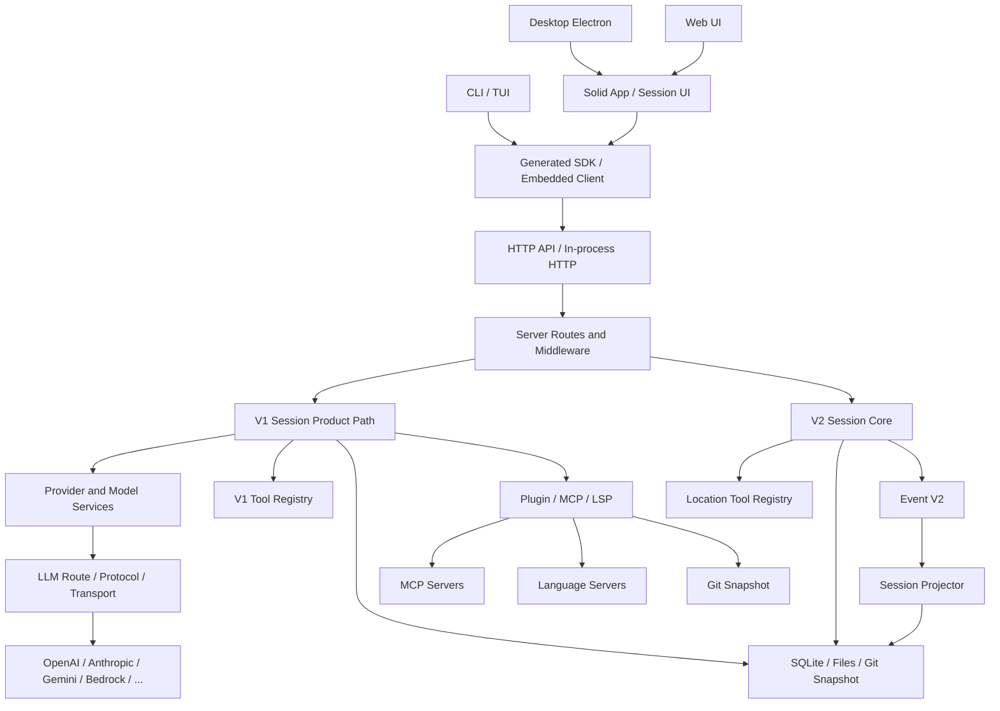
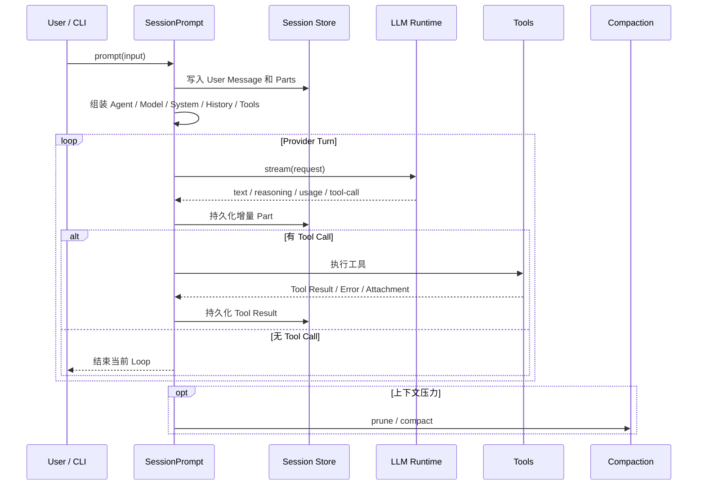

# OpenCode 详细设计文档

> 文档版本：分析稿 v1.0  
> 分析日期：2026-09-15  
> 分析对象：`C:\Users\Administrator\Desktop\opencode-dev\opencode-dev`  
> 项目版本：`1.18.31`  
> 项目定位：开源本地优先 Coding Agent，包含 CLI、TUI、Server、SDK、Desktop、Web、插件和模型路由  
> 主要语言：TypeScript、TSX  
> 运行时与包管理：Bun `1.3.14`  
> 许可证：MIT

## 1. 分析范围与状态声明

OpenCode 是一个处于 V1 到 V2 迁移期的大型 monorepo。分析时必须先区分三个层次：

| 层次 | 当前状态 | 说明 |
|---|---|---|
| V1 产品主链 | 可用且仍是当前完整产品路径 | TUI、CLI、HTTP API、Session Prompt、处理器、工具、插件、MCP 和 Provider 装配 |
| V2 Core | 已实现多个关键切片 | 事件溯源、Location 服务隔离、Session 输入、Projector、Context Epoch、Runner 和 Tool Registry |
| V1 到 V2 对齐 | 尚未完成 | `specs/v2/session.md` 仍列出多个 `partial` 和 `missing` 项 |

因此，不能把 V2 的目标设计直接描述为“OpenCode 已经完整完成的能力”。本设计文档会分别标记：

- **V1 当前实现**
- **V2 已落地切片**
- **V2 后续计划**
- **本次未验证或未执行项**

本次聚焦：

```text
CLI 与 Instance Bootstrap
  -> V1 Session / Prompt / Processor
  -> LLM Runtime
  -> Tool Registry / Permission
  -> Provider / Plugin / MCP / LSP / Snapshot
  -> HTTP API / SDK
  -> V2 Event Store / Input / Projector / Context Epoch
  -> V2 Session Runner / Tool Registry
```

TUI、Desktop、Web 与全部 UI 组件只做结构和职责审阅，不做逐组件、逐行阅读。所有 Provider 协议和测试也不会逐行展开。

## 2. 核心结论

OpenCode 的核心并不是“一个 CLI 调模型”，而是一套本地优先、Server 为中枢、CLI 与 GUI 同权的 Coding Agent 平台。

可以概括为：

```text
OpenCode
  = CLI / TUI / Desktop / Web
  + 本地 Instance Runtime
  + HTTP API 与 Generated SDK
  + V1 Session 产品主链
  + V2 Event-sourced Session 新内核
  + Provider / Model / Endpoint / Variant
  + LLM Schema / Protocol / Transport
  + Tool Registry / Permission
  + Plugin / MCP / LSP / Skill / Snapshot
  + SQLite 与 Worktree 持久化
```

最重要的设计决策：

1. CLI 与 GUI 不直接持有 Agent 核心，它们通过本地 Server、SDK 或 In-process HTTP 访问同一套 API。
2. Session、Message、Part 和 Assistant 状态被显式持久化，允许恢复、分叉、共享、回退和流式事件重放。
3. V1 把 Prompt、Processor、Tool、Compaction、Retry、Snapshot 和 Share 拆成多个 Service，而不是集中在一个无限增长的执行函数中。
4. V2 改用 Event V2：每个 Session 是带连续 `seq` 的事件聚合，Projector 把事件投影成查询模型。
5. V2 引入 Location 概念，把模型、工具、权限、文件系统和插件按项目目录隔离，但 `SessionExecution` 与 `SessionStore` 仍是进程全局。
6. Prompt 输入先进入 durable inbox，再通过 `steer` 或 `queue` 在安全 Provider Turn 边界提升为模型可见历史。
7. Tool V2 使用不透明 `Tool.make`、输入/输出 Codec、单一 Executor、Scope 注册和最新注册覆盖规则。
8. V2 工具调用先持久化，再产生副作用；Provider Turn 广告的注册身份会被保留，过期调用会以 `Stale tool call` 拒绝。
9. Provider 与模型被拆成 Provider、Model、Endpoint、Variant、Capability、Cost 和 Limit。
10. LLM 包把请求构造、协议、端点、认证、framing、transport 和流事件解析拆成正交组件。
11. Permission 和 Provider Policy 都采用有序规则，最后一次匹配胜出。
12. Plugin、MCP、LSP、Snapshot 和 Skills 都通过稳定接口接入，不侵入 Session 主循环。
13. V2 的目标是可靠的事件重放、位置隔离、显式工具结算和可恢复执行，而不是重新造一个更大的 V1 Prompt 类。
14. 当前 V2 仍缺少完整插件请求 Hook、Structured Output、完整引用展开、Provider Retry/Timeout、多节点 Session Ownership 等能力。
15. OpenCode 的工程价值不仅在产品功能，还在于它给出了一条从单体 Agent CLI 迁移到事件溯源 Agent Runtime 的现实路线。

## 3. 产品定位与 Surface

OpenCode 面向：

- 希望使用任意 Provider 的 Coding Agent 用户
- 终端交互用户
- Headless 自动化和脚本调用方
- Desktop 与 Web 用户
- 插件作者
- MCP、LSP、Provider 和 UI 集成方
- 希望嵌入 OpenCode 的第三方应用

### 3.1 主要 Surface

| Surface | 入口 | 职责 |
|---|---|---|
| 交互 CLI/TUI | `opencode`、`opencode run --interactive` | 终端对话、工具状态、权限、提问和会话恢复 |
| 非交互 CLI | `opencode run` | 单次 Prompt、命令、文件附件、JSON 事件输出 |
| Server | `opencode serve` | HTTP API、SSE、WebSocket、PTY、文件和事件 |
| SDK | `@opencode-ai/sdk` | 生成式 Promise 客户端 |
| Embedded | In-process Server + SDK | 不监听网络，复用同一路由、中间件和处理器 |
| Desktop | Electron | 桌面 Shell、Renderer、PTY 与本地能力 |
| Web/App | SolidJS + Vite | 共享 Web UI 与 Desktop Renderer |
| ACP | `opencode acp` | Agent Client Protocol 接口 |
| Plugin | npm、file、built-in | 认证、Provider、TUI 和 Workspace Adapter 扩展 |
| MCP | stdio、SSE、Streamable HTTP | 工具、Prompt、Resource 和 OAuth |

### 3.2 内置 Agent

V1 内置 Agent 包括：

- `build`：默认执行 Agent，可读写和执行工具。
- `plan`：只读规划 Agent，编辑默认拒绝，只允许写计划文件。
- `general`：通用 Subagent。
- `explore`：面向代码库搜索的只读 Subagent。
- `compaction`：内部压缩 Agent。
- `title`：生成会话标题。
- `summary`：生成会话摘要。

Agent 定义包含：

```ts
{
  name
  description
  mode
  native
  hidden
  topP
  temperature
  color
  permission
  model
  variant
  prompt
  options
  steps
}
```

### 3.3 非目标

当前仓库没有把以下能力声明为已完成：

- 稳定的 V2 插件请求 Hook
- V2 Structured Output 与 V1 完全对齐
- V2 Template、`@` mention、媒体与引用完整展开
- V2 Provider Retry、Timeout 和 Watchdog
- V2 多节点执行所有权
- V2 与 V1 完全等价的 Context 装配
- 所有 Provider 在 Native LLM Runtime 上可用

## 4. 技术栈

| 类别 | 技术 |
|---|---|
| 语言 | TypeScript、TSX |
| Runtime | Bun `1.3.14` |
| Monorepo | Bun Workspaces |
| 并发与资源 | Effect 4 `4.0.0-beta.83` |
| Schema | Effect Schema、Zod 4 |
| Database | SQLite、Drizzle ORM |
| HTTP | Effect HttpApi、Hono、OpenAPI |
| Server Middleware | Authorization、Location、Session Location、Fence、Workspace Routing |
| LLM 通用层 | AI SDK 6、自研 `@opencode-ai/llm` |
| Provider | OpenAI、Anthropic、Google、Bedrock、Azure、OpenRouter、Copilot 等 |
| MCP | `@modelcontextprotocol/sdk` |
| LSP | 多语言 Server 启动与 JSON-RPC |
| TUI | SolidJS、OpenTUI |
| Web/Desktop UI | SolidJS、Vite、Tailwind、Kobalte |
| Desktop | Electron、electron-vite、electron-builder |
| Terminal | node-pty |
| Watcher | Parcel Watcher、Chokidar |
| Snapshot | 独立 Git object database |
| Testing | `bun test`、Playwright、HTTP Recorder |
| Lint | oxlint |
| Typecheck | `tsgo` |

## 5. 仓库规模

统计范围为仓库全部文件，排除 `.git` 和 `node_modules`。数值来自本次本地快照。

| 指标 | 数值 |
|---|---:|
| 文件总数 | 6,626 |
| 文本行数 | 1,138,492 |
| 总大小 | 131,876,912 bytes |
| 约合大小 | 125.8 MiB |

主要 `src` 目录规模：

| 包 | `src` 文件数 | `src` 行数 | 覆盖级别 |
|---|---:|---:|---|
| `app` | 481 | 152,345 | 结构审阅 |
| `opencode` | 408 | 83,563 | 核心精读 |
| `ui` | 1,682 | 36,893 | 结构审阅 |
| `tui` | 185 | 33,717 | 结构审阅 |
| `core` | 322 | 33,656 | 核心精读 |
| `session-ui` | 114 | 21,424 | 外围审阅 |
| `llm` | 56 | 9,533 | 核心精读 |
| `desktop` | 126 | 8,526 | 结构审阅 |
| `web` | 681 | 8,293 | 外围审阅 |
| `codemode` | 26 | 6,897 | 外围审阅 |
| `client` | 12 | 4,654 | 接口级审阅 |
| `schema` | 64 | 3,387 | 核心 Schema 审阅 |
| `effect-drizzle-sqlite` | 19 | 3,238 | 结构审阅 |
| `plugin` | 37 | 2,341 | 接口级审阅 |
| `server` | 28 | 1,682 | 结构审阅 |
| `protocol` | 22 | 1,582 | 接口级审阅 |

## 6. 总体架构



### 6.1 运行边界

OpenCode 同时存在三类边界：

1. **进程边界**：CLI、Server、Desktop Main、Desktop Renderer、MCP 子进程。
2. **协议边界**：HTTP、SSE、WebSocket、MCP stdio、LSP stdio、Electron IPC。
3. **Location 边界**：项目目录和 Workspace 决定有效的模型、工具、权限、文件系统和插件。

### 6.2 服务布局

- **Global Service**：进程级共享，例如 Database 和 Event V2。
- **Location Service**：按目录或 Workspace 缓存，例如 Model、Tool Registry、Plugin、Snapshot。
- **Session Service**：V2 `SessionStore` 和 `SessionExecution` 当前是进程全局，但读取的数据通过 Session Location 路由。
- **Surface Service**：TUI、SDK、HTTP、Desktop 只负责交互和传输。

## 7. CLI 与 Instance Bootstrap

### 7.1 CLI 入口

`packages/opencode/src/index.ts` 使用 yargs 注册：

- `run`
- `serve`
- `tui`
- `attach`
- `acp`
- `agent`
- `providers`
- `models`
- `mcp`
- `plugin`
- `session`
- `export`、`import`
- `github`、`pr`
- `web`
- `debug`
- `db`

全局选项包括：

- `--print-logs`
- `--log-level`
- `--pure`

`--pure` 会设置 `OPENCODE_PURE=1`，禁用外部插件。

### 7.2 Bootstrap

CLI 命令通过 `bootstrap()`：

```text
InstanceRuntime.load({ directory })
  -> context.provide(ctx, callback)
  -> finally disposeInstance(ctx)
```

这保证每个命令在明确的实例上下文中运行，并在结束时释放 Watcher、Database、服务缓存和子进程。

### 7.3 `opencode run`

`opencode run` 支持三类模式：

| 模式 | 行为 |
|---|---|
| 默认非交互 | 发送 Prompt，消费事件流，Session 空闲后退出 |
| `--interactive` / `--mini` | 启动分屏 Footer 的直接交互模式 |
| `--attach` | 连接已经运行的 Server |

主要参数：

- `--command`
- `--continue`
- `--session`
- `--fork`
- `--share`
- `--model provider/model`
- `--agent`
- `--format default|json`
- `--file`
- `--title`
- `--attach`
- `--dir`
- `--port`
- `--variant`
- `--thinking`
- `--auto`

### 7.4 Runtime Boot

交互模式启动时会并发解析：

- TUI Keymap 和 diff 样式
- Provider 列表
- 模型 Variant
- Context Limit
- Session 历史和当前 Variant

这些数据在首帧之前汇总，减少启动后的界面跳变。

### 7.5 生命周期

`runtime.lifecycle` 负责：

- 绑定 SDK 与 Server
- 启动和关闭 Relay
- 订阅 Session Event
- 恢复 Session
- 终止活跃 Prompt
- 释放交互 UI 和 PTY

## 8. V1 Session、Prompt 与 Processor

V1 是当前完整产品主链。

### 8.1 Session Service

`packages/opencode/src/session/session.ts` 管理：

- Session 创建、分叉和删除
- 子 Session 查询
- Global Session 列表和归档
- Title、Metadata、Permission 和 Workspace
- Revert 和 Summary
- Message、Part 的增删改查
- Part Delta
- Snapshot Diff

Session 信息包含：

```ts
{
  id
  slug
  version
  projectID
  directory
  path
  workspaceID
  parentID
  title
  agent
  model
  metadata
  cost
  tokens
  time
  permission
  revert
}
```

### 8.2 Message 与 Part

V1 Message 分 User 和 Assistant。Assistant 包含：

- Parent User Message
- Agent
- Model
- Variant
- Path
- Provider Error
- Finish Reason
- Cost
- Tokens

Part 类型包括：

- text
- file
- reasoning
- tool
- step-start
- step-finish
- snapshot
- patch
- compaction
- subtask

`message-v2.ts` 负责把持久化 Part 转成 AI SDK Model Messages。

它处理了几类关键兼容问题：

1. 不同 Provider 对 Tool Result 中媒体支持不同。
2. 不支持媒体 Tool Result 的 Provider 会把附件转成额外的 User Message。
3. `compacted` Tool Output 替换成 `[Old tool result content cleared]`。
4. Pending/Running Tool Call 在恢复时必须补成失败结果，避免 Anthropic 收到悬空 `tool_use`。
5. Assistant 发生模型切换时，移除不可复用的 Native Provider Metadata。
6. Anthropic 的 signed reasoning 结构在重放时保留必要分隔符。

### 8.3 Session Prompt

`SessionPrompt` 是 V1 的核心编排器，职责包括：

- 解析 Prompt Part
- 解析 `@file` 和 `@agent`
- 确保 Session Title
- 组装 System Prompt 和 Instructions
- 选择 Agent 和 Model
- 创建 User、Assistant Message
- 创建子 Agent Task
- 执行 Shell
- 运行 LLM Loop
- 处理 Tool Call
- 处理 Permission 和 Question
- 触发 Compaction
- 处理 Retry
- 写 Snapshot 和 Summary
- 更新 Cost 和 Tokens

### 8.4 V1 Prompt Loop



### 8.5 Session Processor

`SessionProcessor` 订阅统一的 `LLMEvent`。这些事件来自：

- Native LLM Runtime
- AI SDK Adapter

它把 Provider 中立事件转换为 V1 Message Parts：

- reasoning start/delta/end
- tool input start/delta/end
- tool call
- tool result
- tool error
- text start/delta/end
- step finish
- finish
- provider error
- usage

Processor 还实现：

- Doom Loop 检测：连续 3 次相同工具和相同输入会触发 `doom_loop` 权限请求。
- Snapshot：LLM 流启动前捕获初始 Snapshot。
- Attachment 归一化：过大的图片会尝试缩放。
- Tool Deferred 结算：确保每个 Tool Call 都有完成或失败状态。
- Abort 和 Interrupt 清理。

### 8.6 System Prompt 与 Instruction

System Prompt 按模型家族选择不同模板：

- Anthropic
- GPT
- GPT Astra
- Codex
- Gemini
- Kimi
- Meta/Muse
- Trinity
- Beast
- Default

Environment 部分注入：

- 当前模型
- Provider/Model ID
- Working Directory
- Workspace Root
- 是否 Git 仓库
- 平台
- 当前日期
- Project References

Instruction Service 加载：

- Global `AGENTS.md`
- Global `~/.claude/CLAUDE.md`
- 向上查找的项目 `AGENTS.md`
- `CLAUDE.md`
- 已废弃的 `CONTEXT.md`
- 配置中的本地 Glob
- 配置中的远程 URL

首次读取某文件时，还会从文件目录向上发现附近 Instructions，并在当前消息中只附加一次。

### 8.7 V1 Compaction

V1 Compaction 的关键参数：

```text
TOOL_OUTPUT_MAX_CHARS = 2,000
PRUNE_MINIMUM = 20,000
PRUNE_PROTECT = 40,000
MIN_PRESERVE_RECENT_TOKENS = 2,000
MAX_PRESERVE_RECENT_TOKENS = 15,000
```

处理流程：

1. 检测 Token 是否超出可用 Context。
2. 对旧 Tool Output 做 prune。
3. 将历史切成 Turn。
4. 保留最近预算内的 Tail。
5. 必要时拆分单个 Turn。
6. 生成压缩 Summary。
7. 写入 `tail_start_id`。
8. 压缩后决定是否自动继续。

Overflow 恢复只允许一次，防止循环 Compaction 和重复副作用。

### 8.8 V1 Revert 与 Snapshot

Snapshot Service 为项目创建独立 Git Directory：

```text
--git-dir <global-data>/snapshot/<project>/<worktree-hash>
--work-tree <worktree>
```

特点：

- 复用原仓库 object database。
- 支持大仓库避免重建全部 Hash。
- 使用 Semaphore 对 Snapshot Git 操作加锁。
- 支持 Track、Patch、Restore、Revert、Diff 和 Full Diff。
- Snapshot 保留 7 天。
- 忽略项会同步到 Snapshot 专用 `info/exclude`。

## 9. V2 Event Store、Input、Projector 与 Session Runner

V2 是下一阶段核心。

### 9.1 Event V2

每个事件包含：

```ts
{
  id
  type
  data
  durable?: {
    aggregateID
    seq
    version
  }
  location?
  metadata?
}
```

保证：

- Aggregate ID 明确。
- 每个 Aggregate 的 `seq` 严格连续。
- Durable Event 与 Projector 在同一 SQLite Transaction 中提交。
- 重复 ID 被拒绝。
- Replay 顺序必须匹配。
- 相同 Replay 内容幂等。
- 不同内容触发 `Replay diverged`。
- Owner Claim 可约束 Projection Replay 的归属。
- Durable Stream 先 Replay 历史，再监听尾部的 Advisory Wake。

事件类型使用 Typed Definition 和 Versioned Type，避免直接消费无结构 JSON。

### 9.2 Session Input

Prompt 不是立刻进入模型历史，而是先 Durable Admit：

```text
PromptAdmitted
  -> session_input 行
  -> delivery = steer | queue
  -> promoted_seq 为空
```

提升阶段发布 `Prompted`：

- `steer`：下一次安全 Provider Turn 边界提升。
- `queue`：当前 Drain 本应空闲时，每次只提升一条。

`resume: false` 只 Admit，不启动执行。

### 9.3 Session Projector

Projector 订阅 Durable Session Event 并更新：

- Session Table
- Message Table
- Part Table
- Session Input Table
- Session Message V2 Table
- Usage、Cost 和 Token
- Revert 状态
- Compaction 状态

它不修改原始事件，Projection 是可重建的查询视图。

### 9.4 Context Epoch

Context Epoch 解决 Provider Prompt Cache 与动态 Context 的矛盾。

- Baseline System Context 在 Epoch 开始时不可变。
- Process 重启后复用同一 Baseline。
- 动态变化不重写 Baseline，而是发布 Mid-Conversation System Message。
- Context Snapshot 与 System Message 原子推进。
- Compaction 后生成新的 Baseline。
- Session Move 清除当前 Epoch。
- 不可用 Context 使用 stale-while-revalidate 语义。

### 9.5 Session Runner

V2 Runner 的目标是“对一个已经持久化的 Session 做一次本地 continuation”，而不是重新实现 V1 Prompt 单体。

核心流程：

```text
检查 pending steer / queue
  -> 处理中断的 Tool
  -> 读取 Session 和 Location
  -> 初始化或协调 Context Epoch
  -> 解析 Model
  -> 加载 Projected History
  -> Materialize Tools
  -> 构造 LLMRequest
  -> 必要时 Compaction
  -> 捕获初始 Snapshot
  -> llm.stream(request)
  -> 持久化每个 Assistant 和 Tool Event
  -> 立即启动本地 Tool 执行 Fiber
  -> 等待全部 Tool Settlement
  -> 重新加载 History
  -> 继续下一次 Provider Turn
```

### 9.6 Session Run Coordinator

每个 Session 在本进程内串行执行：

- 相同 Session 的 Resume 会 Join 当前 Drain。
- Wake 会合并。
- 不同 Session 可以并发。
- Interrupt 停止当前 Drain，但不删除 Durable Inbox。
- 进程重启后 Active Registry 为空。

### 9.7 V1/V2 差异

| 维度 | V1 | V2 |
|---|---|---|
| Session 真值 | Message/Part 表 | Session Event Aggregate |
| 输入 | 直接写 User Message | Durable Inbox，后提升 |
| 执行 | Prompt 单体编排 | Runner + Collaborators |
| Context | 每轮组装 | Context Epoch + Baseline + Chronological Update |
| Tool | AI SDK Tool + V1 Registry | Opaque Tool + Codec + Scoped Registry |
| 副作用顺序 | Tool Call 与工具执行交错 | 先持久化调用，再执行 |
| 隔离 | Instance/Project | Location-scoped Services |
| 恢复 | Session History | Durable Event + Projected History |
| 扩展状态 | 多个 V1 Hook | V2 Hook 仍在补齐 |

## 10. V2 Tool API、Registry 与输出管理

### 10.1 Tool Definition

V2 Tool 是不透明值：

```ts
Tool.make({
  description,
  input,
  output,
  structured,
  toStructuredOutput,
  execute,
  toModelOutput,
})
```

外部只能看到 `Definition<Input, Output>`。工具没有固有名称，名称在注册时指定。

### 10.2 注册规则

```text
Application Tool
  < Location Tool
  < 最新有效注册
```

规则：

- 最新注册覆盖旧注册。
- Scope 关闭只删除自己的注册。
- 删除最新注册后，会恢复上一个注册。
- 工具值可复用，但注册 Record 会捕获。
- 工具名采用保守的 Provider 中立 Grammar。
- Application Tool 与 Location Tool 使用相同 `register` 操作，但 Authority 不同。

### 10.3 Materialization 与 Stale Rejection

Provider Turn 开始时：

1. 计算有效工具集合。
2. 把 Tool Definition 广告给模型。
3. 捕获每个名字对应的注册 Identity。

Tool Call 回流后：

- 如果名字不存在，返回 `Unknown tool`。
- 如果注册已经被替换，返回 `Stale tool call`。
- 只有 Identity 完全匹配才会执行当前 Handler。

这避免模型调用了旧 Catalog，但运行到新版本工具的情况。

### 10.4 Tool Execution

```text
Resolve Registration
  -> Decode Input
  -> Execute
  -> Encode Output
  -> Project Model Output
  -> Bound Output
  -> Persist Settlement
```

失败语义：

- `ToolFailure`：模型可见的可恢复错误。
- Interruption：取消，不算 Tool Result。
- Unexpected Error/Defect：Runner 级操作失败。
- Unknown、Invalid、Stale：模型可见 Settlement Error，不调用 Handler。

### 10.5 Output Bounding

默认限制：

```text
MAX_LINES = 2,000
MAX_BYTES = 50 KiB
RETENTION = 7 days
```

超限时：

- 完整文本写入全局 Tool Output 目录。
- 模型只收到前后 Preview 和文件路径。
- Structured 数据保留。
- Media 不受通用文本截断影响。
- 写入失败时 Settlement 操作失败，不产生“有损成功”。

## 11. Permission、Agent 与 Provider Policy

### 11.1 V1 Permission

V1 Permission 规则包含：

```ts
{
  permission: string
  pattern: string
  action: "allow" | "ask" | "deny"
}
```

`evaluate()` 从合并后的 Ruleset 中 `findLast()`。这意味着最后匹配的规则胜出。

默认 Agent 权限包括：

- 全局 `* = allow`
- `doom_loop = ask`
- External Directory 默认 `ask`
- `question` 默认拒绝，Build Agent 允许
- `plan_enter`、`plan_exit` 默认拒绝
- `.env` 读取默认 Ask

权限请求会发布 `Asked` 事件并等待 `Deferred`。

Reply 语义：

- `once`：只允许当前请求。
- `always`：把请求中的 `always` Pattern 持久化为 Session 级 Approval。
- `reject`：拒绝当前 Session 内所有 Pending Request。

### 11.2 V2 Permission

V2 Rule：

```ts
{
  action: string
  resource: string
  effect: "allow" | "deny" | "ask"
}
```

评估顺序：

1. Agent 规则。
2. 项目级保存的 Approval。
3. 多个 Resource 中出现 Deny 则 Deny。
4. 否则出现 Ask 则 Ask。
5. 否则 Allow。

重要规则：

- Denied 永远不能被 Saved Approval 覆盖。
- `always` 只保存显式 `save` Resource。
- 一个请求的 `always` 可以自动解锁同一 Session 中满足相同规则的其他 Pending Request。
- 缺失 Agent 时默认使用 `build`，而不是空规则集。

### 11.3 Provider Policy

Provider Policy 使用：

```ts
{
  action: "provider.use"
  resource: "<provider-id>"
  effect: "allow" | "deny"
}
```

评估规则：

- Action 和 Resource 都支持 Wildcard。
- 最后匹配胜出。
- 未匹配时由调用方给出 Fallback，Provider 使用 `allow`。
- 配置文件内保持书写顺序。
- 多个配置文档反向读取，用户全局策略可以阻止仓库重新启用被用户禁用的 Provider。
- 未来组织策略追加到最后。

这替代了旧版 `enabled_providers` 和 `disabled_providers`。

## 12. Provider、Model、Variant 与 Endpoint

### 12.1 Provider

V2 Provider Schema 包含：

- ID
- Name
- Disabled
- API 类型
- Endpoint
- Settings
- Request Headers/Body
- Integration ID

Provider 类型分为：

- AI SDK Provider
- Native Provider

### 12.2 Model

V2 Model 包含：

- ID
- Provider ID
- Family
- Name
- API
- Capabilities
- Request Options
- Variants
- Release Time
- Cost
- Status
- Enabled
- Context/Input/Output Limit

Capability 明确描述：

- 是否支持 Tools
- 输入媒体类型
- 输出媒体类型

### 12.3 Endpoint

支持的 Endpoint 语义包括：

- OpenAI Responses
- OpenAI Chat Completions
- OpenAI-compatible HTTP
- Anthropic Messages
- AI SDK
- Unknown

Native Endpoint URL 是完整 URL，Route Builder 会拆分 Base URL 与 Path。AI SDK URL 保持 Base URL 语义。

### 12.4 Variant

Variant 是一种命名的模型请求覆盖，常用于：

- Reasoning Effort
- Thinking Budget
- Prompt Cache Key
- Provider-specific options
- Headers
- Body overlay

Session、Agent 和用户选择都可以影响 Variant，但当前 Runner 只能映射其已支持的部分。

## 13. LLM Client、Protocol、Transport

`@opencode-ai/llm` 是一个独立于 Session 的 Schema-first LLM Core。

### 13.1 Canonical Model

包内共享：

- LLMRequest
- Message
- Content Part
- Tool Definition
- Tool Call
- Tool Result
- Generation Options
- Provider Options
- HTTP Options
- Usage
- LLMEvent
- LLMResponse
- LLMError

### 13.2 Route 四轴

一个 Route 由以下部分组成：

| 组件 | 职责 |
|---|---|
| Protocol | 请求 Body 构造、Body Schema、流事件 Schema、事件状态机 |
| Endpoint | Base URL、Path、Query |
| Auth | Bearer、API Key Header、SigV4、自定义签名 |
| Framing | SSE、AWS Event Stream 等 Frame 切分 |
| Transport | HTTP JSON、WebSocket JSON |
| Defaults | Headers、Limits、Generation、Provider Options、HTTP Overlay |

这就是 DeepSeek、Together、Cerebras、Groq、Fireworks 等可以共用 OpenAI Chat Protocol 的原因。

### 13.3 编译与执行

```text
LLMRequest
  -> resolve route/model/request defaults
  -> protocol.body.from(request)
  -> validate body schema
  -> endpoint render
  -> auth
  -> transport prepare
  -> HTTP/WebSocket execute
  -> framing
  -> protocol event decode
  -> protocol stream state machine
  -> LLMEvent
```

`LLMClient.prepare()` 会完成到 Transport 前的编译，但不发送网络请求，便于测试和检查。

### 13.4 请求重试与错误归一化

Request Executor 对以下状态进行 Retry：

- 429
- 503
- 504
- 529

默认最多重试 2 次：

- 基础延迟 500ms。
- 指数退避。
- 最大延迟 10s。
- 优先使用 `Retry-After` 或 `Retry-After-Ms`。

错误被归类为：

- Authentication
- Content Policy
- Quota Exceeded
- Rate Limit
- Invalid Request
- Provider Internal
- Transport
- Unknown Provider

### 13.5 日志脱敏

Executor 会脱敏：

- Authorization
- API Key
- Access Token
- Refresh Token
- Secret
- Credential
- Signature
- AWS Signature
- Query 中的 `key` 和 `sig`

不仅按字段名脱敏，还会收集实际发送的 Secret Value，防止 Provider 在响应中回显。

### 13.6 Prompt Caching

默认 `cache: "auto"`：

- Anthropic：最多 3 个显式 Cache Breakpoint。
- Bedrock：最多 3 个 `cachePoint`。
- OpenAI：依赖隐式缓存，不显式插入。
- Gemini：默认隐式缓存。

自动断点通常位于：

- 最后一个 Tool Definition
- 最后一段 System
- 最新 User Message

最新 User Message 断点让同一工具循环中的后续 Provider Turn 复用前缀。

### 13.7 V1 Session 与 LLM 包的接缝

V1 `session/llm.ts` 可以在两种 Runtime 中选择：

1. Native LLM Runtime
2. AI SDK Runtime

Native 支持范围较窄：

- OpenAI Responses
- OpenAI Chat / OpenAI-compatible Chat
- Anthropic Messages
- 指定 AI SDK Provider

不支持的 Provider 会记录原因并回退到 AI SDK。

## 14. HTTP API、SDK 与 Embedded

### 14.1 HttpApi

Public API 由 Effect HttpApi 定义，分为：

- Root API
- Control API
- Control Plane API
- Global API
- Event API
- Instance API
- PTY Connect API

Instance API 包含：

- Config
- Experimental
- File
- Instance
- MCP
- Project
- Project Copy
- PTY
- Question
- Permission
- Provider
- Session
- Sync
- TUI
- Workspace

### 14.2 Session API

主要端点包括：

| 操作 | 路径 |
|---|---|
| List | `GET /session` |
| Status | `GET /session/status` |
| Get | `GET /session/:sessionID` |
| Children | `GET /session/:sessionID/children` |
| Todo | `GET /session/:sessionID/todo` |
| Diff | `GET /session/:sessionID/diff` |
| Messages | `GET /session/:sessionID/message` |
| Message | `GET /session/:sessionID/message/:messageID` |
| Create | `POST /session` |
| Delete | `DELETE /session/:sessionID` |
| Update | `PATCH /session/:sessionID` |
| Fork | `POST /session/:sessionID/fork` |
| Abort | `POST /session/:sessionID/abort` |
| Share | `POST /session/:sessionID/share` |
| Summarize | `POST /session/:sessionID/summarize` |
| Prompt | `POST /session/:sessionID/message` |
| Prompt Async | `POST /session/:sessionID/prompt_async` |
| Command | `POST /session/:sessionID/command` |
| Shell | `POST /session/:sessionID/shell` |
| Revert | `POST /session/:sessionID/revert` |
| Unrevert | `POST /session/:sessionID/unrevert` |
| Permission Reply | `POST /session/:sessionID/permissions/:permissionID` |

Message 分页返回：

- `Link` Header
- `X-Next-Cursor`
- Opaque Cursor

### 14.3 V2 Public Session API

V2 规范中的 `SessionClient` 已形成独立设计：

- `sessions.prompt(..., resume?)`
- `sessions.interrupt`
- `sessions.active`
- `sessions.messages`
- `sessions.context`
- `sessions.events`
- `sessions.history`
- `sessions.switchAgent`
- `sessions.switchModel`

`events.subscribe()` 是实例级 live stream，不提供 Replay。  
`sessions.events()` 是单个 Session 的 Durable Stream，可以按 `seq` 恢复。

### 14.4 SDK

SDK 方案使用 SDK Contract IR 生成：

- Promise Client
- Effect Client
- 共享 Endpoint 和 Transport Metadata
- Encoded/Decoded Type Projection

Promise Client 直接返回 Unwrapped Value，流式方法返回 Lazy `AsyncIterable`。Effect Client 返回 `Effect` 和 `Stream`，由调用方提供 `HttpClient`。

### 14.5 Embedded OpenCode

Embedded OpenCode：

- 不监听端口。
- 在进程内执行 HTTP Router。
- 复用中间件、Codec、Handler 和错误。
- 通过 Scoped Layer 管理生命周期。
- 与 Network Client 使用同一 Client Interface。

## 15. Plugin、MCP、LSP、Skills 与 Snapshot

### 15.1 Plugin

插件来源：

- Built-in
- File
- npm
- Deprecated replacement built-in

加载流程：

```text
Config Origin
  -> Normalize Spec
  -> Resolve Target
  -> Detect Server/TUI Entry
  -> Compatibility Check
  -> Dynamic Import
  -> Apply Plugin
  -> Register Hook
```

内置插件负责：

- OpenAI Codex OAuth/WebSocket
- GitHub Copilot
- Modal
- GitLab
- Poe
- Cloudflare
- Azure
- DigitalOcean
- Snowflake Cortex
- xAI
- Cerebras

外部 Plugin 顺序确定，加载失败会发布 Session Error。Plugin Hook 支持：

- `config`
- `event`
- `dispose`
- `tool.execute.before`
- `tool.execute.after`
- `experimental.chat.system.transform`
- `experimental.chat.messages.transform`
- `experimental.session.compacting`
- `experimental.compaction.autocontinue`

### 15.2 MCP

支持 Transport：

- stdio
- Server-Sent Events
- Streamable HTTP

MCP 能力：

- Tools
- Prompts
- Resources
- Resource Templates
- Instructions
- OAuth
- Client Registration
- Token 持久化

MCP Resource 工具会做：

- Server Capability 检测。
- 权限检查。
- Resource 列表。
- Template 读取。
- 10 MiB Blob 限制。
- PDF、GIF、JPEG、PNG、WebP 附件支持。
- 输出截断和路径管理。

### 15.3 LSP

LSP Server Registry 支持：

- Deno
- TypeScript
- Vue
- ESLint
- Oxlint
- 更多语言 Server

启动逻辑包括：

- 按文件扩展名选 Server。
- 向上寻找项目 Root。
- 排除文件。
- 自动发现或下载某些 Server。
- JSON-RPC stdio。
- Diagnostics 和 Tool 集成。

### 15.4 Skills

Skill 系统提供：

- 目录发现。
- Agent 可见 Skill 列表。
- Permission 过滤。
- Skill Body 按需加载。
- System Prompt 中的名称和描述指导。
- `skill` Tool 的实际读取。

### 15.5 Snapshot

V1 Snapshot 使用独立 Git object database。  
V2 Snapshot 服务保留类似的 Capture、Files、Restore 和 Diff 接口，但由 Runner 在 Provider Turn 前后调用，失败不会阻断普通文本响应。

## 16. TUI、Desktop 与 Web

### 16.1 TUI

TUI 位于 `packages/tui` 与 `packages/opencode/src/cli/cmd/run`：

- SolidJS
- OpenTUI
- Keymap
- Split Footer
- Session Replay
- Permission Footer
- Question Footer
- Subagent Footer
- Diff Surface
- Scrollback Writer
- Theme
- Prompt Editor

它通过 SDK 访问 Server，即使本地模式也不直接绕过公共 API。

### 16.2 Web/App

`packages/app` 是共享 SolidJS 应用：

- Session UI
- Project UI
- Settings
- File/Diff
- Workspace
- Desktop Menu
- Updater
- WSL 类型适配

使用 Vite、Tailwind、Kobalte、TanStack Query/Virtual 和 Shiki。

### 16.3 Desktop

Desktop 使用 Electron：

- Main
- Preload
- Renderer
- Native PTY
- Node Module
- Window State
- Auto Updater
- Deep Link
- Desktop Menu

Renderer 复用 `@opencode-ai/app`、`@opencode-ai/ui` 和 `@opencode-ai/session-ui`。

## 17. 安全、可靠性与测试

### 17.1 安全边界

- `bash` 不是 Sandbox，拥有宿主用户的文件、进程和网络权限。
- External Directory 通过权限系统控制。
- Pending Permission 在 Instance Dispose 时统一失败。
- Tool Call 在 V2 中先持久化，再执行副作用。
- Provider API Key、Token 和 Signature 会脱敏。
- Plugin 是任意可执行代码，Provider Policy 不能隔离 Plugin 任意调用网络。
- MCP Server 可以作为本地子进程运行，需要信任配置来源。
- LSP Server 可以来自项目依赖或自动下载，属于供应链边界。
- Executor 对可重试状态做有界 Retry。
- OpenAI OAuth 的 Custom Fetch 只在特定 Provider 下使用。

### 17.2 可靠性

- V1 用 Deferred 跟踪 Tool Completion。
- V2 用 Durable Event 和 Seq 保证 Replay。
- V2 用 Projector 检查重复和 Divergence。
- Session Run Coordinator 合并 Wake。
- Compaction Overflow 只恢复一次。
- Tool Output 写完整文件失败时，不允许伪造成功。
- Snapshot 使用锁避免并发 Git 操作冲突。
- Plugin / MCP / LSP 错误尽量限制在自身边界。

### 17.3 测试

主要测试规模：

| 范围 | `.test.ts` 数量 | 主要主题 |
|---|---:|---|
| `packages/opencode/test` | 252 | Session、Tool、Permission、Plugin、MCP、Server、Provider |
| `packages/core/test` | 144 | Effect、Session、Plugin、PTY、Skill、System Context |
| `packages/llm/test` | 30 | Provider、Protocol、Recorded HTTP |
| `packages/sdk/js/test` | 1 | SDK/生成代码边界 |

官方测试要求从包目录运行：

```bash
cd packages/opencode
bun test
bun typecheck
```

根目录 `test` Script 故意返回失败，防止误从 Root 执行。

本次没有安装依赖，也没有执行上述测试。

### 17.4 测试策略

OpenCode 的 LLM 包采用 Fixture-first：

- 普通协议测试使用 Scripted Response。
- Provider 实测使用 Cassette。
- 默认 Replay。
- `RECORD=true` 才发起真实请求。
- Frozen Request 使用 Method、URL、允许 Header 和 Canonical JSON 匹配。
- 二进制 Body 使用 Base64 存储。

这比只写 Mock 更接近真实 Provider 行为，同时避免每次测试都发网络请求。

## 18. 优点与风险

### 18.1 主要优点

1. CLI、Server、Desktop 和 Web 共用同一后端接口。
2. V1 与 V2 并存，迁移风险可分片控制。
3. V2 Event Store 提供真正可恢复的 Session。
4. Context Epoch 对 Provider Prompt Cache 友好。
5. Tool Registry 的 Scope、Overlay 和 Stale Rejection 设计严谨。
6. Provider、Model、Endpoint 和 Variant 分层清晰。
7. LLM Protocol 和 Transport 分层使新 Provider 接入成本较低。
8. Prompt Cache、Retry、Redaction 和 Error Normalization 都有共享实现。
9. 插件、MCP、LSP 和 Snapshot 都有稳定接缝。
10. API Schema、OpenAPI 和 Generated SDK 形成完整工具链。
11. UI 不直接访问数据库或内部 Service，降低跨 Surface 耦合。
12. Effect 被用于资源、并发、取消、重试和分层依赖。

### 18.2 P1 风险

#### 18.2.1 V1 与 V2 双轨复杂度

V1 仍然是完整产品主链，V2 还不能替换它。两套 Session、Context、Tool 和 Provider 逻辑会持续增加维护成本。

#### 18.2.2 Effect Beta

项目使用 Effect 4 Beta。升级可能带来较大迁移成本，尤其是 `Layer`、HttpApi、Schema 和 SQL 集成。

#### 18.2.3 V2 多节点 Ownership 未完成

当前 Coordinator 只有进程内语义。多节点部署仍缺少：

- Durable Ownership
- Stale Runtime Rejection
- Remote Interrupt
- Placement Orchestration

#### 18.2.4 任意插件权限

Plugin 拥有进程级代码执行能力。Provider Policy 和普通 Permission 不是 Plugin Sandbox。

#### 18.2.5 Bash 无 Sandbox

Bash 工具是宿主权限执行器。若用户批准了危险命令，系统不会提供额外隔离。

#### 18.2.6 V2 Provider 及 Context Parity 不足

Native Runner 当前只覆盖部分 Endpoint。许多 V1 行为仍是 `partial` 或 `missing`，不能直接用于替换所有用户。

### 18.3 P2 风险

- 超大 monorepo 对开发机、CI 和构建时间要求高。
- TUI、App、Desktop 和 UI 包边界复杂。
- MCP OAuth 与本地回调增加运行环境复杂度。
- LSP 自动下载会带来供应链和离线问题。
- Snapshot 需要 Git，非 Git 项目退化。
- Compaction 仍依赖模型生成高质量 Summary。
- 事件 Projector 需要索引和并发优化。
- Tool Output 的 7 天保留需要安全目录管理。

## 19. 对 Algocode 的可借鉴内容

### 19.1 必须借鉴

1. **Session 事件模型**

Algorithm 优化过程往往很长，必须把输入、模型轮次、工具调用、验证命令、性能数据和结论拆成事件，而不是只保存一段聊天记录。

2. **Tool Call 先记录再执行**

算法优化工具可能修改代码、运行 Benchmark 和更新配置。先持久化调用，再执行副作用，才能在崩溃后判断哪些操作已经发生。

3. **量化验证工具**

Algocode 应把 Benchmark、Profiler、正确性测试和资源监控作为一等工具：

- `run_test`
- `run_benchmark`
- `profile_cpu`
- `profile_memory`
- `compare_versions`
- `validate_correctness`
- `summarize_metrics`

4. **Context Epoch**

性能优化会积累大量日志、Profile、Diff 和试验结果。使用不可变 Baseline 加 Chronological Update，比每轮重拼完整 Context 更稳定，也更利于 Prompt Cache。

5. **Tool Output Bounding**

Benchmark 和 Profiler 输出可能很大。模型只应收到摘要和完整文件路径，而不是整段原始输出。

6. **Provider 与协议分层**

Algocode 可能需要 OpenAI、Anthropic、DeepSeek、Qwen、本地模型和多网关。应使用同一 Canonical Request，再接 Protocol/Transport。

7. **有序 Permission**

允许本地测试、允许修改特定目录、禁止联网、Benchmark 需要审批，这些规则可以采用 `{ action, resource, effect }` 并能持久化 Approval。

8. **验证状态机**

应明确区分：

- Candidate 未验证
- Correctness 通过
- Correctness 失败
- Benchmark 通过
- Benchmark 回退
- 无法复现
- 结果无效
- 已接受
- 已回滚

### 19.2 可选借鉴

- Location-scoped Service
- Plugin Tool Registration
- Subagent
- Snapshot/Revert
- LSP Diagnostics
- MCP 集成
- Embedded Server + SDK
- Generated OpenAPI Client

### 19.3 不建议直接照搬

1. 不要一开始同时实现 V1 与 V2 两套 Session。
2. 不要在第一版就引入多节点 Ownership。
3. 不要把所有 Surface 都做到同等优先级。
4. 不要让 Plugin 在早期拥有任意进程权限。
5. 不要在没有验证状态机前允许自动接受优化结果。
6. 不要只依赖 LLM 判断性能提升，必须有可复现实验。

## 20. 推荐给 Algocode 的最小落地路线

### Phase 1：可验证的单机内核

- SQLite 存储 Project、Task、Session、Message、Event 和 Experiment。
- 单一 Session Runner。
- Prompt、Tool Call、Tool Result、Benchmark Result 都写 Durable Event。
- 实现 `read`、`search`、`edit`、`run_test`、`run_benchmark`、`profile`。
- Tool Output 超过阈值时写文件，只回传摘要。
- 用 Git Diff 生成 Patch 和 Baseline。

### Phase 2：算法优化工作流

- Candidate Patch
- 正确性测试
- Benchmark 多次采样
- 性能指标聚合
- 与 Baseline 比较
- 失败原因分类
- 自动拒绝明显回退
- 人工确认后接受

### Phase 3：可扩展性

- Provider Route 抽象。
- Permission Ruleset。
- Compaction。
- Context Epoch。
- Subagent。
- Plugin Tool Registration。
- HTTP API 和 Python SDK。

### Phase 4：产品化

- TUI
- Web/Desktop
- Shared Session UI
- MCP
- Plugin Marketplace
- Remote Worker
- 多节点任务分配

## 21. 最终评价

OpenCode 是一个“产品规模很大，但架构分层意识很强”的 Coding Agent 项目。

它的 V1 已经覆盖完整的产品工作流，包括 CLI、TUI、Server、SDK、Desktop、Provider、Tool、Plugin、MCP、LSP、Snapshot、Permission、Compaction 和 Share。它的 V2 则试图用 Event Sourcing、Context Epoch、Location Services 和显式 Tool Settlement 解决 V1 单体 Prompt Loop 长期积累的可靠性问题。

最值得 Algocode 学习的是：

- 把算法优化过程建模为可重放实验状态机。
- 把 Benchmark、Profiler 和正确性验证做成可审计工具。
- 把工具输出与模型 Context 分离。
- 把 Provider 协议与产品运行链解耦。
- 把权限、快照、沙箱和可恢复执行当作核心能力，而不是后期补丁。

但它也提醒我们，迁移到事件溯源和 Effect 化运行时会显著增加复杂度。Algocode 不应在第一版复制 OpenCode 的全部双轨设计，而应先建立最小但正确的：

```text
Durable Task
  + Experiment
  + Tool Call
  + Verification
  + Benchmark
  + Decision
  + Rollback
```

只要这条链可靠，Algocode 就能成为一个真正帮助算法工程师优化性能的 Agent，而不是只会“生成几段代码”的聊天工具。
