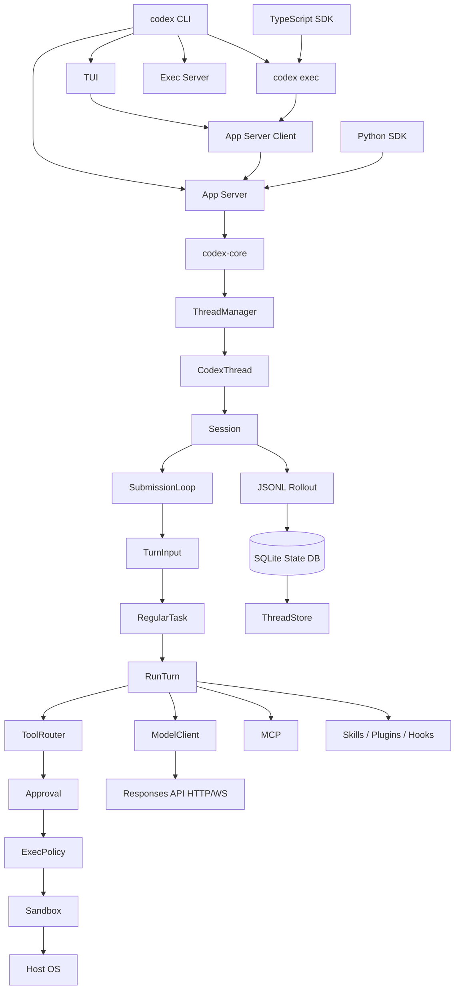
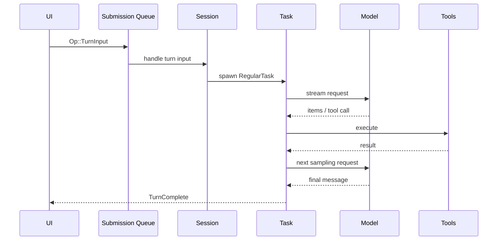

# Codex 详细设计文档

> 文档版本：分析稿 v1.0  
> 分析日期：2026-09-15  
> 分析对象：`C:\Users\Administrator\Desktop\codex-main\codex-main`  
> 项目定位：OpenAI 的开源本地 Coding Agent，覆盖 Rust Core、CLI、TUI、App Server、SDK、沙箱和扩展系统  
> 主要语言：Rust，辅以 TypeScript、Python 和少量原生代码  
> 构建体系：Cargo Workspace，实验性 Bazel 构建  
> 许可证：Apache-2.0

## 1. 分析范围与状态声明

Codex 是一个非常大的 Rust 多 crate 仓库。当前快照包含 100 个左右的 Workspace crate、CLI/TUI、App Server、Exec、SDK、沙箱、网络代理、MCP、Rollout/SQLite 和大量集成测试。

本次分析聚焦：

```text
codex CLI
  -> TUI / exec
  -> app-server / app-server-client
  -> codex-core ThreadManager
  -> CodexThread / Session / Submission Queue
  -> TurnInput / RegularTask / run_turn
  -> ModelClient / Responses API
  -> Tool Registry / ToolRouter / approvals
  -> Sandbox / execpolicy / network proxy
  -> Rollout JSONL / SQLite State DB / ThreadStore
  -> TypeScript and Python SDK
```

需要明确：

- 本次没有编译或测试整个仓库。
- 没有运行真实模型请求。
- 没有逐行阅读全部 7,811 个文件。
- TUI 只做主状态和事件流审阅。
- 部分高级能力存在于代码中，但可能由 Feature Flag、账号、平台或实验开关控制。
- 根目录 `docs/` 中的多数页面是官方文档跳转桩，不能当作完整设计说明。
- 代码注释和实现中存在明显的迁移与 TODO，说明内部架构仍在演进。

## 2. 核心结论

Codex 的核心不是 CLI，也不是 TUI，而是 `codex-core` 中的 Thread/Session/Turn 事件机。

可以概括为：

```text
Codex
  = CLI / TUI / Exec / App Server
  + ThreadManager
  + Session Submission Loop
  + TurnInput Scheduling
  + RegularTask / run_turn
  + Responses Model Client
  + Tool Registry / ToolRouter
  + Approval + ExecPolicy + Sandbox
  + Rollout JSONL + SQLite State DB
  + MCP / Skills / Plugins / Hooks
  + App Server Protocol / SDK
```

最重要的设计决策：

1. UI 和 Core 通过 Submission Queue 与 Event Queue 解耦。
2. `Session` 同一时刻最多运行一个主 Task，但可以接收 steer、mailbox 和辅助执行输入。
3. `ThreadManager` 负责创建、恢复、分叉、保存和关闭 Thread。
4. `TurnInput` 明确区分开始新 Turn、steer 当前 Turn、排队和恢复。
5. `RegularTask` 包装一个用户可见 Turn，`run_turn` 内部可进行多次模型采样和工具调用。
6. 每次采样都会从 Session History 重新构造请求输入。
7. 工具执行统一经过 Registry、Router、Approval、Sandbox 和 ExecPolicy。
8. macOS、Linux、Windows 使用不同 Sandbox 后端，但进入同一 `SandboxManager`。
9. Rollout JSONL 是完整历史来源，SQLite 提供快速元数据和查询。
10. App Server 使用 JSON-RPC 风格协议，TUI、Exec 和 Python SDK 可以复用它。
11. TypeScript SDK 更轻，直接包装 `codex exec --json` 的 JSONL 事件。
12. 测试体系以 Core Suite、Snapshot、HTTP Mock 和真实 App Server RPC 为中心。
13. Cargo 是依赖事实来源，Bazel 是实验性 hermetic/跨平台构建层。
14. 代码规模巨大，`codex-core` 本身仍被维护者明确警告“不要继续堆积代码”。

## 3. 产品定位与 Surface

Codex 面向：

- 交互式 CLI/TUI 用户
- 非交互自动化
- IDE 和 Desktop 客户端
- Python/TypeScript 应用开发者
- MCP、Plugin、Skill 和 Hook 作者
- 需要在本地沙箱内运行命令的用户
- 需要远程 App Server 或 Exec Server 的集成方

### 3.1 主要 Surface

| Surface | 入口 | 职责 |
|---|---|---|
| TUI | `codex` | 交互对话、工具事件、Approval、Diff、历史 |
| Exec | `codex exec` | 非交互运行、JSONL、Structured Output |
| Review | `codex review` | 非交互代码审查 |
| Resume | `codex resume` | 恢复历史 Thread |
| Fork | `codex fork` | 从历史分叉 Thread |
| App Server | `codex app-server` | JSON-RPC、本地/WebSocket/Unix Socket |
| Exec Server | `codex exec-server` | 远程执行环境 |
| Cloud | `codex cloud` | Codex Cloud 任务 |
| Plugins | `codex plugin` | 安装、列出和配置插件 |
| MCP | `codex mcp` | 管理 MCP Server 和 OAuth |
| Sandbox | `codex sandbox` | 在平台 Sandbox 下运行命令 |
| Doctor | `codex doctor` | 安装、配置、认证和网络诊断 |
| SDK | `@openai/codex-sdk` / `openai-codex` | 嵌入自动化应用 |

### 3.2 重要 Terminology

| 术语 | 含义 |
|---|---|
| Thread | 一条可持久化会话，旧称 Conversation |
| Session | Thread 的当前配置和运行状态 |
| Task | Session 中一次执行工作，通常对应一个用户 Turn |
| Turn | 一次用户可见执行周期，内含一个或多个模型请求 |
| Step / Sampling | 一次 Provider 请求及其流响应 |
| Submission | UI 发给 Core 的 `Op` |
| Event | Core 发给 UI 的 `EventMsg` |
| Rollout | 持久化的 JSONL 会话记录 |
| Approval | 工具或网络访问需要用户确认 |
| Sandbox | 对文件系统和网络能力的平台级限制 |
| ExecPolicy | 命令前缀规则和审批策略 |

## 4. 技术栈

| 类别 | 技术 |
|---|---|
| Core 语言 | Rust 2024 Edition |
| CLI | Clap |
| TUI | ratatui、crossterm |
| Async Runtime | Tokio |
| 协议 | JSON-RPC 风格 typed protocol、JSONL |
| 模型协议 | OpenAI Responses |
| HTTP | 自研 `codex-http-client` |
| WebSocket | tokio-tungstenite |
| MCP | `rmcp` |
| Persistence | JSONL Rollout、SQLite/state、可选压缩 |
| Build | Cargo Workspace、实验性 Bazel |
| Sandbox | Seatbelt、bubblewrap、seccomp/Landlock、Windows Restricted Token/Elevated/MXC |
| Network | 受管 HTTP Proxy、可选 MITM、域名/Unix Socket Policy |
| TS SDK | TypeScript、Node.js 18+ |
| Python SDK | Python 3.10+、Pydantic |
| Testing | Rust integration tests、insta、wiremock、Playwright 只出现在其他生态但不属于核心主体 |

## 5. 仓库规模

统计范围排除 `.git`、`target`、`node_modules` 和大型 vendored V8。

| 指标 | 数值 |
|---|---:|
| 文件总数 | 7,811 |
| 文本行数 | 2,008,313 |
| 仓库大小 | 77,334,385 bytes |
| Rust `*_test*.rs` 文件 | 914 |
| TypeScript SDK 测试 | 9 |
| Python SDK 测试 | 21 |
| Core Suite Rust 文件 | 162 |
| Core Suite 行数 | 151,597 |
| App Server 测试文件 | 164 |
| App Server 测试行数 | 118,776 |
| Core Snapshot 文件 | 28 |
| TUI Snapshot 文件 | 999 |

主要 `src` 目录规模：

| Crate | 文件数 | 行数 | 覆盖级别 |
|---|---:|---:|---|
| `tui` | 1,707 | 345,413 | 主状态与结构审阅 |
| `core` | 525 | 225,171 | 核心精读 |
| `app-server` | 135 | 56,859 | 核心接口审阅 |
| `core-plugins` | 83 | 45,567 | 外围/扩展审阅 |
| `exec-server` | 115 | 40,665 | 结构审阅 |
| `app-server-protocol` | 64 | 34,685 | 核心协议审阅 |
| `thread-store` | 65 | 33,341 | 核心接口审阅 |
| `protocol` | 69 | 29,598 | 核心 Schema 审阅 |
| `config` | 86 | 28,259 | 结构审阅 |
| `cli` | 67 | 28,153 | 核心入口审阅 |
| `network-proxy` | 55 | 27,803 | 核心边界审阅 |
| `rmcp-client` | 77 | 26,462 | 接口级审阅 |
| `windows-sandbox-rs` | 84 | 24,682 | 结构审阅 |
| `state` | 48 | 23,989 | 核心接口审阅 |
| `codex-mcp` | 49 | 23,374 | 接口级审阅 |
| `app-server-transport` | 34 | 18,168 | 结构审阅 |
| `rollout` | 32 | 16,039 | 核心精读 |
| `hooks` | 34 | 15,671 | 接口级审阅 |
| `sandboxing` | 23 | 9,441 | 核心精读 |
| `model-provider` | 22 | 6,145 | 核心精读 |
| `tools` | 36 | 6,819 | 核心结构审阅 |

## 6. 总体架构



### 6.1 分层

1. **Surface Layer**：CLI、TUI、Exec、SDK。
2. **Protocol Layer**：App Server Protocol、ClientRequest、ServerNotification。
3. **Core Runtime Layer**：ThreadManager、CodexThread、Session、Submission Loop。
4. **Execution Layer**：TurnInput、Task、run_turn、ToolRouter。
5. **Provider Layer**：ModelProvider、ModelClient、Responses Client。
6. **Security Layer**：Approval、ExecPolicy、Sandbox、Network Proxy。
7. **Persistence Layer**：Rollout、SQLite、ThreadStore。
8. **Extension Layer**：MCP、Skills、Plugins、Hooks、Extensions、Memories。
9. **UI Layer**：ratatui TUI、TUI Plugins、桌面/IDE 客户端。

## 7. CLI、TUI、Exec 与 App Server

### 7.1 CLI 多工具入口

`codex-rs/cli/src/main.rs` 使用 Clap 提供：

- 默认交互模式
- `exec`
- `review`
- `login` / `logout`
- `mcp`
- `plugin`
- `app-server`
- `remote-control`
- `resume`
- `queue`
- `archive` / `unarchive` / `delete`
- `fork`
- `cloud`
- `sandbox`
- `doctor`
- `update`
- `features`
- `execpolicy`
- `responses-api-proxy`
- `exec-server`

CLI 采用 `arg0` 分派，因此同一个二进制可以作为：

- `codex`
- `codex-linux-sandbox`
- 其他平台辅助入口

### 7.2 TUI

TUI 使用 ratatui 与 crossterm，主要模块包括：

- `App`：全局状态与事件循环
- `ChatWidget`：聊天主界面
- `BottomPane`：输入框、状态栏和选项
- `ResumePicker`
- `DiffRender`
- `ExecCell`
- `HistoryCell`
- `Markdown` 渲染
- Keymap
- Approval/Question UI
- MCP 和 Plugin UI
- Agent Picker
- Worktree Picker
- Token Usage
- Inline Visualization
- Transcript Export

TUI 通过 App Server Client 与 Core 通信，而不是直接调用所有 Core API。

### 7.3 Exec

`codex exec` 的目标是 Headless 自动化：

- 默认 stdout 只输出最终消息。
- `--json` 输出一行一个 JSON Event。
- 支持 Prompt、图片、Structured Output。
- 支持 Resume、Fork、Review。
- 使用 In-process App Server Client。
- 支持 Managed Worktree、Sandbox、Approval。
- 将复杂事件转换为适合 Headless 消费的事件模型。

### 7.4 App Server

App Server 是 JSON-RPC 式长连接服务：

- client 发请求和通知。
- server 发响应、请求和通知。
- 支持 stdio、Unix Socket、WebSocket。
- 支持 in-process typed channel。
- 支持 initialize 握手。
- 支持 Thread Start/Resume/Fork/Read/List/Archive/Delete。
- 支持 Turn Start/Steer/Interrupt。
- 支持 Approval、Elicitation、User Input、Permissions。
- 支持 Account、Login、Model、MCP、Plugin、Config、Rate Limit。
- 支持 Goal、Memory、Realtime 和实验 API。

Daemon 模式增加：

- `start`
- `restart`
- `stop`
- `version`
- `bootstrap`
- remote control enable/disable
- 自动更新
- CODEX_HOME 级互斥
- PID 和升级状态

### 7.5 App Server Client

`codex-app-server-client` 为 TUI 和 Exec 提供统一客户端：

- 启动 in-process App Server
- initialize 握手
- typed request/response
- Server Request 响应和拒绝
- 有序、无损失事件消费
- bounded command channel
- graceful shutdown

它保留 JSON-RPC 语义，但进程内热路径使用 typed channel，避免不必要的序列化。

## 8. Core Thread Manager

`ThreadManager` 是 Core 的会话生命周期中心。

职责：

- 创建 Thread
- 恢复 Thread
- 从 Rollout 或工作树恢复
- Fork Thread
- 生成 Subagent Thread
- 删除 Thread
- 列出和查询 Thread
- 更新 Thread Metadata
- 管理 Section、Project、Attachment
- 关闭所有 Thread
- 管理共享 Auth、Models、MCP、Skills、Plugins 和 Environment
- 维护 loaded Thread Map
- 维护 Thread Created Broadcast
- 选择 Local 或 InMemory ThreadStore

### 8.1 Thread / Conversation 命名

代码仍保留旧命名兼容：

```text
ConversationManager = ThreadManager
NewConversation = NewThread
CodexConversation = CodexThread
```

新代码统一使用 Thread。

### 8.2 Thread Identity

- `ThreadId` 是一个 Thread 的持久身份。
- `SessionId` 代表 Root Thread 及其后代共享的会话身份。
- Subagent 是独立 Thread，但有 Parent Thread ID。
- Fork 产生新 Thread ID，并记录 `forked_from_thread_id`。

### 8.3 Fork Snapshot

支持两种策略：

1. `TruncateBeforeNthUserMessage`
2. `Interrupted`

Fork 可以：

- 从历史 Rollout 复制。
- 引用已有 Rollout 做 Copy-on-Write 式持久化。
- 保留或重建 Model Context。
- 在活动 Turn 中插入统一的中断标记。

## 9. CodexThread、Session 与 Submission Loop

### 9.1 CodexThread

`CodexThread` 是对外句柄，持有：

- `Arc<Session>`
- `SessionIo`
- Session Source
- SessionConfigured
- Rollout Path
- 生命周期诊断 Guard

它提供：

- `submit(Op)`
- `next_event()`
- `start_or_steer_turn`
- `start_turn_if_idle`
- `recover_turn_if_idle`
- `steer_turn`
- `suspend_turn_and_shutdown`
- `shutdown_and_wait`
- `load_history`
- `read_thread`
- `update_thread_metadata`
- `append_rollout_items`
- Token Usage 和 Agent Status 查询

### 9.2 Session

`Session` 是进程内运行状态，包括：

- Thread ID
- Event Sender
- Agent Status Watch
- SessionState Mutex
- Thread Settings Persistence Lock
- Managed Network Proxy Refresh Lock
- Active Turn
- Input Queue
- Session Services
- MCP Runtime 和 Refresh
- Realtime Conversation
- Extension Data
- Guardian Review
- Fork Persistence
- Internal Submission Sequencer

重要约束：

```text
一个 Session 同一时间最多只有一个主运行 Task。
```

### 9.3 Submission Loop



Submission Loop 处理：

- Interrupt
- Realtime Conversation
- TurnInput
- RecoverTurn
- ThreadSettings
- TurnSettings
- Inter-Agent Communication
- Exec Approval
- Patch Approval
- User Input Answer
- Permission Response
- Dynamic Tool Response
- MCP Refresh
- Config Reload
- Compact
- Memory Mode
- User Shell
- MCP Elicitation
- Review
- Shutdown

### 9.4 Event Model

Core 向 UI 发送：

- Turn Started/Completed/Aborted
- Agent Message 和 Delta
- Reasoning Delta
- Exec Start/Output/End
- Tool Call
- Approval Request
- User Input Request
- MCP Tool Result
- Patch Apply
- File Change
- Token Usage
- Rate Limits
- Safety Buffering
- Error / Warning
- Session Configured
- Shutdown Complete

`EventMsg` 是 `non_exhaustive` 枚举，新增事件不能假定旧客户端完全理解。

### 9.5 TurnInput Admission

`TurnInput` 支持：

```text
UserInput
FunctionCallOutput
ResponseItem
InterAgentCommunication
```

输入模式：

| 模式 | 行为 |
|---|---|
| `StartOrSteer` | 空闲则 Start，忙则 Steer |
| `StartIfIdle` | 只在空闲时启动，否则拒绝 |
| `Steer` | 只允许 steer 指定 Turn |
| `Recovery` | 以已记录 Turn ID 恢复中断 Turn |

Steer 接受后：

- 输入进入 ActiveTurn 的 Pending Input。
- 当前 Turn 在安全边界继续处理。
- 不创建第二个并发主 Task。
- Turn Settings 可持久化，但 Start Options 只对真正 Starts 生效。

### 9.6 Pending Input

Pending Input 分两类：

- Turn-local Steer Input
- Session-level Mailbox Communication

Mailbox 用于 Multi-Agent：

- 可要求立即触发 Turn。
- 可在当前 Turn 内传递。
- 也可延后到下个 Turn。
- 多个 Mailbox Start Options 会合并，冲突时采用后续或保守规则。

### 9.7 RegularTask

`RegularTask::run`：

1. 发出 TurnStarted。
2. 尝试消费启动预热。
3. 调用 `run_turn`。
4. 如果仍有 Pending Input，再次调用 `run_turn`。
5. 直到没有 Pending Input 或遇到终止错误。

## 10. run_turn 与模型循环

`run_turn` 是最核心的执行函数之一。

### 10.1 主流程

```text
接收 TurnInput
  -> 清理异步 Hook 结果
  -> 创建 Turn-scoped ModelClientSession
  -> Pre-sampling Compaction
  -> 解析 MCP requirements
  -> 捕获 StepContext
  -> 记录 World State / Context Diff
  -> 构建 Skills / Plugins / Connectors 注入
  -> 记录 User Input 和 Hook Context
  -> 预启动 Shell Snapshot
  -> 构建 Prompt
  -> 调用模型
  -> 消费 Stream
  -> 持久化 Assistant / Reasoning / Tool Item
  -> 执行 Tool Call
  -> 等待需要结算的工具
  -> 检查 Pending Input、Token Limit 和 Compaction
  -> 决定 Continue / Stop / Compact
```

### 10.2 Step Context

`StepContext` 在每次模型采样边界捕获一次，确保：

- System/Developer Instructions
- Tools
- Permission Profile
- Environment
- Reasoning Settings
- Service Tier
- MCP Visibility
- Tool Namespaces

属于同一个模型可见快照。

这样工具调用不会在一个 Step 中途因为配置变化而使用不同权限。

### 10.3 Prompt

`Prompt` 包含：

```ts
{
  input,
  tools,
  parallel_tool_calls,
  base_instructions,
  output_schema,
  output_schema_strict,
  cyber_access_program
}
```

### 10.4 采样循环

一次 Turn 可以包含多次 Provider Sampling：

1. 模型返回 Tool Call。
2. Core 执行工具。
3. Tool Result 写入 History。
4. Core 重新构造请求。
5. 发起下一次采样。
6. 直到模型不再要求 Follow-up。

每个 `ModelClientSession` 只在同一个 Turn 内复用，以保持：

- WebSocket 连接
- Sticky Routing Token
- Incremental Request 状态

不能跨 Turn 复用，否则会错误重放上一 Turn 的路由状态。

### 10.5 Stop Hooks

模型结束输出后可以触发：

- Stop Hook
- Legacy AfterAgent Hook
- 额外 Continuation Prompt
- Stop/Block 决策

### 10.6 Interrupt

Interrupt：

- 取消当前 Task。
- 终止工具子任务。
- 清理后台终端。
- 写入 Aborted 事件或中断 Context Marker。
- 不删除已持久化历史。
- 可通过 Turn Recovery 或新 User Turn 继续。

## 11. Model Client 与 Responses API

### 11.1 Wire API

当前快照只保留：

```text
WireApi::Responses
```

旧 `wire_api = "chat"` 已明确移除。

这意味着 Codex Core 当前不是通用多协议 LLM 抽象，而是围绕 Responses API 设计，再通过 Provider Base URL 和兼容适配支持其他服务。

### 11.2 Provider 类型

Provider 配置包括：

- Name
- Base URL
- Env Key
- Experimental Bearer Token
- Command-backed Auth
- AWS SigV4 Auth
- Wire API
- Query Params
- Headers
- Environment Headers
- Request/Stream Retries
- Stream Idle Timeout
- WebSocket Connect Timeout
- OpenAI Auth Requirement
- WebSocket Support
- Standalone Web Search Support

### 11.3 Request Shape

核心请求字段：

```text
model
instructions
input
tools
tool_choice = auto
parallel_tool_calls
reasoning
store = false
stream = true
include = reasoning.encrypted_content
service_tier
prompt_cache_key
text
client_metadata
access_programs
```

### 11.4 HTTP 与 WebSocket

Model Client 支持两条传输：

1. Responses over HTTP SSE
2. Responses over WebSocket

WebSocket 特点：

- Turn 内惰性连接。
- 可预热。
- 可复用。
- 可发送 Incremental Delta。
- 通过 `x-codex-turn-state` 保持 Sticky Routing。
- 连接失败或升级失败可回退 HTTP。
- 一旦回退，后续同 Session 可固定使用 HTTP。

HTTP 特点：

- 标准 SSE。
- 支持 Zstd 请求压缩条件。
- 支持代理和自定义 CA。
- 对流进行 Idle Timeout 和 Retry。

### 11.5 Incremental WebSocket Request

只有在以下条件满足时才发送增量：

- Model、Tools、Instructions、Reasoning 等非 Input 字段完全相同。
- 新 Input 是上一 Request + Server Output 的严格扩展。
- Previous Response ID 可用。

否则重新发送完整 Input。

### 11.6 Retry

默认：

```text
request_max_retries = 4
stream_max_retries = 5
stream_idle_timeout = 300 s
websocket_connect_timeout = 15 s
```

上限：

```text
100 retries
```

Retry 路径包括：

- 429
- 5xx
- Transport Failure
- Stream Disconnect
- WebSocket 失败后 HTTP Fallback
- 401 后的 Auth Recovery

### 11.7 Prompt Cache

核心使用 `prompt_cache_key` 维持缓存亲和性：

- Root Thread 通常使用 Session Prompt Cache Key。
- Subagent 可用 Parent Thread 关系生成 Key。
- ChatGPT 和 API Key 路径使用不同 Session Header 策略。

### 11.8 Structured Output

`Prompt.output_schema` 会转换为 Responses 的文本格式控制：

- `json_schema`
- strict
- schema
- name = `codex_output_schema`

### 11.9 Reasoning

支持：

- Reasoning Effort
- Reasoning Summary
- Sequential Cutoff Delivery
- Encrypted Reasoning 返回
- Responses Lite 的不同 Reasoning Context 策略

## 12. Tool Registry、ToolRouter 与工具执行

### 12.1 Tool Registry

Registry 使用有序 Map 保存：

- Trusted Built-in Tool
- External Tool
- MCP Tool
- Extension Tool
- Code Mode Tool
- Dynamic Tool
- Deferred Tool

名称使用：

```text
namespace + name
```

默认 Namespace 可省略。

### 12.2 Tool Exposure

工具可以处于：

- Direct
- Deferred
- Code Mode
- Direct Model Only
- Code Mode Only
- Hidden

控制维度包括：

- Config
- Model Tool Mode
- MCP Omit Policy
- Tool Search
- Code Mode
- Direct-only Namespace
- Agent/Client Capability

### 12.3 ToolRouter

ToolRouter 是一个 Step 已冻结的工具计划：

- Model Visible Specs
- 可执行 Registry
- Tool Mode
- Code Mode Nested Names
- Namespace Metadata
- Child Management 能力

Provider 请求使用 ToolRouter 的 Model Visible Specs。  
Tool Call Settlement 使用同一个 Router，避免“广告了一套、执行另一套”。

### 12.4 Tool Call 构建

支持：

- Function Call
- Tool Search Call
- Custom Tool Call
- Local Shell Call

### 12.5 并行执行

Tool Runtime 使用 `RwLock`：

- `supports_parallel = true`：并发读锁。
- 非并行工具：独占写锁。

因此多个只读工具可以并发，但写文件或独占工具会串行。

### 12.6 工具执行流水线

```text
Tool Call
  -> PreToolUse Hook
  -> Approval
  -> ExecPolicy
  -> Sandbox Selection
  -> First Attempt
  -> Sandbox Denied?
  -> Second Approval if needed
  -> Escalated Attempt
  -> PostToolUse Hook
  -> Result Projection
  -> History
```

### 12.7 工具失败语义

- `RespondToModel`：模型可自行修正的工具错误。
- `Fatal`：终止当前执行链。
- Permission/User Reject：当前 Tool 失败，并可能中断 Turn。
- Sandbox Denied：可请求 Escalation。
- Interrupt：返回明确 Aborted Tool Output。

### 12.8 内置工具

代码中可见的内置/控制工具包括：

- `exec_command`
- `write_stdin`
- `apply_patch`
- `view_image`
- `request_user_input`
- `request_permissions`
- `request_plugin_install`
- `list_available_plugins_to_install`
- `tool_search`
- `update_plan`
- `new_context_window`
- `get_context_remaining`
- `sleep`
- `wait_for_environment`
- `test_sync`
- MCP Resource 工具
- Multi-Agent V1/V2 工具

### 12.9 Code Mode

Code Mode 可以把多个嵌套工具暴露给代码运行时：

- `code_mode`
- `code_mode_wait`
- 嵌套 Tool Definitions
- 子 Tool Call 路由

它提供更灵活的批量调用，但也增加执行边界和审批复杂度。

### 12.10 Multi-Agent

V1/V2 存在多套工具：

- Spawn Agent
- Send Input / Send Message
- Wait Agent
- Resume Agent
- Close Agent
- Follow-up Task
- Interrupt Agent
- List Agents

Agent 拥有独立 Thread，Subagent 从指定 Thread 分叉，可以与 Parent 互相传递消息。

## 13. Approval、ExecPolicy 与 Permission Profiles

### 13.1 Approval Policy

审批策略可见：

- Never
- OnRequest
- UnlessTrusted
- Granular

Granular 可以分别控制：

- Rules Approval
- Sandbox Approval

### 13.2 ExecPolicy

ExecPolicy 使用命令前缀和危险命令规则：

```text
Decision =
  Allow
  Prompt
  Forbidden
```

流程：

1. 解析命令。
2. 解析 Shell Wrapper。
3. 展开 PowerShell 或 Bash 内部命令。
4. 匹配 Prefix Rule。
5. 应用危险命令启发式。
6. 得到 Allow、Prompt 或 Forbidden。
7. Prompt 根据 Approval Policy 可能转成 Forbidden。

### 13.3 Prefix Rule Amendment

用户批准命令后，可以保存：

```text
["git", "pull"]
```

作为复用 Prefix Rule。

系统会避免建议危险 Prefix，例如：

- Shell 解释器
- Python `-c`
- Node `-e`
- PowerShell `-Command`
- `rm`
- `sudo`
- 包管理器 `run`

### 13.4 Permission Profile

Permission Profile 可以表达：

- Managed
- Disabled
- External

Managed Profile 区分：

- File System Policy
- Network Policy
- Enforcement
- Workspace Roots
- Read/Write Roots
- Deny/Read Carveouts

### 13.5 Network Approval

网络访问可以按：

- Domain
- Method
- Protocol
- Unix Socket

进行 Allow、Prompt 或 Deny。

## 14. Sandbox 与 Network Proxy

### 14.1 Sandbox Manager

统一 Sandbox 类型：

- None
- macOS Seatbelt
- Linux Seccomp/Landlock/Bubblewrap
- Windows Restricted Token
- Windows MXC

Sandbox Manager 负责：

- 是否启用 Sandbox
- 选择平台后端
- 将 Permission Profile 转换为平台参数
- 生成 Sandboxed Command
- 处理 Sandbox Denied
- 记录 Violation
- 处理 Elevated Windows Backend

### 14.2 macOS Seatbelt

特点：

- 使用 `/usr/bin/sandbox-exec`。
- 固定安全路径，防止 PATH 注入。
- Base Policy、Network Policy、Preferences Policy 分离。
- 支持 File Read/Write、Subpath、Literal Path。
- 支持 Deny Read/Write Carveouts。
- 支持 Proxy Loopback Port。
- 支持 Unix Domain Socket。
- 防止用户控制路径中的符号链接逃逸。
- 允许少数 macOS 顶层 Alias。

### 14.3 Linux

Linux Sandbox 分两层：

- bubblewrap：Namespace、文件挂载、网络隔离。
- Landlock/Seccomp：系统调用和文件权限限制。

特性：

- 优先系统 `bwrap`，需要时回退 bundled。
- 检测 User Namespace 是否可用。
- 明确拒绝 WSL1。
- Proxy-only 模式使用隔离网络 Namespace。
- ExecPolicy 和 Sandbox 是两个不同维度。

### 14.4 Windows

支持：

- Restricted Token
- Elevated Backend
- MXC
- Private Desktop

复杂性：

- Restricted Token 对 Read Deny 的支持受限。
- Elevated Backend 可执行更完整 ACL。
- Split Read/Write Policy 可能无法由 Unelevated 后端表达。
- 某些无法安全表达的策略会拒绝运行，而不是静默取消 Sandbox。
- MXC 不支持 Private Desktop。

### 14.5 Managed Network Proxy

Network Proxy 是真正的网络中介，不只是环境变量。

能力：

- HTTP Proxy
- HTTPS MITM 可选
- SOCKS5
- Domain Allow/Deny
- Unix Socket Allow List
- 本地绑定策略
- 请求审计
- 阻断响应
- Credential Broker
- MITM Header/Body Hook
- Remote Config Reload
- 连接生命周期取消

### 14.6 Credential Broker

Credential Broker 可以：

- 对子进程注入占位环境变量。
- 在请求发送到指定 Host 时替换真实凭据。
- 限制凭据只能用于绑定目标。
- 将真实 Secret 保留在 Proxy 外层。

这是比“把 API Key 直接给子进程”更细的权限模型。

## 15. Rollout、SQLite 与 ThreadStore

### 15.1 Rollout JSONL

Rollout 是 Append-only JSONL：

- Session Meta
- User/Assistant Items
- Tool Calls 和 Results
- Compaction
- Turn Context
- Reverted/Hidden 状态
- Model Context
- Token Usage

优点：

- 人类可读。
- 易调试。
- 易恢复。
- 易复制和 Fork。
- 可压缩。

代价：

- 大文件扫描成本。
- 需要 Writer Lock。
- 需要 Reverse Scanner。
- Metadata Query 不适合完全依赖文件遍历。

### 15.2 Rollout Writer

`RolloutRecorder` 使用后台 Writer Task：

- Async Command Queue
- AddItems
- Persist
- Flush
- Shutdown
- Discard
- Writer Lock
- Terminal Failure 传播

这避免所有模型事件都同步 Wait 文件写入。

### 15.3 SQLite State DB

SQLite 用于：

- Thread Metadata
- 搜索
- 排序
- Cursor Pagination
- Project
- Section
- Attachment
- Goal
- Memory Job
- Logs
- Queue
- Thread History
- Rollout Migration

数据库区分多类：

- State DB
- Logs DB
- Goals DB
- Memories DB
- Queue DB
- Thread History DB

### 15.4 Rollout 与 SQLite 双写修复

系统会：

- 从 Rollout 回填 SQLite。
- SQLite 查询失败时回退到文件扫描。
- 扫描结果修正 stale metadata。
- 迁移旧 Rollout。
- 压缩 Rollout。
- 检测数据库损坏并备份重建。
- 跟踪 Backfill Lease 和状态。

### 15.5 ThreadStore

Core 不直接依赖具体存储，而通过 `ThreadStore`：

- LocalThreadStore
- InMemoryThreadStore

接口覆盖：

- Create
- Resume
- Read
- Append
- Load History
- Update Metadata
- Archive/Delete
- Search
- Fork/Prepare Fork
- Revert
- Project/Section
- Attachment
- Queue

Thread ID 是唯一 Durable Handle，底层可以是 JSONL、SQLite 或 RPC。

## 16. Context、Compaction 与 Token 管理

### 16.1 Model-Visible Context 规则

Codex 的 `AGENTS.md` 明确规定：

1. 不重写历史，只增量构建 Context。
2. 避免频繁改动导致 Prompt Cache Miss。
3. 所有注入项必须有硬上限。
4. 单项不超过约 10K Tokens。
5. 可能超过 1K Tokens 的新单项视为 P0 审查项。
6. 所有 Injected Fragment 必须是 `core/context` 中的 Struct 并实现 `ContextualUserFragment`。

### 16.2 Context Fragments

代码中的 Fragment 包括：

- Base Instructions
- Developer Instructions
- Environment Context
- AGENTS.md
- Skills
- Plugins
- Permissions
- Current Time
- Turn Aborted
- Subagent Notification
- Inter-Agent Message
- Compaction Summary
- Token Budget
- Model Switch Instructions
- Guardian Policy/Evidence

### 16.3 Local Compaction

Local Compaction 流程：

1. 插入 Summarization Prompt。
2. 使用完整 History 发起模型请求。
3. 处理 Context Window Exceeded，逐项移除最旧 History。
4. 提取 Summary。
5. 保留最近 User Messages，默认上限 20K Tokens。
6. 生成 Compaction Summary。
7. 按策略注入初始 Context。
8. 替换 Live History。
9. 推进 Compaction Window。

### 16.4 Remote Compaction V2

Remote Compaction 特点：

- Provider 返回正式 `Compaction` Item。
- 保留 User/Developer/Agent Message 的一部分。
- 默认保留预算 64K Tokens。
- 单个 Agent Message 最多 10K Tokens。
- 可保留图片并计算图片预算。
- 可 Fallback 到当前 Model。
- Stream Retry 上限比普通 Sampling 小。
- 明确要求正好一个 Compaction Output。

### 16.5 Token Budget

Token Budget 路径包括：

- Auto Compact Limit
- Context Window Limit
- Full Context Window
- Window Number
- Context Window ID
- Token Usage Scope
- New Context Window Tool
- Rollout Budget

### 16.6 关键原则

Compaction 不只是截断，而是替换“活动模型表示”：

- Durable Transcript 不丢失。
- 新 Context 保持可恢复。
- 不能在多个阶段重复执行副作用。
- 失败应保留输入并允许重试。
- 多次 Compaction 可能降低准确性，因此会发 Warning。

## 17. MCP、Skills、Plugins、Hooks 与 Memories

### 17.1 MCP

MCP 由独立 `codex-mcp`、`rmcp-client` 和 Core Session 运行时管理。

能力包括：

- Server Startup
- Tool List Refresh
- Tool Cache
- Tool Exposure
- Deferred Tools
- Resource
- Resource Template
- Prompt
- OAuth
- Elicitation
- User Verification
- Connector
- OpenAI File MCP
- HTTP Proxy 行为

MCP Tool 通过统一 Core Tool Runtime 适配为 Responses Tool。

### 17.2 Skills

Skills 提供：

- 文件系统发现
- 显式 Skill Invocation
- Implicit Skill Invocation
- Skill Approval
- Skill Body 注入
- Skill 与 MCP Dependency
- Skill 搜索
- 路径和来源校验

### 17.3 Plugins

Plugins 是更广义扩展：

- Plugin Marketplace
- Plugin Install
- Plugin Config
- Plugin Capability
- Tool Suggestion
- App/Connector
- Plugin Mention
- Plugin Analytics
- Managed Hooks

插件可以贡献工具、Skills、Connectors 和 Instructions，但必须经过配置和权限边界。

### 17.4 Hooks

Hooks 可在多个生命周期触发：

- Session Start/End
- User Prompt
- PreToolUse
- PostToolUse
- Turn Stop
- PreCompact/PostCompact
- Agent End
- MCP Execution

Hook 可以：

- 阻止操作
- 注入 Additional Context
- 修改 Tool Input
- 修改可见结果
- 启动 MCP Hook

### 17.5 Memories

Memories 是异步记忆流水线：

- Stage 1 提取
- Phase 2 Global Consolidation
- Job Claim/Heartbeat/Retry
- Thread Memory Mode
- External Context Pollution 标记
- 记忆引用
- Retention/Prune
- 专用 Memories DB

它不与当前 Turn 同步阻塞，主要通过后台 Job 和后续 Context 注入生效。

## 18. App Server Protocol 与 SDK

### 18.1 Protocol

`app-server-protocol` 负责生成：

- Rust Types
- TypeScript Types
- JSON Schema
- API Metadata
- Experimental API Surface

核心协议实体：

- ClientInfo
- Initialize
- Thread
- Turn
- ThreadItem
- ClientRequest
- ServerRequest
- ServerNotification
- Approval
- Tool Input
- Goal
- Plugin
- Config
- Account

### 18.2 Transport

App Server Transport 支持：

- stdio
- Unix Domain Socket
- WebSocket
- Remote WebSocket
- In-process Channel

Remote Control 增加：

- Enrollment
- Pairing
- Device Auth
- Client Tracking
- Desired State
- Persistence
- Reconnect
- Retry

### 18.3 TypeScript SDK

TypeScript SDK 的模型非常简单：

```text
Codex
  -> CodexExec
  -> Thread
  -> run / runStreamed
```

它通过 Node `spawn` 运行：

```text
codex exec --experimental-json
```

然后逐行解析 JSONL。

优点：

- 依赖少。
- 与 CLI 行为一致。
- 不需要直接维护 App Server RPC Client。

限制：

- 必须安装 Codex CLI。
- 事件模型是 Exec JSONL，不是完整 App Server API。
- 没有直接暴露所有 Thread/Plugin/Config 控制面。

### 18.4 Python SDK

Python SDK 更接近 App Server：

- Codex / AsyncCodex
- Thread / AsyncThread
- TurnHandle / AsyncTurnHandle
- Login
- Goal
- Approval
- Input Model
- Typed Generated Protocol

特点：

- stdio JSON-RPC Reader Thread。
- MessageRouter 将 Response、Notification、Login、Turn、Goal 分流。
- 每个 Turn Consumer 使用独立 Cursor。
- 支持同步和异步。
- 支持 Retry-on-overload。
- 生成类型来自 App Server JSON Schema。

### 18.5 SDK 差异

| 维度 | TypeScript SDK | Python SDK |
|---|---|---|
| 底层 | `codex exec` JSONL | App Server JSON-RPC |
| 进程模型 | Spawn CLI | 启动/连接 App Server |
| 类型来源 | TS 手写模型 | JSON Schema 生成 |
| 流式 | AsyncGenerator | Iterator / AsyncIterator |
| 覆盖范围 | Prompt、Turn、事件 | Thread、Turn、Login、Goal 等更多 RPC |
| 优点 | 实现简单 | 控制面完整 |
| 限制 | API 较窄 | 生命周期和路由复杂 |

## 19. 安全模型

### 19.1 安全原则

- 默认代码执行应处于 Sandbox。
- 需要越权时必须显式 Approval。
- ExecPolicy 可以预先 Allow/Prompt/Forbid。
- Network 可以独立限制。
- Credential 不应轻易暴露给子进程。
- Sandbox 无法表达策略时应拒绝，而不是静默取消。
- Approval 与 Turn 绑定，不能跨 Turn 混用。
- Plugin、Hook、MCP 也属于可执行或数据注入边界。

### 19.2 主要风险

1. `codex sandbox` 与 `/shell` 的 Unrestricted Shell 是显式 Escape Hatch。
2. Approval 只需一次的用户决策可能被错误复用。
3. Prefix Rule 可能因命令包装、Shell Alias 或解释器参数绕过。
4. Windows Sandbox Policy 表达能力存在平台差异。
5. MCP、Plugin、Hook 和 Code Mode 增加供应链和任意代码执行面。
6. Managed Network Proxy 的 MITM CA 必须被严格保护。
7. Credential Broker 配置错误可能把 Secret 发送给错误 Host。
8. Rollout 可能包含源代码、日志、Prompt 和敏感附件。
9. Remote App Server 暴露远程控制和认证风险。
10. `dangerously_bypass_approvals_and_sandbox` 完全移除主要安全边界。

## 20. 测试与工程体系

### 20.1 测试规模

| 范围 | 数量 |
|---|---:|
| Rust `*_test*.rs` | 914 |
| TypeScript SDK Test | 9 |
| Python SDK Test | 21 |
| Core Suite 文件 | 162 |
| Core Suite 行数 | 151,597 |
| App Server Test 文件 | 164 |
| App Server Test 行数 | 118,776 |
| Core Snapshot | 28 |
| TUI Snapshot | 999 |

### 20.2 测试策略

- Agent 逻辑优先 Integration Test。
- 单元测试尽量放独立 `*_tests.rs`。
- 使用 `test_codex` 构造真实 Core 实例。
- 使用 SSE Mock 验证 Responses Request。
- 捕获并检查 `ResponsesRequest` Body。
- TUI UI 变化必须使用 insta Snapshot。
- App Server 必须走公开 JSON-RPC API。
- Bazel 和 Cargo 都必须支持测试资源定位。
- 大量 Snapshot 用于 TUI 和模型可见 Layout。

### 20.3 工程约束

- `codex-core` 被标记为需要阻止继续膨胀。
- 新概念优先放独立 Crate。
- 默认目标 Rust Module 小于约 500 行。
- 超过约 800 行的文件不应继续追加新功能。
- 不使用随意 bool/Option 位置参数。
- Match 尽量穷尽。
- Lockfile 变化必须同步 Bazel Lock。
- `include_str!` 等编译期文件访问必须更新 Bazel Data。
- 测试不能直接 `cargo test`，应使用 `just test`。

### 20.4 本次未执行

未执行：

```bash
cargo build
cargo test
just test
just fix
bazel test
pnpm test
uv run pytest
codex exec
codex app-server
TUI
真实的 Responses API 请求
```

因此，本文只形成静态设计结论，不声明运行正确性。

## 21. 优点与风险

### 21.1 主要优点

1. Thread/Turn/Task 生命周期定义清晰。
2. Submission Queue 与 Event Queue 使 Core 和 UI 解耦。
3. TurnInput 明确处理 Start、Steer、Queue 和 Recovery。
4. Tool Router 在一个 Step 内冻结工具和权限视图。
5. Approval、ExecPolicy、Sandbox 和 Network Proxy 分层完整。
6. 多平台 Sandbox 后端统一在一个 Manager 后。
7. Rollout JSONL 保证完整历史，SQLite 提升查询能力。
8. ThreadStore 抽象允许 Local、InMemory 和未来远程实现。
9. App Server Protocol 可由 Rust、TypeScript 和 Python 生成使用。
10. MCP、Skills、Plugins 和 Hooks 都有正式扩展边界。
11. 测试数量和 Snapshot 覆盖极高。
12. Bazel 与 Cargo 双构建体系为跨平台发布提供基础。

### 21.2 P1 风险

#### 21.2.1 Core 过重

`codex-core/src/session/mod.rs`、`turn.rs`、`client.rs` 等文件都在千行到数千行。维护者自己也要求不要继续向 Core 堆积功能。

#### 21.2.2 安全策略组合复杂

Sandbox、Permission Profile、Approval、ExecPolicy、Network Proxy、Windows Elevated Backend 和 Credential Broker 的组合状态很多。任何一个映射错误都可能造成过度授权。

#### 21.2.3 Responses API 绑定

Wire API 当前只剩 Responses。自定义 Provider 必须兼容 Responses 或通过代理转换，模型生态灵活性弱于 Protocol/Transport 分离架构成熟的项目。

#### 21.2.4 WebSocket 增量复用契约复杂

增量请求依赖：

- 非 Input 字段完全一致。
- 历史是严格扩展。
- Previous Response ID。
- Sticky Routing State。
- 不能跨 Turn 复用。

这是性能优化，也是容易出现难复现 Bug 的地方。

#### 21.2.5 双持久化一致性

Rollout JSONL 与 SQLite 形成一个“文件是真值、数据库是索引”的组合。需要：

- Backfill
- Read Repair
- Migration
- Corruption Recovery
- Writer Lock
- Search Fallback

一致性问题会成为长期维护成本。

#### 21.2.6 平台差异

Linux、macOS、Windows 的 Sandbox 能力不同。Windows Unelevated 和 Elevated 的表达能力尤其不对称。

### 21.3 P2 风险

- 100 个以上 Crate 提高构建和依赖管理成本。
- TUI 体积和 Snapshot 数量非常庞大。
- App Server 协议仍在新增和实验。
- Plugin、Hook、MCP 和 Code Mode 扩大供应链面。
- Remote Control Daemon 需要长期安全维护。
- 多 Agent Thread Graph 增加调度与生命周期复杂度。
- Memories 和 Goal 引入后台 Job，可能产生长期状态漂移。
- 文档目录跳转官网，离线开发者无法从仓库获得完整说明。
- Rust Workspace 加 Bazel 增加新人上手成本。

## 22. 对 Algocode 的可借鉴内容

### 22.1 必须借鉴

1. **Thread / Turn / Step 三层模型**

Algocode 应明确：

```text
Task
  = 一次完整算法优化任务
Turn
  = 一次用户可见迭代
Step
  = 一次模型采样
Experiment
  = 一次可复现 Benchmark
```

不要让“用户任务”“模型请求”“性能实验”混在一个 Session 内。

2. **Submission Queue 与 Event Queue**

CLI、Web 和 IDE 不应直接调用内部优化逻辑。应统一通过请求和事件流通信。

3. **Step Context 冻结**

一次 Benchmark 或编辑决策必须使用同一版本：

- 代码
- 编译参数
- 输入数据
- 硬件环境
- 性能基线
- 权限

4. **Tool Registry + Router**

Algocode 的工具应包括：

- 代码读取和搜索
- Patch
- Correctness Test
- Benchmark
- Profiler
- Environment Probe
- Export Result

Registry 负责注册，Router 负责某一执行轮次的工具和权限快照。

5. **ExecPolicy 式命令控制**

算法项目常用复杂脚本。系统不应直接允许任意命令，而应按命令前缀、脚本路径和 Bench 目标形成 Allow/Prompt/Forbid 规则。

6. **Sandbox 和 Approval 分离**

- Sandbox 限制能做什么。
- Approval 决定是否允许例外。
- ExecPolicy 解释具体命令风险。
- Network Policy 单独控制下载和远程监控。

7. **完整实验落盘**

每次优化都应保存：

- Candidate Diff
- Correctness Result
- Benchmark Command
- Benchmark Raw Output
- Aggregated Metrics
- Environment
- Decision
- Rejection/Acceptance Reason

8. **Compaction 与 Replay**

算法会话常产生大量 Profiler 和日志。应像 Codex 一样区分：

- 完整 Durable Log
- 活动模型 Context
- Compaction Summary

而不是删除原始实验数据。

### 22.2 可选借鉴

- App Server JSON-RPC
- In-process typed client
- Rollout JSONL
- SQLite Metadata Index
- Snapshot UI Tests
- MCP
- Hooks
- Subagent
- Code Mode
- Credential Broker

### 22.3 不建议直接照搬

1. 不要一开始实现 100 个 Crate。
2. 不要先做 Bazel 和 Cargo 双构建。
3. 不要同时支持 Responses HTTP、WebSocket、Incremental Request 和所有高级 Provider。
4. 不要让 Core 同时负责 UI、Protocol、Sandbox、Memory 和 Plugin。
5. 不要引入二十级权限配置后才提供简单 Benchmark。
6. 不要把任意 Shell Escape Hatch 当作默认能力。
7. 不要在没有实验状态机前自动接受性能变化。

## 23. 推荐给 Algocode 的最小落地路线

### Phase 1：算法实验内核

- Rust 或 Python 单进程 Runner。
- Task、Turn、Step、Experiment 四类核心对象。
- Code Snapshot
- Candidate Patch
- Correctness Test
- Benchmark
- Profile
- Result Store
- Git Revert

### Phase 2：工具和安全

- Read/Search/Edit
- Run Test
- Run Benchmark
- Run Profiler
- Command Allow/Prompt/Forbid
- Workspace Root
- Network Off by Default
- Tool Output Spooling

### Phase 3：可恢复与可观测

- SQLite Metadata
- JSONL Durable Experiment Log
- Event Stream
- Run Resume
- Context Compaction
- Experiment Replay
- Baseline Comparison

### Phase 4：多 Surface

- CLI
- TUI
- HTTP/JSON-RPC
- Python SDK
- Web UI
- IDE

## 24. 最终评价

Codex 是一个工业级 Coding Agent Runtime，而不是一个简单的命令行包装器。

它最强的地方是：

- Thread、Turn、Step 和 Submission/Event 模型。
- 明确的多层安全边界。
- 多平台 Sandbox。
- Tool Router 的 Step 冻结语义。
- Rollout 与 SQLite 的组合持久化。
- App Server 协议和 SDK。
- 极高的测试和 Snapshot 覆盖。

它最重的地方也来自这些能力：

- Core 超大。
- 平台和安全组合复杂。
- Persistence 双轨。
- Protocol 和 Feature 持续演进。
- 构建体系复杂。

对 Algocode 而言，最值得直接吸收的不是所有功能，而是 Codex 的“执行控制面”：

```text
冻结 Step Context
  -> 明确工具 Catalog
  -> 判断命令与权限
  -> 在受限环境执行
  -> 记录完整实验事实
  -> 用可验证指标决定是否继续
```

Algocode 不应只生成优化代码。它必须把每次优化变成可复现、可审计、可回滚、可比较的算法实验。Codex 已经证明这种方法可以支撑真正长期运行的 Coding Agent；Algocode 应把这个骨架收敛到算法性能领域，而不是复制整个产品体量。
