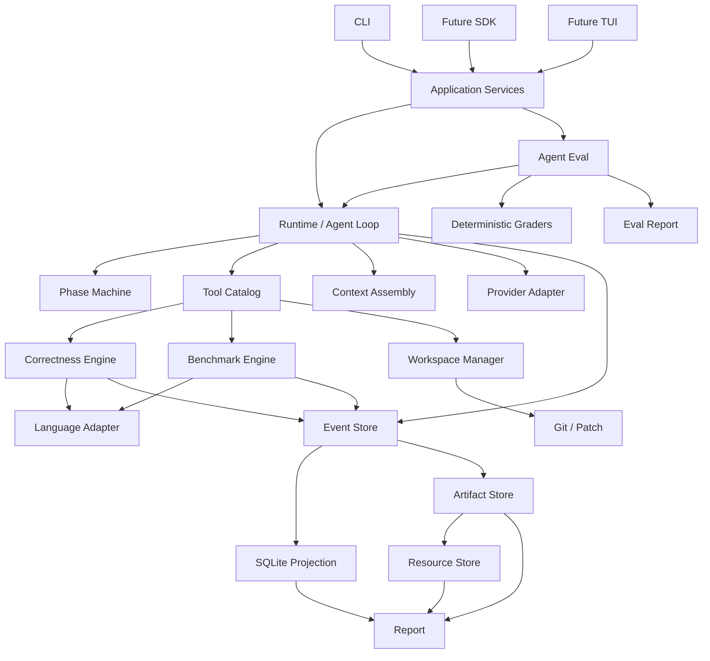
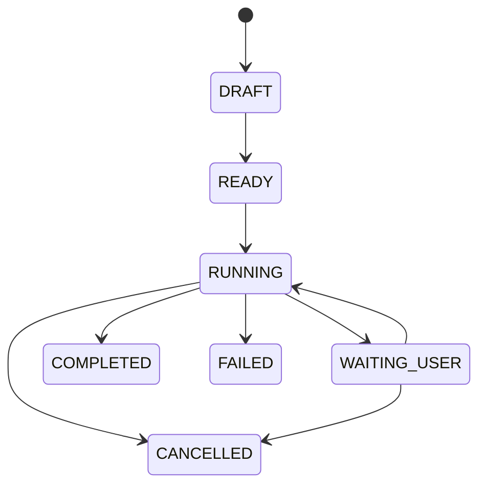
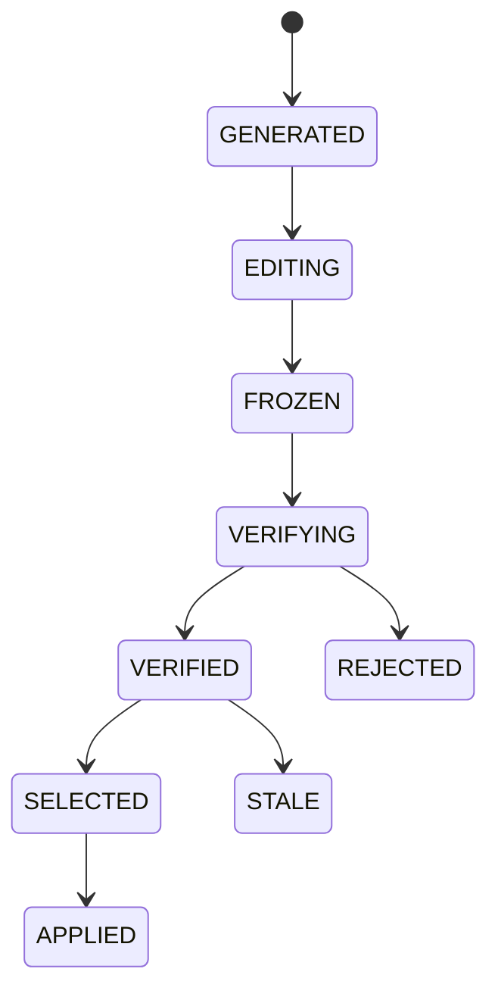
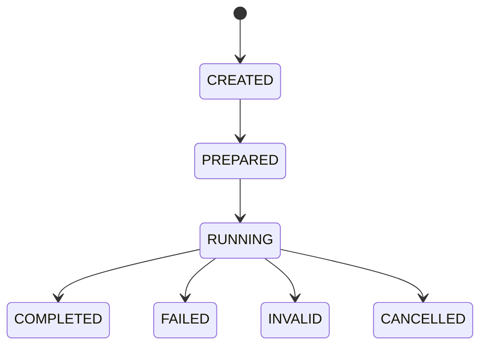

# Algocode 工程化总体设计文档

> 文档版本：综合设计稿 v1.0  
> 编写日期：2026-09-15  
> 项目目标：把 Algocode Demo 演进为可靠、可复现、可审计的算法优化 Agent  
> 目标语言：C++、Python  
> 核心形态：本地优先的命令行 Agent  
> 文档状态：实现前基线设计

## 0. 文档说明与决策状态

本文档综合此前所有分析、讨论和决定，作为 Algocode 后续包骨架与实现工作的总设计入口。

参考文档：

- `00-cross-project-analysis.md`
- `01-demo-algocode-design.md`
- `02-markitdown-design.md`
- `03-openviking-design.md`
- `04-firecrawl-design.md`
- `05-openclaude-design.md`
- `06-deepseek-harness-design.md`
- `07-opencode-design.md`
- `08-codex-design.md`

### 0.1 决策状态

本文使用以下状态：

| 状态 | 含义 |
|---|---|
| `LOCKED` | 已讨论并确定，后续实现应遵守 |
| `PROVISIONAL` | 当前推荐方案，仍允许根据实现反馈调整 |
| `OPEN` | 尚未决定 |
| `FUTURE` | 明确不在第一版实现 |
| `DO-NOT-COPY` | 只借鉴思想，不复制源码 |

### 0.2 总体决策摘要

| 主题 | 决策 | 状态 |
|---|---|---|
| 目标语言 | C++ 和 Python 都支持 | LOCKED |
| 产品形态 | CLI 优先，本地优先 | LOCKED |
| 自主级别 | Semi-Autonomous | LOCKED |
| 用户工作区 | Agent 不直接修改，Accept 后 Apply | LOCKED |
| 核心对象 | Task、Candidate、Experiment、Decision | LOCKED |
| 事件模型 | Durable Event + SQLite Projection | LOCKED |
| Benchmark | 多次采样、Median 主指标 | LOCKED |
| Correctness | Benchmark 前硬 Gate | LOCKED |
| Agent 循环 | 外层阶段机 + 内层 Tool Loop | LOCKED |
| Agent 自评测 | P0 核心模块 | LOCKED |
| Provider | P0 先稳定一个协议，接口分层 | PROVISIONAL |
| Sandbox | P0 支持本地受限进程，评测要求正式隔离 | PROVISIONAL |
| 插件生态 | 内部 Adapter 优先，外部插件后置 | LOCKED |
| 多 Agent | 第一阶段只做工作流角色，不做并发平台 | LOCKED |

## 1. 项目目标、范围与非目标

### 1.1 项目目标

Algocode 的目标不是生成“看起来更快”的代码，而是完成可验证的算法优化：

```text
理解算法目标
  -> 建立可信 Baseline
  -> 生成多个优化候选
  -> 编译并验证正确性
  -> 重复 Benchmark
  -> 比较指标
  -> 形成有证据的决策
  -> 输出可应用 Patch
  -> 支持回滚
```

### 1.2 目标用户

- 算法竞赛和刷题用户
- 需要优化 C++ 算法实现的人
- 需要优化 Python 算法代码的人
- 希望自动做正确性对拍和 Benchmark 的开发者
- 需要可复现实验记录的算法工程师

### 1.3 输入

- C++ 源码
- Python 源码
- 测试数据
- Brute Force Oracle
- 随机数据生成器
- Benchmark 输入
- 编译和运行配置
- 用户优化目标

### 1.4 输出

- 优化后的 Candidate Patch
- 正确性证据
- Benchmark 原始样本
- Baseline/Candidate 比较
- Accepted/Rejected/Inconclusive 决策
- JSON、Markdown、HTML 报告
- 可 Apply 和 Rollback 的 Patch

### 1.5 成功指标

```text
正确性通过率
有效优化率
False Accept Rate
Benchmark 可复现性
Agent 任务成功率
平均和 P50 加速
内存和编译时间约束
Token 与成本
恢复成功率
```

### 1.6 非目标

第一阶段明确不做：

- 通用聊天 Agent
- Web UI
- 多租户平台
- 微服务
- 远程分布式 Worker
- Plugin Marketplace
- MCP 平台
- GPU 集群调度
- 自动发布代码
- 自动 Commit
- 自动修改测试或 Oracle
- 无 Benchmark 的自动接受
- 直接复制许可证不明确的参考项目源码

## 2. 参考项目与许可证边界

### 2.1 八个项目的职责参考

| 项目 | 主要借鉴 | 不直接采用 |
|---|---|---|
| Algocode Demo | 多候选、对拍、性能验证和领域闭环 | Controller、全局状态和文件式临时状态 |
| MarkItDown | Converter Registry、文档归一化 | 无边界远程获取 |
| OpenViking | Resource URI、L0/L1/L2/L3、内容与索引分离 | 一开始实现完整 Context Database |
| Firecrawl | Job 状态、重试、Artifact 分层 | AGPL 服务端源码和复杂后端栈 |
| OpenClaude | Query Loop、Provider、Tool、Permission、SDK 结构 | 源码，完整授权不明确 |
| DeepSeek Harness | 事件 Session、Tool Pipeline、插件边界 | 第一版全插件化 |
| OpenCode | Event Sourcing、Projector、Tool Registry、Context Epoch | V1/V2 长期双轨 |
| Codex | Thread/Task/Turn/Step、Approval、ExecPolicy、Sandbox、Rollout | 巨型 Core 和完整平台体量 |

### 2.2 许可证注意事项

| 项目 | 许可风险 |
|---|---|
| MarkItDown | MIT，可参考和依赖，但应固定版本和许可证 |
| OpenViking | 主项目 AGPLv3；CLI 和示例为 Apache 2.0 |
| Firecrawl | 服务端 AGPL-3.0；多数 SDK 为 MIT |
| OpenClaude | 仓库声明衍生自专有 Claude Code，完整授权不明确 |
| DeepSeek Harness | MIT，但处于 Developer Preview |
| OpenCode | MIT |
| Codex | Apache-2.0 |

### 2.3 复用原则

```text
可以采用的思路：
  架构边界、状态机、接口形状、错误分类、测试策略

需要许可证审查：
  第三方源码、协议实现、SDK、生成文件和 UI 组件

禁止直接复制：
  OpenClaude 的衍生源码
  Firecrawl AGPL 服务端源码进入不兼容项目
  OpenViking AGPL 主项目源码进入不兼容项目
```

本文所有“参考”默认表示独立实现，不表示复制源码。

## 3. 总体架构

### 3.1 架构图



### 3.2 架构风格

采用模块化单体：

```text
一个 Python 包
一个 Core Runtime
一个 SQLite 数据库
一个本地 Artifact Store
多个可替换 Adapter
先本地执行，后远程扩展
```

### 3.3 分层

| 层 | 职责 |
|---|---|
| Surface | CLI、未来 SDK/TUI |
| Application | 用例编排和事务边界 |
| Domain | Task、Candidate、Experiment、Decision |
| Runtime | Agent Loop、Tool Loop、Phase Machine |
| Ports | 外部能力接口 |
| Adapters | Git、SQLite、Provider、Language、Document |
| Storage | Event、Projection、Artifact、Resource |
| Eval | Agent 自评测与 Grader |

### 3.4 依赖规则

```text
Domain 不依赖 Infrastructure
Runtime 不依赖具体 Provider
Tool 不直接访问 SQLite
CLI 不绕过 Application Service
Report 只读 Evidence
ProviderAdapter 不知道 Worktree
LanguageAdapter 不知道 Agent Loop
```

## 4. 产品 Surface 与 CLI

### 4.1 P0 命令

```bash
algocode init
algocode baseline
algocode optimize
algocode experiment list
algocode experiment show <id>
algocode correctness run
algocode report <task-id>
algocode accept <candidate-id>
algocode apply <candidate-id>
algocode rollback <candidate-id>
algocode eval run
algocode doctor
```

### 4.2 P1 命令

```bash
algocode resume <task-id>
algocode cancel <task-id>
algocode provider list
algocode artifact list
algocode resource show
algocode clean --dry-run
```

### 4.3 命令职责

| 命令 | 作用 |
|---|---|
| `init` | 注册项目、检测语言、生成配置 |
| `baseline` | 建立不可变 Baseline |
| `optimize` | 运行 Agent Loop，生成并验证 Candidate |
| `experiment` | 查看、恢复和比较实验 |
| `correctness` | 单独运行或重放正确性测试 |
| `report` | 从 Evidence 生成报告 |
| `accept` | 只做决策，不修改用户工作区 |
| `apply` | 将已接受 Patch 应用到用户工作区 |
| `rollback` | 在安全条件下恢复 Apply 前状态 |
| `eval` | 运行 Agent 自评测 Suite |

### 4.4 结构化输出

所有命令支持：

```bash
--json
--no-color
--quiet
--verbose
```

JSON 输出不能混入日志：

```json
{
  "ok": true,
  "task_id": "task_123",
  "candidate_id": "cand_456",
  "experiment_id": "exp_789",
  "status": "completed",
  "artifacts": []
}
```

### 4.5 Exit Code

```text
0 = 成功
1 = 内部错误
2 = 参数或配置错误
3 = Baseline 不可用
4 = 构建或正确性失败
5 = Benchmark 无效
6 = 没有可接受候选
7 = Policy 或 Approval 失败
8 = Sandbox 不可用或违反
```

## 5. Config 系统

### 5.1 优先级

```text
内置默认值
  < 用户全局配置
  < 项目 .algocode.yaml
  < 项目 .algocode.local.yaml
  < 环境变量
  < CLI 参数
  < Eval Harness 强制覆盖
```

Hard Invariant 不受配置覆盖。

### 5.2 合并策略

```yaml
merge:
  policyRules: append
  protectedFiles: append
  providers: merge
  models: merge
  benchmarkSuites: merge
  limits: replace
```

标量最后值胜出。列表必须在 Schema 中声明 `append` 或 `replace`。

### 5.3 P0 配置

```yaml
version: 1

project:
  language: auto
  sourceRoot: .

providers:
  default:
    type: openai-compatible
    baseUrl: https://api.deepseek.com/v1
    apiKeyEnv: "ALGOCODE_API_KEY"

models:
  default:
    provider: default
    model: deepseek-flash
    contextWindow: 128000

runtime:
  maxStepsPerPhase: 20
  maxToolCallsPerPhase: 50
  maxCandidates: 3
  network: false

benchmarks:
  default:
    method: process
    warmup: 2
    repeats: 5
    primaryMetric: wall_time
    direction: minimize

correctness:
  mode: hybrid
  requireDeterminism: true

policy:
  rules:
    - action: file.write
      resource: "*"
      effect: allow
    - action: network.connect
      resource: "*"
      effect: deny

storage:
  artifactRetentionDays: 90
```

### 5.4 Secret

配置只允许保存引用：

```yaml
apiKeyEnv: OPENAI_API_KEY
```

或：

```yaml
credentialRef: env://OPENAI_API_KEY
```

Secret 不进入：

- Event
- SQLite
- Prompt
- Report
- Log
- Artifact

### 5.5 ResolvedConfig

加载完成后生成不可变 `ResolvedConfig`，并计算：

```text
configHash
policyHash
providerConfigHash
benchmarkDefaultsHash
```

任何运行记录都必须绑定 `configHash`。

## 6. Domain Model

### 6.1 聚合边界

```text
Task 是 Aggregate Root
Baseline、Candidate、Experiment、Decision 是 Task 内的实体
Event 的 aggregateId 使用 taskId
```

### 6.2 Task

```ts
Task {
  id
  projectId
  objective
  status
  currentPhase
  baselineId?
  activeCandidateId?
  createdAt
  updatedAt
  completedAt?
}
```

### 6.3 Baseline

```ts
Baseline {
  id
  revision
  snapshotHash
  environmentHash
  buildResultRef
  correctnessResultRef
  benchmarkResultRef
}
```

### 6.4 Candidate

```ts
Candidate {
  id
  taskId
  status
  baseRevision
  baseSnapshotHash
  workspaceRef
  patchHash
  createdAt
  frozenAt?
}
```

### 6.5 Experiment

```ts
Experiment {
  id
  taskId
  baselineId
  candidateId
  specHash
  inputHash
  environmentHash
  comparisonKey
  policyHash
  status
  decision?
  startedAt
  completedAt?
  invalidationReason?
}
```

### 6.6 Decision

```ts
Decision {
  id
  taskId
  candidateId
  experimentIds
  outcome: "accepted" | "rejected" | "inconclusive"
  reason
  evidenceRefs
  decidedAt
}
```

### 6.7 Domain Invariant

```text
没有 Baseline 不能创建 Candidate
Candidate 必须有 Base Revision
Experiment 前 Candidate 必须 Frozen
Correctness 未通过不能 Benchmark
comparisonKey 不同不能比较
INVALID Experiment 不能 Accepted
Base Revision 变化后 Candidate 变 STALE
未 ACCEPTED 不能 APPLY
APPLIED 必须有 Reverse Patch
任何状态变化必须有 Event
```

## 7. Agent Loop 与 Tool Loop

### 7.1 两层循环

```text
Agent Loop
  = 外层阶段机

Tool Loop
  = 当前阶段内的模型调用、工具调用和结算
```

### 7.2 阶段

```text
CREATE
  -> ANALYZE
  -> BASELINE
  -> PLAN
  -> GENERATE_CANDIDATE
  -> IMPLEMENT
  -> VERIFY
  -> BENCHMARK
  -> COMPARE
  -> DECIDE
  -> REPORT
  -> ACCEPT / REJECT
```

### 7.3 Tool Loop

```text
构建 Context
  -> Provider Stream
  -> 解析 Tool Calls
  -> 持久化 Tool Call
  -> Policy / Approval
  -> 执行 Tool
  -> 持久化 Tool Result
  -> 重建 Context
  -> 继续
```

### 7.4 结束条件

```text
没有 Tool Call
模型提交 Phase Result
达到阶段预算
检测到无进展
被取消
发生不可恢复错误
```

### 7.5 Steer 和 Queue

P0：

```text
支持取消

P1：
支持 task-scoped steering
支持 queue
```

安全边界：

```text
Provider Turn 前
全部 Tool Settlement 后
Phase Gate 前
Experiment 完成后
Apply 前
```

## 8. Task、Candidate、Experiment 状态机

### 8.1 Task



### 8.2 Candidate



### 8.3 Experiment



Experiment Decision 独立：

```text
ACCEPTED
REJECTED
INCONCLUSIVE
```

## 9. Tool Catalog

### 9.1 公共契约

```ts
ToolDefinition {
  name
  description
  inputSchema
  outputSchema
  effects
  idempotent
  parallelizable
  permission
  timeout
}
```

```ts
ToolResult {
  status: "success" | "error" | "interrupted"
  summary
  structured?
  artifactRefs[]
  truncated
}
```

### 9.2 P0 工具

| 工具 | Effect | 并行 | Approval |
|---|---|---|---|
| `list_files` | read | 是 | 无 |
| `read_file` | read | 是 | 取决于文件 |
| `search_code` | read | 是 | 无 |
| `read_resource` | read | 是 | 取决于 Resource |
| `get_task_state` | read | 是 | 无 |
| `get_candidate_diff` | read | 是 | 无 |
| `apply_patch` | write | 否 | 可配置 |
| `build` | execute | 受限 | 默认允许 |
| `run_correctness` | execute | 否 | 默认允许 |
| `run_benchmark` | execute | 否 | 默认允许 |
| `submit_phase_result` | control | 否 | 无 |

### 9.3 `apply_patch`

```ts
input: { patch: string }
output: {
  appliedFiles
  rejectedFiles
  patchHash
  reversePatchRef
}
```

规则：

- 只能在 Candidate Worktree。
- 不修改 Protected Files。
- 预检查。
- 保存 Reverse Patch。
- 串行执行。

### 9.4 `build`

```ts
input: {
  profile?: "default" | "debug" | "release"
  clean?: boolean
}
```

只使用冻结 BuildProfile，不接受任意命令。

### 9.5 `run_correctness`

```ts
input: {
  mode: "quick" | "full" | "stress"
  seed?: number
}
```

输出包含失败类别和 Artifact。

### 9.6 `run_benchmark`

```ts
input: {
  spec?: string
  candidateId?: string
}
```

强制使用冻结 BenchmarkSpec，持 Benchmark 资源锁。

### 9.7 `submit_phase_result`

```ts
input: {
  phase
  status: "continue" | "completed" | "blocked"
  summary
  findings
  blockers
}
```

它是控制工具，不直接改变 Task 状态。

## 10. C++ / Python LanguageAdapter

### 10.1 接口

```python
class LanguageAdapter(Protocol):
    async def detect(path) -> ProjectInfo: ...
    async def prepare(workspace, spec) -> PrepareResult: ...
    async def build(workspace, spec) -> BuildResult: ...
    async def run_correctness(workspace, spec) -> CorrectnessResult: ...
    async def run_benchmark(workspace, spec) -> BenchmarkResult: ...
```

### 10.2 共享对象

```text
BuildProfile
RunProfile
EnvironmentProfile
Diagnostic
ArtifactRef
```

### 10.3 C++

需要支持：

```text
g++
clang++
MSVC cl
C++17/C++20/C++23
编译参数
链接参数
可执行文件
stdin/stdout
退出码
编译诊断
```

第一实现可优先 GCC/Clang，Windows 再补 MSVC。

### 10.4 Python

需要支持：

```text
sys.executable
虚拟环境
python -m module
python script.py
函数模式 Benchmark
导入路径
依赖检查
异常
超时
```

### 10.5 Contract Test

C++ 和 Python 必须共享：

```text
Build Contract
Correctness Contract
Benchmark Contract
Artifact Contract
Cancellation Contract
```

## 11. Correctness Engine

### 11.1 原则

```text
没有正确性，就没有优化
```

Correctness 是 Benchmark 的硬前置 Gate。

### 11.2 CorrectnessSpec

```ts
CorrectnessSpec {
  mode: "cases" | "oracle" | "stress" | "hybrid"
  cases
  checker?
  oracle?
  generator?
  iterations
  seed
  timeout
  visibleToAgent
  protectedFiles
  requireDeterminism
}
```

### 11.3 比较器

支持：

```text
exact
line-trim
token-normalized
float-absolute
float-relative
checker-command
```

### 11.4 Failure Kind

```text
OutputMismatch
ProcessCrash
Timeout
ResourceLimit
OracleFailed
CheckerFailed
GeneratorFailed
NonDeterministic
ProtectedFileChanged
InputInvalid
Inconclusive
```

### 11.5 Stress Test

必须保存：

```text
Seed
Generator Hash
Input Hash
Candidate Output
Oracle Output
Failure Artifact
```

同一 Seed 必须可重放。

### 11.6 Protected Files

默认：

```text
tests/
oracle/
generator/
hidden-tests/
benchmarks/
.algocode.yaml
```

修改后直接失败。

## 12. Benchmark Engine

### 12.1 BenchmarkSpec

```ts
BenchmarkSpec {
  schemaVersion
  language
  scope: "process" | "stdin" | "function"
  prepare
  build
  run
  cwd
  envPolicy
  input
  timeout
  networkPolicy
  warmup
  repeats
  samplingPolicy
  metrics
  resourceLimits
  artifactPolicy
}
```

### 12.2 Metric

```text
wall_time
cpu_time
peak_memory
page_faults
```

P0 主指标：

```text
wall_time
```

### 12.3 采样

```text
Baseline Warmup
Candidate Warmup
Baseline/Candidate 交错执行
保留全部样本
Median 为主
Min/Max/Stddev 为辅助
```

### 12.4 Hash

```text
specHash
inputHash
environmentHash
candidateHash
baselineHash
comparisonKey
policyHash
```

Baseline 和 Candidate 的 `comparisonKey` 必须一致。

### 12.5 Environment Fingerprint

```text
OS
CPU
GPU
内存
线程数
C++ 编译器
编译参数
Python 版本
依赖 Lock Hash
Sandbox Profile
```

### 12.6 AcceptancePolicy

```ts
{
  requireCorrectness: true
  minMedianImprovementPercent
  maxPeakMemoryRegressionPercent
  maxCompileTimeRegressionPercent
  maxVariationPercent
}
```

AcceptancePolicy 不进入 BenchmarkSpec Hash。

### 12.7 资源锁

```text
benchmark:<environmentHash>
```

同一环境不能并发运行 Benchmark。

## 13. Candidate Worktree 与 Patch 生命周期

### 13.1 运行时目录

```text
~/.local/share/algocode/
  projects/<hash>/
    state.sqlite
    events.jsonl
    artifacts/
    resources/
    worktrees/
```

项目目录只保存：

```text
.algocode.yaml
.algocode/report/
```

### 13.2 干净仓库

```text
git worktree add --detach <candidate> HEAD
```

### 13.3 Dirty Repo

```text
baseRevision = HEAD
basePatch = git diff HEAD --binary
untracked = git ls-files --others --exclude-standard
baseSnapshotHash = hash(HEAD + basePatch + untracked)
```

在 Candidate Worktree 中重建 Snapshot，不修改用户工作区。

### 13.4 Accept、Apply、Rollback

```text
accept
  = 只做 Decision

apply
  = 修改用户工作区

rollback
  = 恢复 Apply 前状态
```

默认：

```text
不自动 Commit
不自动 Stage
可保存 Reverse Patch
```

### 13.5 Stale Candidate

Apply 前检查：

```text
baseRevision
baseSnapshotHash
Patch 是否可应用
Experiment 是否有效
Decision 是否 Accepted
```

失败则标记 STALE，要求重新验证。

## 14. Event、SQLite、Projection 与 Migration

### 14.1 Event

```ts
Event {
  id
  aggregateId
  seq
  type
  schemaVersion
  timestamp
  payload
  artifactRefs[]
}
```

同一 Task 的 `seq` 连续递增。

### 14.2 事务

```text
Event 与 Projection 更新
必须位于同一 SQLite Transaction
```

### 14.3 Durable 与 Ephemeral

Durable：

```text
状态变化
Tool Call
Tool Result
Experiment
Decision
Apply
```

Ephemeral：

```text
文本 Delta
Reasoning Delta
实时进度
```

### 14.4 事件清单

```text
TaskCreated
ProjectSpecLoaded
BaselineStarted
BaselineCaptured
CandidateCreated
CandidateFrozen
BuildStarted
BuildSucceeded
BuildFailed
CorrectnessStarted
CorrectnessPassed
CorrectnessFailed
ExperimentCreated
ExperimentStarted
ExperimentCompleted
BenchmarkSamplesCaptured
ComparisonProduced
DecisionMade
CandidateApplied
CandidateRolledBack
TaskCompleted
TaskFailed
TaskCancelled
```

### 14.5 SQLite 表

```text
projects
tasks
candidates
build_runs
correctness_runs
experiments
experiment_runs
samples
comparisons
decisions
artifacts
resources
resource_versions
reports
event_log
schema_migrations
task_run_locks
```

### 14.6 Migration

独立版本：

```text
Database Migration Version
Event Schema Version
Config Schema Version
BenchmarkSpec Version
Report Schema Version
```

升级必须支持：

```text
Forward Migration
Dry Run
Backup
Failure Recovery
Version Mismatch Detection
```

## 15. Context 与 Prompt Assembly

### 15.1 ContextFragment

```ts
ContextFragment {
  id
  kind
  trust
  priority
  content?
  resourceRef?
  sourceHash
  maxTokens
  cacheable
  visibility
}
```

### 15.2 Trust

```text
system
verified
untrusted
```

Untrusted：

```text
网页
MarkItDown 文档
README
代码注释
外部日志
MCP 内容
```

### 15.3 上下文顺序

```text
Base System
Safety and Tool Rules
Task Objective
Resolved Config
Project Summary
Phase Instructions
Baseline Summary
Candidate Summary
Correctness / Benchmark Evidence
Relevant Resources
Recent Tool Results
Current Request
```

### 15.4 阶段上下文

| 阶段 | 主要内容 |
|---|---|
| ANALYZE | 项目、代码、测试、环境 |
| PLAN | 分析结果、Baseline、约束 |
| IMPLEMENT | Plan、Candidate Diff、错误 |
| VERIFY | Build、Correctness、失败引用 |
| BENCHMARK | Metrics、Environment、Samples Ref |
| COMPARE | 结构化比较 |
| DECIDE | Evidence 和 Policy |
| REPORT | Decision 和 Artifact |

### 15.5 Compaction

只在安全边界：

```text
模型请求前
阶段完成后
Tool 全部结算后
```

保留：

```text
Base Instructions
Task Objective
Phase
当前 Candidate
最近失败
Baseline
最新 Benchmark
```

压缩旧过程，不删除事实。

## 16. ProviderAdapter

### 16.1 分层

```text
ProviderAdapter
ProtocolAdapter
Transport
CredentialProvider
```

### 16.2 ModelRef

```ts
ModelRef {
  providerId
  modelId
  variant?
}
```

### 16.3 ModelRequest

```ts
ModelRequest {
  requestId
  model
  system
  messages
  tools
  toolChoice?
  generation?
  responseFormat?
  providerOptions?
  timeout?
}
```

### 16.4 ModelEvent

```text
text-delta
reasoning-delta
tool-call-delta
tool-call
tool-result
usage
finish
provider-error
```

### 16.5 Structured Output

P0 使用强制工具：

```text
submit_phase_result
```

Provider-native JSON Schema 后置。

### 16.6 Provider 错误

```text
TransportError
AuthenticationError
RateLimitError
QuotaExceededError
InvalidRequestError
ContextOverflowError
ProviderInternalError
InvalidProviderOutputError
ToolProtocolError
```

Context Overflow 触发 Compaction，不盲目重试。

### 16.7 Usage 和成本

```ts
ModelUsage {
  inputTokens
  outputTokens
  reasoningTokens
  cacheReadTokens
  cacheWriteTokens
  estimatedCost
  providerRequestId?
  durationMs
}
```

### 16.8 第一实现

P0：

```text
OpenAI-compatible Chat Completions
SSE
Tool Calls
Tool Results
Usage
API Key Env
```

P1：

```text
OpenAI Responses
Anthropic Messages
Local Provider
OAuth
Prompt Cache Metadata
```

## 17. Policy、Approval 与 Sandbox

### 17.1 三层分离

```text
Policy Engine
  -> allow / ask / deny

Approval Provider
  -> once / task / project / unavailable

Sandbox Runtime
  -> process / fs / network / resources
```

### 17.2 Policy Rule

```ts
PolicyRule {
  action
  resource
  effect
}
```

评估：

```text
Hard Deny
  > Managed
  > User
  > Project
  > Defaults
```

层内 Last Match Wins。

### 17.3 Hard Invariant

禁止：

```text
修改 tests/oracle/generator/hidden-tests
修改 benchmark 输入
读取 Secret
写入 Workspace 外
绕过 Benchmark Lock
```

### 17.4 Approval

类型：

```text
once
task
project
unavailable
```

非交互 ask 默认拒绝。

### 17.5 Sandbox 等级

```text
L0 trusted-local
L1 process-sandbox
L2 container-sandbox
```

评测默认要求 L2。不可用则 Fail Closed。

### 17.6 Sandbox Profile

必须进入 Environment Hash：

```text
imageDigest
runtimeVersion
cpuLimit
memoryLimit
threadCount
networkPolicy
mounts
```

## 18. Artifact、Resource 与 Report

### 18.1 Artifact

```ts
Artifact {
  id
  sha256
  kind
  mimeType
  size
  storagePath
  retention
  metadata
}
```

内容寻址、不可变、可去重。

### 18.2 Resource

```ts
Resource {
  uri
  version
  type
  title
  summary
  hash
  artifactRefs
  trust
}
```

URI：

```text
artifact://sha256/<hash>
resource://task/<id>/baseline
resource://task/<id>/candidate/<id>
resource://experiment/<id>/benchmark
doc://sha256/<hash>
repo://path
```

### 18.3 Report

Canonical JSON：

```ts
Report {
  schemaVersion
  reportId
  taskId
  generatedAt
  objective
  finalStatus
  selectedCandidateId?
  project
  baseline
  environment
  candidates
  experiments
  comparison
  decision
  correctnessEvidence
  benchmarkEvidence
  tradeoffs
  limitations
  artifactRefs
}
```

Markdown 和 HTML 是投影。

### 18.4 Claim

```ts
Claim {
  text
  claimType: "verified_metric" | "narrative"
  evidenceRefs
}
```

Narrative 不能覆盖 Verified Metric。

### 18.5 Report 安全检查

禁止：

```text
Secret
Hidden Test
Oracle 内容
私有 Benchmark 输入
未脱敏环境变量
```

### 18.6 Retention

```text
Patch / Reverse Patch       长期
Correctness Failure         长期
Benchmark Samples           长期
Profile                      可配置
Build Logs                   可配置
临时输出                     短期
Report                       Task 生命周期
```

GC 必须保护被引用 Artifact。

## 19. Agent 自评测

### 19.1 两条链

```text
Candidate Evaluation
  = Baseline vs Candidate

Agent Evaluation
  = 多个固定任务判断 Agent 能力
```

### 19.2 EvalTask

```ts
EvalTask {
  id
  version
  language
  category
  difficulty
  objective
  workspaceTemplate
  protectedFiles
  correctnessSpec
  benchmarkSpec
  expectedBehavior
}
```

Expected Behavior：

```text
EXPECT_OPTIMIZATION
EXPECT_NO_OPTIMIZATION
EXPECT_REJECT
EXPECT_RECOVERY
EXPECT_POLICY_DENY
```

### 19.3 Suite

```text
smoke
core
adversarial
recovery
```

### 19.4 EvalRun

记录：

```text
algocodeCommit
configHash
promptVersion
toolCatalogHash
provider
model
environmentHash
seed
repeatCount
```

### 19.5 指标

```text
Build Pass Rate
Correctness Pass Rate
Benchmark Validity Rate
Optimization Acceptance Rate
False Accept Rate
False Reject Rate
Median Speedup
Recovery Success Rate
Cost per Accepted Candidate
```

### 19.6 Grader

```text
Deterministic Grader
Behavioral Grader
Statistical Grader
LLM Narrative Grader
```

LLM 不参与硬性接受。

### 19.7 发布门禁

```text
FalseAcceptCount = 0
PolicyViolationCount = 0
ProtectedFileChangeCount = 0
ReplayDivergenceCount = 0
EventSequenceGapCount = 0
Apply/Rollback Failure Count = 0
```

## 20. 测试与 CI

### 20.1 测试层

```text
Unit
Contract
Integration
E2E
Agent Eval
Adversarial / Recovery
```

### 20.2 Fake

```text
FakeClock
FakeIdGenerator
FakeEventStore
FakeArtifactStore
FakeProcessRunner
FakeProvider
FakeLanguageAdapter
```

### 20.3 Fixture

参考 Codex 和 OpenCode：

- SSE Mock
- Provider Cassette
- Replay 默认
- Record 受控
- 请求 Body 断言
- Snapshot

### 20.4 CI 阶段

每次提交：

```text
format
lint
typecheck
unit
contract
```

PR：

```text
integration
E2E
migration
C++ integration
Python integration
security tests
```

夜间：

```text
real provider smoke
core eval
recovery eval
cost report
```

发布：

```text
core eval 3-5 次
adversarial
recovery
A/B 对比
```

## 21. Python 包结构与依赖方向

### 21.1 目录

```text
pyproject.toml
src/algocode/
  cli/
  application/
  domain/
  ports/
  runtime/
  tools/
  benchmark/
  correctness/
  context/
  providers/
  languages/
  workspace/
  policy/
  storage/
  report/
  eval/
  observability/
tests/
evals/
```

### 21.2 核心依赖

```text
Python 3.11+
pydantic
typer
httpx
sqlite3 或 SQLAlchemy Core
pytest
ruff
pyright 或 mypy
zstandard
```

Domain 优先不可变 dataclass。Pydantic 用于边界、Config、DTO、Event、Report。

### 21.3 Optional Dependencies

```text
docs -> MarkItDown
context -> OpenViking Adapter
web -> Firecrawl Adapter
ui -> rich
```

### 21.4 Runtime 数据目录

```text
Windows:
  %LOCALAPPDATA%/algocode

Linux/macOS:
  ~/.local/share/algocode
```

### 21.5 Composition Root

`bootstrap.py` 是唯一组装依赖的位置：

```text
Config
  -> Database
  -> EventStore
  -> ArtifactStore
  -> WorkspaceManager
  -> LanguageAdapters
  -> ProviderAdapters
  -> PolicyEngine
  -> Runtime
  -> Application Services
  -> CLI
```

业务模块不创建全局单例。

## 22. P0、P1、P2 范围

### 22.1 P0

```text
C++ 和 Python
CLI
本地 Git Worktree
SQLite + Event Log
Correctness
Benchmark
Agent Loop
Tool Loop
一个 Provider
Patch / Apply / Rollback
Report
Eval smoke
```

### 22.2 P1

```text
多 Provider
Profiler
MarkItDown
OpenViking 风格 Resource
HTML Report
TUI
SDK
更多 Eval Suite
Recovery Suite
```

### 22.3 P2

```text
MCP
Plugin Marketplace
远程 Worker
Web UI
GPU Profiler
多 Agent 并发
多目标 Pareto
组织级 Policy
```

### 22.4 P0 Gap Closure 步骤

M0-M8 是核心功能里程碑。完成 M0-M8 不等于 P0 已经完成，因为 P0 还包含跨模块的安全、上下文、CLI、一致性和验收要求。

推荐顺序：

```text
P0-0 M0-M8 基础实现
  -> P0-1 Policy / Approval / Sandbox
  -> P0-2 Context / Phase Gate / Task Lock
  -> P0-3 P0 CLI / Config / Resource
  -> P0-4 Cross-Surface Integration / E2E
  -> P0-5 P0 Acceptance / Release Gate
```

| 步骤 | 范围 | 当前状态 |
|---|---|---|
| P0-0 | M0-M8 基础实现 | COMPLETE |
| P0-1 | Policy / Approval / Sandbox | COMPLETE |
| P0-2 | Context / Phase Gate / Task Lock | COMPLETE |
| P0-3 | P0 CLI / Config / Resource | COMPLETE |
| P0-4 | Cross-Surface Integration / E2E | COMPLETE |
| P0-5 | P0 Acceptance / Release Gate | COMPLETE |

#### P0-0 M0-M8 基础实现

目标：

```text
落地设计文档中的 M0-M8 核心功能
```

当前状态：

```text
COMPLETE
```

已完成：

- 包结构、CLI、配置、SQLite、Event Log、Migration、Projection。
- Git Worktree、Baseline、C++/Python Build、Artifact。
- Correctness、Protected Files、Replay。
- Benchmark、Sampling、Median、Environment Hash、Comparison、Resource Lock。
- Agent Phase Machine、Tool Loop、Cancellation、Fake Provider。
- 真实 OpenAI-compatible Provider、SSE、Tool Calls、Usage、错误和重试。
- Candidate、Decision、Report、Accept、Apply、Rollback。
- smoke、core、adversarial、recovery Eval Suite 和 A/B Compare。

边界：

```text
P0-0 完成不等于 P0 完成
P0-0 只证明核心功能已经存在并可测试
```

#### P0-1 Policy / Approval / Sandbox

目标：

```text
建立真实 Agent 执行代码前的最低安全边界
```

当前状态：

```text
COMPLETE
```

已完成：

- `PolicyRuleConfig`、`PolicyConfig`、Approval 和 Sandbox 配置。
- `PolicyEngine`，支持 Hard/Managed/User/Project/Default 层级。
- 层内 Last Match Wins 和 Protected Files Hard Deny。
- `ApprovalProvider`、ApprovalStore、`once/task/project/unavailable`。
- `LocalProcessSandbox`，提供网络拒绝和环境变量脱敏门禁。
- Tool 执行链：`Policy -> Approval -> Sandbox -> Tool`。
- Policy、Approval 和 Sandbox 结果写入 Tool Result 与 Durable Tool Event。
- Policy、Approval、Sandbox 和 Tool 安全集成测试。
- 统一 `SandboxProcessRunner`，用于 Build、Correctness 和 Benchmark。
- 子进程环境变量脱敏、超时控制、输出上限和 `PYTHONHASHSEED`。
- Global(User) 与 Project Policy Rules 的自动分层和追加合并。
- Policy Hash 写入 Tool Result 和 Durable Tool Event。
- Docker Sandbox 镜像 `algocode-sandbox:latest`。
- Docker 默认 `--network none`、只读根文件系统、Workspace Mount。
- Docker CPU、内存、PID、超时和输出限制。
- WSL2 备用后端，使用 root + `unshare -n` 隔离网络。
- Docker/WSL2 不可用时执行类 Tool Fail Closed。
- Docker 隔离测试：Workspace 写、根文件系统只读、网络关闭、超时清理。

仍需完成：

- Managed Policy 的远程下发属于组织级能力，不阻塞 P0。
- L2 容器沙箱的镜像签名与远端策略属于后续发布加固。

P0-1 原始需求清单：

1. `PolicyConfig`、`PolicyRule`、Policy Hash。
2. `PolicyEngine`，支持 `allow/ask/deny`。
3. 规则优先级：Hard Deny > Managed > User > Project > Defaults。
4. 层内 Last Match Wins。
5. `ApprovalProvider`，支持 `once/task/project/unavailable`。
6. 非交互环境默认拒绝需要 Approval 的操作。
7. `Sandbox Runtime`，支持受限本地进程。
8. 限制工作目录、环境变量、超时、网络和资源。
9. Tool 统一执行链：`Policy -> Approval -> Sandbox -> Tool`。
10. Sandbox 不可用时 Fail Closed。
11. 写入 Policy、Approval、Sandbox 事件和测试。

完成标准：

- Protected Files 无法绕过。
- 未审批的写操作不能执行。
- Sandbox 被禁用时，执行类 Tool 拒绝运行。
- Policy Violation 和 Sandbox Violation 可以审计。

#### P0-2 Context / Phase Gate / Task Lock

目标：

```text
保证 Agent 上下文可控，Phase 前置条件不可绕过，同一 Task 不并发执行
```

当前状态：

```text
COMPLETE
```

已完成：

- Agent Loop、Tool Loop、Phase Machine、Cancellation。
- `ContextFragment`、`ContextTrust`、优先级、来源 Hash、Visibility 与 Required 标记。
- 固定顺序 Context Assembly：System、Safety、Objective、Config、Project、Phase、Baseline、Candidate、Correctness、Benchmark、Resources、Facts、Current Request。
- Untrusted Fragment 强制隔离，文件、README、日志等上下文不能作为指令执行。
- 保守 Token Estimator，预留模型输出、安全边界和 Tool Schema 预算。
- 安全 Compaction：优先保留 Required Fragment，按优先级保留 Optional Fragment，并限制最近 Tool Exchange 数量。
- 最近 Tool Exchange 纳入 Context Hash 和 Token 估算，旧 Tool 历史压缩为摘要。
- 确定性 Fact Ledger；同 Key 更新保留 `supersedes` 关系，压缩时不删除事实。
- 每次 Provider Turn 前重新组装 `ContextSnapshot`，持久化 Snapshot Artifact，并写入 `context.assembled`。
- Compaction 写入 `context.compacted`，事件包含 Context Hash 和被丢弃 Fragment。
- Phase Gate 强制 Baseline、当前 Candidate、当前 Candidate Correctness 和有效 Benchmark Evidence。
- Gate 拒绝写入 `phase.gate_denied`，Runtime 返回 `WAITING_USER`，不能绕过前置阶段。
- SQLite `task_run_locks`，Task 级排他锁、过期回收和异常/取消释放。
- 连续重复且无进展的 Tool 调用会停止 Phase，并返回 `no progress detected`。
- Eval Smoke 在 Baseline 后停止；Recovery 验证预算耗尽后的安全恢复路径。

仍需完成：

- 无 P0-2 阻塞项。

验证：

- `tests/unit/context/test_builder.py`。
- `tests/unit/runtime/test_gates.py`。
- `tests/unit/runtime/test_task_lock.py`。
- `tests/integration/test_agent_runtime.py`。
- `tests/integration/test_eval_service.py` 和 `tests/integration/test_cli_eval.py`。
- 全量 `pytest`、`ruff check` 和 `ruff format --check`。

P0-2 原始需求清单：

1. `ContextFragment`、Trust、优先级和来源 Hash。
2. Prompt Assembly 固定顺序。
3. Token Budget 和安全 Compaction。
4. Phase Gate 强制检查前置条件。
5. 没有 Baseline 不能进入 Candidate。
6. Correctness 未通过不能进入 Benchmark。
7. Benchmark 无效不能进入 Accept。
8. `task_run_locks`，禁止同一 Task 并发执行。
9. Resume、无进展检测和恢复路径。

完成标准：

- 任意 Phase 不能绕过前置 Gate。
- Context 超限时可压缩且不丢失关键事实。
- 同一 Task 同时只能有一个运行实例。
- 崩溃或取消后可以安全恢复。

#### P0-3 P0 CLI / Config / Resource

目标：

```text
让 CLI、Resolved Config 和 Resource 接口与 P0 设计一致
```

当前状态：

```text
COMPLETE
```

已完成：

- `experiment list` 和 `experiment show`，底层复用 `benchmark_runs`、Result 与 Comparison Artifact。
- `correctness run`、`correctness replay` 和 `eval run` 命令结构。
- 所有 P0 命令统一支持 `--json --no-color --quiet --verbose`。
- 统一 JSON envelope：`ok`、`command`、`status`、上下文 ID、`artifacts`、`message`、`data`。
- 非 JSON 日志和错误写 stderr，JSON stdout 不混入日志。
- `read_resource` Tool，接入 Policy、Approval、Sandbox 和 ToolContext。
- `LocalResourceProvider`，支持 `repo://`、Task Baseline/Candidate、Experiment Benchmark 和 Artifact URI。
- Resource `summary` 与 `content` 两种模式，`repo://` 禁止路径逃逸。
- `policy.rules`、AcceptancePolicy、Benchmark Defaults 和 CredentialRef 配置。
- `accept` 强制当前 Candidate 的 Correctness、有效 Benchmark Comparison、Improvement 与 Variation 阈值。
- `SecretRedactor` 覆盖 Event、SQLite Projection、Approval Store、Artifact、Prompt、Tool Result、Provider Error 和 Report。
- 配置只保存 `apiKeyEnv` 或 `env://` CredentialRef，不保存 Secret 原文。

仍需完成：

- 无 P0-3 阻塞项。

验证：

- CLI 契约、Experiment、Resource、AcceptancePolicy 和 Secret 防泄漏专项测试。
- 全量 `pytest`、`ruff check` 和 `ruff format --check`。

P0-3 原始需求清单：

1. `experiment list` 和 `experiment show`。
2. 对齐 `correctness run`、`eval run` 等命令形式。
3. 所有 P0 命令统一支持 `--json --no-color --quiet --verbose`。
4. `read_resource` Tool。
5. 本地 ResourceProvider。
6. `policy.rules` 配置。
7. AcceptancePolicy 和默认阈值。
8. Secret 不进入 Event、SQLite、Prompt、Report、Log、Artifact。

完成标准：

- P0 命令全部存在且输出契约一致。
- 配置可以完整表达 Policy、AcceptancePolicy、Correctness 和 Benchmark 默认值。
- Resource 可以按 URI 和摘要模式读取。

#### P0-4 Cross-Surface Integration / E2E

目标：

```text
将各模块从“单模块可用”提升为“完整任务可运行”
```

当前状态：

```text
COMPLETE
```

已完成：

- `create_candidate` Tool，Agent 只在 `GENERATE_CANDIDATE` 阶段创建并激活 Candidate Worktree。
- `apply_patch`、`run_correctness`、`run_benchmark` 强制绑定 Implement、Verify、Benchmark Phase。
- 真实 OpenAI-compatible HTTP/SSE Provider 闭环，包括 Candidate Patch、Correctness 和 Benchmark。
- Python 完整 E2E：Init、Baseline、Agent、Candidate、Correctness、Benchmark、Accept、Report、Apply、Rollback。
- C++ 完整 E2E：使用本机 `g++` 从 Baseline 跑到 Apply/Rollback。
- Provider Rate Limit、截断 SSE、认证失败恢复和 Context Overflow Compaction 重试。
- Correctness Replay 一致性验证。
- `task.completed`、`task.failed`、`task.cancelled` Event 与 Task Projection 终态同步。
- Event Sequence Gap 检查、False Accept 检查和 Evidence Ref 一致性检查。
- Recovery、Adversarial、Policy Deny Eval Suite 全通过。
- 真实 DeepSeek `smoke` 与 `core` 评测通过；实测 core median speedup 约 11.17%。

仍需完成：

- 无 P0-4 阻塞项。

验证：

- `tests/integration/test_e2e_full.py`。
- `tests/integration/test_agent_runtime.py`。
- `tests/unit/providers/test_openai_compatible.py`。
- 全量 `pytest`、`ruff check` 和 `ruff format --check`。

P0-4 原始需求清单：

1. C++ 完整 E2E。
2. Python 完整 E2E。
3. 真实 Provider 的 Candidate 生成闭环。
4. `optimize -> candidate -> correctness -> benchmark -> accept -> report -> apply -> rollback`。
5. Provider 失败、限流、断流和 Context Overflow 恢复。
6. Recovery、Adversarial 和 Policy Deny 端到端场景。
7. Benchmark 与 Correctness Evidence 在 Report 中一致。
8. 所有状态变化都有 Event。

完成标准：

- 真实 C++ 和 Python 任务可从 Init 跑到 Apply/Rollback。
- 失败路径不会产生 False Accept。
- Apply/Rollback 失败数为零。
- Replay 结果一致。

#### P0-5 P0 Acceptance / Release Gate

目标：

```text
对 P0 逐条验收并形成可重复的发布门禁
```

当前状态：

```text
COMPLETE
```

已完成：

- P0 Requirement Traceability Matrix：25 条 Requirement 全部映射到实现、测试和证据。
- 可重复 Release Gate：Unit、Contract、Integration、E2E、Eval 分组执行。
- Release Evidence Probe：自动执行 Candidate、Correctness、Replay、Benchmark、Accept、Report、Apply 和 Rollback。
- False Accept Count = 0。
- Policy Violation Count = 0。
- Protected File Change Count = 0。
- Replay Divergence Count = 0。
- Event Sequence Gap Count = 0。
- Apply/Rollback Failure Count = 0。
- `algocode gate run` CLI。
- 生成 `docs/acceptance/P0/report.json` 和 `docs/acceptance/P0/report.md`。

验证：

- `docs/acceptance/p0-requirements.yaml`。
- `tests/unit/acceptance/test_matrix.py`。
- `tests/integration/test_acceptance_gate.py`。
- 正式执行 `algocode gate run`，结果为 `PASS`。

P0 总状态：

```text
COMPLETE
```

P0-5 原始需求清单：

1. P0 Requirement Traceability Matrix。
2. Unit、Contract、Integration、E2E 和 Eval 全量验证。
3. False Accept Count = 0。
4. Policy Violation Count = 0。
5. Protected File Change Count = 0。
6. Replay Divergence Count = 0。
7. Event Sequence Gap Count = 0。
8. Apply/Rollback Failure Count = 0。
9. 生成 P0 Acceptance Report。

完成标准：

- 设计文档中的每个 P0 条目都能映射到实现、测试和证据。
- 所有发布门禁为零失败。
- P0 状态可以从 `PARTIAL` 正式变更为 `COMPLETE`。

## 23. 实现里程碑

### M0 包骨架

```text
pyproject
CLI help
Domain 空模型
测试可运行
依赖方向检查
```

### M1 Config + Event + SQLite

```text
Config 加载
Event Append
Projector
Task 创建
恢复
```

### M2 Workspace + Baseline

```text
Git Worktree
C++ Adapter
Python Adapter
Build
Baseline Artifact
```

### M3 Correctness

```text
Cases
Oracle
Stress
Protected Files
Replay
```

### M4 Benchmark

```text
Sampling
Median
Environment Hash
Comparison
Resource Lock
```

### M5 Runtime + Fake Provider

```text
Agent Loop
Tool Loop
Phase Machine
Cancellation
```

### M6 Real Provider

```text
SSE
Tool Calls
Usage
Errors
Cost
```

### M7 Report + Apply

```text
JSON Report
Markdown Report
Accept
Apply
Rollback
```

### M8 Agent Eval

```text
smoke
core
adversarial
recovery
A/B Compare
```

## 24. 风险、开放问题与验收标准

### 24.1 主要风险

| 风险 | 影响 | 缓解 |
|---|---|---|
| Benchmark 噪声 | 错误接受 | 多次采样、Median、环境 Hash |
| Agent 作弊 | 假优化 | Hidden Oracle、Protected Files |
| Worktree 冲突 | Apply 错误 | Base Revision 校验 |
| Provider 差异 | Tool Loop 不稳定 | Canonical Event |
| Sandbox 不可用 | 执行不安全 | Fail Closed |
| Event/Projection 不一致 | 状态损坏 | 同事务、Replay 检查 |
| 上下文膨胀 | 成本和错误增加 | Artifact Ref 和 Compaction |
| 许可证风险 | 法律问题 | 独立实现、许可证审计 |
| 多语言差异 | Benchmark 不公平 | Language Contract |
| 模型漂移 | Eval 结果变化 | 固定模型版本和重复运行 |

### 24.2 开放问题

```text
P0 Provider 是否使用 Chat Completions 还是 Responses
C++ 第一平台优先 Windows 还是 Linux
Python function benchmark 默认策略
是否允许 Dirty Repo Baseline
Benchmark 默认 repeats
AcceptancePolicy 默认阈值
Artifact 默认保留期
是否提供自动 Commit 选项
```

### 24.3 MVP 验收

MVP 完成必须满足：

```text
C++ 和 Python 都能建立 Baseline
能生成 Candidate
能编译或准备环境
能通过 Correctness Gate
能运行 5 次 Benchmark
能生成比较和 Report
能 Accept 和 Apply Patch
能 Rollback
能中断和恢复
Agent Eval smoke 通过
False Accept = 0
Policy Violation = 0
```

## 附录 A：核心 Schema 汇总

```text
Task
Baseline
Candidate
Experiment
Decision
Event
Artifact
Resource
BenchmarkSpec
CorrectnessSpec
ToolCall
ToolResult
Report
EvalTask
EvalResult
```

## 附录 B：事件清单

```text
TaskCreated
ProjectSpecLoaded
BaselineStarted
BaselineCaptured
BaselineFailed
CandidateCreated
CandidateFrozen
CandidateSelected
CandidateRejected
CandidateApplied
CandidateRolledBack
BuildStarted
BuildSucceeded
BuildFailed
CorrectnessStarted
CorrectnessPassed
CorrectnessFailed
ExperimentCreated
ExperimentPrepared
ExperimentStarted
ExperimentCompleted
ExperimentFailed
ExperimentInvalidated
BenchmarkSamplesCaptured
ComparisonProduced
DecisionMade
TaskCompleted
TaskFailed
TaskCancelled
```

## 附录 C：P0 Tool 清单

```text
list_files
read_file
search_code
read_resource
get_task_state
get_candidate_diff
apply_patch
build
run_correctness
run_benchmark
submit_phase_result
```

## 附录 D：决策记录

| 决策 | 结论 |
|---|---|
| C++/Python | 都支持 |
| 用户工作区 | 不直接修改 |
| Candidate | 独立 Worktree |
| Correctness | Benchmark 前硬 Gate |
| Benchmark | 多次采样、Median |
| Event | Durable + SQLite Projection |
| Accept/Apply | 分离 |
| Provider | 业务层使用统一事件 |
| Sandbox | Policy 与 Sandbox 分离 |
| Agent Eval | P0 核心模块 |
| 插件 | 内部 Adapter 优先 |
| 多 Agent | 后置 |
| 参考代码 | 先审查许可证 |

## 25. 最终结论

Algocode 的第一版不应被定义为“接入大模型后自动改代码的工具”。

更准确的定义是：

```text
Algocode
  = 算法优化实验内核
  + 可恢复 Agent Runtime
  + Correctness Gate
  + Reproducible Benchmark
  + Candidate Worktree
  + Durable Evidence
  + Agent Self-Evaluation
```

只要这条链能稳定工作，C++ 和 Python、更多 Provider、更多 Profiler、TUI、SDK、MCP 和远程 Worker 都可以在之后逐步增加。

如果这条链不可靠，那么增加更多模型、工具和界面只会放大错误，而不会让 Algocode 成为真正可信的算法优化 Agent。
