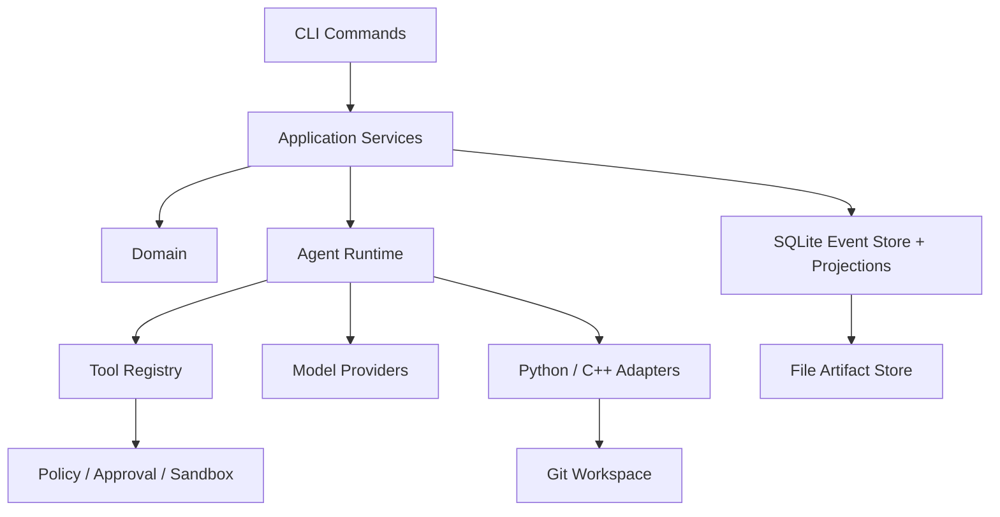

# Architecture Overview

## Layer Responsibilities

- `cli/`: command entry points and output.
- `application/`: business workflow orchestration.
- `domain/`: domain models and events.
- `runtime/`: phase machine, tool loop, and model interaction.
- `tools/`: tools available to the Agent.
- `providers/`: model service adapters.
- `languages/`: Python and C++ adapters.
- `workspace/`: Git worktree and patch management.
- `storage/`: event, projection, and artifact persistence.
- `profiling/`: Python and C++ profiling adapters.
- `security/`: credentials and redaction.
- `policy/`: policy decisions.
- `approval/`: human approval.

## Search and Refinement

After Decide, the runtime determines the next step:

- Significant positive evidence without acceptance: reopen the current candidate and refine it.
- No measurable gain or wrong direction: archive the candidate and create a new one.
- Acceptance condition met: finish search and move to reporting.

Each phase exposes only the tools in `PHASE_TOOL_ALLOWLIST` and injects remaining turns, tool calls, candidate-check status, and fallback reasons.

## Two Entry Points

| Entry point | Isolation | Primary use |
| --- | --- | --- |
| CLI | Git worktree | Terminal automation, complete workflows, batch and script use. |
| VS Code extension | Temporary shadow workspace | In-editor optimize, diff, review, apply, and rollback. |

Both entry points call the same Application Services, Runtime, verification, and storage layers.

## Request Path

CLI or VS Code commands enter `application`, which drives the `runtime` Agent. The Agent edits candidate worktrees through `tools`, calls models through `providers`, uses `languages` for Python and C++, manages Git state through `workspace`, and persists events and artifacts through `storage`. Policy, Approval, and Sandbox constrain high-risk actions.
