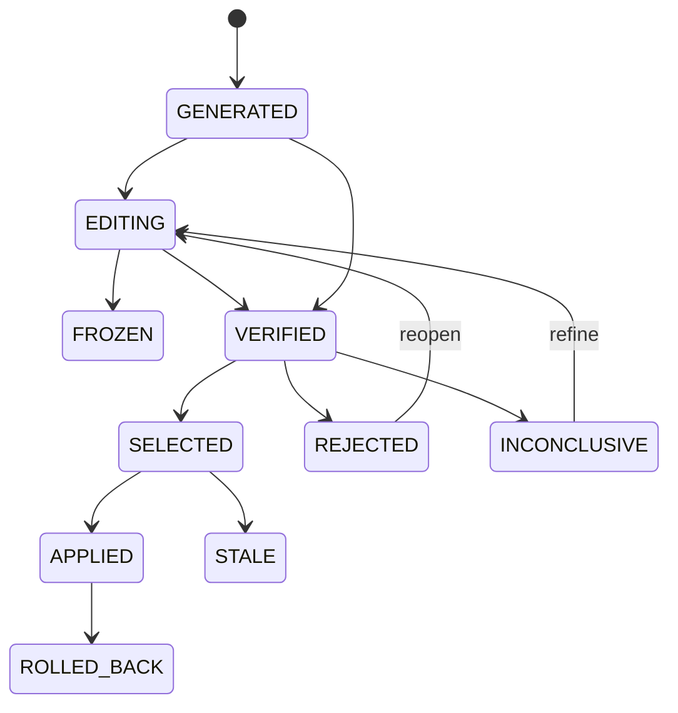

# Candidate Lifecycle

Candidates never appear directly in the user workspace. Each candidate completes its lifecycle in an isolated Git worktree.

## Main States

- `generated`: the candidate was created.
- `editing`: candidate code is being changed.
- `frozen`: candidate contents are fixed.
- `verified`: candidate Correctness passed.
- `selected`: the candidate was accepted by a decision.
- `applied`: the candidate was applied to the user workspace.
- `rolled_back`: the candidate was rolled back.
- `rejected`: verification failed or the candidate was rejected.
- `stale`: the workspace changed and the candidate can no longer be applied safely.
- `inconclusive`: evidence was too noisy or the confidence interval crossed zero.

When a direction has significant positive potential but has not met acceptance conditions, the Runtime can reopen the candidate and return it to `editing` for refinement. When there is no measurable benefit or the direction is wrong, it creates a new candidate and continues search.

`verifying` means Correctness or Contract is currently running. CLI and VS Code share the same state model; they differ mainly in where candidates live and how they are applied.
