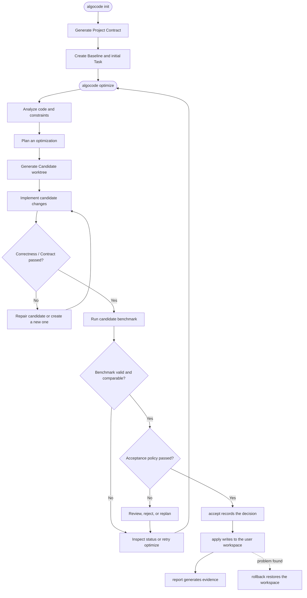

# Quick Workflow

This is the minimal Algocode workflow. Use it for the overall path, then read the [Complete Workflow](workflow.md) for phase details, gates, and failure handling.



## The Four Steps

1. **Initialize**: `algocode init` detects the project, generates the Contract, creates a Task, and captures a Baseline.
2. **Optimize**: `algocode optimize` analyzes the project, creates a plan, and implements the change in an isolated candidate workspace.
3. **Verify**: A candidate must pass Correctness and Contract before Benchmark runs. Benchmarks use paired statistics; strong directions are refined while weak directions lead to a new candidate.
4. **Apply**: Review `status`, `review`, and `diff`, then run `accept` and `apply`. Use `rollback` when needed.

## Most Common Commands

```bash
algocode init
algocode optimize
algocode status
algocode review
algocode diff
algocode accept <task-id> <candidate-id>
algocode apply
algocode rollback
```
