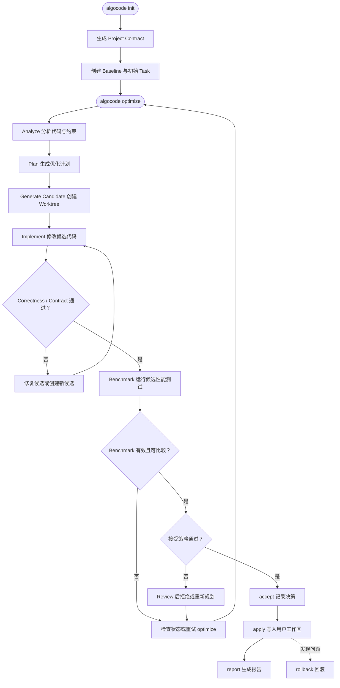

# 简略工作流

这里是 Algocode 的最小使用链路。先看整体流程，再看 [完整工作流](workflow.md) 中的阶段细节、门控和失败处理。



## 四步理解

1. **初始化**：`algocode init` 检测项目、生成 Contract、创建 Task，并捕获 Baseline。
2. **优化**：`algocode optimize` 分析项目、制定计划，并在隔离候选工作区中实现优化。
3. **验证**：候选必须先通过 Correctness 和 Contract，然后才运行 Benchmark。
4. **落地**：用户查看 `status`、`review`、`diff`，确认后执行 `accept` 和 `apply`；需要时执行 `rollback`。

## 最常用命令

```bash
algocode init
algocode optimize
algocode status
algocode review
algocode diff
algocode accept <task-id> <candidate-id>
algocode apply
algocode rollback
```
